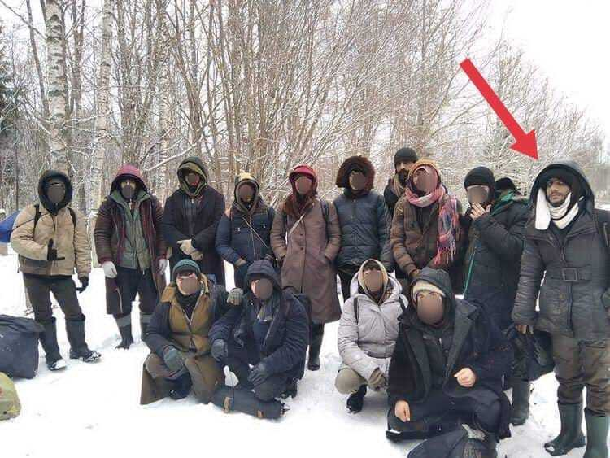

### AYS News Digest 20/8/22: Violent eviction of Eleonas camp begins in Athens

](assets/9db56d106a4a/1*B3uacvrsjKBXkWDerd87og.jpeg)

Photo: Marios Lolos, [https://www\.2020mag\.gr/themata/5698\-xtypisan\-ton\-elaiona\-ksimeromata?fbclid=IwAR0V3DtAbnmoGOfZoADXQDfEWMLL2thiRnu7bDmR2NiYMnkmsSqZ4BWY99Y](https://www.2020mag.gr/themata/5698-xtypisan-ton-elaiona-ksimeromata?fbclid=IwAR0V3DtAbnmoGOfZoADXQDfEWMLL2thiRnu7bDmR2NiYMnkmsSqZ4BWY99Y)
#### Arrivals on Kythera — a new route towards Europe? // Prison sentences and fines for 12 people of the crossing preceding the ‘Melilla massacre’ // Boat missing off Libya with 80 people on board // Potential fines for those providing aid in Calais & much more
#### GREECE
#### Violent attempted eviction of Eleonas camp begins in the small hours of the morning

At 4\.58am on 18/08/22 Greek police entered Eleonas camp outside Athens\. They removed barricades erected by residents, and fired tear gas and stun grenades at those who resisted from within the camp\. Let’s not forget that the Greek police, in riot gear, are using signifiant and excessive force to evict people, many of whom have been forced to flee war zones, seeking sanctuary in Greece\. The distressing footage below shows what that looks like today in Eleonas:

■■■■■■■■■■■■■■ 
> **[Teacher Dude](https://twitter.com/teacherdude) @ Twitter Says:** 

> > VIDEO - Greek SWAT team attacking #Elaionas refugee camp in the middle of the night, snatching toddlers while riot police use tear gas and flash grenades against #refugees, many of who have fled war zones. #Greece #antireport #ελαιωνας 

> **Tweeted at [2022-08-18 08:52:38](https://twitter.com/teacherdude/status/1560187906525986829).** 

■■■■■■■■■■■■■■ 

■■■■■■■■■■■■■■ 
> **[Moira Lavelle](https://twitter.com/Alohamoira) @ Twitter Says:** 

> > Today at 4:58am Greek police entered the refugee camp of #Ελαιώνας in Athens in an attempted eviction of the camp. They removed the barricades residents had built at the gates and then fired tear gas and a flash grenade at those resisting inside. https://t.co/wztBHMC0Yr 

> **Tweeted at [2022-08-18 04:05:52](https://twitter.com/alohamoira/status/1560115738488324098).** 

■■■■■■■■■■■■■■ 

■■■■■■■■■■■■■■ 
> **[Eleni Konstantopoulo](https://twitter.com/EleniKonstanto) @ Twitter Says:** 

> > More 🎥 comes to light to expose the excessive police violence against the #Refugeesgr &amp; #Solidarity workers at #Eleanos camp. While Petros Konstantinou, municipal councilor of Athens with Keerfa responds to counter @[nmitarakis](https://twitter.com/nmitarakis) narrative 
via @[EFSYNTAKTON](https://twitter.com/EFSYNTAKTON) [efsyn.gr/ellada/dikaiom…](https://www.efsyn.gr/ellada/dikaiomata/356074_keerfa-binteo-ntokoymento-apo-tin-agria-epithesi-ton-mat-ston-elaiona) 

> **Tweeted at [2022-08-19 17:18:10](https://twitter.com/elenikonstanto/status/1560677515521585152).** 

■■■■■■■■■■■■■■ 

Greek newspaper EFSYN has published videos from the attack from MAT, countering claims from Notis Mitarakis, the Migration and Asylum Minister, who claimed that: ‘ _immigrants and solidarity people are threatening our staff_ \.’ Read more [here](https://www.efsyn.gr/ellada/dikaiomata/356074_keerfa-binteo-ntokoymento-apo-tin-agria-epithesi-ton-mat-ston-elaiona) \.

> “We are the refugees and refugee residents of Eleonas camp\. We live here in the refugee structure in Eleonas, some of us for years\. Our daily life in the camp has always been quite difficult, as we face the lack of medical care and welfare benefits, while we are often faced with dangerous disasters, such as fires inside the camp\. 

> However, this place is our home, where our families are raised, where we wake up to go to work and school\. We are hundreds of people from different ethnic communities, and we speak a variety of languages\.” 

Read more here, in Maria Kefala’s article ‘They hit Elonas at Dawn’:

#### Evros Fence to be extended by 80km

Mitarakis has also announced that the fence in the Evros River will be extended by 80km, and has been bragging about the ‘decongestion’ that he has already achieved in limiting the number of people coming to Greece\. More [here](https://www.keeptalkinggreece.com/2022/08/19/greece-evros-fence-extend/?fbclid=IwAR3zU9O5pHS5xNTwBbp_0PEd7EdPWwgS3RdQSBCHrU3QnKE7FizEjC5ft-M) on his openly xenophobic narrative\.
#### Arrivals in Greece — A new route trying to avoid pushbacks in the Aegean?

150people arrived at Kythera, Greece on Wednesday\. Two sailboats, perhaps heading for Italy, arrived on the Southern Greek island where one had run aground\. Thankfully no injuries have been reported\. Another vessel has since arrived, leaving 236 refugees sweltering in 40 degree heat with no shelter or provisions\. There has been no help from official agencies, and food and shelter provided by local volunteers\.

](assets/9db56d106a4a/1*jHhf9eg_bukdoWX3vCTmPg.jpeg)

[https://twitter\.com/ecre/status/1560249404010921984?fbclid=IwAR0gqwz3DOI9fqad6voOP8183bcjzP18d6kMVjUEfyZBZYNexpOgCUkrSWM](https://twitter.com/ecre/status/1560249404010921984?fbclid=IwAR0gqwz3DOI9fqad6voOP8183bcjzP18d6kMVjUEfyZBZYNexpOgCUkrSWM)

#### Landing in Lesvos

18 people, including women have arrived in Lesvos, report Alarm Phone\. At last report their whereabouts were no longer known, and Alarm Phone fear that no illegal attempt will be made to pushback these individuals to Turkey\.

■■■■■■■■■■■■■■ 
> **[Alarm Phone](https://twitter.com/alarm_phone) @ Twitter Says:** 

> > 🆘 on #Lesvos! We were informed about a group of 18 people, including women and children, who arrived on #Lesvos.At least one person is in critical condition - they urgently need help and we urge authorities to rescue now and not to push them back!

#StopPushbacks https://t.co/sdIUchsu7b 

> **Tweeted at [2022-08-19 15:53:48](https://twitter.com/alarm_phone/status/1560656285707558912).** 

■■■■■■■■■■■■■■ 

This follows a report of a pushback on 11/8/22 from Lesvos\. Nine individuals, out of a group of 18, were found drifting in a life raft by the Turkish coast guard\. Aegean Boat Report have detailed the events in full here:

#### SEARCH AND RESCUE
#### Boat missing with 80 people on board off Libya

On 19/8, Alarm Phone was alerted to a boat that departed from Sabratha, Libya with around 80 individuals on board\. Authorities claim to know nothing about the boat, and Alarm Phone have no contact with it\. Weather reports of high waves and an incoming storm are highly distressing\.

■■■■■■■■■■■■■■ 
> **[Alarm Phone](https://twitter.com/alarm_phone) @ Twitter Says:** 

> > 🆘 in the Central #Mediterranean!

Alarm Phone was alerted by a relative about a boat that had left from #Sabratha in #Libya. We do not have contact to the boat but have informed authorities about this case. Weather is soon deteriorating, and we fear for their lives. 

> **Tweeted at [2022-08-19 09:46:55](https://twitter.com/alarm_phone/status/1560563956913143809).** 

■■■■■■■■■■■■■■ 

#### Open Arms rescue 101 people adrift in the Mediterranean

■■■■■■■■■■■■■■ 
> **[Open Arms ENG](https://twitter.com/openarms_found) @ Twitter Says:** 

> > Hours of searching in the 1st intervention of #OpenArmsUno in international waters of the #Med. 101 people adrift are now safe, in the face of the silence and passivity of the responsible authorities. 
Thank you @[alarm_phone](https://twitter.com/alarm_phone) for the alert to all active in the area.
📹@[Pep_Feliu](https://twitter.com/Pep_Feliu) https://t.co/d3nBwh9E3b 

> **Tweeted at [2022-08-17 17:25:40](https://twitter.com/openarms_found/status/1559954628313321473).** 

■■■■■■■■■■■■■■ 

#### Update from Lampedusa on 17/08

17 people left adrift and unattended for three days near Malta have finally been rescued\. Their boat was eventually intercepted by the Tunisian coastguard, but their lives were significantly and unnecessarily put at risk of shipwreck by the European policy of non\-assistance\.

■■■■■■■■■■■■■■ 
> **[Alarm Phone](https://twitter.com/alarm_phone) @ Twitter Says:** 

> > We can now confirm that the boat in distress with 17 people on board was intercepted by the Tunisian coastguard. We are glad that they survived but their case demonstrates once more the EU policy of non-assistance, which could have led to yet another shipwreck. 

> **Tweeted at [2022-08-18 17:00:14](https://twitter.com/alarm_phone/status/1560310614374899713).** 

■■■■■■■■■■■■■■ 

44 people, mostly from Libya, have been rescued off the coast of Malta\. Drifting for many hours in deteriorating weather on 19/8, they were eventually rescued and disembarked in Malta on 20/08\. Thanks to Alarm Phone for their persistent care, and for alerting the Maltese authorities and sustaining pressure\.

Read more about Malta’s general policy of non\-assistance \- in violation of maritime law \- here, in Alarm Phone’s Central Mediterranean Analysis 1/1/22–30/6/22 here:

#### MOROCCO
### Thirteen people sentenced for Melilla border crossing attempt

Thirteen men from Sudan, South Sudan and Chad were given prison sentences of two\-and\-a\-half years and fines of 10,000 dirham \(about €94\), after they were convicted over the June 24 storming of the autonomous Spanish territory\.

Activists, including the Spanish rights group Caminando Fronteras \(Walking Borders\), [say](https://www.infomigrants.net/en/post/42698/morocco-13-migrants-sentenced-for-melilla-border-crossing-attempt?fbclid=IwAR04C0aWJnjqPGgOLiUuKxa5HgUWIa9dBznNTlmA_775R1nH_gKSoqNZGt8) that there may have been more than 40 deaths\. AMDH has criticized Sudanese and Moroccan authorities for failing to identify scores of migrants who remain missing\.

As we reported earlier, almost 500 million euros is the amount the EU is sending to Morocco to keep them a well\-behaved and “privileged” partner in curbing “illegal migration”, so such high visibility cases come as a no surprise, even in the midst of the horror that happened on that day, when so many people lost their lives in Melilla\.
#### TURKEY
### The little boy who died at the border was finally buried in a resting place in Ankara

> “I was leaning over Yusuf\. I had my child protected\. 

> Those bullets were supposed to hit me” 

These are the words of the mother of a six\-year old boy, Yussuf, who died of border police gunfire when they were shooting at a bus last month\. When the bus approached the checkpoint, the driver and the smuggler started shouting and instead of stopping, the vehicle sped up\.

“The Taliban wanted to enlist my 16 and 14 year old sons as soldiers\. Shortly after the Taliban took over the country last year, I sent them both to Turkey to save them from death,” said the boy’s mother who has barely been eating since the tragedy, remembering that shortly before his death, her son said he was hungry\. The entire story was told in the Turkish media, available [here](https://kisadalga.net/haber/detay/vanda-oldurulen-6-yasindaki-yusufun-annesi-cocuklarimi-olumun-ulkesinden-kacirdim-ama-cocugum-burada-olduruldu_38645) \.
#### SEARCH AND RESCUE AT SEA

20 people were rescued from the Mediterranean by Italian officials some 12 miles off Lampedusa on Wednesday\. 
Meanwhile, Tunisian authorities intercepted more than 120 people en route to Italy between Tuesday and Thursday, it is [reported](https://l.facebook.com/l.php?u=http%3A%2F%2Fwww.infomigrants.net%2Fen%2Fpost%2F42739%2F20-migrants-rescued-from-ship-adrift-off-lampedusa%3Ffbclid%3DIwAR0n7V5eLmwZNaJCqK_JObYHwDgTho038JSZwKxsd8C977bTWD9a4_UhQG0&h=AT3NkcphxuOLM15y8csc5K92lo3RFNxCh12DIIV13HHlDIaQ0tZ70p7Yl4QLT79VNAp_RGiOp4wyk-PxwSGJL2g-gmegor9xGSRafLIJDSkKqdwsdNf9aHg5yO2FlXTJWr9nT7xdKVWadm0WkBPtP4uf6MqCyw&__tn__=R]-R&c[0]=AT1vtSKf7R9gEmfXP7AMz21PFxRRX6AyxK80wja6CgXcg3jiyOlCROIGONx2TRLUwDQq4coHM_Lbutqh8xNvRUWIxkXj6yFgXNTwZ4ebVPishzZDv1iJNeqLH0j1yv4NpFBPff-rMrWMiGYDtK7lh4OOlB4tBSMPRLibWgN63bxbQbrKS-MCq7zb_cvAacdZwyFiNxPxz4zx) \.
#### ITALY
### A constant fight to be heard and get a chance to ask for protection

A group of 25 people spent seven days and seven nights in front of the police headquarters before having the first appointment to apply for asylum, Italian media [report](https://www.larena.it//territori/citta/un-gruppo-di-migranti-ha-trascorso-sette-giorni-e-sette-notti-davanti-alla-questura-prima-di-avere-il-primo-appuntamento-per-la-richiesta-di-asilo-1.9578396) \.

> Most of the group will have to wait until January next year\. In the meantime they will be “ghosts”\. “Even if, at least in theory, they would be entitled to hospitality in a reception center”, _Alberto Sperotto, president of the Ronda della Carità said\._ 

](assets/9db56d106a4a/0*wia_XUQsZkQ5KF1m)

Photo: [Ronda della Carità Verona — Organizzazione di Volontariato](https://www.facebook.com/RondaDellaCaritaVerona?__cft__[0]=AZWJD2c5dOldHJmK_XuR-nnPE-ybwxYFPXH2FXO5i-1wD566noa34ZGJ44wVZxoP-QGjS2QvRXj3NTZxV0MayTh4b6VT1mn2jDYPrYN_Gi_3LR_CM0acCFkmSz_tx5Hzjgz_XI8Uz-iiusWr90eQnGew&__tn__=-UC%2CP-R)

Thanks to the persistent people, those assisting them and the organisations that gave them visibility, this time, this group managed to express the intention to seek asylum, the first one in a line of long and often futile steps towards international protection\. But, what about all the others, those who were too tired to walk all the way? Those who are not in a group and are afraid to come by themselves? Those who, based on their experience so far, fear all officials and uniforms, and who have nobody to encourage or inform them? The system must change\. Long overdue\.
#### FRANCE
### New prefect, new decree

In some streets of Calais, if you hand out an apple or a bottle of water to a person in need, you will be fined 135€\.

> With this, we solve the problem of violence in the world and the borders, that’s for sure, _the volunteers and activists of Utopia 56 write\._ 

At the same time, they send some inspiration as well:

■■■■■■■■■■■■■■ 
> **[Utopia 56](https://twitter.com/Utopia_56) @ Twitter Says:** 

> > Jay traverse le monde librement à bord de son bateau qu'il a lui-même construit. Dans les prochains jours, il va tenter d'établir un record entre New-York et Brest. Avec nos couleurs, il souhaite partager un message d'accueil et de liberté ➡️ [utopia56.org/un-record-de-v…](https://utopia56.org/un-record-de-voile-pour-visibiliser-les-invisibles/) @[coconutssail](https://twitter.com/coconutssail) https://t.co/i0wsCJ1kRK 

> **Tweeted at [2022-08-19 07:37:39](https://twitter.com/utopia_56/status/1560531423794237441).** 

■■■■■■■■■■■■■■ 

#### LATVIA
### A testimony after a forced return

As a follow up to previous reports of forced returns and violent treatment of people at the northern borders, a man wrote his own testimony of the experience in Latvia:

> My name is Hogir Hazim Biro and I am from Iraq\. I was going to Belarus on 11 November 2021, and was at the border of Belarus with Latvia on 20 December 2021\. I'd spent two months on the border between Latvia and Belarus\. While I had no communication device with me, and we knew nothing of our families and friends, we also had no food and nothing to drink, nor a place to keep us from the cold\. Their soldiers were beating us and showing no respect, from both countries\. They treated migrants far from all human values\. Latvia treated us very badly\. We were tortured\. We were hungry, we were cold, and we slept in the snow\. On 24 February 2022, I was forced to sign a voluntary return agreement and returned to Iraq against my will\. 

#### **POLAND**
#### A zone of hidden violence: documenting human rights violations on the Belarus\-Poland border

Border Emergency Collective have produced a 3D reconstruction of Mariam and Hamdi’s treatment on the Belarusian\-Polish border in November 2021\. Despite requesting international protection, they were repeatedly pushed back to Belarus by Polish officers\. Watch the visual report produced by the Border Emergency Collective below:

#### FOR FURTHER READING & LISTENING
- denied access to the people he was trying to write about… :

- New BVMN’s Voices From the Borders episode: “You cannot describe the life of a person, you can only write the things that you see\.”

- podcast on UK home office, using migrants as scapegoats for all issues in UK politics, and the concerted effort at making a hostile environment:

**Find daily updates and special reports on our [Medium page](https://medium.com/are-you-syrious?source=email-156a28ef10e4-1660244456586-newsletter.subscribeToProfile-------------------------68bdcd3d_8cf3_4eba_889e_fd5281d60100--------3e266993d553) \.**

**If you wish to contribute, either by writing a report or a story, or by joining the Info Gathering team, please let us know\!**

**We strive to echo correct news from the ground through collaboration and fairness\. Every effort has been made to credit organisations and individuals with regard to the supply of information, video, and photo material \(in cases where the source wanted to be accredited\) \. Please notify us regarding corrections\.**

**If there’s anything you want to share or comment, contact us through Facebook, Twitter or write to: [areyousyrious@gmail\.com](mailto:areyousyrious@gmail.com)**

_Converted [Medium Post](https://medium.com/are-you-syrious/ays-news-digest-20-8-22-violent-of-eviction-of-eleonas-camp-begins-in-athens-9db56d106a4a) by [ZMediumToMarkdown](https://github.com/ZhgChgLi/ZMediumToMarkdown)._
