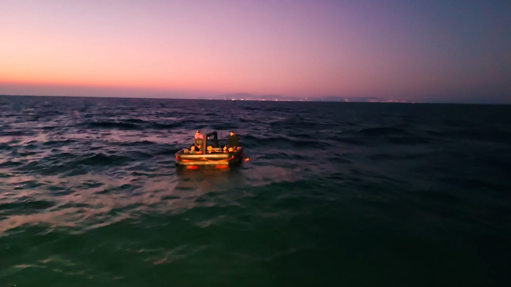
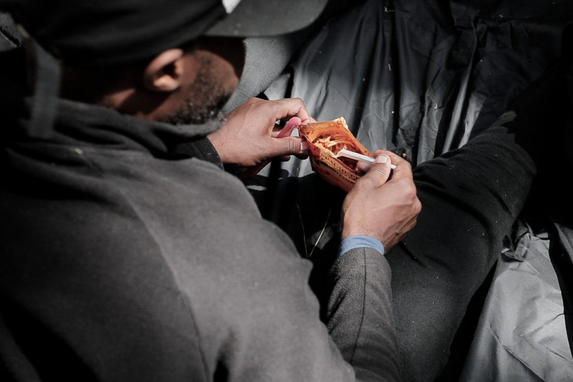
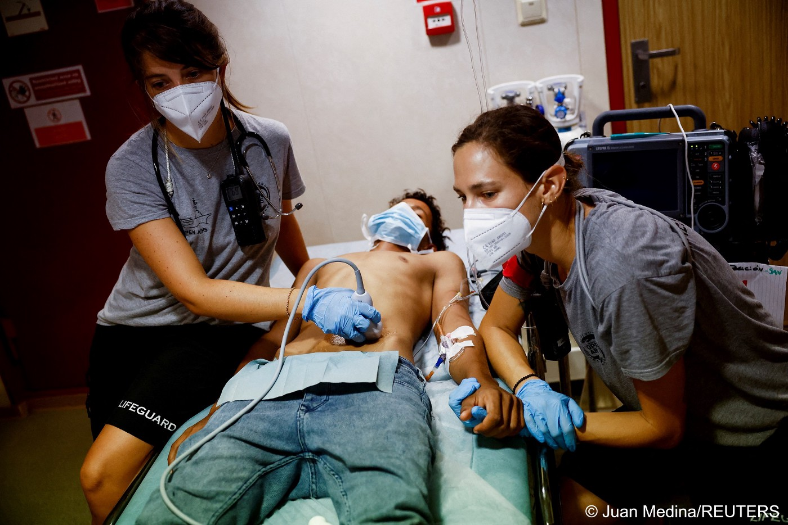
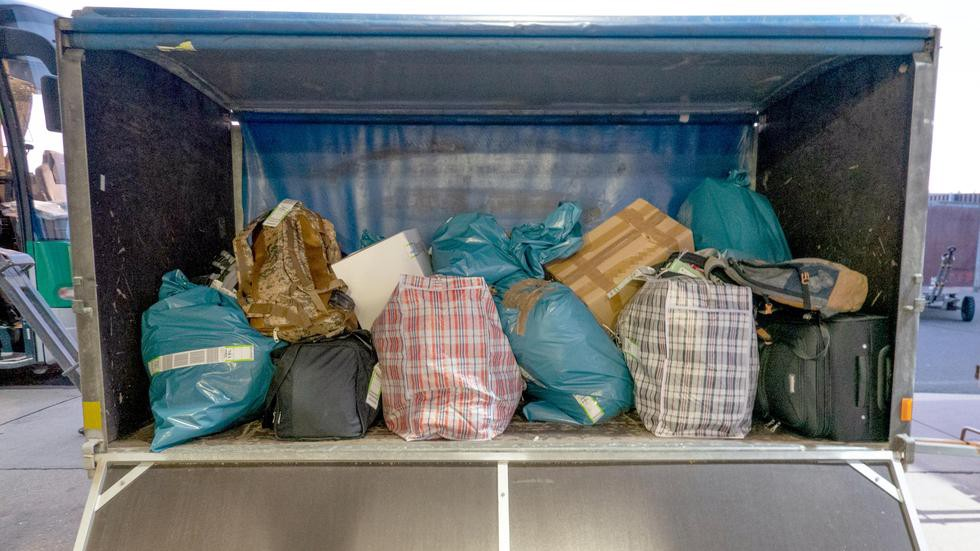

### AYS News Digest 22/8/22: Pushback after pushback after pushback…

A reflection on the past year on the Polish\-Belarusian border/Geo Barents have rescued 106 individuals in the Med/As many as 52% of individuals from migrant backgrounds in Morocco do not have access to the COVID\-19 vaccine/Almost 6,200 individuals deported from Germany between January and June 2022/The UK Home Office is concerned about young asylum seekers lying about their age/Crisis at the Ter Apel centre in the Netherlands/And much more…

 , Source: thomas\-acht](assets/afea0082ac2e/0*PQWmhvNJyMlBlnNu)

The mass gathering reached Syntagma and was blocked on the subway steps by MAT squads [\#antireport](https://twitter.com/hashtag/antireport?src=hashtag_click) , Source: thomas\-acht
#### FEATURE
### The systematic use of pushbacks at Greek borders

It has been reported time and time again that the Greek Hellenic Coast Guard, the police, the border guards, the army, and FRONTEX have all taken part in the illegal practice of refoulement\.

There are many ways in which refoulement takes place, for instance, an individual who has reached the mainland may be detained in an old warehouse, police or army vehicle until the night when the refoulemount is planned to take place\. They are usually detained in awful conditions, and are often not provided with any food, water, or medicine\.

As reported across many news outlets, the practice of refoulement has been extended to the Aegean sea in the form of ‘pushbacks’\.

> “In the 89 incidents of illegal pushbacks, affecting approximately 4,500 persons, recorded by the Border Violence Monitoring Network in the 2020 Annual Torture Report, almost 90% involved serious mistreatment and torture, while 52% of the victims were minors\.” 

The systematic use of pushbacks suggest it is the preferred method of refoulement on the Greek/Turkish border\.

AYS, among several other organisations, have regularly reported on pushbacks\. There have been several pushbacks reported on the Greek coast this last week\. For instance, [The Aegean Boat Report](https://aegeanboatreport.com/2022/08/20/just-another-pushback/?fbclid=IwAR2YevtxogYC5_Nz5L3ac7Kb1R61p8kzJkRPN4ROYO3BwKvznB8ApWuZmG0) wrote of a group of nine individuals who reached Leros on 15th August, and were in hiding\. Contact was lost before any assistance was provided, and on 16th August a boat was found drifting in the Aegean\. The Turkish authorities rescued the boat, and the Aegean Boat Report has identified this was the same group who had reached Leros and were pushed back\.

Source: Aegean Boat Report, ‘Just Another Pushback’

This follows another pushback that took place on 14th August, when a boat with 46 people on board was found drifting off the coast of Cesme, Turkey, after being pushed back from Chios\.

■■■■■■■■■■■■■■ 
> **[Aegean Boat Report](https://twitter.com/ABoatReport) @ Twitter Says:** 

> > On August 14 2 life rafts was found drifting outside Çesme, Turkey, carrying 46 people, arrived on Chios, captured by Greek police and forced back to sea by the Greek Coast Guard, Left drifting in 2 life rafts in the Aegean Sea. @[HCoastGuard](https://twitter.com/HCoastGuard) @[nmitarakis](https://twitter.com/nmitarakis) @[PrimeministerGR](https://twitter.com/PrimeministerGR) https://t.co/vllF6Mrwhq 

> **Tweeted at [2022-08-20 10:46:39](https://twitter.com/aboatreport/status/1560941376556208128).** 

■■■■■■■■■■■■■■ 

And another pushback that look place in Lesvos where a group of 19 people, including eight children, arrived on Lesvos in the early hours of 12th August\. They went into hiding, and contacted the Aegean Boat Report\. However, they lost contact with them before they could reach them, and that afternoon, the group were found drifting on a life raft off the coast of Dikili, Turkey\.

Protests have been taking place across Athens in response to the reports of pushbacks and the inhumane treatment of refugees and asylum seekers in Greece\.

■■■■■■■■■■■■■■ 
> **[Θωμάς Αχταρίδης](https://twitter.com/thomas_acht) @ Twitter Says:** 

> > Διαδήλωση για τις επαναπροωθήσεις προσφύγων από το ελληνικό κράτος, μέσα από την Ερμού, με συνοδεία ΜΑΤ πάντα. #antireport https://t.co/EnzTcZA6RC 

> **Tweeted at [2022-08-19 17:34:25](https://twitter.com/thomas_acht/status/1560681607421480961).** 

■■■■■■■■■■■■■■ 

■■■■■■■■■■■■■■ 
> **[Partizan Yunanistan](https://twitter.com/partizanGreece1) @ Twitter Says:** 

> > People gathered in Athens' Monastiraki square to protest the push back and deaths of refugees.
#Stoppushback
#Antireport
#Refugees #Athens https://t.co/OgT4VIcvKE 

> **Tweeted at [2022-08-19 17:11:25](https://twitter.com/partizangreece1/status/1560675816182525952).** 

■■■■■■■■■■■■■■ 

It is also very important to note pushbacks are not unique to Greece\. This illegal practice is taking place along borders in many other EU countries, such as, [Lithuania](https://t.co/VHnBa5R6on) , [Latvia](https://twitter.com/ecre/status/1558045928682029058) , [Croatia](https://twitter.com/LHreports/status/1445814415446581259) , and others\.
#### POLAND
### Report reflecting on the last year at the Polish\-Belarusian border

> The crisis on the Polish\-Belarusian border has revealed not only that Poland has no migration policy, and the migration policy of the entire European community is inadequate to the migration challenges posed by the modern world\. 

Large, international organisations stated they were not able to enter the border zone without an invitation from the Polish government\. Other organisations didn’t seem to make enough effort to fight the political obstacles that prevented them from entering the border zone\.

Photo Monika Bryk, Source: Krytyka Polityczna 20/8/22

You can read the full article [here](https://krytykapolityczna.pl/kraj/bartosz-rumienczyk-granica-polsko-bialoruska-gdzie-sa-duze-organizacje-pomocowe/?fbclid=IwAR2ekwfyTVN8uSxwkH6ho0AbiN2f_lQRM24dd0R6h2xxOtrM6OtZvm5pe1M) \.
#### BOSNIA
### NoNameKitchen reports on evictions that have been taking place at the hands of Bosnian police

■■■■■■■■■■■■■■ 
> **[NoNameKitchen](https://twitter.com/NoNameKitchen1) @ Twitter Says:** 

> > Again evitions: On Thursday, around 10 am the Bosnian police evicted 2 squats in Vrenograc, a small village in the municipality of Velika Kladusa, where there were living about 100 people, and a squat in the city center with another 20 people. 

> **Tweeted at [2022-08-22 09:14:35](https://twitter.com/nonamekitchen1/status/1561642981609857024).** 

■■■■■■■■■■■■■■ 

#### GREECE
### Following on from the AYS Digest 20/8/22, another video has been posted of the police violence against residents of the Eleonas camp who were protesting the forced evictions

■■■■■■■■■■■■■■ 
> **[Ehsan Fardjadniya](https://twitter.com/EFardjadniya) @ Twitter Says:** 

> > Brutal police reaction to Eleonas refugee camp inhabitants demonstrating against forced evictions on the 18th Aug. In the next few days we might see more of these kind of responses. https://t.co/UzVpqbWlll 

> **Tweeted at [2022-08-22 10:32:51](https://twitter.com/efardjadniya/status/1561662679147839489).** 

■■■■■■■■■■■■■■ 

#### A Somali male has been rescued on Chios after hiding for 12 days, in fear of being pushed back

■■■■■■■■■■■■■■ 
> **[Vassilis Tsarnas](https://twitter.com/VassilisTsarnas) @ Twitter Says:** 

> > #Greece: GHM informed the authorities &amp; the Civil Protection @[GSCP_GR](https://twitter.com/GSCP_GR) (who replied rapidly) about the whereabouts of an injured refugee from Somalia, on #Chios island. He was hiding for 12 days, in fear of being pushed back! He expresses his will to apply for asylum.
#RefugeesGr 

> **Tweeted at [2022-08-20 12:44:10](https://twitter.com/vassilistsarnas/status/1560970949792604165).** 

■■■■■■■■■■■■■■ 

Ruhi Akhtar, from Refugee Biryani and Bananas, posted on Facebook about this case\.

> From this boat arrival some people made it to quarantine\. Eight others were pushed back, three of whom died, reported to have been handcuffed and thrown into the sea during a pushback to Turkey\. One of the boys who was pushed back solemnly recounted this incident and how he watched his friends drown\. 

You can read her full post here: [‘Missing People, Pushbacks, Death and a Miracle’](https://www.facebook.com/ruhi.akhtar.7/posts/pfbid031AwNktpD9NmogJxvacLhwmmbuy2ogeHMdQv5RSAi3HDt7u6kqQgf3Hw8bWMKws9xl)
#### The parents of the five\-year\-old Syrian girl who tragically died on the Evros islet attended court on 22nd August

■■■■■■■■■■■■■■ 
> **[Giorgos Christides](https://twitter.com/g_christides) @ Twitter Says:** 

> > "We want justice for our daughter"

The parents of Maria, the 5-year-old girl from Syria who died on the islet in #Evros, attended the Orestiada court today.

They testified to the prosecutor

At their side are their lawyers from @[GCRefugees](https://twitter.com/GCRefugees) and @[rights360](https://twitter.com/rights360) 

> **Tweeted at [2022-08-22 09:11:01](https://twitter.com/g_christides/status/1561642085102518278).** 

■■■■■■■■■■■■■■ 

#### A blatant show of racism in Crete

■■■■■■■■■■■■■■ 
> **[Vassilis Tsarnas](https://twitter.com/VassilisTsarnas) @ Twitter Says:** 

> > In #Greece of #PushBacks of #RefugeesGr is anything a surprise anymore? "Golden beach", a business renting umbrellas on a beach near Chania, #Crete had an idea, they advertised on Instagram: black slave "sculptures" holding the umbrellas. #Racism was never a real taboo here... https://t.co/FRHeb8uDBW 

> **Tweeted at [2022-08-21 17:15:21](https://twitter.com/vassilistsarnas/status/1561401584088653825).** 

■■■■■■■■■■■■■■ 

■■■■■■■■■■■■■■ 
> **[aforfreedom](https://twitter.com/aforfreedom1) @ Twitter Says:** 

> > Οι πιο ρατσιστικες ομπρελες που εχω δει ποτε στη ζωη μου, στην πολη του μητσοτακη. https://t.co/pZxpO3qA7X 

> **Tweeted at [2022-08-20 09:42:54](https://twitter.com/aforfreedom1/status/1560925333020368898).** 

■■■■■■■■■■■■■■ 

#### SEA/SAR
### On Sunday 21st August, Geo Barents rescued 106 individuals in the Mediterranean

The boat had been adrift for five days after leaving Turkey for Europe\. Within the group, there was one pregnant woman, and seven of the children were under the age of five\.

#### Open Arms Uno is also looking for a safe port for the 100 people currently onboard

■■■■■■■■■■■■■■ 
> **[Oscar Camps](https://twitter.com/campsoscar) @ Twitter Says:** 

> > 5 días a bordo del #OpenArmsUno esperando desembarcar las 100 personas rescatadas, algunos casos médicos. 
“No estamos en el mismo barco. Estamos en el mismo mar, unos en yate, otros en lancha, otros en salvavidas y otros… nadando con todas sus fuerzas.”
#CadaVidaCuenta https://t.co/JvqWbUkP6z 

> **Tweeted at [2022-08-22 18:34:32](https://twitter.com/campsoscar/status/1561783897326747650).** 

■■■■■■■■■■■■■■ 

Within this group, one individual needed to be evacuated due to a medical emergency\.

Source: InfoMigrants, 22/8/22
#### MOROCCO
### As many as 52% of individuals from migrant backgrounds in Morocco do not have access to the COVID\-19 vaccine

> Out of that percentage, 70% refused to get vaccinated while the remaining 30% wanted a vaccine but couldn’t obtain it, a survey carried out by the International Organization for Migration in Morocco shows\. 

Out of those who refuse the vaccine, the reasons can vary from not having enough information on the vaccine to being scared of the side effects\.

The IOM conducted this research in order to boost their awareness campaigns and better understand the views of migrant groups towards getting vaccinated\.

#### SPAIN
### Alarm Phone reports two bodies were found on a beach in Melilla on the morning of 22nd August

■■■■■■■■■■■■■■ 
> **[Alarm Phone](https://twitter.com/alarm_phone) @ Twitter Says:** 

> > Two bodies were found at the beach in #Melilla. 
Many young people desperately try to reach the European enclaves by swimming. We deplore once again the unnecessary deaths caused by the European border regime. Our condolences go out to their loved ones. #SafePassage 

> **Tweeted at [2022-08-22 08:58:59](https://twitter.com/alarm_phone/status/1561639055703638017).** 

■■■■■■■■■■■■■■ 

#### GERMANY
### Almost 6,200 individuals deported from Germany between January and June 2022

The main three countries were North Macedonia, Albania and Georgia, while 230 individuals were deported to Turkey\.

_Baggage of rejected asylum seekers at Leipzig\-Halle Airport © Michael Kappeler/​dpa Source: Zeit Online_

As part of the Dublin Regulation, another 1826 individuals were deported back to the first EU country in which they had claimed asylum\.

It has become apparent that the Government have been using ‘mini\-charter flights’:

> The left\-wing faction, meanwhile, sharply criticized the practice of so\-called ‘mini charter flights’, which refer to deportation flights with no more than four persons who are obliged to leave\. 

■■■■■■■■■■■■■■ 
> **[No Border Assembly Berlin](https://twitter.com/NoBorder_Berlin) @ Twitter Says:** 

> > Together w/h @spo_berlin &amp; @[EG_Berlin](https://twitter.com/EG_Berlin), we will start our monthly supporters meeting at our Küfa in the café @[rbf_xberg](https://twitter.com/rbf_xberg) to talk about support work &amp; to create a space where persons looking for a support group &amp; supporters can meet.🛋️
⏰every last Friday of the month, 18-21h #b2608 https://t.co/D7wLzc1c9x 

> **Tweeted at [2022-08-22 14:57:55](https://twitter.com/noborder_berlin/status/1561729386327441408).** 

■■■■■■■■■■■■■■ 

#### NETHERLANDS
### The Dutch reception process has been heavily criticised as asylum seekers have been left out on the street at Ter Apel, the main reception facility, for months\.

It was closed last week due to a fight breaking out, but the Red Cross has now reopened the facility\. This last weekend, around 300 people have been forced to sleep outside the centre\.

■■■■■■■■■■■■■■ 
> **[Sophie in 't Veld](https://twitter.com/SophieintVeld) @ Twitter Says:** 

> > Ter Apel is the Dutch Moria, and it’s against EU law. 

For months now, asylum applicants coming to the Netherlands, including women and children, were “received” with no roof over their head and no privacy whatsoever.

Will the @[EU_Commission](https://twitter.com/EU_Commission) start an infringement procedure? https://t.co/zz67348BWN 

> **Tweeted at [2022-08-19 13:11:42](https://twitter.com/sophieintveld/status/1560615490522796035).** 

■■■■■■■■■■■■■■ 

[The Dutch Refugee Council](https://www.reuters.com/world/europe/dutch-refugee-council-sues-state-over-inhumane-asylum-centres-2022-08-18/?fbclid=IwAR30pImC1XMmbrvCZmJ0GXk0tb2ByA7vFrn3sGgCijcu25yLr7ecqPekiPs) is taking the government to court over the conditions at Ter Apel\.

> “In the Netherlands we don’t have a refugee crisis\. There is a political crisis that has resulted in people in Ter Apel sleeping outside\.” — Martijn Van der Linden, Refugee Council spokesperson 

The Council is calling for improved access to clean water, adequate food and healthcare, privacy, and showers\.
#### UK
### The Home Office is concerned about young asylum seekers lying about their age

52 individuals who entered the UK irregularly over the last 10 years have succeeded in registering as underage when in fact they were aged 30 or older\.

Around 1500 individuals attempted to claim they were underage, but this claim did not often pass the initial assessments\. The rate at which individuals try to falsely claim to be underage has risen exponentially in the last few years\. This is partly due to the fact the UK government has been tightening their migration policies, creating greater desperation among those arriving\.

> According to UK legislation, migrants whose appearance qualifies as 25 years of age or younger are to be treated as children under the law — unless it is proved otherwise\. However, testing methods to deliberate the age of migrants are limited, with many false claimants falling through the cracks in the system\. 

The idea of running medical tests has been put forward in the past, such as conducting X\-rays to look at an individual’s bone structure\. However, human rights organisations have raised concerns of the ethics of such testing\.

#### [A great guide](https://gal-dem.com/guide-stopping-deportation-flight-immigration/) to getting actively involved in stopping deportations and immigration raids\. They refer to a few organisations that you can join and emphasise the importance of collective resistance\.
#### Flying Kites in Solidarity

■■■■■■■■■■■■■■ 
> **[Refugee Council 🧡](https://twitter.com/refugeecouncil) @ Twitter Says:** 

> > Fantastic to see so many people joining together in support of the people of Afghanistan as part of #FlyWithMe🧡 exactly a year after Kabul fell, shattering the lives of thousands.

#RememberAfghanistan 🪁 

> **Tweeted at [2022-08-22 16:04:21](https://twitter.com/refugeecouncil/status/1561746101363003392).** 

■■■■■■■■■■■■■■ 

#### WORTH READING:
- _Mixed Migration Hebdo_ — A particular focus on the situation along the Evros river

- _The New Humanitarian_ — The humanitarian sector tends to focus solely on needs and in order to do so, organisations usually remain impartial to the wider context\. This article looks into research being conducted in South Sudan, and how governments have been able to use humanitarian organisations as a pawn due to this impartiality\.

- _The Diplomat_ — Countries, such as, Thailand, Malaysia, Indonesia, and Australia need to be more welcoming of Rohingya refugees in order to relieve the pressure on Bangladesh and allow these refugees to properly resettle and live in better quality conditions\.

- _InfoMigrants_ — UNHCR operators who have had lived experience of forced displacement — Mohamed and Oleksandra

**Find daily updates and special reports on our [Medium page](https://medium.com/are-you-syrious?source=email-156a28ef10e4-1660244456586-newsletter.subscribeToProfile-------------------------68bdcd3d_8cf3_4eba_889e_fd5281d60100--------3e266993d553) \.**

**If you wish to contribute, either by writing a report or a story, or by joining the Info Gathering team, please let us know\!**

**We strive to echo correct news from the ground through collaboration and fairness\. Every effort has been made to credit organisations and individuals with regard to the supply of information, video, and photo material \(in cases where the source wanted to be accredited\) \. Please notify us regarding corrections\.**

**If there’s anything you want to share or comment, contact us through Facebook, Twitter or write to: [areyousyrious@gmail\.com](mailto:areyousyrious@gmail.com)**

_Converted [Medium Post](https://medium.com/are-you-syrious/ays-new-digest-22-8-22-pushback-after-pushback-after-pushback-afea0082ac2e) by [ZMediumToMarkdown](https://github.com/ZhgChgLi/ZMediumToMarkdown)._
