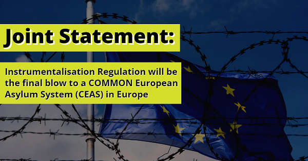
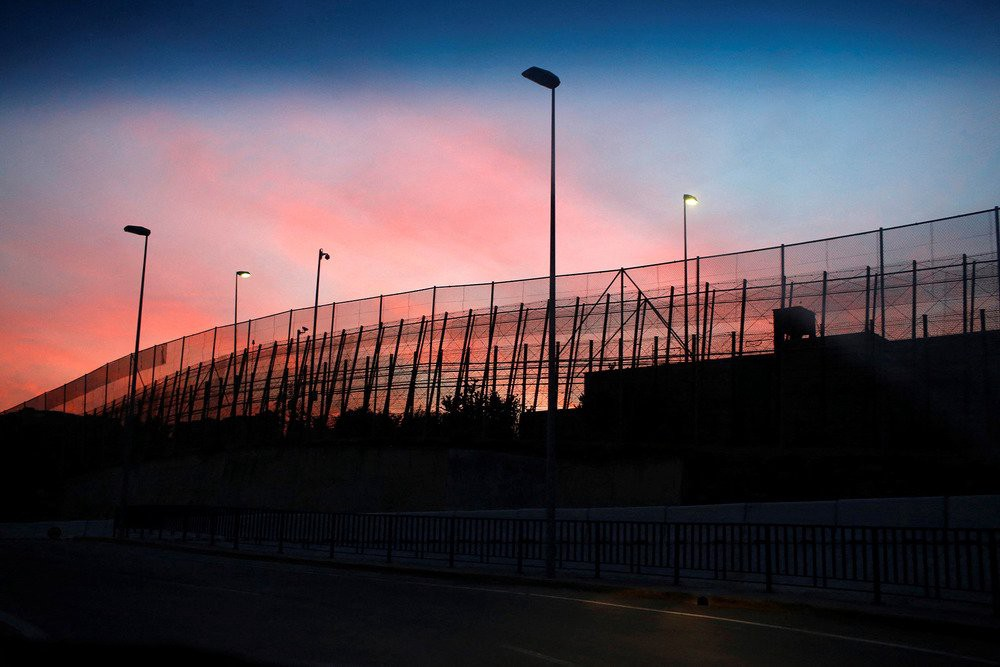
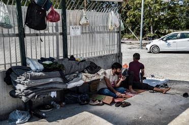
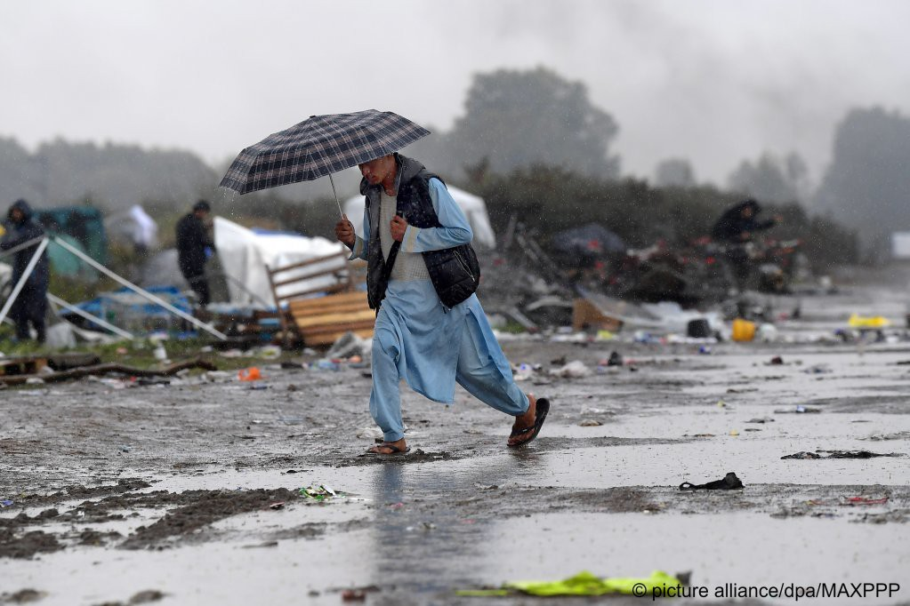
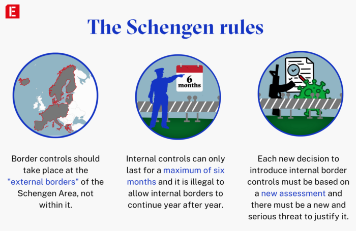

### AYS News Digest 10/09/22: Joint Statement from NGOs to EU Member States in opposition to the Instrumentalisation Regulation
#### Deportations from Tajikistan // Frontex ‘training’ merchant vessels? // Public outcry at torture in Lebanese custody // Paper pushbacks in Croatia // Greece’s selective use of border technology in the Evros region for offensive purposes // More shootings at Loon\-Plage // Concerns over Frontex and data security & much more
#### FEATURE

Under a proposed EU asylum reform, a new mechanism will allow Member States to derogate their responsibilities under EU asylum law in situations where migration has been ‘instrumentalised\.’ The undersigned NGOs oppose the reform for 5 central reasons:

**It is disproportionate** — _“We challenge the argument that actions of third country governments which use people, including those seeking international protection, to destabilise the EU should result in a significant negative impact on the rights of those people, including by the lowering of asylum standards and making it more difficult for people to apply for international protection in Europe”_

**It is counterproductive — _“_** _Derogations available on a permanent basis will undermine the CEAS and in particular its common nature\.”_

**It is unnecessary — “** _The current legal framework already provides flexibility for Member States to deal with changing events at their border, including already allowing for derogations, albeit tightly circumscribed by the Treaties and jurisprudence\.”_

> **_It is misguided —_** “Countries frequently manipulate displaced people\. \[…\] There is no logical reason why manipulation of people should necessitate a different asylum regime\. Actions by third country governments to destabilise the EU should be met by policy measures directed at those third country governments rather than at people seeking protection, themselves victims of such actions” 

**It is unfair \(to applicants and some Member States\) — “** _The significant divergence in respect for legal obligations in the field of asylum creates differential treatment of people searching protection based on their mode of arrival\. It also results in increased responsibilities for the Member States that do respect the law\. A system where some Member States frequently derogate — and thus apply lower standards — by claiming to face instrumentalisation, is likely to have an impact on Member States which continue to apply higher standards, as lack of respect for the standards of EU and international law create a push factor\.”_

Read in full below:

#### SEARCH AND RESCUE
#### A boat sunk off the coast of Tunisia on Thursday\. Eight individuals have been confirmed dead, and another 15 people remain unaccounted for

The boat, which sank just off the coast of Chebba, was [reportedly trying to cross the Mediterranean to reach Italy, carrying individuals believed to be from Tunisia](http://www.infomigrants.net/en/post/43222/several-migrants-confirmed-dead-off-tunisian-coast?fbclid=IwAR1YXi_ac6Tk3D48tTMI8NWV8ufcH3NkJHHjfbKR9Bugi81kb4vJxsT6n9I) \. The rising number of departures from Tunisia and fatalities in the Mediterranean is being met with heightened measures to curb irregular migration — since January 2022 around 16,000 individuals have been intercepted and returned to Tunisia\.
#### A Merchant Vessel, co\-operating with Frontex, actively refused a rescue

Sea Watch report that a EFCA vessel — the Lundy Sentinel — actively refused a rescue in a co\-operative partnership aimed to ‘strengthen’ national coast guards\.

■■■■■■■■■■■■■■ 
> **[Sea-Watch International](https://twitter.com/seawatch_intl) @ Twitter Says:** 

> > A few days ago, we could observe how the merchant vessel #LundySentinel actively refused a rescue. We now learned that the ship is part of a cooperation of @[Frontex](https://twitter.com/Frontex), @[EFCA_EU](https://twitter.com/EFCA_EU), and @[EMSA_EU](https://twitter.com/EMSA_EU) aimed at “strengthening” national coast guards. https://t.co/jUmZHQnEdC 

> **Tweeted at [2022-09-09 12:39:20](https://twitter.com/seawatch_intl/status/1568217492333658115).** 

■■■■■■■■■■■■■■ 

70 people on four small vessels were intercepted by the Spanish coastguard off Ibiza and Formentera in the Balearic Islands\. Most people on board are believed to be of North African origin\. More [here](https://www.europapress.es/epsocial/migracion/noticia-incerceptados-setenta-migrantes-cuatro-pateras-aguas-murcia-baleares-20220909123545.html?fbclid=IwAR2Ed7OuwMMymvjyyliPhTGiZREMR0ZCjDODCFLD7SuFurTd0R75_txgtXE) \.
#### The Geo Barents, carrying 267 survivors, has arrived at Taranto

■■■■■■■■■■■■■■ 
> **[MSF Sea](https://twitter.com/MSF_Sea) @ Twitter Says:** 

> > The #GeoBarents finally reached #Taranto, the place of safety assigned to the 267 survivors rescued last week.

After more than 24 hours of navigation, it is another day of waiting ahead of them. We are hoping the disembarkation will kick off soon. https://t.co/aONG2x4p6t 

> **Tweeted at [2022-09-08 08:23:59](https://twitter.com/msf_sea/status/1567790841824935937).** 

■■■■■■■■■■■■■■ 

#### AFGHANISTAN
#### A year after the Taliban’s takeover, ECRE releases a statement on Afghans and their ‘welcome’ in Europe

_“One year after the Taliban takeover, the country is in a state of lawlessness without a constitution\. \[…\] the efforts of European governments to provide protection in Europe have been too little and have come too late\. Instead, efforts have been made to prevent Afghans from arriving in Europe and to reduce protection for Afghan asylum seekers despite their growing protection needs\. Afghan asylum seekers are highly impacted by violence at the borders, pushbacks, and use of the ‘’safe third country clause’’\. — ECRE_

Read the ECRE’s full report here:

#### _The Guardian_ have reported that Tajikistan is ‘rounding up and deporting Afghan refugees’

](assets/96946c11fc8a/0*MGe0q_xeK3fdEFSM)

Refugees crossing into Tajikistan from Afghanistan\. Credit: Jack Picone/Alamy — from [https://www\.theguardian\.com/global\-development/2022/sep/09/tajikistan\-rounding\-up\-and\-deporting\-afghan\-refugees?fbclid=IwAR1Xipkgkb0\_d48J7v1gXhvJUS2I5ZSElRZzJxdHDUx4vZIJFI12XMxXk50](https://www.theguardian.com/global-development/2022/sep/09/tajikistan-rounding-up-and-deporting-afghan-refugees?fbclid=IwAR1Xipkgkb0_d48J7v1gXhvJUS2I5ZSElRZzJxdHDUx4vZIJFI12XMxXk50)

People who have been sheltering in Tajikistan since August 2021 — an estimated 10,000 Afghan refugees — are living in fear of deportation following the deportation of 80 individuals since 16th August 2022\. UNHCR is yet to understand Tajikistan’s motivation for the policy that is putting lives at risk\. Read the article in full [here](https://www.theguardian.com/global-development/2022/sep/09/tajikistan-rounding-up-and-deporting-afghan-refugees?fbclid=IwAR1Xipkgkb0_d48J7v1gXhvJUS2I5ZSElRZzJxdHDUx4vZIJFI12XMxXk50) \.
#### LIBYA
#### Video emerges of a Sudanese refugee kidnapped and abused in Libya

Mazen Adam, a refugee from Sudan’s Darfur region is recorded cowering from his assailants, begging for mercy in response to demands for money\. Shortly after the video was posted online, the boy’s father was reportedly abducted from his home\. No one has claimed responsibility yet, and the family still have no news as to Mazen or his father’s whereabouts and well\-being\. This video illustrates the troubling, seemingly regular practice of refugees transiting through Libya being detained by unknown gunmen in order to demand ransoms from their families\.

■■■■■■■■■■■■■■ 
> **[Sam Magdy](https://twitter.com/sammymagdy) @ Twitter Says:** 

> > The video has underscored how abuses, torture, sexual violence and killings of migrants are rampant in #Libya, where the European Union is using fragments of the broken-down state as an out-sourced policeman to block migrants from reaching its shores, trapping them there. 

> **Tweeted at [2022-09-07 06:14:03](https://twitter.com/sammymagdy/status/1567395756255887362).** 

■■■■■■■■■■■■■■ 

Read more [here](https://www.infomigrants.net/en/post/43160/brutal-video-of-15yearold-sudanese-refugee-kidnapped-in-libya?fbclid=IwAR2B295dMlruiPPxyx3L8zKsk6M4ezYQt2YqWr6vdJa_rFazpRA_7ns6LaE) \.
#### MELILLA

Credit: Juan Medina, REUTERS — Photo from December 2014
#### The legalisation of pushbacks on the Moroccan\-Melilla border?

Following the Melilla Massacre on 24th June 2022, the role of Morocco as externalised, weaponised EU border guards has been increasingly put under the spotlight\. Since 2018, when 56,000 asylum seekers arrived in Spain via Melilla and Ceuta, Morocco has received increasing levels of EU funding — 148 million euros in 2019\.

Spain and Morocco have recently renewed their friendship — with Spain publicly supporting Morocco’s territorial claim over the Western Sahara — and Lorena Stella Martini \(European Council on Foreign Relations\) suggests this is connected to the violence in Melilla: _“\[There are often\] crackdown\[s\] on undocumented migrants and asylum seekers in those countries on the heels of renewed declarations of partnership”\._

Migration is being increasingly framed in a criminal context: irregular entrants to Melilla being pushed back\. The focus publicly has become one that directs hostile border policies, rather than highlighting the distressing dearth of legal migration pathways\. Read more [here](https://www.thenewhumanitarian.org/analysis/2022/09/08/Migrant-crisis-Morocco-Spain-border?fbclid=IwAR3KI70YW1jc2tvmCHFhLcULcd9mTUB2JnCrG1KBPChVk9HRoNZVPT_Iiwg) \.
#### LEBANON
#### A Syrian refugee named Bashar Abdel\-Saud died in Lebanese custody this week, the result of injuries sustained whilst being held there and subject to torture\.

 \)](assets/96946c11fc8a/1*q5mFPZjN2T14AeERQN8HCA.jpeg)

Credit: Amnesty International \( [https://www\.amnesty\.org/en/latest/news/2022/09/lebanon\-transfer\-investigation\-into\-death\-in\-custody\-of\-syrian\-refugee\-to\-the\-civilian\-justice\-system/?fbclid=IwAR3CJKJlh\-Pefab\_FXo1ApL4jwPAGFn8\_Bd8SYEFp1owcB1DzUrX\-MKjRdQ](https://www.amnesty.org/en/latest/news/2022/09/lebanon-transfer-investigation-into-death-in-custody-of-syrian-refugee-to-the-civilian-justice-system/?fbclid=IwAR3CJKJlh-Pefab_FXo1ApL4jwPAGFn8_Bd8SYEFp1owcB1DzUrX-MKjRdQ) \)

_“Bashar Abdel\-Saud cruelly died while in the custody of Lebanon’s State Security agency — the images of his bruised, gashed body offer a distressing reminder of the need to urgently implement the 2017 anti\-torture law\. It is unacceptable for torture to be continuing to occur in Lebanese detention centres and with such brutality — the authorities must put a stop to it immediately” —_ Heba Morayef, Amnesty International’s director in the Middle East and North Africa\.

The commonplace impunity for torture, stressed by Morayef, is of acute concern: the [anti\-torture law](https://www.amnesty.org/en/latest/news/2018/06/lebanon-new-anti-torture-law/) passed in 2017 has unequivocally being ignored\. Amnesty have urged Abdel\-Saud’s case to be referred to a civilian court to ensure transparency and impartiality\. Read Amnesty’s full report [here](https://www.amnesty.org/en/latest/news/2022/09/lebanon-transfer-investigation-into-death-in-custody-of-syrian-refugee-to-the-civilian-justice-system/?fbclid=IwAR3CJKJlh-Pefab_FXo1ApL4jwPAGFn8_Bd8SYEFp1owcB1DzUrX-MKjRdQ) \.
#### BULGARIA
#### Border violence intensifies in pushbacks from Bulgaria to Turkey

Following the Bulgarian bureaucracy’s failure to ensure its border officers comply with ECHR law and obligations, ECHR and Voice in Bulgaria have filed a report\.

■■■■■■■■■■■■■■ 
> **[ECCHR](https://twitter.com/ECCHRBerlin) @ Twitter Says:** 

> > Bulgaria’s #pushbacks are intensifying! 
To date, #Bulgaria has disregarded the @[ECHR_CEDH](https://twitter.com/ECHR_CEDH) judgment condemning pushbacks + taken no steps to ensure officers comply w/ #ECHR at #borders. 
So, we filed a #rule9 report w/ @[VoiceInBulgaria](https://twitter.com/VoiceInBulgaria) to push the implementation of D v. Bulgaria https://t.co/sXlwrPt3Xg 

> **Tweeted at [2022-09-08 07:54:16](https://twitter.com/ecchrberlin/status/1567783362168750080).** 

■■■■■■■■■■■■■■ 

Read it in full [here](https://www.ecchr.eu/fileadmin/user_upload/Rule_9_submission__D_v._Bulgaria_implementation.pdf?fbclid=IwAR1M4UpHlVNChlER_F6rIdiT4f7MUUTm6yA3crasT2HcC--je2Dvf7KwDvQ) \.
#### GREECE
#### Offensive use of border technology: to repel, never rescue

In recent years Greece has invested millions into high\-tech systems: drones, sensors, cameras — all aimed to track down and deter migration\. The sum of 15 million euros has recently been spent expanding the system in the Evros region, yet Greek authorities regularly claim to be unable to locate people stranded in the Evros region\. This is exactly what happened when a five\- [year\-old girl tragically and unnecessarily lost her life\.](ays-news-digest-10-8-22-a-5-year-old-girl-died-on-evros-her-family-still-remains-there-helpless-869b6d619c2d) Lena Karamanidou, a human rights researcher from Evros, has mapped the ABSS pylons in the Evros region and says that:

> “It’s absurd that the Greek police and government in this incident, and similar ones earlier this year, say that they cannot locate people on islets\. They have the technology, and the area is heavily patrolled by both police and army”\. 

Read the [full investigation here\.](https://www.dw.com/en/is-greece-failing-to-deploy-eu-funded-surveillance-system-at-turkish-border-as-intended/a-63055306)

■■■■■■■■■■■■■■ 
> **[Lydia Emmanouilidou](https://twitter.com/lydiaemman) @ Twitter Says:** 

> > NEW: Greece &amp; EU poured millions into an automated border surveillance system aimed, in part, at "saving lives" at Evros border. Our investigation suggests Greek authorities are failing to utilize the new system for search &amp; rescue. W/ @[SchmitzFlorian_](https://twitter.com/SchmitzFlorian_)  

[dw.com/en/is-greece-f…](https://www.dw.com/en/is-greece-failing-to-deploy-eu-funded-surveillance-system-at-turkish-border-as-intended/a-63055306) 

> **Tweeted at [2022-09-09 08:13:49](https://twitter.com/lydiaemman/status/1568150672192716803).** 

■■■■■■■■■■■■■■ 

Also worth reading:

> ‘In migration policy, especially, the Greek government has essentially abrogated international and European law\. In the last two years, Greek security personnel have intercepted thousands of refugees and violently forced them to return to Turkey\. They have also used other migrants as slaves to assist in these illegal pushbacks\. In other instances, Greek officials have towed asylum\-seekers out to sea and abandoned them on unsafe inflatable rafts\. 

> Almost never is a Greek official forced to answer for crimes committed on the country’s borders\. What does frequently happen, by contrast, is that those who document such crimes come under intense pressure\.’ — Maximilian Popp in Spiegel\. 

#### Data safeguards required under EU law absent from Asylum Surveillance Systems recently launched in Greece

■■■■■■■■■■■■■■ 
> **[Solomon](https://twitter.com/we_are_solomon) @ Twitter Says:** 

> > #THREAD: 

Central to Greece's conservative government’s asylum policy, #Hyperion and #Centaur, two surveillance systems directed at asylum seekers and partly financed with European Union pandemic-recovery funds, have previously faced criticism from humanitarian organisations. https://t.co/jvvJQZKxf0 

> **Tweeted at [2022-09-09 11:46:47](https://twitter.com/we_are_solomon/status/1568204266690445313).** 

■■■■■■■■■■■■■■ 

The construction of Hyperion and Centaur were crafted and implemented without a Data Protection Officer and therefore no GDPR oversight\. Side\-lining data concerns is particularly troubling given the functions of these systems: ‘the former monitoring movement in and out of state\-run asylum camps and the latter deploying behavioural analysis algorithms and transmitting CCTV and drone footage to a control room set up inside the Ministry of Migration and Asylum\.’

More troubling still, these systems were partly financed with EU pandemic\-recovery funds\. Unsurprisingly, the paper trail is rather opaque\. [Report in full here\.](https://balkaninsight.com/2022/09/09/asylum-surveillance-systems-launched-in-greece-without-data-safeguards/?fbclid=IwAR3bzBpGanrElLqNBEcYLMG5kt_dvk6KVAJL-WEENvZkqgVTzSaw_Sa-L5w)
#### Testimonies from the Evros/Meric region: ‘A dilemma between unbelievable violence and death’

Alarm Phone has recorded and published some testimonies from the Evros/Meric border region, highlighting the infrastructure of persecution\. They write that “ **_These border crimes are a result of political processes — practically enforced by the Greek state, wilfully supported and legitimized by its main partner, the European Union\.”_**

_“We were sitting in the forest waiting for the night to pass, when before sunset, four people \(three young people about 25 years old and a man about 40 years old\) came from behind the trees without the slightest sound\. With pistols aimed at our faces and batons in their other hands\._

_One of them told us in a low voice to sit down, then asked for phones and GPS\. When they took our phones and put them in a bag, they said, “How did you come here? With a smuggler?” When we said no, they asked “Did you see any other groups?” We said no\. \[…\] Finally, a black big Mercedes Benz van arrived and they told us to get in\. There were no lights inside the van, all the windows were covered with iron sheets and there were no openings for oxygen to enter\. There were no seats, the van had been turned into an iron can\. We were in the van for about three to four hours, after the first half hour everyone was dizzy, scared and nauseous\. My heart rate had risen strangely so that I could feel my heart beating in my eyes and head and I was very hot\. We were all on top of each other, no one was talking to anyone\.”_ Read the [testimonies in full here\.](https://alarmphone.org/en/2022/09/07/a-dilemma-between-unbelievable-violence-and-death/?fbclid=IwAR3bzBpGanrElLqNBEcYLMG5kt_dvk6KVAJL-WEENvZkqgVTzSaw_Sa-L5w)
#### Two years on from the Moria fire

■■■■■■■■■■■■■■ 
> **[Petra Molnar](https://twitter.com/_PMolnar) @ Twitter Says:** 

> > Two years ago today, the Moria refugee camp burned to the ground. What has been happening since at Europe’s borders?🧵 https://t.co/UJBY3O11qM 

> **Tweeted at [2022-09-09 15:42:23](https://twitter.com/_pmolnar/status/1568263556826812416).** 

■■■■■■■■■■■■■■ 

Read Petra Molnar’s thread in full for updates on Europe’s borders: high\-tech camps and border\-tech surveillance, criminalisation of NGOs, journalists and search and rescue workers\. She asks:

> **How many more people will die?** 

■■■■■■■■■■■■■■ 
> **[Petra Molnar](https://twitter.com/_PMolnar) @ Twitter Says:** 

> > I have been quiet on here lately, trying to make sense of years of work comparing technologically facilitated violence at borders. One experience sits viscerally with me every day. How many more people will die? 🧵 

> **Tweeted at [2022-09-09 15:42:40](https://twitter.com/_pmolnar/status/1568263628406800386).** 

■■■■■■■■■■■■■■ 

#### 120 Yazidis have been stranded outside a refugee camp in Serres, northern Greece, for the past twelve days

Authorities have blocked the Kurdish\-speaking minority from Iraq entrance to the camp, which is currently home to 1000 refugees \(700 of whom are from the Yazidi community\) \. Officials say the camp is at capacity, and no safe alternative accomodation has been provided\. Greece now ‘hosts’ 34 camps, compared to 121 in 2020\. Migration Minister Notis Mitarachi recently announced plans to close two more\.

Read more [here](https://english.alarabiya.net/News/world/2022/09/07/Scores-of-Yazidis-stranded-outside-Greek-camp-?fbclid=IwAR2eRlUrIGjMFnz4G89W8TdPo3bn-y4ukkKid5Oru3S-63pRAs9gzF-UnJo) \.

Credit: AFP
#### CROATIA
#### Paper pushbacks in the form of ‘seven\-day notices’?

 on [Unsplash](https://unsplash.com?utm_source=medium&utm_medium=referral)](assets/96946c11fc8a/0*VVWXbaDG3VYCmmdO)

Photo by [Daniel Bernard](https://unsplash.com/@nardly?utm_source=medium&utm_medium=referral) on [Unsplash](https://unsplash.com?utm_source=medium&utm_medium=referral)

As earlier reported by AYS, many people entering Croatia are served by the police with a seven\-day notice — in short, they are required to leave the European economic space within seven days\. So, whilst there is no physical detention nor violent pushback, people arriving in Croatia have no support, no place to stay, and often no opportunity to seek asylum in Croatia\. Indeed, it pushes people into the hands of EU smugglers\. Deferring the problem, rather than seeking solutions, appears to be the default\.
#### FRANCE
#### Shootings at Loon\-Plage migrant camp in Northern France

Photo: picture\-alliance/dpa/MAXPPP

Two more shootings have occurred at Loon\-Plage, leading to the hospitalisation of a 32\-year\-old Eritrean man who was shot in the head\. The shootings have been attributed to the ‘settling of scores’ between smugglers, reportedly between Kurdish and Sudanese communities\. This follows injuries to nine people in a shooting incident on 30th August 2022\. Around 500 people live in the camp, which is constantly dismantled and evicted by French authorities to little effect\.
#### Hussam Hammoud \- a prominent Syrian journalist — refused asylum in France

Currently in Turkey, Hammoud had a ‘humanitarian visa’ for himself, his wife and children denied despite receiving multiple threats in Syria and Turkey\. He is still trying to get an explanation for the rejection of his application\. [Full article here\.](https://www.middleeasteye.net/news/syria-france-journalist-asylum-rejected?fbclid=IwAR3f8ALHfXx90GLjYuYOgDrjRWmtpgH1SxD5YAP00j9TXRXJCtIMWvJMWiM)
#### WORTH WATCHING:

Human Rights Observers/Utopia 56 have released a video showing police violence in Calais on 22/23 August 2022\. The video, containing graphic violence, shows the CRS manhandling a group of individuals to a CCTV blindspot\. One was hospitalised\. Such violence is abhorrently commonplace at the France\-UK border\.

#### UNITED KINGDOM
#### The High Court is set to rule on the UK’s shameful Rwanda Policy

Following the European Court of Human Rights’ ruling\. that no individuals should be forcibly removed to Rwanda until domestic courts have arbitrated over the policy’s legality, no flights have yet taken off\. Asylyum Aid have specifically opposed the blanket assessment that Rwanda is a ‘safe’ country, which allows the government to sidestep making case\-by\-case decisions about deportation, as it considers Rwanda suitable for international protection\. Read more [here](https://eachother.org.uk/high-court-set-to-rule-on-rwanda-policy/?fbclid=IwAR3bzBpGanrElLqNBEcYLMG5kt_dvk6KVAJL-WEENvZkqgVTzSaw_Sa-L5w) \.

However, a recent investigation by Iain Overton for _The Byline Times_ suggests that Rwanda’s stifled press prevents transparency and accountability for the UK’s asylum scheme\-partnership\. Overton writes that:

_“Such concerns were reflected in the European Parliament’s decision to adopt two resolutions in February and October 2021, [condemning](https://www.hrw.org/world-report/2022/country-chapters/rwanda) Rwanda’s broader human rights record\. Despite this, the British Home Office is adamant that the nation is “safe and secure”\._

_Just how safe and secure, though, is not easy to establish when journalists are under threat\.”_

Indeed, his investigation has revealed the persistent suppression of independent domestic journalism in Rwanda: ‘ **_Dissent, in Rwanda, it seems, is simply not tolerated_ \.’**

It is **really** worth reading Overton’s article in full:

**GENERAL**
#### Frontex and Data Protection needs scrutiny

_“This blogpost shows that Frontex is playing an increasingly important role in the processing and exchange of personal data in the Area of Freedom Security and Justice\. The blurring of boundaries between law enforcement and migration purposes further enhanced this information\-related role of Frontex\. As this role is a de jure and de facto reality, appropriate data protection provisions and supervision are of key importance\.”_ — Sarah Tas in Verfassungblog\.

Read her piece in detail:

And another piece on \(lack of\) public access to documents:

#### Vincent Cochetel \(UN special envoy\) apologises for blaming the mothers of the disappeared in Tunisia for the disappearance of their children

■■■■■■■■■■■■■■ 
> **[Maurice Stierl](https://twitter.com/MauriceStierl) @ Twitter Says:** 

> > Three days ago, when I tweeted about a #CommemorAction protest in Tunisia by the mothers of the disappeared, a #UNHCR special envoy responded by blaming the mothers for the disappearance of their children. Now the mothers as well as many solidarity groups have responded. 1/6 

> **Tweeted at [2022-09-09 09:03:42](https://twitter.com/mauricestierl/status/1568163223618129923).** 

■■■■■■■■■■■■■■ 

> Hajer Ayachi \(mother\): “It should be a shame to accuse mothers and sisters of missing migrants … of being responsible for their deaths\. We have been fighting against governments since 2011 to show that it is migration policies that endanger the lives of our sons, not us\.” 

Read the full thread on Maurice Stierl’s twitter for responses from a number of mothers\.

■■■■■■■■■■■■■■ 
> **[vincent cochetel](https://twitter.com/cochetel) @ Twitter Says:** 

> > Reflecting on the strong reactions to my previous tweets, my comments were inappropriate. I am sorry especially to the mothers who have lost their children. My frustration at seeing so many lives lost and the impunity the smugglers enjoy, does not justify my words. 

> **Tweeted at [2022-09-07 07:52:32](https://twitter.com/cochetel/status/1567420539395784704).** 

■■■■■■■■■■■■■■ 

#### The Red Cross’ Trace the face website for missing persons

[Trace the face](https://familylinks.icrc.org/ttf-europe) is a platform/database allowing for the permanent documentation of family search requests for missing lived ones\.

In 2021, there were 16,500 people registered, searching for 25,600 missing persons\. The Red Cross’ website has been raising awareness for the long\-term familial impacts and trauma of such disappearances\. More [here](https://www.infomigrants.net/en/post/43068/red-cross-when-a-person-disappears-life-is-frozen-in-many-ways?fbclid=IwAR29is_EJP5kR_tHdozA1EmE3MgodQjaw-3RHVbV9HMu8p7nmO9GfDQB27U) \.

■■■■■■■■■■■■■■ 
> **[ICRC](https://twitter.com/ICRC) @ Twitter Says:** 

> > Every year, thousands die or go missing moving along migratory routes. 

Back home, they leave behind suffering families unable to move on. 

Together, let’s make sure they are not forgotten: [bit.ly/3KEggTj](https://bit.ly/3KEggTj) 
#NoTraceOfYou https://t.co/zzZmqvTkEZ 

> **Tweeted at [2022-09-02 09:33:23](https://twitter.com/icrc/status/1565633980401057793).** 

■■■■■■■■■■■■■■ 

#### Frontex’s aim ‘to return people with dignity’, not protect them…

■■■■■■■■■■■■■■ 
> **[ECRE](https://twitter.com/ecre) @ Twitter Says:** 

> > 🧐One might think the cornerstone of the pact should rather be how to ensure dignified, efficient &amp; rapid protection... 

> **Tweeted at [2022-09-09 10:46:59](https://twitter.com/ecre/status/1568189215740928000).** 

■■■■■■■■■■■■■■ 

**WORTH READING**
- ‘Dismantling Schengen — half a year at a time’ — An Investigation into semi\-permanent internal border controls instituted in several EU member states that circumvent the Schengen Agreement on free movement\. This allows the economic benefits of Schengen — worth an estimated €25\.5 billion to the European economy annually — to remain, whilst internally policing borders in anti\-migration efforts that won’t harm the economy\.

Credit: Investigate Europe

Read in full here:

See also:

‘National border controls: illegal, dangerous — and deadly: 7 years of madness at the European internal borders’

- ‘Waiting for what? Hope and endurance in situations of uncertainty for asylum\-seekers in Greece’ — Research article by Margarita Lipatova in the European Journal of Social Work\.

**Find daily updates and special reports on our [Medium page](https://medium.com/are-you-syrious?source=email-156a28ef10e4-1660244456586-newsletter.subscribeToProfile-------------------------68bdcd3d_8cf3_4eba_889e_fd5281d60100--------3e266993d553) \.**

**If you wish to contribute, either by writing a report or a story, or by joining the Info Gathering team, please let us know\!**

**We strive to echo correct news from the ground through collaboration and fairness\. Every effort has been made to credit organisations and individuals with regard to the supply of information, video, and photo material \(in cases where the source wanted to be accredited\) \. Please notify us regarding corrections\.**

**If there’s anything you want to share or comment, contact us through Facebook, Twitter or write to: [areyousyrious@gmail\.com](mailto:areyousyrious@gmail.com)**

_Converted [Medium Post](https://medium.com/are-you-syrious/ays-news-digest-10-09-22-joint-statement-from-ngos-to-eu-member-states-in-opposition-to-the-96946c11fc8a) by [ZMediumToMarkdown](https://github.com/ZhgChgLi/ZMediumToMarkdown)._
