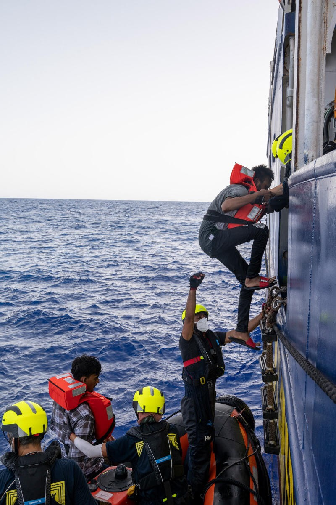
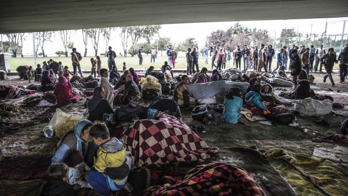

### AYS News Digest 12/9/22: 6 Syrian refugees found dead on a boat that arrived at the port of Pozzallo, Sicily

Legal risks associated to the ETIAS regulation//Press Release by the Association des Mères de Migrants Disparus//PRO ASYL and 60 NGOs sign a letter warning against an EU regulation that would undermine European Asylum Law// A 16\-year\-old boy, without a legal guardian, was pushed back from Poland into Belarus//A train collision in Croatia left 12 injured, including an Iranian family//Turkey has released footage of a Greek illegal pushback//Ahead of the elections, UNHCR has sent sent 12 proposals to Italy’s politicians//and much more…

Source: SOS Humanity Tweet September 10th 2022
#### FEATURE
#### Frontex— The ETIAS Regulation

Amanda Musco Ekland, a PhD researcher and lecturer, focuses on the automation of EU external border control from a rule of law perspective, and is a legal consultant for the NGO Front\-LEX\. [She has written a piece looking into the legal challenges to FRONTEX’s soon\-to\-be\-implemented European Travel Information and Authorisation System \(ETIAS\)](https://verfassungsblog.de/frontex-and-algorithmic-discretion-part-i/?fbclid=IwAR21TAhkwGnEIkqWWsm-IOGW8SFAs4aQywRFxJ7qTHSyiqlZoNy4E9fx5P0) \.

> I argue that the ETIAS screening rules algorithm illustrates how automation can lead to what I suggest is a new form of arbitrariness — which I refer to as ‘algorithmic discretion’\. This can be defined as a situation where the exercise of power and discretion and their limitations are not sufficiently specified at the legislative level but are delegated to an algorithm instead\. 

**How will ETIAS work?**

ETIAS will use personal data and an algorithm to assess the risk posed by visa\-exempt third\-country nationals entering European territory\.

Personal data is defined as:

> their sex, date, place and country of birth, nationality, city and country of residence, level of education and current occupation 

The algorithm will then assess any risk in the form of; security, irregular migration or epidemic\. It is the Commission that will establish the risk regulation that determines and specifies what would be considered, for instance, a security risk\. It will combine personal information and risk level to then profile an individual and determine whether they are considered a risk\. It will cross\-check with data from Europol, Interpol, and its own ETIAS database\.

**However, the way in which the ETIAS regulation will work in reality will rely quite heavily on the discretion of FRONTEX\.**

> the Regulation merely requires that the specific risk indicators are 1\) based on the Commission’s risk specification, 2\) consist of a combination of certain data categories and 3\) are targeted, proportionate and non\-discriminatory\. 

It works as an automated mechanism and therefore uses very little to no human interference\. The concept of an automated mechanism, as Ekland argues, is not necessarily a bad thing but rather there are legal systems in place to structure human decision\-making, whereas this is not yet completely established in terms of AI\. This is especially concerning if the element of human interference is driven by FRONTEX decision\-making\.

With legal complications and ‘arbitrariness’, comes difficulties in accountability\. Legality and accountability have a relatively straightforward relationship, however, in this instance, the imposition of power and discretion have not been legally clarified\. This responsibility has been placed onto the algorithm, that does not necessarily meet the standard of transparency, accountability, nor legality\.

You can read more on this topic here:

#### GENERAL
### Press Release by the the Association des Mères de Migrants Disparus

In their statement, [they criticise the statement made by the special envoy of UNHCR](https://alarmphone.org/en/2022/09/11/press-release-by-association-des-meres-de-migrants-disparus/) , where he stated the deaths of individuals trying to cross the Mediterranean [were partly the responsibility of the mothers who allowed them to leave in the first place](ays-news-digest-10-09-22-joint-statement-from-ngos-to-eu-member-states-in-opposition-to-the-96946c11fc8a) \.

They firstly place a great deal of responsibility on countries, such as Tunisia, that have not protected and done enough for their children who have tried to go through such countries with the aim of reaching Europe\.

> Secondly, we blame the policy of the European Union, which is considered racist, for imposing visas on us and closing the borders in the face of our children, while the EU citizens go to our countries without any problems or queues to take visas — an identity card being sufficient to enter\. Furthermore, their governments are colluding with ours to undermine and exploit our wealth, and in consequence, we have been deprived of development projects that could have created opportunities and jobs for our youth\. 

> Therefore, we call for more caution and consideration of the feelings of mothers before making statements that are not appropriate, and even the apology we saw, we did not feel its sincerity but only received it as a formal reply\. 

### PRO ASYL and 60 NGOs sign a letter warning against an EU regulation that would undermine European Asylum Law

This regulation, [proposed in December 2021](https://eur-lex.europa.eu/legal-content/DE/TXT/PDF/?uri=CELEX:52021PC0890&from=EN) , would allow EU states to [deviate from their obligations under European Asylum Law](https://www.proasyl.de/pressemitteilung/frontalangriff-auf-das-europaeische-asylrecht/?fbclid=IwAR0GmCaDycN0LO4KS5BpztktkrGR4g3q_MJpTMGIW4rfxg2PB5zyAimIc5o) in specific circumstances within the context of migration and asylum\.

> “For years we have been observing an erosion of the right to asylum and the rule of law at Europe’s external borders\. But with this regulation, shabby practices of breaking the law would be cast in law\. That means a free pass for repressive governments in the EU that trample on the rights of those seeking protection,” — Karl Kopp, Head of Europe Department of PRO ASYL\. 

#### POLAND
### A body that was fished out of the border river, Swislocz has been identified, thanks to Karolina Mazurek’s investigation and police cooperation

■■■■■■■■■■■■■■ 
> **[Piotr Czaban](https://twitter.com/CzabanPiotr) @ Twitter Says:** 

> > Zmarły wyłowiony 29 lipca ze Świsłoczy to Egipcjanin. 
Dzięki dociekliwości Karoliny Mazurek i współpracy z policją udało się ustalić tożsamość zmarłego.
Ze względu na dobro rodziny chłopaka w tym momencie więcej szczegółów nie podaję. 

> **Tweeted at [2022-09-10 18:42:49](https://twitter.com/czabanpiotr/status/1568671351258628096).** 

■■■■■■■■■■■■■■ 

### A 16\-year\-old boy, without a legal guardian, was pushed back from Poland into Belarus

The government continues to act violently in its response to refugees and asylum seekers in Poland

■■■■■■■■■■■■■■ 
> **[Piotr Czaban](https://twitter.com/CzabanPiotr) @ Twitter Says:** 

> > Chłopak ma 16 lat. Bez opiekuna prawnego. Wczoraj został wyrzucony na Białoruś. 
Od roku rządowe metody "walki z kryzysem humanitarnym" nie zmieniają się. 

> **Tweeted at [2022-09-08 09:56:12](https://twitter.com/czabanpiotr/status/1567814046992273408).** 

■■■■■■■■■■■■■■ 

#### CROATIA
### A train collision last Friday left 12 injured, including an Iranian family

The family members were separated, with 5 being taken to a hospital in Nova Gradiska, and the other 3 members were taken to a hospital in Slavonski Brod\.

They weren’t sure whether their family members had survived until the Saturday afternoon when other family members spoke to journalists outside of the Nova Gradiska hospital\.

The family had previously been informed by the Croatian authorities that they were to return to Iran\. However, as two of the passengers were minors, and were taken to hospital without any adults present, the authorities considered them to be unaccompanied minors\. They were taken to a social care centre, and are now in foster families\.

### 49\-year old male arrested on suspicion of human smuggling

The Croatian authorities suspect he was smuggling a group of Indian nationals, [charging them roughly 1000 euros](https://dnevnik.hr/vijesti/hrvatska/na-granici-sa-srbijom-ulovljen-svercer-koji-je-prevozio-ilegalne-migrante---741614.html?utm_campaign=ughr.contentexchange.me&utm_medium=referral&utm_source=ughr.contentexchange.me&fbclid=IwAR2zIvy8OkGoRwzTMiBEnxM44L9_oY_xjyJ18uoDSKU0k9skwyJfWWKX3ks) \.

The group were found in a compartment with no air vents, windows or safety belts, and were therefore exposed to inhumane conditions\.
#### TURKEY
### Conditions for Syrian refugees in Turkey are becoming even harsher

■■■■■■■■■■■■■■ 
> **[Eleni Konstantopoulo](https://twitter.com/EleniKonstanto) @ Twitter Says:** 

> > Crackdown on Syrian #refugees in #Turkey intensifies.
"Concern is mounting among refugees, who are facing increasing administrative difficulties as the government enforces tougher measures" [lemonde.fr/en/internation…](https://www.lemonde.fr/en/international/article/2022/09/11/crackdown-on-syrian-refugees-in-turkey-intensifies_5996549_4.html?utm_term=Autofeed&utm_medium=Social&utm_source=Twitter#Echobox=1662908971) 

> **Tweeted at [2022-09-11 17:09:32](https://twitter.com/elenikonstanto/status/1569010264456200192).** 

■■■■■■■■■■■■■■ 

### ‘Across mountains and seas: Afghan refugees in Istanbul kitted out for the perilous trek to Europe’

[This article](https://english.alaraby.co.uk/features/afghans-istanbul-kitted-out-long-trek-europe?fbclid=IwAR2SEnr3dbJOBGVXxDCyyPiPzxRIdTW7Ga5rWRrcGQfJAi3Ekzr1cmQEcfg) offers a snippet into the lives of Afghan refugees living in horrendous conditions, in constant fear of being repatriated\.

_Source: The New Arab — Afghan refugees seeking to reach Europe are seen under a viaduct where they have been staying for about three months in the Zeytinburnu District of Istanbul, Turkey_
#### GREECE
### A group of 80 asylum seekers thought to have now been pushed back to Turkey

Alarm Phone had initially reported on this group who were thought to have been detained by Greek authorities\. Relatives of the group have now confirmed that they have been pushed back to Turkey\.

■■■■■■■■■■■■■■ 
> **[Alarm Phone](https://twitter.com/alarm_phone) @ Twitter Says:** 

> > We lost contact to the people. As we now found out, they were held at the #Isaakio border guard station. Satellite imageries on Google Maps and video-footage show a fenced site &amp; many cars. We fear the people have already been pushed back by now - @[hellenicpolice](https://twitter.com/hellenicpolice), where are they? https://t.co/ELTfrFzmQS 

> **Tweeted at [2022-09-12 09:01:29](https://twitter.com/alarm_phone/status/1569249829091708933).** 

■■■■■■■■■■■■■■ 

### Turkey has released footage of a Greek illegal pushback

■■■■■■■■■■■■■■ 
> **[ANADOLU AGENCY](https://twitter.com/anadoluagency) @ Twitter Says:** 

> > Türkiye releases damning footage of illegal Greek pushback of migrants [v.aa.com.tr/2682042](http://v.aa.com.tr/2682042) https://t.co/wMLvEBpKDC 

> **Tweeted at [2022-09-10 13:30:42](https://twitter.com/anadoluagency/status/1568592803847880704).** 

■■■■■■■■■■■■■■ 

### 28\-year\-old Yunus Emre Ayyildiz is missing after falling in the Evros river after his boat capsized

■■■■■■■■■■■■■■ 
> **[Refugees Unknown Stories Untold/RUSU](https://twitter.com/RefugeesUnknown) @ Twitter Says:** 

> > URGENT Search Evros River &amp; surrounding areas for life of Yunus Emre Ayyildiz. Every day those forced to leave their homes, persecuted, wrongly imprisoned &amp; tortured socially and systemically- in prisons will take the risk of death to be free. Innocent lives- find him @[RESCUEorg](https://twitter.com/RESCUEorg) 

> **Tweeted at [2022-09-11 16:49:56](https://twitter.com/refugeesunknown/status/1569005331182747648).** 

■■■■■■■■■■■■■■ 

#### ITALY
### 6 Syrian refugees have been found dead on a boat that arrived at the Sicilian port of Pozzallo

> They died of thirst, hunger and severe burns\. This is unacceptable — UNHCR’s representative to Italy, Chiara Cardoletti 

Among them were 2 children — aged one or two, and the other was 12 years old\.

### Ahead of the elections, UNHCR has sent sent 12 proposals to Italy’s politicians

[The 12 UNHCR recommendations are](https://www.infomigrants.net/en/post/43261/unhcr-sends-12-proposals-to-italys-politicians-before-vote?preview=1662984135745) :
- strengthen international efforts to deal with the causes of forced migration;
- promote European cooperation and solidarity on asylum;
- ensure fair use of resources allocated for asylum through improving governance and planning;
- ensure rescues at sea and access to the territory to save human lives;
- maintain a leading role in legal and safe channels for refugees;
- make reception a launchpad for integration;
- protect and take care of the most vulnerable;
- set up an asylum agency to strengthen the integrity of the system and the efficiency of procedures;
- create an integration system that is a asset for refugees and the country;
- deal with obstacles impeding the repatriation of people who do not need protection;
- involve refugees in the search for solutions for their future;
- and maintain a balanced and objective narrative on the issue of forced migration flows\.

#### SEA/SAR
### Alarm Phone reports on a boat in distress carrying 19 people

They alerted authorities on 11th September, but by the 12th, there had still been no response and the boat was still adrift

■■■■■■■■■■■■■■ 
> **[Alarm Phone](https://twitter.com/alarm_phone) @ Twitter Says:** 

> > 🆘 in Central Med!
We were alerted to a boat carrying 19 people fleeing from #Libya. 
Their engine has troubles and they cannot continue.
They need rescue NOW. https://t.co/73WbgnpuAY 

> **Tweeted at [2022-09-11 14:48:10](https://twitter.com/alarm_phone/status/1568974688998531075).** 

■■■■■■■■■■■■■■ 

### Sea Watch Rescue Missions

■■■■■■■■■■■■■■ 
> **[Alarm Phone](https://twitter.com/alarm_phone) @ Twitter Says:** 

> > We are relieved that #SeaWatch3 finally found and rescued the group we were on the phone with during a long and desperate night. Thanks to the crew! #Civilfleet [twitter.com/seawatch_intl/…](https://twitter.com/seawatch_intl/status/1568159967693135875?t=1pCDnXLC5R4jX4R8JWxIbw&s=09) 

> **Tweeted at [2022-09-10 07:15:44](https://twitter.com/alarm_phone/status/1568498443093528576).** 

■■■■■■■■■■■■■■ 

■■■■■■■■■■■■■■ 
> **[Sea-Watch International](https://twitter.com/seawatch_intl) @ Twitter Says:** 

> > Yet another rescue was conducted by our crew bringing 34 people safely aboard the #SeaWatch3.
It is appalling that the fate of hundreds of people has to rely on civil actors as the #EU and its member states don’t care about the loss of life at sea. https://t.co/Z0zhhQ10vU 

> **Tweeted at [2022-09-11 15:41:34](https://twitter.com/seawatch_intl/status/1568988126668013568).** 

■■■■■■■■■■■■■■ 

■■■■■■■■■■■■■■ 
> **[Sea-Watch International](https://twitter.com/seawatch_intl) @ Twitter Says:** 

> > 🔴 6th rescue within ~50 hours!
Once again 18 people could be brought safely from an unseaworthy boat to the #SeaWatch3. Previously, our ship had searched for another boat, but could only find the remains of what we assume to have been an illegal #pullback to #Libya. https://t.co/BGmsCKrxXC 

> **Tweeted at [2022-09-10 20:44:20](https://twitter.com/seawatch_intl/status/1568701933011238912).** 

■■■■■■■■■■■■■■ 

### SOS Humanity — after 2 missions, the boat carrying 183 individuals started heading north

They have conducted medical examinations on passengers, discovering serious injuries that passengers say are from abuse in Libya\.

However, after receiving a distress call from Frontex aircraft Osprey 3, Humanity 1 changed course to rescue the 25 people onboard\. They then transported **208 individuals** up north\.
### WORTH READING:
- Statewatch — ‘European police facial recognition must be halted, warns new paper’

- The Guardian — ‘British Muslims’ citizenship reduced to ‘second\-class’ status, says thinktank’\. The recently extended powers allowing for individuals to be stripped of their citizenship disproportionately targets British Muslims\.

- Intersos — ‘Syria, 2,400 boys, and girls can finally go back to school’

[https://www\.intersos\.org/en/syria\-2400\-boys\-and\-girls\-can\-finally\-go\-back\-to\-school/](https://www.intersos.org/en/syria-2400-boys-and-girls-can-finally-go-back-to-school/)

**Find daily updates and special reports on our [Medium page](https://medium.com/are-you-syrious?source=email-156a28ef10e4-1660244456586-newsletter.subscribeToProfile-------------------------68bdcd3d_8cf3_4eba_889e_fd5281d60100--------3e266993d553) \.**

**If you wish to contribute, either by writing a report or a story, or by joining the Info Gathering team, please let us know\!**

**We strive to echo correct news from the ground through collaboration and fairness\. Every effort has been made to credit organisations and individuals with regard to the supply of information, video, and photo material \(in cases where the source wanted to be accredited\) \. Please notify us regarding corrections\.**

**If there’s anything you want to share or comment, contact us through Facebook, Twitter or write to: [areyousyrious@gmail\.com](mailto:areyousyrious@gmail.com)**

_Converted [Medium Post](https://medium.com/are-you-syrious/ays-news-digest-12-9-22-6-syrians-found-dead-on-a-boat-that-arrived-at-the-port-of-pozzallo-b59d309b915) by [ZMediumToMarkdown](https://github.com/ZhgChgLi/ZMediumToMarkdown)._
