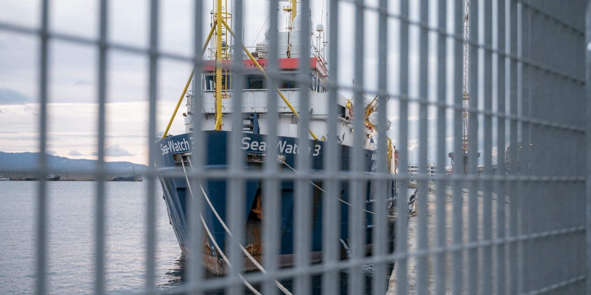

### AYS News Digest 23/09/22: Shipwreck off Syria
#### Shipwreck off the Syrian Coast // Sea\-Watch 3 detained in Italy against an ECJ ruling // Open Arms disembarks finally // ECJ ruled that suspensions because of the pandemic do not extend the 6\-months Dublin regulations rule // long reads & and investigations

 on [Unsplash](https://unsplash.com?utm_source=medium&utm_medium=referral)](assets/4ed90a64de8f/0*YBIs7Qj72GSpCKMO)

Photo by [Stormseeker](https://unsplash.com/ja/@sseeker?utm_source=medium&utm_medium=referral) on [Unsplash](https://unsplash.com?utm_source=medium&utm_medium=referral)
#### FEATURE
#### A boat sailing from Lebanon to Italy sunk off the coast of Tartus, Syria on Thursday 22nd September\. At least 94 people are confirmed to have lost their lives

](assets/4ed90a64de8f/0*zFWs_bZXq2AWCslS)

Source: [Al Jazeera](https://www.aljazeera.com/news/2022/9/24/death-toll-from-lebanon-migrant-shipwreck-rises-to-89)

The boat set off from Lebanon’s northern Minyeh region on Tuesday, the most impoverished region of the country, before tragedy struck on Thursday\. On Saturday, Syrian state TV announced that 94 bodies have been recovered, whilst reports from survivors suggest that there were between 120 and 150 people on board\. Twenty survivors are thankfully being treated at the Al\-Basel Hospital in Tartus\.

Phillipe Lazzarini \(head of the UN agency for Palestinian refugees\), [said that](https://www.theguardian.com/world/2022/sep/24/lebanon-migrant-boat-sinking-syria-death-toll) :

_No one gets on these boats lightly\. People are taking this perilous decision, risking their lives in search of dignity_ \.

No one should have to risk their lives in such conditions to find safety\. Our thoughts are with the survivors and victims of this catastrophic event, and their families\.

■■■■■■■■■■■■■■ 
> **[Ahdaf Soueif](https://twitter.com/asoueif) @ Twitter Says:** 

> > Her name is Ra3d Hakeem. She's a Syrian architect.  She's one of the migrants who died when their boat capsized as it left Lebanon. 

> **Tweeted at [2022-09-23 22:24:07](https://twitter.com/asoueif/status/1573438087010844672).** 

■■■■■■■■■■■■■■ 

#### What is happening in Lebanon?

Following the country’s economic collapse in 2019, 3/4 of Lebanon’s 6\.5 million person population has been pulled into poverty\. Accordingly, the number of people seeking to reach Europe by boat — mostly Lebanese, Syrians and Palestinians — has risen, and so too has the incidence of tragedies at sea\. Since 2020, Lebanese citizens have joined Syrian and Palestinian refugees in embarking upon terrifying boat crossings, and Lebanon’s shores are becoming increasingly frequent and busy departure points\.

Lebanon hosts a population of 1 million Syrian refugees, and tens of thousands of people are now seeking an alternative future in Europe\. The Lebanese pound dropped more than 90% of its value earlier this year, and as poverty surges it is feared that further tragedies at sea will too\.
#### SEARCH AND RESCUE
#### Italy blocks Sea\-Watch 3 in port, ignoring European Court of Justice ruling

Accused of rescuing too many people, Sea\-Watch 3 has been held in the Italian port of Reggio Calabria\.

> Contrary to the verdict \[of the ECJ\], Italian authorities are again using a creative argument to hamper search and rescue efforts in the Mediterranean\. Linking the number of people rescued to the safety of the ship, the Italian authorities argue that too many people rescued pose “a danger to people, property or the environment” \(quote from the inspection report\), since these allegedly reduce the safety of the ship\. In fact, however, the ship’s captains and Sea\-Watch check and reassess the safety of the ship for each individual rescue operation and ensure that all operations are carried out safely\. — _More [here](https://sea-watch.org/sea-watch-3-blockade/) \._ 

In 2020, Sea Watch filed a complaint to challenge such arbitrary routine ‘inspections’ and detentions of their ships\. In August 2022, the ECJ declared rescue at sea to be a duty, and as such port state controls are inadmissible where such cases are concerned: there is no legal basis for detaining a ship for ‘rescuing too many people’\. By criminalising Sea\-Watch, Italy is expressing its preference: its government ignores its own duty to rescue people in distress at sea, and would seemingly prefer other people do too\.
#### Open Arms finally arrives in Messina, Sicily with 402 people on board

After sailing for a further two days to a port of safety in worsening weather conditions while having to ration food, [as reported in our last digest](ays-news-digest-21-09-2022-5845eb1e3f7d) , the disembarkation of Open Arms Uno was finally completed on 23rd September\.

■■■■■■■■■■■■■■ 
> **[Open Arms](https://twitter.com/openarms_fund) @ Twitter Says:** 

> > Y, por fin, desembarcamos en #Messina, Sicilia.
402 personas pisan por primera vez en mucho tiempo un lugar seguro donde poder construir un futuro digno en paz y libertad. 
Ojalá Europa les trate con la dignidad a la que todo ser humano tiene derecho. 
#cadavidacuenta https://t.co/AgiXM0NyfC 

> **Tweeted at [2022-09-22 10:47:20](https://twitter.com/openarms_fund/status/1572900346586071040).** 

■■■■■■■■■■■■■■ 

#### BELGIUM
### Fighting deportations of young women to Iran, even in the midst of global outrage

On 20 September 2022, a 20\-year\-old woman from Iran — Aisha — resisted her second deportation attempt\. Hands and feet tied, accompanied by two policemen, she showed her resistance by shouting\. This was how she warned the passengers who supported her\. She was eventually ejected from the plane\.

September 22, 2022 is the date of the 24th anniversary of Semira Adamu, who was suffocated and died at the hands of 9 policemen during the 6th attempt to deport her\. Despite this murder, nothing has changed about the ruthlessness for Aisha\. The second deportation was narrowly avoided as passengers on Turkish airline flight TK1938 stood up to support her in her resistance\.

Aisha is currently being held at the Caricole detention centre\.

During her first deportation, police and airline officials had already intimidated her by beating her before and after the attempted deportation\. Aisha returned to the centre covered in blood and bruises\. Videos taken by passengers show Aisha can be heard shouting:

> “I am fighting for my life, please leave me alone, I am just a refugee, they want to force me to return, please do something\! I beg all of you, do something\. I don’t want to die, I’m only 20 years old, I don’t want to die”\. 

“The passengers had the reflex to record what happened because too often there is still a lack of evidence of the violence deportees experience from police officers and staff in detention centres\.

This makes it possible to publicise what really happens in these centres\. We need to make people aware of the violence of our migration policy: the border policy caused death 24 years ago and remains responsible for the deaths of thousands of people since then,” explains an activist\.

The coercive measures and violence increase with every attempt to deport her\. According to our sources, Aisha faces a third deportation attempt on 23 September and will apparently be deported on a so\-called “secure flight” to Iran\.

#### GERMANY 
During the Covid pandemic, the BAMF had unlawfully suspended transfer deadlines under the Dublin Regulation\. Asylum seekers were threatened with deportation to another EU country, although responsibility for their asylum procedure had passed to Germany, ProAsyl [reports](https://www.proasyl.de/pressemitteilung/eugh-stellt-fest-bamf-handelte-waehrend-pandemie-europarechtswidrig/?fbclid=IwAR2OwAV-In6Jr6GCT0l027U2BW4u5FQnfIlpppyRQHkdT4mFuoi8Ui7tT_A) \.

The ECJ is quite clear that refugees should not suffer if the BAMF is unable to carry out returns, as ProAsyl explain:

“…a country cannot arbitrarily suspend deadlines for transferring refugees to another EU country just because it is having difficulties, due to the Covid 19 pandemic or other circumstances, in actually getting people seeking protection transferred to another EU country”\.

> According to the Dublin Regulation, asylum seekers are sent back to the European member state where they first set foot on European soil and where they were registered\. However, on March 18th 2020, the BAMF decided to no longer carry out Dublin transfers due to the corona pandemic\. 

> If the transfer does not take place within six months, the member state that requested the transfer is actually responsible for the asylum seeker — in these cases Germany\. In order to prevent responsibility being passed to the Federal Republic, the BAMF had arranged for these transfer periods to be suspended\. With this legal trick, the transfer period should start all over again when the procedure is resumed\. 

> The Federal Office wanted to give itself another six months to organize the repatriation\. The BAMF announced this procedure in writing to all persons involved in the Dublin procedure\. According to the federal government, over 21,000 asylum seekers received a letter to this effect, and the suspension of the deadline was maintained for around 9,000 people\. 

#### WORTH READING
- Following the joint investigation by [\#Solomon](https://www.facebook.com/hashtag/solomon?__eep__=6&__cft__[0]=AZX0c9hmHZsNZZryGQI81vipPcRiU5zOSL2kUj2UM8ozx89icqP4fD8g5HQCbcJdNzkKIiGLL211QTwLHRqQsVYz3lkA5MlAOulEaQIbySziSUN3l23j5gx8SBDFfwpHIq3UQFHdOpQC2eMzc3JAFdbN4M8Uii9vTL8Mxfd0HWHrj17b-aBE640_PaWqIRjLESk&__tn__=R]-R) and Balkan Investigative Reporting Network into the design and implementation by the Greek government of surveillance systems “Centaur” and “Hyperion” deployed in reception areas in Greece, eight Members of the European Parliament have filed questions to the European Commission\.

[](https://l.facebook.com/l.php?u=https%3A%2F%2Fbit.ly%2Fsurveillance-systems%3Ffbclid%3DIwAR2onPspB8C-EqTI2DdyjlxVMoUokr2P-9wdGPKJd2zowaky482wGJqTDSQ&h=AT2OJYC3JPg5JJ5BSruvrp190cvVv9lS61UlRsVoaKRpklpGamfF2C7B4NYIADpVf_UX8eHtlbWwbGpdxtgnAlG4ktyI3ZLoJxqdgxuqwmx2CMnRlQCIMnHki7qccSmtfZz6pHMMJdwtBGyNF3I&__tn__=R]-R&c[0]=AT3HX8F8ReFzLtth5vmDtaurUFslhbegA_1kGoFz2wCruM-VBDH6soR19L2XOsEuJDAX99UvDSvxidbn2TyIDkw1dFq0qJKCDhaMhlaE1tFI1P9sMyi38lepuKw4_UdU22nZ61Y6_qBdHSHO-OOmnoTmWgtyJUhyGBq_HoQrI_4mNFBJZccYGR1T0l1K8UH3Ag62vu4QIAou)

- ‘Weaponising rescue: Law and the materiality of migration management in the Aegean’ — An article by Niamh Keady\-Tabbal and Itamar Mann that examines the flawed logic that **‘technocratic solutions can fix structural injustices** ’, arguing that managerialism is incompatible with human rights protection in the context of contemporary migration\.

- BVMN members met with members of the Greens/EFA MEPs to discuss recent developments in the relationship between migration and technology\. Full thread here:

■■■■■■■■■■■■■■ 
> **[Border Violence Monitoring Network](https://twitter.com/Border_Violence) @ Twitter Says:** 

> > This morning, BVMN members met with @[Tineke_Strik](https://twitter.com/Tineke_Strik) @[ErikMarquardt](https://twitter.com/ErikMarquardt) and other members of the @[GreensEFA](https://twitter.com/GreensEFA) delegation to Greece. There have been a number of concerning developments in the areas of migration and technology recently and we were able to put forward our concerns: 1/5 

> **Tweeted at [2022-09-21 09:47:31](https://twitter.com/border_violence/status/1572522907359936514).** 

■■■■■■■■■■■■■■ 

**Find daily updates and special reports on our [Medium page](https://medium.com/are-you-syrious?source=email-156a28ef10e4-1660244456586-newsletter.subscribeToProfile-------------------------68bdcd3d_8cf3_4eba_889e_fd5281d60100--------3e266993d553) \.**

**If you wish to contribute, either by writing a report or a story, or by joining the Info Gathering team, please let us know\!**

**We strive to echo correct news from the ground through collaboration and fairness\. Every effort has been made to credit organisations and individuals with regard to the supply of information, video, and photo material \(in cases where the source wanted to be accredited\) \. Please notify us regarding corrections\.**

**If there’s anything you want to share or comment, contact us through Facebook, Twitter or write to: [areyousyrious@gmail\.com](mailto:areyousyrious@gmail.com)**

_Converted [Medium Post](https://areyousyrious.medium.com/ays-news-digest-23-09-22-shipwreck-off-syria-4ed90a64de8f) by [ZMediumToMarkdown](https://github.com/ZhgChgLi/ZMediumToMarkdown)._
