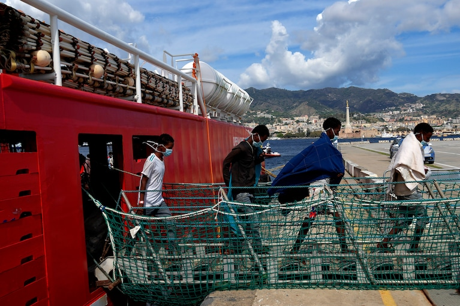

### AYS News Digest 26/9/22: What will happen after the far\-right win in Italy?

Increasing death rates in Home Office accommodation/Six people drowned in the Aegean, including four children/Case of the 2011 shipwreck has been re\-opened in France/One woman believed to have died after being forced by border guards to swim back across the Świsłocz river in Poland/and much more…

Men disembark the Spanish NGO Open Arms lifeguard ship after docking at Messina port, in Sicily, Italy, on Thursday\. Source: The Washington Post, 26/9/2022
#### FEATURE
### Devastating far\-right election win in Italy

As the results of the Italian elections arrive, more and more questions are piling up regarding how this will affect the migration policies of the country, but also those of the EU given that Italy, as one of the first entry countries, has an important say in everything concerning the topic at the highest level, consequently affecting everyone in the EU\.

■■■■■■■■■■■■■■ 
> **[ECRE](https://twitter.com/ecre) @ Twitter Says:** 

> > Far-right leader won Italy's elections. This will have implications on EU migration policy:
➡Weaponizing migrants for political interests; 
➡Disagreement between EU &amp; @[GiorgiaMeloni](https://twitter.com/GiorgiaMeloni) 
➡Increase of violence against migrants
➡Fear 4 rise in deaths at sea
➡Hostility towards SAR https://t.co/1BttTlkEwt 

> **Tweeted at [2022-09-26 09:04:31](https://twitter.com/ecre/status/1574324024427089921).** 

■■■■■■■■■■■■■■ 

As part of the anti\-immigration rhetoric, it seems that the [obvious effects will very likely be those concerning securitisation](https://www.infomigrants.net/en/post/43592/fears-for-the-future-of-migrants-as-italy-shifts-to-the-right?fbclid=IwAR2lQ94vspGCzyzuGS2Nb1BS8o_g8uIwPvQ2q3FGkAeRlygRolgIdquvreM) \. The use of AI and weapons, being developed in the name of national security, is a more comfortable position for all those spreading hate and disapproval towards people on the move in Italy and Europe and injustices in the everyday life and work of people across the country\.

Another important aspect are the sea crossings\. Already a sensitive topic in the political arena, we have no doubts the search and rescue activities of NGOs and humanitarians will be criminalised openly, and [that the deaths in the sea will rise exponentially](https://www.infomigrants.net/en/post/43561/the-implications-of-the-italian-elections-on-migration-policy?fbclid=IwAR2lQ94vspGCzyzuGS2Nb1BS8o_g8uIwPvQ2q3FGkAeRlygRolgIdquvreM) \. As part of the campaign, they mentioned blocking boat landings and have introduced the idea of EU\-managed centres to assess asylum applications before asylum seekers arrive in the EU\.

The question is \(how\) the EU will be able and willing to respond and find a position on all this in spite of Italy’s firm political stance which is slowly, but seemingly surely, moving towards the vision the Hungarian president has for the European societies…

Source: InfoMigrants \(26/9/2022\) ‘Fears for the future of migrants as Italy shifts to the right’
#### SERBIA

In addition to identifying cross\-border pushbacks, Border Violence Monitoring Network collects evidence of physical, material, and structural violence against people on the move within Serbia\. The quantitative and qualitative data included in this report were collected via a questionnaire from volunteers who interacted daily with people on the move in cities such as Belgrade, Subotica, Majdan, and Šid\.

Additionally, information was drawn from the testimonies of people on the move and from the observations of long\-term volunteers and activists, which collectively illustrate the complex factors influencing the well\-being of people on the move\.

Through analysis of data collected in the field, the first section of this report discusses acts of physical violence against people on the move\. The second examines violence at the hands of law enforcement officers and members of extremist right\-wing political groups, while the third reports on instances of structural violence, a term that refers to the development or perpetuation of inequality by social institutions or processes\.

Specific examples of structural violence reported by people on the move and the organizations which support them include restricted access to asylum, collective expulsions, evictions, harassment, and criminalization of solidarity\.

A detailed [timeline](https://www.borderviolence.eu/serbia-as-a-transit-country-a-timeline/) of Serbiaʼs development as a transit country and migration buffer zone for the Balkan route has been produced by BVMN\. A summary of this information is included to better contextualize the subsequent reports of internal violence\.

Read the full report [HERE](https://www.borderviolence.eu/wp-content/uploads/Serbia-report-v2.pdf) \.
#### POLAND
### **At least one group was forced by the Border Guard to return by swimming across the Świsłocz River**

It is believed that a 30\-year\-old woman from Congo, called Arlette, may have drowned\. The group she was travelling with lost sight of her when the woman began to drown\.

■■■■■■■■■■■■■■ 
> **[Piotr Czaban](https://twitter.com/CzabanPiotr) @ Twitter Says:** 

> > Moment odnalezienia w rzece kobiecej kurtki. W miejscu, gdzie według zgłoszenia miała utonąć kobieta. Tę kurtkę policjant dowodzący akcją przekazał SG do utylizacji. Po mojej interwencji nie miał wyjścia i zapakował do swojego auta.Będę składał zeznania na posterunku w Michałowie https://t.co/8jdeayDuCF 

> **Tweeted at [2022-09-26 12:03:16](https://twitter.com/czabanpiotr/status/1574369008740347904).** 

■■■■■■■■■■■■■■ 

■■■■■■■■■■■■■■ 
> **[Marta Górczyńska](https://twitter.com/MarGorczynska) @ Twitter Says:** 

> > Przynajmniej jedną z grup Straż Graniczna zmusiła do powrotu do BY wpław przez rzekę Świsłocz (!). Jedna osoba, 30-latka z Kongo, mogła tego nie przeżyć. Grupa, z którą podróżowała straciła ją z oczu, gdy kobieta zaczęła tonąć. @[GrupaGranica](https://twitter.com/GrupaGranica) wzywa służby do poszukiwań kobiety! 

> **Tweeted at [2022-09-26 08:06:47](https://twitter.com/margorczynska/status/1574309493609046016).** 

■■■■■■■■■■■■■■ 

#### GREECE
### Pushbacks and deaths in the Aegean

Six people have drowned in the Aegean, after being pushed back by the Hellenic Coastguard\.

**Four out of the six were children\.**

■■■■■■■■■■■■■■ 
> **[Aegean Boat Report](https://twitter.com/ABoatReport) @ Twitter Says:** 

> > Another tragedy in the Aegean Sea, six drowned, four of them children, after being pushed back by @[HCoastGuard](https://twitter.com/HCoastGuard) outside Lesvos yesterday. How many more children needs to drown before we act? @[YlvaJohansson](https://twitter.com/YlvaJohansson) @[saskiabricmont](https://twitter.com/saskiabricmont) @[EU_Commission](https://twitter.com/EU_Commission) @[nmitarakis](https://twitter.com/nmitarakis) @[PrimeministerGR](https://twitter.com/PrimeministerGR) @[Europarl_EN](https://twitter.com/Europarl_EN) https://t.co/RTGIiPvVuy 

> **Tweeted at [2022-09-25 11:24:03](https://twitter.com/aboatreport/status/1573996752650309634).** 

■■■■■■■■■■■■■■ 

#### BELGIUM

**There will be a meeting on 22/10/22 at 3pm** for those who want to be involved in supporting GVO with collecting testimonies from detainees and helping to fight against immigration detention\.

#### FRANCE
### The case of the 2011 shipwreck has been re\-opened

In 2011, a boat carrying 72 asylum seekers was left adrift for two weeks off the coast of Libya\. Sixty\-three out of the 72 passengers died\.

New evidence has triggered the reopening of the case\. Survivors have claimed that they were abandoned and left adrift by the western military navy, including the French navy\. The new evidence of this includes log books for all planes and ships in the area, a cross inquiry in Italy, Belgium, and Spain, among other information\.

#### UK
### Increasing death rates in Home Office accommodation

In the first six months of 2022, there have been more deaths in Home Office accommodation than in the whole of 2021\.

Last year, 19 people died, whereas from January to June 2022, already 21 people died\. Most deaths were due to medical conditions, such as cancer, heart disease, and liver failure\. Two people died from suicide\. Three other deaths have yet to be confirmed\.

Asylum seekers can end up in poor conditions, where there are leaks, regular power cuts, and infestations\. The small spaces can also take a huge toll on their mental health, especially as they can end up waiting in such accommodation for months without knowing when they will be able to leave\.

Private companies, including Clearsprings, Serco, and Mears Group, manage the Home Office accommodation\.

> These conditions show that profit is being prioritised over the welfare of residents\. The Home Office is paying private companies to act as its slum lords\. — Corporate Watch 

It has been known for a while now that private companies should not be the responsible authorities when it comes to the welfare of individuals\.

> People, individuals and families, are held in semi\-detention in hotels for months or years\. They are given less than £9/week and forced to eat reheated crap or starve\. 

> Staff control residents movements, search rooms and treat people as criminals\. It would be unbearable for people without any trauma\. This leads to ill health, self harm and suicide\. 

> — Jacob Berkson, AlarmPhone 

You can read the full article [here](https://thecivilfleet.wordpress.com/2022/09/26/more-people-die-in-home-office-asylum-seeker-accommodation-in-first-six-months-of-2022-than-in-the-whole-of-2021/?fbclid=IwAR1v0paXCMtFqvEgQ2OLqGNIrRRS459ZNBceSICue32E2deYI77x9yJ5lUI) \.

Further delays in asylum claims were seen by residents at the Gatwick immigration removal centre who stated they were very anxious about the delays in their asylum cases and the lack of information being provided to them by the Home Office\.

> Some detainees were held for unacceptably long periods of time, including one who had been in the centre for 16 months\. Case progression was slow in too many cases, although inspectors were pleased to see that the Home Office’s Detention Engagement Team had resumed face\-to\-face contact with detainees, and there were plans to introduce more wing\-based surgeries\. — Report by the HM Inspectorate of Prisons 

The centre has also seen an increase in residents, resulting in overcrowded conditions, a lack of outdoor space, and more noise\.

### No for the rights, but yes for the profits

In the face of a recession, Liz Truss, the UK’s new Prime Minister, has announced the government will expand the shortage occupation list which will allow businesses to hire overseas workers with less bureaucracy\.

The hospitality sector in particular has struggled with employee intake and has felt frustrated with the lack of governmental response, especially in regard to the visa system\.

### WORTH READING:
- ‘Love, determination and risking all to cross the Mediterranean’, Al Jazeera, 25/9/2022

- ‘Coping Strategies: Domestic and International Courts in Times of Backlash’, VerfBlog, 26/9/22

**If you wish to contribute, either by writing a report or a story, or by joining the Info Gathering team, please let us know\!**

**We strive to echo correct news from the ground through collaboration and fairness\. Every effort has been made to credit organisations and individuals with regard to the supply of information, video, and photo material \(in cases where the source wanted to be accredited\) \. Please notify us regarding corrections\.**

**If there’s anything you want to share or comment, contact us through Facebook, Twitter or write to: [areyousyrious@gmail\.com](mailto:areyousyrious@gmail.com)**

_Converted [Medium Post](https://medium.com/are-you-syrious/ays-news-digest-26-9-22-what-will-happen-after-the-far-right-win-in-italy-77f88a33b848) by [ZMediumToMarkdown](https://github.com/ZhgChgLi/ZMediumToMarkdown)._
