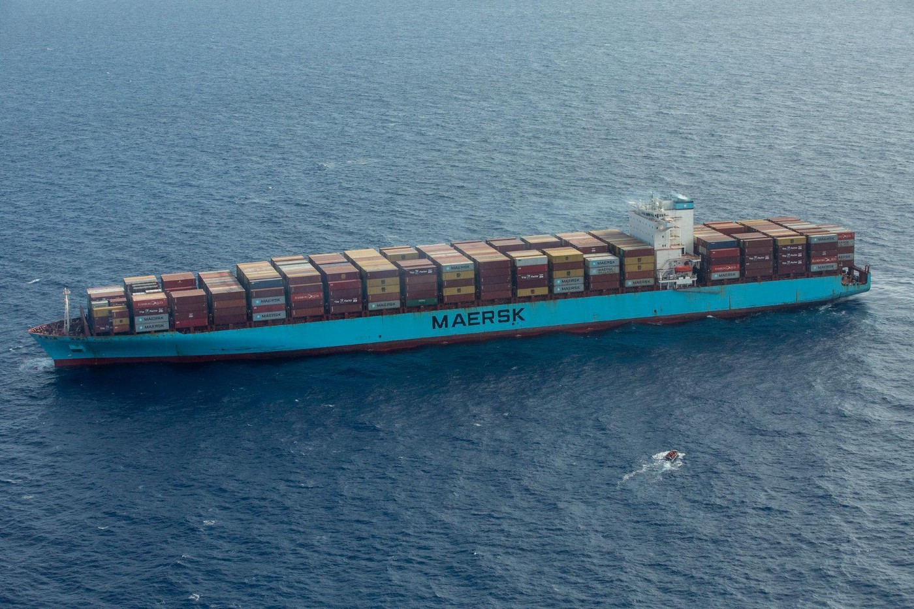
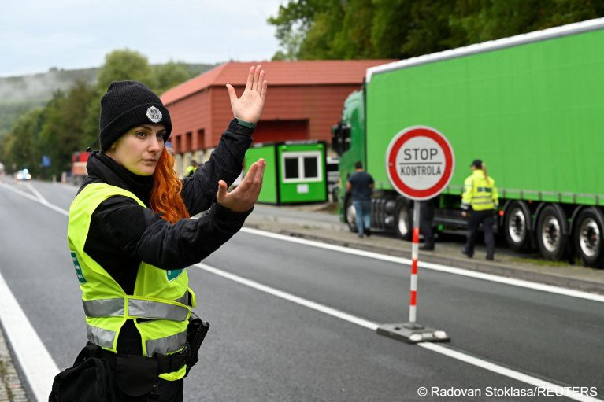

### AYS News Digest 01/10/22: How do we talk about people on the move?
#### Malta pursues its SAR ‘policy’ of non\-response // Tightening restrictions on the Balkan route — Austria introduces controls at the Slovakian border, and Slovakia introduces them at the Hungarian border // Greece’s 1630th pushback, recorded and evidenced in unusual detail // Call to drop the charges against El Hiblu 3 in Malta // Spain and Morocco impede investigations into the Melilla massacre // Evictions across France from a government who has abandoned refugees in la rue // Upcoming protests in Germany against the Berlin airport deportation centre and the Italy\-Libya Memorandum // Age dispute process putting children at risk in the UK & much more

 on [Unsplash](https://unsplash.com?utm_source=medium&utm_medium=referral)](assets/4aebc977ddfd/0*3vT2_A51nPAu0D7h)

How do we frame narratives through language? Photo by [pine watt](https://unsplash.com/@pinewatt?utm_source=medium&utm_medium=referral) on [Unsplash](https://unsplash.com?utm_source=medium&utm_medium=referral)
#### FEATURE
### ‘It’s time to create and enhance refugee agency in decision making and policy that affects them’

— Dr Claire Loughnan and Professor Philomena Murray, University of Melbourne have written a policy paper entitled [‘Combatting Corrosive Narratives about Refugees’](http://'Combatting Corrosive Narratives about Refugees') \. Their paper evokes a central question: how do we tell narratives about people on the move? Do the language choices of our narratives impact policy? Their answer to the latter is yes\.

To step back, in all acts of story\-telling there are some fundamental truths\. All testimonies are recounted, refracted through a linguistic lens that changes the nature of representation\. This rhetorical function of language is ever\-present: the words we use constitute narrative frames, and these have the power to alter the lived reality of the subjects they represent\. In short, how we represent people and ourselves can effect everything else about our real lives\.

Loughnan and Murray write:

> Governments and the media must stop presenting policy and analysis about people seeking refugee protection in ways that undermine their personhood — and instead lead discussions that are transparent, principled and accurate\. 

This may seem like a naive request, yet the language that defines the worlds of people on the move certainly needs greater attention\. They go on to write that

_In many instances, they \[governments, political parties and the media\] intentionally inflame debates about refugee movement and often fail to communicate directly with people seeking refuge\._

Would it be possible to integrate linguistic laws with legal policy? Would it be possible to mitigate the manipulation and dehumanisation of suppressed refugee voices at a policy level?

By reminding us to consider the power of the language we use, Loughnan and Murray provide food for substantial thought on how we might change dominant media narratives through acts of re\-framing, noting for example that

> there’s a danger in using emotive language that reduces those seeking refuge to the figure of the ‘victim’\. Asylum seekers have often reflected on the harm that is done by these narratives: by constructing people as little more than a victim, there’s a tendency towards pity that draws on a public imagery of [the ‘benevolent’ state as a ‘saviour’](https://www.tandfonline.com/doi/abs/10.1080/14490854.2020.1840287) \. 

As we document, read about and talk about people on the move, everyone should bear in mind the following:

> The initial stage in all discussions for policymakers and advocates is the acknowledgement that the voices of those seeking refuge should always come first\. 

Read their policy paper in full here:

This article from March 2022 reflects on the way in which language has cleaved migration into racialised camps of the ‘deserving’ and ‘undeserving’, the product of narrative failures: it must be ensured that refugee voices are central to any conversation about refugees\. [As such, pejorative language, harmful narratives and stereotypes of fleeing are much less likely to emerge\.](https://pursuit.unimelb.edu.au/articles/changing-the-narrative-on-refugees?fbclid=IwAR3oF17L_4TB4vJ7QNX-6S-YC56AgihVmqvA6Hrzk5TIofz0kAzU3wx9Xqc)

#### SEARCH AND RESCUE
#### Malta has AGAIN failed to assist people in danger, in contravention of maritime law, on the Italian\-Maltese sea border

The 33 people concerned were rescued by the merchant vessel Maersk Athabasca after Malta’s inaction\. On Sept 29, Sea\-Bird 2 alerted the Maltese authorities of a distressed vessel in their SAR zone, yet no action was taken\. Malta ordered Maersk not to rescue the boat within their SAR zone, so the merchant ship followed the boat to Italian waters where Italy authorised the rescue\. This illogicity and dehumanising nature of this chain of events speaks for itself\.

■■■■■■■■■■■■■■ 
> **[Alarm Phone](https://twitter.com/alarm_phone) @ Twitter Says:** 

> > We just spoke to the ~33 people in distress again. They report of high waves and request urgent assistance. They are at the SAR boundary between #Malta and #Italy. Malta has failed once more to render assistance. We call on the authorities to launch a rescue operation now! https://t.co/8EUT6xmAxr 

> **Tweeted at [2022-09-30 07:27:25](https://twitter.com/alarm_phone/status/1575749137639034880).** 

■■■■■■■■■■■■■■ 

#### MV Louise Michel waits for Port of Safety to be assigned, with 68 unaccompanied minors aboard

■■■■■■■■■■■■■■ 
> **[LouiseMichel](https://twitter.com/MVLouiseMichel) @ Twitter Says:** 

> > For more than a day now, 88 people on board #LouiseMichel await a safe port to disembark. 68 of our guests are unaccompanied minors. The weather is picking up and high waves are making people seasick. We need a safe port, Now! #PortOfSafety #SeaRescue #FreedomofMovementForAll https://t.co/aoyrQwjJ2M 

> **Tweeted at [2022-09-30 15:24:43](https://twitter.com/mvlouisemichel/status/1575869253961383937).** 

■■■■■■■■■■■■■■ 

#### Seventy\-six people disembark in Taranto, Italy after 10 days aboard the GeoBarents

■■■■■■■■■■■■■■ 
> **[MSF Sea](https://twitter.com/MSF_Sea) @ Twitter Says:** 

> > 🟢 DISEMBARKATION COMPLETED 
Today, in the port of #Taranto we greeted the 76 survivors after almost 10 days spent aboard #GeoBarents. It is always a great relief to see them disembark in a safe place. We hope they will find the protection they deserve and need. https://t.co/u2SzGIzsJl 

> **Tweeted at [2022-09-30 14:56:30](https://twitter.com/msf_sea/status/1575862156507373568).** 

■■■■■■■■■■■■■■ 

ECRE’s weekly report from the Mediterranean can be found here:

> The UN Refugee Agency \(UNHCR\) [estimates](https://data.unhcr.org/en/situations/mediterranean) that 1,209 people died or went missing across the Mediterranean in 2022 as of 25 September\. 

#### SOS Humanity has published their first rescue report, detailing the lack of support during four rescues involving 414 survivors

#### BALKAN ROUTE

Traffic control on the Czech\-Slovak border — Credit: REUTEURS/Radovan Stoklasa
#### Austria to conduct controls at the Slovakian border, and Slovakia to conduct controls at the Hungarian border

There have been controls on Austria’s borders with Hungary and Slovenia since 2015, and now controls are being introduced at the Slovakian border as a ‘deterrent’\.

In 2022, the number of asylum seekers in Austria has increased by 195%, and [_Euractiv_ note that Indians, rather than Syrians and Afghans \(as was the case in 2021\), now make up the majority nationality of asylum applications\.](https://www.euractiv.com/section/politics/short_news/austria-slovakia-look-to-border-controls-to-stop-migrant-flows/?fbclid=IwAR0LIW-4PKO3uvXJyBu9dIsE2gHanq9rBflfQ3zA7t1MGw7BYeXZFmX3a_c)

As border controls increase, so does the threat of violence\. On Thursday \(29/09\), Czech police detained 120 irregular migrants and nine suspected people smugglers on the Slovakian border\. Warning shots were fired by police during this time\. Read the full story from [_InfoMigrants_ here](https://www.infomigrants.net/en/post/43683/border-checks-by-czech-republic-and-austria-over-100-migrants-intercepted?fbclid=IwAR02gtcAnyT4pRgA6V2JO5cPHp_MwxtsnFlHFLsj75s3Bb500N6qlEwgN-A) \.
#### Why has the Balkan route become more active?

The ECRE \(European Council of Refugees and Exiles\) have released their weekly update on the Balkan Route:

■■■■■■■■■■■■■■ 
> **[ECRE](https://twitter.com/ecre) @ Twitter Says:** 

> > #ECREWeekly Update on the Balkan Route
➡️New Violent Tactics of Pushbacks Across the Region
➡️CJEU Finds 🇭🇺 in Violation of EU Law 
➡️#Frontex to Operate In 🇲🇰 Despite Allegations of Complicity in Pushbacks
🔗[bit.ly/3CoHqLz](https://bit.ly/3CoHqLz) https://t.co/WgEdJLOkcc 

> **Tweeted at [2022-09-30 13:55:32](https://twitter.com/ecre/status/1575846814204694530).** 

■■■■■■■■■■■■■■ 

The report notes that:
- BVMN has released its August report, sharing 12 testimonies of pushbacks impacting 354 individuals on the move\.
- Hungary’s asylum process is partly in violation of EU law following the examination of a case concerning a Syrian asylum applicant, G\.M\., who already received refugee status back in 2012\.
- Enhanced police checks on the Czech/Slovak/Austrian/Swiss borders are in need of adequate safeguards to comply with the rulings of the European Court of Human Rights, as pointed out by ECRE member the Hungarian Helsinki Committee\.

In August 2022 Frontex recorded 15,900 attempted crossings, a 141% increase on the previous year\. There are several hypotheses for this spike in migration along the Balkan route, explored [here in detail by _InfoMigrants_](http://www.infomigrants.net/en/post/43691/why-has-the-balkan-migrant-route-become-more-active-again?fbclid=IwAR1GDHCy5A_E4jLfwHtXok5cdyBqxIKP2PKR2B7gRacCAAEBx1qx__HWKC4) :
1. Attempts to re\-cross the border following pushbacks\.
2. Certain nationalities do not need visas to enter particular countries in the Balkans\. E\.g\. Indian, Burundian, Tunisian and Cuban citizens do not require a visa to enter Serbia\.
3. Controls have been tightened on other routes — the EU has recently strengthened its cooperation with Libya, Morocco, Senegal and Mauritania, making crossing the Mediterranean or Canary Islands route harder\.
4. The resumption of movement post Covid\-19\. Many people, unable to travel during the pandemic, have moved from Greece and Turkey towards central Europe\.

#### GREECE
#### Pushback №1630 recorded by ABR

> “While on Marmaras, the group provided pictures, videos and geolocations, there was absolutely no doubt that they were on the island\. 

> \[…\] After four hours we regained contact with the group on two different phone numbers, they were again asking for help, this time not from a Greek island, but from a life raft drifting north of Simi, deep inside Turkish waters\.”

■■■■■■■■■■■■■■ 
> **[Aegean Boat Report](https://twitter.com/ABoatReport) @ Twitter Says:** 

> > Pushback Nr. 1630 and counting. This morning a group of 17 people contacted Aegean Boat Report from the small Greek island of Marmaras, west of Simi, a few hours later they were drifting in a life raft in the Aegean Sea [aegeanboatreport.com/2022/09/30/pus…](https://aegeanboatreport.com/2022/09/30/pushback-nr-1630/) 

> **Tweeted at [2022-09-30 19:05:59](https://twitter.com/aboatreport/status/1575924938174656512).** 

■■■■■■■■■■■■■■ 

**44,000 people have been pushed back in the Aegean since March 2020\.** ABR note that these numbers are rapidly increasing: 380 rubber boats and 440 life rafts have been found drifting so far this year, involving the violation of 18,000 individuals’ human rights\.
#### The over\-zealous criminalisation of people on the move

Borderline Europe is calling for an end to arbitrary, excessive imprisonments such as that of H\. Sabetara, whose appeal hearing will not take place before Christmas 2023\. That means another year of detention for a man who waited for over a year in pre\-trial detention, merely because he drove a car\.

■■■■■■■■■■■■■■ 
> **[borderline-europe](https://twitter.com/BorderlineEurop) @ Twitter Says:** 

> > After 1 year in pre-trial detention, 58-year-old H. Sabetara from #Iran, who had wanted to reunite with his daugthers in #Berlin, finally stood trial in Thessaloniki on Monday. He was sentenced to 18 YEARS in prison for #smuggling - bc he drove a car with ppl without papers! /1 https://t.co/GNAiIdKUUn 

> **Tweeted at [2022-09-30 16:06:52](https://twitter.com/borderlineeurop/status/1575879863432380416).** 

■■■■■■■■■■■■■■ 

#### MALTA
#### Open letter with over 1,000 signatories delivered to Malta’s Attorney General, urging her to drop charges against the El Hiblu 3: Amara, Abdalla, and Kader

■■■■■■■■■■■■■■ 
> **[ElHiblu3](https://twitter.com/ElHiblu3) @ Twitter Says:** 

> > Today, we deliver our open letter with over 1,000 signatories to the #AttorneyGeneral, Victoria Buttigieg, of Malta.

We demand that Malta drop all charges against Amara, Abdalla, and Kader now.
Free the #ElHiblu3! https://t.co/dHsn9iBcqw 

> **Tweeted at [2022-09-29 09:14:21](https://twitter.com/elhiblu3/status/1575413662013177856).** 

■■■■■■■■■■■■■■ 

Amnesty International’s Nils Muižnieks has written an article in support of the El Hiblu 3, detailing the

> chronic lack of safe and legal routes to enter Europe for people fleeing violence persecution and extreme poverty, which EU member states and institutions have never wanted to address \[…\] The death toll at sea has been such, over the years, that the Central Mediterranean route has become the world’s most dangerous\. In 2021, 1,553 people were reported dead or missing at sea along this route _\._ 

Amnesty is calling for Malta’s Attorney General to drop the case against El Hiblu 3 — Amara, Kader and Abdalla who resisted being unlawfully returned to Libya, and are now on trial and facing life imprisonment for doing so\. Read Nils’ full article [here](https://elhiblu3.info/nils.html) and support Amnesty’s ‘Write for Rights’ campaign by lobbying\.

■■■■■■■■■■■■■■ 
> **[ElHiblu3](https://twitter.com/ElHiblu3) @ Twitter Says:** 

> > “No one should have to face life in prison for opposing their return to torture and suffering in Libya.”

@[MuizNils](https://twitter.com/MuizNils) of @[amnesty](https://twitter.com/amnesty) writes in his contribution.

Read the full article here: 👉[elhiblu3.info/nils.html](https://elhiblu3.info/nils.html)

Free the #ElHiblu3
#DropTheCharges https://t.co/LdvacnJrFs 

> **Tweeted at [2022-09-30 11:00:02](https://twitter.com/elhiblu3/status/1575802647491248133).** 

■■■■■■■■■■■■■■ 

#### Malta fears a spike in immigration, but continues to offer ‘golden passports’…

Following the election of the far\-right Brothers of Italy, the Maltese interior minister is concerned that the small island nation will see a rise in disembarkation on Maltese shores\. Former right\-wing Italian interior minister, [Matteo Salvini, pursued a “closed ports” policy between June 2018 and September 2019](https://www.infomigrants.net/en/post/43662/malta-fears-change-in-italian-migration-policy?fbclid=IwAR0LIW-4PKO3uvXJyBu9dIsE2gHanq9rBflfQ3zA7t1MGw7BYeXZFmX3a_c) , increasing the pressure on Malta to take in migrants and refugees\. Byron Camilleri, Maltese interior minister, fears a similar policy may return\.

The sad irony behind this anti\-immigration stance is that the [EU Commission is currently filing a legal challenge against Malta’s ‘golden passport’ program\.](https://euobserver.com/tickers/156177?fbclid=IwAR1rZVF_eAg2skqQ3OMncrZCTIK-6GsHytnPebp3vPKPB_jDSzjhkMo8dTU) An investment of around €1m on the island nation of 500,000 people currently buys one EU citizenship, without requiring beneficiaries to even live in Malta…
#### SPAIN
#### A larger number of arrivals and rescue operations along the Atlantic route to Spain, as well as attempts to delay the Melilla investigation

■■■■■■■■■■■■■■ 
> **[ECRE](https://twitter.com/ecre) @ Twitter Says:** 

> > #ECREWeekly update: Atlantic Route and Spain
➡️ “There was no massacre” 🇪🇸 Minister of Interior says
➡️Morocco and Spain Attempt to Delay #Melilla Investigation   
➡️Large Number of Arrivals & Rescue Operations 
🔗[bit.ly/3RpF9Uy](https://bit.ly/3RpF9Uy) https://t.co/YSFVeNlyje 

> **Tweeted at [2022-09-30 14:11:35](https://twitter.com/ecre/status/1575850852157652993).** 

■■■■■■■■■■■■■■ 

The Spanish Minister of the Interior has blamed the Melilla massacre on “an extremely violent group” of migrants\. This fact\-free counter narrative directly occludes human rights, and is particularly concerning as Morocco denies entry to a group of MEPs seeking to investigate the tragedy\.

ECRE reports:

> Deputy Maria Dantas said “Spain pays and Morocco kills” and posed a question to the minister: “Can’t you control borders without inflicting dehumanising and degrading treatment?”

\[…\]

> Left MEP Miguel Urban Crespo declared: “If we are not allowed to go to Morocco it means they are covering something up\. And what they are covering up are the murders that happened on 24 June\.”

Whilst EU migration policy fails to be based upon reception, human rights and the guarantee of safe and legal passages, more and more people continue to risk their lives journeying across the Atlantic\. On 20–21 September, 193 people arrived on the Canary Islands\. On 25 September, Alarm Phone was informed about 200 people on four vessels near the Canary Islands, 100 of whom are still missing\. The humanitarian obligation for positive reception policies is more pressing than ever\.
#### FRANCE
#### Evictions across France

354 men were evicted from their camp in Paris’ 19th arrondissement on Wednesday, the 15th such operation since 2022\. More [here from _InfoMigrants\._](https://www.infomigrants.net/en/post/43670/police-clear-migrant-camp-of-more-than-350-on-outskirts-of-paris?fbclid=IwAR0LIW-4PKO3uvXJyBu9dIsE2gHanq9rBflfQ3zA7t1MGw7BYeXZFmX3a_c)

Following an eviction in Paris’ Place de la Bastille and the deportation of more than 50 young people to Marseille, MSF has called for the governmental solutions to pay closer attention to the ages and vulnerabilities of the people it is already mistreating\.

■■■■■■■■■■■■■■ 
> **[MSF France](https://twitter.com/MSF_france) @ Twitter Says:** 

> > Suite à l’évacuation du campement de #MNA place de la Bastille à #Paris et l’expulsion d’une 50aine de jeunes étrangers à #Marseille, #MSF demande une solution d’accueil pérenne et adaptée à leur âge et à leur vulnérabilité. 

> **Tweeted at [2022-09-26 12:00:55](https://twitter.com/msf_france/status/1574368416927989761).** 

■■■■■■■■■■■■■■ 

Utopia 56 continues to provide support for those whom the French government have consciously abandoned to life in the streets:

■■■■■■■■■■■■■■ 
> **[Utopia 56](https://twitter.com/Utopia_56) @ Twitter Says:** 

> > Cette nuit encore, plus de 200 personnes en demande d’asile survivent à même le sol sous les ponts entre Pantin et Paris. Le froid est bien là et beaucoup sont malades. La stratégie du gouvernement qui consiste à abandonner volontairement ces personnes à la rue est insupportable. https://t.co/rtrl6Mb9EI 

> **Tweeted at [2022-09-27 05:24:03](https://twitter.com/utopia_56/status/1574630927669796864).** 

■■■■■■■■■■■■■■ 

#### What is the dominant media narrative?

Care4Calais has published a [story](https://www.facebook.com/care4calais/posts/pfbid02M38PSVRvXto3TkaqZCXDuFAk1KyKW5qHHVpaGXtNiCVDU7Yuk9qsNKX9S1RSBEdRl) , sadly all too common, about those who have failed to cross the channel and were rescued, only to be left in the soaking clothes they stood up in, freezing cold in the French autumn\.

> They had just decided to risk their lives crossing the Channel, but their boat had sunk just off the French shore and they had been rescued\. As they own only the clothes they stand up in, they had had to get as dry as they could and then spend the day waiting for the damp to leave them — not easy in the autumn in Northern France\. 

> Some 970 refugees have been reported rescued in the seas off the French coast this month\. It’s easy to see that as just a statistic, but that’s almost 1000 people who risked their lives trying to find safety, who must have been terrified as they waited for their rescuers, and then who had to live with the memories afterwards\. It’s horrific\. 

> This situation is chilling when you think that we’re approaching the first anniversary of the worst\-ever loss of life by refugees trying to cross; as many readers will remember, in November last year, 29 people died horrifically when their dinghy sank\. The horrific truth is that nothing significant has been done to prevent it happening again\. 

> **This should be the real story when we talk about 30,000 refugees crossing the Channel; 30,000 lives being needlessly risked, and that risk increasing as the weather starts to worsen\.** It is the most important reason of all that we need to provide safe passage for refugees now\. 

#### BELGIUM
#### A man who fled Rwanda aged six, recognised as a refugee in 2002, has had his refugee status revoked and is to be deported back to Rwanda

From [_Getting the Voice Out_](https://www.gettingthevoiceout.org/victim-of-the-genocide-in-rwanda-at-the-age-of-6-and-expelled-to-the-same-country/?fbclid=IwAR02gtcAnyT4pRgA6V2JO5cPHp_MwxtsnFlHFLsj75s3Bb500N6qlEwgN-A) :

> He doesn’t know anyone in Rwanda, doesn’t speak the language, all his family members live in Belgium or France and have refugee status \(uncles, cousins, etc\. \) He is very afraid of reprisals in Rwanda, as his father remains one of the genocidaires in the memory of many \(he was a colonel in the Rwandan army and was wanted\) \. 

> His release has been ordered 5 times by the Council Chamber\. Each time, the Aliens Office appealed\. 

> He will appear again this Tuesday 4/10/2022 before the Indictment Division for the fifth procedure to obtain his release\.This 4 October 2022 will also mark the 13th day of his hunger strike\. 

Read his testimony in full here:

#### GERMANY
#### Protest against Deportation Centre BER on 1st October

No Border Assembly is organising a protest against the conversion of Berlin’s T5 into a deportation centre with the capacity to detain 120 people, from 1pm at Hermannplatz\. Full details here:

#### ProAsyl supportes Connection’s petition for the EU to protect and give asylum to deserters and objectors from Belarus and the Russian Federation

Connection eV write the following:

> **Why we are starting this petition:** For more than half a year, the Russian Federation has been waging a war of aggression in Ukraine, with devastating consequences\. There seems no end in sight\. We know that men and women on all sides are evading the crimes of war\. Tens of thousands left the Russian Federation and Belarus to avoid being recruited for the war\. Thousands left Ukraine because they see their human right to conscientious objection to military service in jeopardy\. You are all our hope for overcoming violence\. 

#### Protest in Berlin against the Italy\-Libya Memorandum on 15th October at 2pm in front of the EU Commission:

■■■■■■■■■■■■■■ 
> **[Sea-Watch International](https://twitter.com/seawatch_intl) @ Twitter Says:** 

> > @[[RefugeesinLibya](https://twitter.com/RefugeesinLibya)](https://twitter.com/[RefugeesinLibya](https://twitter.com/RefugeesinLibya)) Follow @[[RefugeesinLibya](https://twitter.com/RefugeesinLibya)](https://twitter.com/[RefugeesinLibya](https://twitter.com/RefugeesinLibya)) and support their demands. In Berlin, you can show your solidarity on October 15 at the protest "Stop the Italy - Libya Memorandum" at 2 pm in front of the EU Commission (Unter den Linden 78).

#EvacuateRefugeesFromLibya https://t.co/dIjsSlIpQt 

> **Tweeted at [2022-09-30 10:01:12](https://twitter.com/seawatch_intl/status/1575787839446339584).** 

■■■■■■■■■■■■■■ 

#### UNITED KINGDOM
#### The Home Office’s disposition to disbelieve the ages of children undermines the asylum process, and amounts to a serious safeguarding failure

■■■■■■■■■■■■■■ 
> **[ECRE](https://twitter.com/ecre) @ Twitter Says:** 

> > In 2021, @[refugeecouncil](https://twitter.com/refugeecouncil) worked w/ 233 young people whom @[ukhomeoffice](https://twitter.com/ukhomeoffice) determined to “certainly” be adults. But after age assessments, 94% were found to be children. 

🔴Children are amongst the most vulnerable. Wrong age assessment during asylum process make them more vulnerable https://t.co/OCumUb9Ftv 

> **Tweeted at [2022-09-30 08:36:06](https://twitter.com/ecre/status/1575766425335042048).** 

■■■■■■■■■■■■■■ 

Enver Solomon, CEO of the Refugee Council, writes:

> When a young person arrives in the UK, Border Force officials can immediately decide that the individual before them is a child and put them in the care of local authorities\. If they don’t know, they can refer a case to others to decide\. The problem arises on the occasions when a Border Force official makes a judgment themselves that someone claiming to be a child is in fact an adult, based on first glance and purely on how they look\. They are not trained for this, and time and again, they are getting these decisions badly wrong\. 

> What does this mean in practice? It means that hundreds of children are wrongly being judged to be adults, as our report today makes clear\. It means children are being placed in hotels for adults who are seeking asylum, raising major safeguarding issues\. 

Ahmed’s \(not his real name\) testimony reveals the power dynamic that presides over this dangerous misrepresentation of age\. He says:

> _“When I am in Dover, I tell them I am 16 years, they don’t believe me, they tell me ‘no, you are 28’ I tell them no, it’s not my real age\._ 

> _Maybe because I’m tired when I come from France, and I’m afraid of the police\. When I come to UK, I’m still afraid, I’m really so afraid\. When the police tell me I will give you this age, I can’t tell him no\._ 

> _Just they tell me we’ll give you this age, bring me to hotel, and I’m still afraid, I stay in my room\. I don’t feel comfortable, I’m afraid, I want to live with people like me, I want to go to school\. In the hotel I get in a bad situation…”_ 

Read about his case in full here:

Children are being put at risk by this age dispute process\. Read the full report here:

#### WORTH READING
- ‘Refugee Camps as Torturing Environments — An Analysis of the Conditions in the Moria Reception Centre \(Greece\)’ — An academic article assessing the presence of torture in the EU, _in which_ _the right to live in an environment free from torture and under the protection of the state should be an inalienable element_ ’\. This is **really worth reading** \.

From the abstract:

> The findings confirm the inhumane living conditions for the people sheltered in Moria, documenting the severe suffering of the population due to elements linked to basic human functions \(hunger, thirst, hygiene, overcrowding, temperature, etc\. \), actions that produce fear and distress, actions that produce helplessness and hopelessness, actions that cause physical pain, attacks on sexual integrity, and attacks on identity and the need to belong\. Some of the data suggest that the purposive and intentionality elements of the definition of cruel, inhuman, or degrading treatment were also met\. Conclusions\. **According to the conceptual model of torturing environments, the Moria reception camp constitutes a space of systematic ill treatment** that vulnerated the European legal standards related to torture \(Article 3 of the Human Rights Convention\) \. 

- ‘ _Our lives and bodies matter:_ memories of violence and strategies of resistance among migrants crossing the Mediterranean’

A critical reflection on the implications of migration control enforcement, where torture is often rife, that is promoted at the EU’s borders\. The article takes a case study of Somali asylum\-seekers who were tortured in Libyan detention centres, and then pressed charges against their torturers upon their eventual arrival in Italy\. Read it in full here:

[https://www\.tandfonline\.com/doi/full/10\.1080/01419870\.2022\.2101894?fbclid=IwAR3WUXLur201ZqG1gF8408U3M1V2zn0LXTaGHZxUZYKRH\_EnfOVgyAEzDyM](https://www.tandfonline.com/doi/full/10.1080/01419870.2022.2101894?fbclid=IwAR3WUXLur201ZqG1gF8408U3M1V2zn0LXTaGHZxUZYKRH_EnfOVgyAEzDyM)
- ASGI \(Association for Juridicial Studies on Immigration\) have released a **practical guide on countering discrimination,** available in [Arabic](https://asgi.it/wp-content/uploads/2022/09/Vademecum_AR_rev.pdf?fbclid=IwAR0iphi83UpvMwa30WhdxH5O9f6dgjuKaG_a3txqMIPyQCMgSevJsFzayvc) , [English](https://www.asgi.it/wp-content/uploads/2022/09/Vademecum_eng_rev.pdf?fbclid=IwAR2TRpgimCKSswaZaBbuKahC-Zvg3wc4gGLPn_UY3y1CEG32CuFDSpCA08c) and [French](https://asgi.it/wp-content/uploads/2022/09/Vademecum_FR_Rev-2.pdf?fbclid=IwAR38pXo_SOpT9t491CUjjKU4JWQ8EZZzG4BKBbJXfeMMx_rzTSDTbMvaEBc) \.

**If you wish to contribute, either by writing a report or a story, or by joining the Info Gathering team, please let us know\!**

**We strive to echo correct news from the ground through collaboration and fairness\. Every effort has been made to credit organisations and individuals with regard to the supply of information, video, and photo material \(in cases where the source wanted to be accredited\) \. Please notify us regarding corrections\.**

**If there’s anything you want to share or comment, contact us through Facebook, Twitter or write to: [areyousyrious@gmail\.com](mailto:areyousyrious@gmail.com)**

_Converted [Medium Post](https://medium.com/are-you-syrious/ays-news-digest-01-10-22-how-do-we-talk-about-people-on-the-move-4aebc977ddfd) by [ZMediumToMarkdown](https://github.com/ZhgChgLi/ZMediumToMarkdown)._
