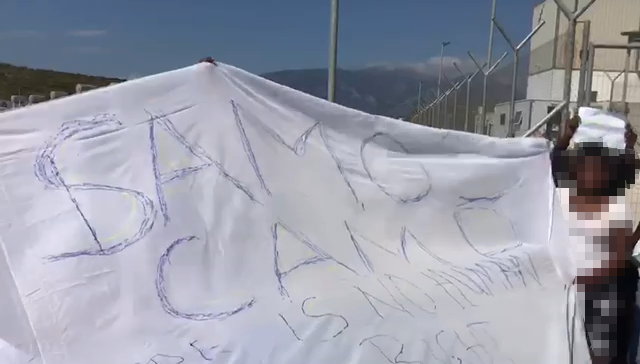

### AYS Special from Greece: **Protests on Samos CCAC shed light on procedural violations**
#### On Monday 5th September, asylum seekers in the EU\-funded Closed Control Access Centre \(CCAC\) on Samos held a protest against their treatment by the Greek authorities\. Holding a banner that reads “Samos Camp — There is no Human Rights \#saynorejections” the group demanded their human rights be respected, which includes having their claims for asylum fairly considered\.

The protest was sparked by the Greek authorities issuing, in one day, 40 rejections of the asylum claims of 40 people held in the CCAC, most of whom are from Sierra Leone\.

Not only did most of these rejections come a few weeks after people’s asylum interviews, they came after legal actors on Samos noticed flagrant violations of asylum seekers’ procedural rights in their asylum process\. Procedural rights are principles enshrined in European law, which, in the asylum context, are intended to guarantee fair conditions for asylum seekers to present their claims for asylum\.

Without procedural rights being upheld, people’s right to asylum is undermined\.

> Procedural rights are principles enshrined in European law, which, in the asylum context, are intended to guarantee fair conditions for asylum seekers to present their claims for asylum 

The [EU Asylum Procedure Directive \(2013/32/EU\)](https://home-affairs.ec.europa.eu/policies/migration-and-asylum/common-european-asylum-system/asylum-procedures_en) enshrines “procedural guarantees safeguarding the rights of applicants, including providing adequate and timely information, being heard in a personal interview, free legal assistance, interpretation and representation”\.

Such procedural rights are **essential to ensure fair access to asylum** \. In particular, the Directive requires that each asylum seeker undergo an assessment to determine possible vulnerabilities \( [Directive \(2013/32/EU\)](https://home-affairs.ec.europa.eu/policies/migration-and-asylum/common-european-asylum-system/asylum-procedures_en) [Art\. 8 and 24](https://home-affairs.ec.europa.eu/policies/migration-and-asylum/common-european-asylum-system/asylum-procedures_en) \), and where such vulnerabilities are identified, applicants are entitled to “special procedural guarantees” \( [Directive \(2013/32/EU\)](https://home-affairs.ec.europa.eu/policies/migration-and-asylum/common-european-asylum-system/asylum-procedures_en) [Art\. 24 \(3\)](https://home-affairs.ec.europa.eu/policies/migration-and-asylum/common-european-asylum-system/asylum-procedures_en) \) \.

On [Samos](https://medium.com/are-you-syrious/search?q=samos) , as on all the five Greek ‘hotspot islands’ \(Lesvos, Samos, Chios, Leros, Rhodes and Kos\), the so\-called “fast track procedure” is applied\. This procedure aims at issuing decisions in a short period of time\. It has been [heavily criticised](https://asylumineurope.org/reports/country/greece/asylum-procedure/procedures/fast-track-border-procedure-eastern-aegean/) for resulting in violations of asylum seekers’ procedural rights\. Over the past weeks the already shortened “fast track border procedure” on Samos has been further accelerated, with severe consequences for applicants, as procedural protections, which are essential to a fair asylum system, are being eroded and passed over in favour of rapid decisions\.

Over the past months, IHR has recognised increasing violations of applicants’ procedural rights, including the **denial of access to legal information and counselling, inadequate vulnerability assessments and interview conditions which do not allow applicants to fully express their grounds for asylum\.**
### **Denied access to information and counselling through detention**

Asylum seekers “shall not be denied the opportunity to communicate with UNHCR or with any other organisation providing legal advice or other counselling” \( [Directive \(2013/32/EU\)](https://home-affairs.ec.europa.eu/policies/migration-and-asylum/common-european-asylum-system/asylum-procedures_en) [Art\. 12 \(3\)](https://home-affairs.ec.europa.eu/policies/migration-and-asylum/common-european-asylum-system/asylum-procedures_en) \) \. The system of arbitrary detention in the CCAC, however, prevents asylum seekers from accessing information and advice\.

> Asylum seekers “shall not be denied the opportunity to communicate with UNHCR or with any other organisation providing legal advice or other counselling” 

In order to leave the CCAC, asylum seekers need to receive their ‘red card’, a card which functions as an ID during the asylum procedure\. Even though the Reception and Identification Service \(RIS\) of the CCAC registers asylum seekers shortly after they arrive \(including their identity details and nationality\), [Greek asylum law](https://www.kodiko.gr/nomothesia/document/572171/nomos-4636-2019) allows further detention for up to 25 days for identification purposes\. This detention is arbitrary, since applicants are already identified but still detained\. Asylum seekers are often interviewed before they receive their ‘red card’ or so soon after that seeking legal advice or counselling is effectively denied\.

> Greek asylum law allows further detention for up to 25 days for identification purposes\. This detention is arbitrary, since applicants are already identified but still detained 

According to data from IHR, asylum seekers are **detained for 12 days on average** after being identified by the RIS\. In addition, in 6% of IHR’s cases, people are detained for longer than 25 days before receiving their ‘red card’\. Without the ‘red card’, applicants have no access to information and legal assistance outside the camp\.

This _arbitrary_ detention in the CCAC, combined with the short notice of interviews, makes it **almost impossible for many asylum seekers to access necessary information/ support** and is a breach of their procedural rights\.
### **Inadequate vulnerability assessment**

Greece is obliged to “take into account the specific situation of vulnerable persons” during the asylum procedure \( [Directive \(2013/32/EU\)](https://home-affairs.ec.europa.eu/policies/migration-and-asylum/common-european-asylum-system/asylum-procedures_en) [Art\. 21](https://home-affairs.ec.europa.eu/policies/migration-and-asylum/common-european-asylum-system/asylum-procedures_en) \) \. In order to do so, Greek authorities “shall assess whether the applicant is an applicant in need of special procedural guarantees” \( [Directive \(2013/33/EU\) Art\. 24 \(1\)](https://eur-lex.europa.eu/legal-content/EN/TXT/HTML/?uri=CELEX:32013L0033&from=EN) \) \. This assessment is often referred to as a vulnerability assessment\.

**Medical and psychological screenings are a key part of this procedure with the purpose to determine whether one or more of the vulnerability criteria have been met** \( [Directive \(2013/33/EU\) Art\. 21](https://eur-lex.europa.eu/legal-content/EN/TXT/HTML/?uri=CELEX:32013L0033&from=EN) \) \. In the CCAC, these assessments are inadequate\. Despite the CCAC having been in operation for a year, and with the current population reaching nearly 1,000, it does not have a doctor employed full time\. **Instead, a volunteer doctor** from the Samos General Hospital **attends for one or two afternoons a week\.**

Many of IHR’s beneficiaries describe the medical screening, a key part of the vulnerability assessment, as rushed and “like a box\-ticking exercise”\. Only 33% of IHR beneficiaries were in contact with the CCAC psychologist before their asylum interview\. Of the beneficiaries who have not seen a psychologist before their interview, 39% expressed the wish to see one\.

This is of particular concern, as in 2022, 42% of IHR beneficiaries met the legal category of vulnerability, with 26% being survivors of torture and 12% being survivors of human trafficking\. By not providing sufficient vulnerability assessments in the CCAC, **Greek authorities deprive those who meet the legal vulnerability criteria of the special procedural guarantees to which they would be entitled** , such as the possibility to leave Samos for necessary medical treatment via a geographical lift\.

> In 2022, 42% of IHR beneficiaries met the legal category of vulnerability, with 26% being survivors of torture and 12% being survivors of human trafficking 

### **Denial of the opportunity to present asylum claims in a comprehensive manner**

Asylum interviews should be conducted in such a way that asylum seekers can “present the grounds for their applications in a comprehensive manner” \( [Directive \(2013/32/EU\) Art\. 15 \(3\)](https://home-affairs.ec.europa.eu/policies/migration-and-asylum/common-european-asylum-system/asylum-procedures_en) \) \. Despite Greece’s obligations, **interviews are often conducted in a way that undermines asylum seekers’ ability to present their claims comprehensively\.**

Many asylum interviews are conducted by **remote caseworkers and/or interpreters** \. IHR’s beneficiaries report this leads to confusion and miscommunications, further exacerbated by a poor internet connection\. IHR’s beneficiaries furthermore report that **during the interview they are interrupted or pressured** to keep the presentation of their asylum claim short\.

Applicants report that these interruptions or signs to ‘speed up’ often happen through hand gestures so that they do not appear in the interview transcript\. **Reports of pushbacks or human trafficking incidents were incorrectly passed over as irrelevant for their asylum claim\.** This is extremely worrying, as the asylum interview is the basis for decisions on asylum claims\.

By not providing the legally required interview conditions and by pressuring asylum seekers to rush through their interview, the GAS actively hinders people from presenting their claim in a comprehensive manner\.

> The Greek authorities are creating unlawful obstacles to fair access to asylum 

**This systematic violation of the procedural rights of applicants is another step towards undermining the rights of asylum seekers** in the CCAC on Samos\. By denying access to information and counselling, proper assessment of vulnerability and interview conditions that allow asylum seekers to fully present their claim, the Greek authorities are creating unlawful obstacles to fair access to asylum\.

Protests in the camp are an example of asylum seekers standing up for their right to be heard and their right to asylum\. IHR condemns the increasing procedural violations and stands in solidarity with those demanding fair access to asylum\.

**_By: I Have Rights_**

**If you wish to contribute, either by writing a report or a story, or by joining the Info Gathering team, please let us know\!**

**We strive to echo correct news from the ground through collaboration and fairness\. Every effort has been made to credit organisations and individuals with regard to the supply of information, video, and photo material \(in cases where the source wanted to be accredited\) \. Please notify us regarding corrections\. For the latest version of this text, visit our Medium page\.**

**If there’s anything you want to share or comment, contact us through Facebook, Twitter or write to: [areyousyrious@gmail\.com](mailto:areyousyrious@gmail.com)**

_Converted [Medium Post](https://medium.com/are-you-syrious/ays-special-from-greece-protests-on-samos-ccac-shed-light-on-procedural-violations-d5e7bf509c40) by [ZMediumToMarkdown](https://github.com/ZhgChgLi/ZMediumToMarkdown)._
