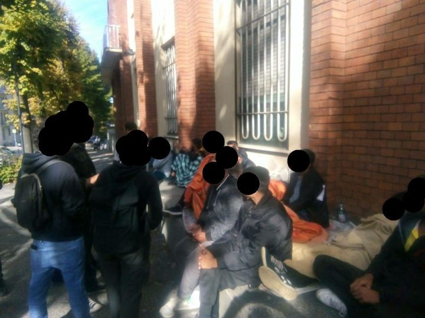

### AYS News Digest 5/10/22: Escaping the arbitrary detention
#### 48 people safe on board Louise Michel / Shipwreck in the Aegean, at least five dead / Pakistani asylum seekers protest in Italy / Interesting story from the south of Italy / More evictions in France / UK decisive on deportations and insisting on ruthless public rhetoric / & other interesting reads and important news

](assets/8eb43628fd0b/0*2Mbt-ml6cuDxY_KV.jpg)

Image via [**Getting the Voice Out**](https://www.gettingthevoiceout.org/)
#### FEATURE

**Belgium** — “The Caricole centre is one of the detention centres set up by the Belgian state\. Its function is to detain people arrested at airports and borders\. 
These include people who were visiting someone or visiting as tourists and who did not have the required papers to enter the country\. These people are repatriated to their country of departure\. Others apply for international protection and are arrested at the airport, their applications being deemed suspicious by the airport police and the Aliens Office\. They are locked up in the Caricole centre while their asylum application is processed\. 
The detainees are currently witnessing several very violent expulsions, including that of an Iraqi national expelled to Burundi\. All the detainees were very shocked by this expulsion\.

This 4 October in the evening, five detainees chose freedom and left the centre,” the activist group Get the Voice Out reported\.
#### SEARCH AND RESCUE AT SEA

■■■■■■■■■■■■■■ 
> **[LouiseMichel](https://twitter.com/MVLouiseMichel) @ Twitter Says:** 

> > Late yesterday evening we were informed by @alarmphone about a overcrowded wooden boat in distress. Early this morning our crew found the boat and embarked all 48 people safely onboard the #LouiseMichel. 
#LeaveNoOneBehind #FreedomOfMovementforAll #SolidarityAndResistance https://t.co/TSnHu2D7Ho 

> **Tweeted at [2022-10-04 10:04:43](https://twitter.com/mvlouisemichel/status/1577238278708731905).** 

■■■■■■■■■■■■■■ 

[Reportedly](https://www.infomigrants.net/en/post/43792/mediterranean-48-people-rescued-by-louise-michel?fbclid=IwAR0EswLDEOFaFT9TPJoZPhC_vyZ3hb5ppikrC4YI9Ibj23_bRheRSk0myNI) , 72,252 people have disembarked in Italy from the Mediterranean this year\. Some are brought in by private rescue ships, others reach the Italian coastline under their own steam and thousands more are picked up by the Italian coast guard and the tax and border police Guardia di Finanza who also operate rescue missions in the Mediterranean\.

If you missed the story, read the AYS Special about the person behind the name of this brave crew and SAR ship that washes our faces patrolling in the Med:

[AYS International Women’s Day Special — Who is Louise Michel? \| by Are You Syrious?](ays-international-womens-day-special-who-is-louise-michel-c156eb428c75)
#### GREECE
### Shipwreck with many victims involved reported

A shipwreck with 95 people occurred off the island of Kythera, South Peloponnese late on Wednesday\. There are reports of at least five dead people and some 15 people are stranded on the rocks\. According to the latest information, 30 people have been rescued so far, as reported by the [local](https://kythera.news/nayagio-diakofti-anthropous-sti-thalassa/) [media](https://www.keeptalkinggreece.com/2022/10/06/shipwreck-with-95-migrants-off-kythera-big-rescue-operation/?fbclid=IwAR2BJyUqUeupWs4wEUiTrJPxjHDhanTLR9Dcn5644Knx6CxA8C7vV8KpGIo) \.
### Lesvos

■■■■■■■■■■■■■■ 
> **[Aegean Boat Report](https://twitter.com/ABoatReport) @ Twitter Says:** 

> > Another tragedy in the Aegean, when a boat carrying 40 people went down outside Patelidi, Thermi, Lesvos north east last night, 17 found dead, 9 rescued and at least 14 missing. https://t.co/sHMTb8ixjY 

> **Tweeted at [2022-10-06 06:55:59](https://twitter.com/aboatreport/status/1577915557491376128).** 

■■■■■■■■■■■■■■ 

### Automated boats to patrol around Evros border

The portraying of the border situation continues to be all about securitisation in the media\. Newest in line is the enthusiastic reporting about state\-of\-the\-art autonomous systems on patrol that will be employed for patrolling the Evros border, as they talk of the “electronic shielding of the Evros fence”\.

> The automated surveillance system on the fence will also be installed on boats, that is, when the patrol boats will have cameras day and night, especially radar to detect traffic and will be able at any time, to see exactly what is happening on the territory of Turkey\. 

> In fact, this system will be so sophisticated that at this time the operational ones located in Evros are doing research so that our country can procure unmanned boats, which will be able to do regular patrols along the river regardless of weather conditions without there being any people on board, [_reported_](https://www.cnn.gr/politiki/story/331117/evros-thorakizontai-ta-synora-se-peripolia-mi-epandromenes-lemvoi-me-ypersygxrona-systimata) _the media\._ 

#### ITALY
### A sit\-in protest for rights to asylum

For the past 40 days, a group of Pakistani nationals have been conducting a sit\-in with blankets and sleeping bags outside the police headquarters of the Italian town of Asti, located in the Piedmont region of northwestern Italy, demanding that they be granted political refugee status, InfoMigrants [reported](https://www.infomigrants.net/en/post/43795/italy-pakistanis-hold-sitin-in-asti-demand-refugee-status?fbclid=IwAR3H2LDe97aW4GOVAsuvAKS_0BMMwm38OCS-G5tQvhgCrYlcOfgbzQ0z3Ds) \.

The people in question arrived a while ago via the so\-called Balkan Route, and they have been trying to penetrate the reception and asylum system of the EU in Italy ever since, but — no success and no ears to listen to them, it seems\.

They have reportedly been refused entry into the local reception center again and again, with local authorities reportedly saying there were no spots available\. This left some of them sleeping in the city’s parks\.

Local activists and organisations are helping them with basic things, support and dencouncing the unfairness of the situation, but who is responsible for whatever happens next?

> Faced with this situation, we mobilized ourselves as Self\-Managed Laboratory La Miccia, together with a number of spontaneous agreements\. First of all to talk to these people, understand their situation, bring essential items and put them in contact with lawyers from Astiga and the Association for Immigration Legal Studies\. 

> Let’s leave to the latter the technicalities of the law and speak out publicly to denounce this intolerable situation for which the very city authorities are responsible\. Over the years, as a collective, we have mobilized several times against the killer border system, which every year reaps victims both outside and within our country\. 

> The fight for these people to get at least what they rightfully deserve is a small part of a much larger battle: in solidarity with all the people on the move and against the mechanisms of marginalization and oppression that these people experience on a daily basis\. 

> We fight for a world with no more states, no borders, no jails, where no one should be considered illegal anymore, where no one has to put their own lives on the line in an attempt to improve their existence, for themselves and for their loved ones\. In doing so, we will not look away and will continue to support these people’s claims, bring them our active solidarity, until they receive an appropriate response\. — [Laboratorio Autogestito La Miccia — Asti](https://www.facebook.com/collettivoastiosa?__cft__[0]=AZXfVHfPKQlURa35k2jxJPkT5k9s0CEAdVbOETfnXgRYCRWRc98LioGjuOE3v3aWwcuFvkYJef6wVuQAVzugyIKSN3cDxqJ1XxwPsKC6zL--gqz4xshfNRw4TW-UmvSF5z19SBXmhH4ERnygz4NeIEnN&__tn__=-UC%2CP-R) 

### “Without them, we wouldn’t be here anymore”

On the other side of the country, a different history and a different picture\. One of the many places in Europe that has no more inhabitants or is lacking people to be able to form, keep and sustain communities in Camini, a small isolated village in Calabria, in southern Italy\.

About 150 people from Afghanistan, Morocco, Tunisia, Libya, South Sudan, Pakistan, Bangladesh, Nigeria, Syria live in Camini, making it one of the municipalities of the peninsula with the highest rate of immigrants among its population\. Their presence alone sparked a surge of solidarity from organizations that injected money into the village’s coffers\. The cooperative employs 18 people and has opened several craft workshops in which refugees work: ceramics, woodworking, clothing and art creation\.

Take time to read and think about the story of this village and perspectives that could grow from it, for both the locals and those who have in the meantime become locals\.

[“Without them, we wouldn’t be here”: in Calabria, a small village survives thanks to migrants](https://www.infomigrants.net/fr/post/43810/sans-eux-on-ne-serait-plus-la--en-calabre-un-petit-village-survit-grace-aux-migrants?fbclid=IwAR1wcx744mQVyiB91TTecw5FPWslOJVE7Z5tjQPcNJ81WpFjteJqfFiR-UU) \.
#### GERMANY
### Has the immigration office in Passau made the wrong decision?

The answer to this question will decide whether the man who was lured into the immigration office “on false pretenses”\.

According to [reports](https://www.migazin.de/2022/10/05/abschiebung-iraner-luege-amt-regierung/?fbclid=IwAR07UAaZhDzcEU9lYHg6lsbsVzp8Kj9J7__xvd9OK3o4KrB-WLdXiwtsP9Y) , it was Interior Minister Joachim Herrmann \(CSU\) who prevented the deportation to Teheran planned for Wednesday \(5 October\) at the last minute, as a ministry spokesman confirmed on Wednesday on request\.

#### FRANCE

By order of the Préfet of Haut\-de\-France, French policemen has dismantled one camp in the city of Roubaix\. Twenty\-eight persons are now without a place to live, more than half of whom are children\. No solution has been given by the authorities, [Collectif national droits de l’homme Romeurope](https://twitter.com/CNDH_Romeurope) reported\.
#### UK
### Someone’s dreams are other people’s nightmares

The political image of the European countries, but also the UK, is turning into something that our grandparents would fear is a trip into the dark past, but the statements of some of the politicians confirm our feared realities \(and their ignorance, of course\) \.

“I would love to be having a front page of The Telegraph with a plane taking off to Rwanda\. That’s my dream\. That’s my obsession\.” — This was [said](https://www.independent.co.uk/news/uk/politics/suella-braverman-rwanda-dream-obsession-b2195296.html?utm_content=Echobox&utm_medium=Social&utm_campaign=Main&utm_source=Twitter#Echobox=1664896094) by the British interior minister Suella Braverman\.

She plans to introduce new legislation designed to enable the government to deport anyone coming to the country by boat from France\.

“We have to stop the boats from crossing the Channel\. This has gone on for far too long,” she said\.

> [According](http://www.infomigrants.net/en/post/43782/uk-government-intent-on-deporting-channel-migrants?fbclid=IwAR2ZTLCSxO6OKGqh1xNwEKmSWOx5l_6VdBa3T7AwEWxpaZV_bigvsZlBrjk) to the government, large numbers of migrants crossing the Channel are claiming to be victims of human trafficking in order to be allowed to remain in the UK\. It [amended the legislation](https://www.gov.uk/government/news/alarming-rise-of-abuse-within-modern-slavery-system) last year in response to what it said had been an “alarming rise in the people abusing the … system by posing as victims,” citing those taking advantage of modern slavery safeguards as “child rapists, people who pose a threat to national security, serious criminals and failed asylum seekers\.” 

Related to this topic, we recommend this for today’s read:

Refugee Council: [Our reflections on the Home Secretary’s announcements at CPC22 — Refugee Council](https://www.refugeecouncil.org.uk/latest/news/our-reflections-on-the-home-secretarys-announcements-at-cpc22/?fbclid=IwAR2JYlPS-YHtMEd84hPQHfsy_jXoTiytgM7xifs70mr5AASExC6VXoV_r0k)

**Find daily updates and special reports on our [Medium page](https://medium.com/are-you-syrious?source=email-156a28ef10e4-1660244456586-newsletter.subscribeToProfile-------------------------68bdcd3d_8cf3_4eba_889e_fd5281d60100--------3e266993d553) \.**

**If you wish to contribute, either by writing a report or a story, or by joining the Info Gathering team, please let us know\!**

**We strive to echo correct news from the ground through collaboration and fairness\. Every effort has been made to credit organisations and individuals with regard to the supply of information, video, and photo material \(in cases where the source wanted to be accredited\) \. Please notify us regarding corrections\.**

**If there’s anything you want to share or comment, contact us through Facebook, Twitter or write to: [areyousyrious@gmail\.com](mailto:areyousyrious@gmail.com)**

_Converted [Medium Post](https://medium.com/are-you-syrious/ays-news-digest-5-10-22-escaping-the-arbitrary-detention-8eb43628fd0b) by [ZMediumToMarkdown](https://github.com/ZhgChgLi/ZMediumToMarkdown)._
