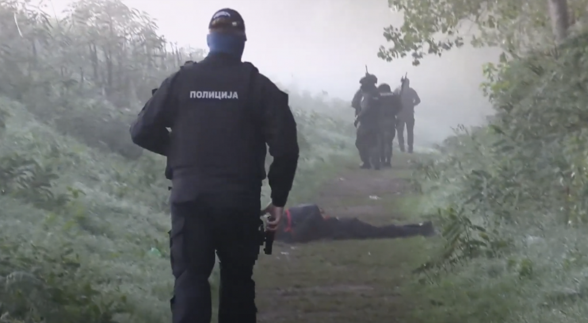
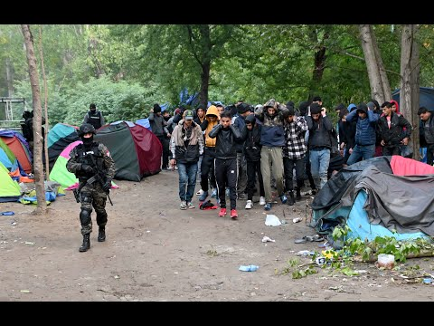
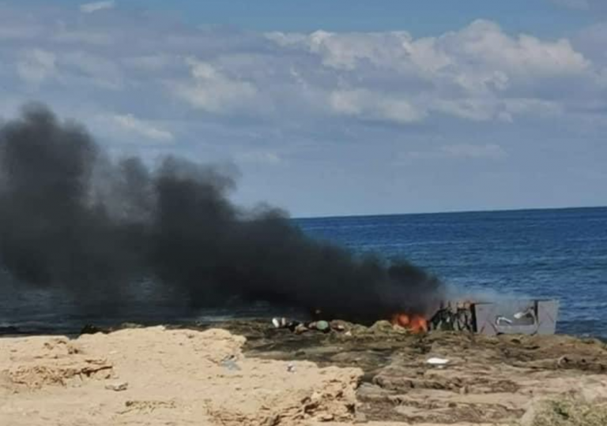
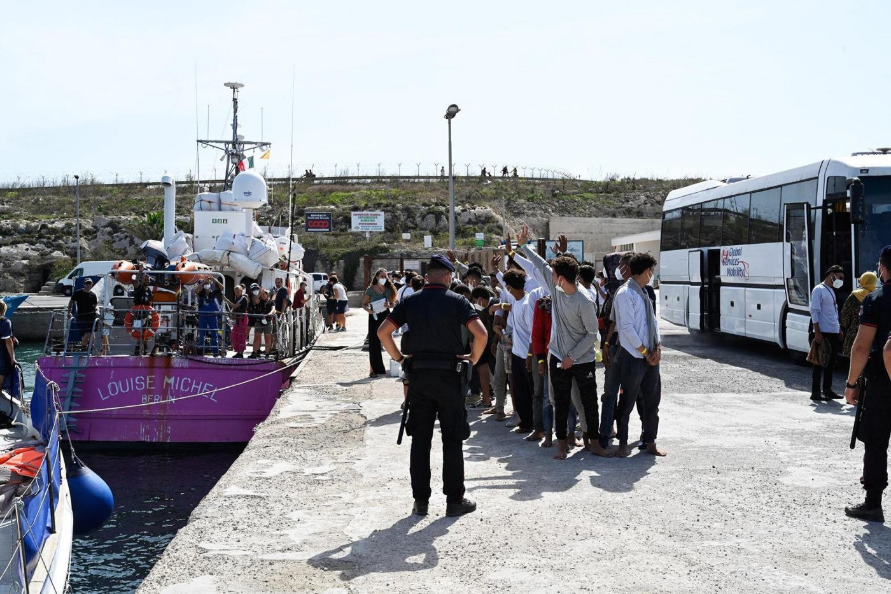

### AYS News Digest 10/10/22: Serbian Interior Minister calls migrants ‘scum’ after makeshift camp raids

Greece has called for Turkey to stop allowing asylum seekers to depart from Turkish shores/15 bodies found on a beach in Libya after an altercation between two trafficking gangs/Sea Watch International reports on a boat carrying 50 people pulled back to Libya/ No Borders Team on Tour — Fight Fortress Europe/Front\-Lex takes FRONTEX to court/Information on travel documents for Refugees in Greece/Serbia’s interior minister, Aleksandar Vulin, has referred to migrants as ‘scum’/and much more…

Serbian special police raided a camp on the banks of the Tisza River near the Hungarian border on Wednesday, October 5 \| Source: Screenshot YouTube Serbian Interior Ministry \(InfoMigrants\)
#### FRONTEX
### No Borders Team on tour — Fight Fortress Europe

### Front\-Lex takes Frontex to court

The NGO has filed a case against Frontex’s new Executive Director Aija Kalnaja at the Court of Justice of the European Union\.

They claim the EU Border and Coast Guard agency must terminate or suspend its joint operations with the Hellenic Coast Guard in the Aegean Sea Region due to countless horrific human rights abuses related to these operations\.

■■■■■■■■■■■■■■ 
> **[front-LEX](https://twitter.com/LexFront) @ Twitter Says:** 

> > Our #OLAF-based case on Greece filed to EU Court of Justice, and suddenly #Frontex's Director @[KalnajaAija](https://twitter.com/KalnajaAija)  finds the time to read the report .. 

how many children will drown until she applies it? 

[euobserver.com/migration/1562…](https://euobserver.com/migration/156237) 

> **Tweeted at [2022-10-08 09:35:43](https://twitter.com/lexfront/status/1578680528630272000).** 

■■■■■■■■■■■■■■ 

#### GREECE
### Greece has called for Turkey to stop allowing asylum seekers to depart from Turkish shores

Notis Mitarachi used the recent shipwrecks that cost the lives of 23 people last week to argue that [Turkey needed to prevent people from making the journey across the Aegean](https://www.infomigrants.net/en/post/43881/athens-calls-on-turkey-to-stop-migrant-departures?fbclid=IwAR0kDLQ8TWEGqR3Ps8v-MPA_uFNLMwZc8rn_AiuQt-d9X-f46qzjfXF2aWg) \. He claimed the Hellenic Coast Guard is working hard, and for as long as Turkey does not abide by the agreements they have signed, more people will die in the Aegean\.

There is obviously no mention of Greece’s role in the high death rates in the Aegean\.
### Information on Travel Documents for Refugees in Greece:

[https://www\.facebook\.com/mobileinfoteam/posts/pfbid0qFkw9RPA7433i5VdCNZMvwNFEFqAfAvxSDymkxnDKej6x8DCyAyayeKarqUxrgJYl](https://www.facebook.com/mobileinfoteam/posts/pfbid0qFkw9RPA7433i5VdCNZMvwNFEFqAfAvxSDymkxnDKej6x8DCyAyayeKarqUxrgJYl)

■■■■■■■■■■■■■■ 
> **[Samos Advocacy Collective](https://twitter.com/AdvocacySamos) @ Twitter Says:** 

> > Having released a whole campaign about @[Frontex](https://twitter.com/Frontex)’s non-compliance with its internal mechanisms ahead of the @EP_justice meeting today, we made sure to inform all of the MEPs about our efforts. 

> **Tweeted at [2022-10-10 06:53:48](https://twitter.com/advocacysamos/status/1579364556174163968).** 

■■■■■■■■■■■■■■ 

#### SERBIA
### Serbia’s interior minister, Aleksandar Vulin, has referred to migrants as ‘scum’\.

> Our country did not cause and is in no way responsible for the migrant crisis, and \(it\) will not be a parking lot for migrants, and especially not a place for scum and bandits — Aleksander Vulin, Interior Minister 

He has vowed to crack down on smugglers as he visited a makeshift camp near the Hungarian border\. He posted a video of police raiding a makeshift camp near the Hungarian border\.

The video shows mobile phones and cash being siezed, despite the Minister claiming they had siezed weapons\.

These raids are not new in Serbia; there have been a multitude of raids in different areas in Serbia, such as in Belgrade and Subotica\. In the months of March and April 2022, raids took place on an almost daily basis in Subotica\.

You can watch a short video posted by NoNameKitchen here: [https://www\.facebook\.com/reel/767615651003757](https://www.facebook.com/reel/767615651003757)
#### POLAND
### No Borders Team posted about a group of Congolese individuals who were beaten and sent back to Belarus:

[https://www\.facebook\.com/nobordersteam/posts/pfbid03884WqhQ71NXUmYSvx2f5V12roLd7gnnHxzZdY8Nhzr3tbwzqHDNAT2fifBod3CRzl](https://www.facebook.com/nobordersteam/posts/pfbid03884WqhQ71NXUmYSvx2f5V12roLd7gnnHxzZdY8Nhzr3tbwzqHDNAT2fifBod3CRzl)

■■■■■■■■■■■■■■ 
> **[Piotr Czaban](https://twitter.com/CzabanPiotr) @ Twitter Says:** 

> > - Jeb...nie.
- Zaj...bisty jest.
- Hahaha...
Nagrali, a potem chwalili się "przygodą" i napędzali tym samym hejt na ludzi.
Białowieża. Noc z wczoraj na dzisiaj. https://t.co/k6e5rv8UNK 

> **Tweeted at [2022-10-06 18:23:09](https://twitter.com/czabanpiotr/status/1578088489257779200).** 

■■■■■■■■■■■■■■ 

#### ITALY
### Campobello di Mazara migrant camp — ‘unsanitary no man’s land’

The camp is exceptionally dangerous, police do not even go into the camp\. There is little to no organisation and very limited infrastructure\. The conditions are inhumane, with very little access to electricity and water\.

#### GERMANY
### **Germany’s interior minister, Nancy Faeser, has called for a stop to deportations to Iran**

Within the current context, where authorities are violently cracking down on peaceful protests, Germany’s interior minister insisted Germany should take responsibility of stopping deportations to Iran and standing in solidarity with Iranian protesters\.

Josefine Paul, the North Rhine\-Westphalian Minister for Flight and Integration [has announced a halt on deportations](https://www.migazin.de/2022/10/10/nordrhein-westfalen-landesregierung-abschiebungen-iran/?fbclid=IwAR3LYEBL4yqoKMtWnbSb4gf4q9i2zdDg3WFXJTknj3iUhFrS_71aMs5zVGU) :

> North Rhine\-Westphalia stands in solidarity with the Iranians who campaign for women’s rights, for freedom of expression and assembly, and against torture and the death penalty\. But we also continue to rely on a nationwide solution\. I expect that the federal government and the federal states will quickly decide on a coordinated approach\. 

So far in 2022, [31 people have been deported to Iran](https://www.migazin.de/2022/10/09/faser-abschiebung-in-jahr31-menschen/?fbclid=IwAR087aXNB7MV0VgYdVSg1buTgstGqTa-28H_xJrJyLsvUzJ4Una8QFPfKy4) \.

■■■■■■■■■■■■■■ 
> **[Mediterranea Berlin e.V.](https://twitter.com/berlinersfor) @ Twitter Says:** 

> > STOP the Italy-Libya Memorandum!
October 15 - 2pm EU Commission*, Unter den Linden 78 
AGAINST the EU cooperation with the so-called Libyan coast guard and other militias
AGAINST the dying in the Mediterranean Sea https://t.co/yh8un1NKQy 

> **Tweeted at [2022-10-09 05:06:54](https://twitter.com/berlinersfor/status/1578975269494235137).** 

■■■■■■■■■■■■■■ 

#### FRANCE

■■■■■■■■■■■■■■ 
> **[Utopia 56](https://twitter.com/Utopia_56) @ Twitter Says:** 

> > Depuis hier soir, plus de 500 personnes exilées, à bord d’une dizaine d’embarcations, ont été secourues dans la Manche et ramenées sur les côtes françaises. Beaucoup sont toujours en détresse mer et contactent nos lignes d'urgence : « nous ne voulons pas mourir ». https://t.co/zchRJ8nZ8y 

> **Tweeted at [2022-10-09 16:14:14](https://twitter.com/utopia_56/status/1579143208663416832).** 

■■■■■■■■■■■■■■ 

### **As many as 1065 people crossed the English channel on Sunday 9/10**

The Channel is one of the most dangerous and busiest shipping lanes in the world, making it a highly precarious and risky sea to cross\.

#### SEA/SAR
### 15 bodies found on a beach in Libya

Most of the group had been burned in a charred boat, which the UN mission in Libya believes to be the act of smugglers\.

[The individuals had been shot after an altercation between two rival trafficking gangs](https://www.infomigrants.net/en/post/43870/heinous-killing-of-migrants-in-libya?fbclid=IwAR3kuiPq1g1uxixF5OOqk_ztShGVMiExcCZM7mXinhraknsUSINMXW0Ihsk) \. The boat was then set on fire\.

_Authorities reportedly discovered the bodies of 15 migrants, many in a charred boat, on a beach at Sabratha early on Friday, October 7 \| Source: Twitter \(@RefugeesinLibya\)_
### Sea Watch International reports on a boat carrying 50 people pulled back to Libya

■■■■■■■■■■■■■■ 
> **[Sea-Watch International](https://twitter.com/seawatch_intl) @ Twitter Says:** 

> > Pullback by #Seabird crew witnessed: on Saturday, the so-called Libyan Coast Guard caught up with about 50 people off the coast of Europe in the Maltese Search &amp; Rescue Zone and dragged them back to Libya. Illegal actions in the Mediterranean - coordinated and directed by Europe. https://t.co/8r4l8wEuaS 

> **Tweeted at [2022-10-10 17:38:06](https://twitter.com/seawatch_intl/status/1579526701662760960).** 

■■■■■■■■■■■■■■ 

### Louise Michel ports without permission due to critical circumstances onboard

[The Louise Michel ship rescued 48 individuals in the Mediterranean](https://thecivilfleet.wordpress.com/2022/10/09/louise-michels-rescuers-forced-to-attempt-port-entry-without-permission-after-three-guests-throw-themselves-overboard/?fbclid=IwAR0CYsON8WgKMDHMP5LHhpmzPyfrGMBugzDdlA4jN38Us_ibcibK7fjLD4s) \. They then contacted the Italian authorities, as well as other European authorities, for a safe port\.

The situation became critical onboard, as passengers became more and more distressed\. A few jumped off the boat in an attempt to swim to shore, and others tried to follow them\.

> The psychological capacities of our already traumatised guests were so intensively overstretched with the wait for a safe port for the fifth day in a row, and witnessing three boats being rescued by Italian coastguard, that three people tried to jump and swim towards them\. — A Crew Member 

The ship ended up trying to disembark at a port without permission\. They luckily received permission as they were arriving at the port\.

Source: The Civil Fleet

■■■■■■■■■■■■■■ 
> **[LouiseMichel](https://twitter.com/MVLouiseMichel) @ Twitter Says:** 

> > 1/2 Finally all 48 people from the #LouiseMichel disembarked on Lampedusa today. We are relieved but also speechless about how people can be denied their basic human rights. As the traumatic situation escalated we were forced to declare a state of necessity yesterday evening. https://t.co/yPUQJmGNid 

> **Tweeted at [2022-10-09 15:20:32](https://twitter.com/mvlouisemichel/status/1579129692866908160).** 

■■■■■■■■■■■■■■ 

### WORTH READING:
- Discussion Paper — Getting Stuck En Route “From Dayton to Brussels”: EU Conditionality as an Obstacle to Accession

- Global Detention Project — The GDP and the International Refugee Rights Association Submit Freedom of Information Requests to Türkiye’s Presidency of Migration Management

■■■■■■■■■■■■■■ 
> **[Kolbassia Haoussou MBE](https://twitter.com/haoussou) @ Twitter Says:** 

> > Mental Health took my brother one day he was ok and next evening he took his life. At Sing for Freedom Choir singing give us expression and we lose our feeling in the joy of singing check our video talking about it here. @[Together_Create](https://twitter.com/Together_Create) @[FreefromTorture](https://twitter.com/FreefromTorture) [youtu.be/mroFDpDQsV0](https://youtu.be/mroFDpDQsV0) 

> **Tweeted at [2022-10-10 14:06:09](https://twitter.com/haoussou/status/1579473360576471041).** 

■■■■■■■■■■■■■■ 

■■■■■■■■■■■■■■ 
> **[Greater Manchester Immigration Aid Unit](https://twitter.com/GMIAU) @ Twitter Says:** 

> > Thread for #WorldMentalHealthDay 🧵

Everyone deserves to live in the safety and security that will allow their mental health to thrive. It's easy to understand that people who arrive in the UK after fleeing war or persecution may need particular mental health support. (1/9) 

> **Tweeted at [2022-10-10 15:17:25](https://twitter.com/gmiau/status/1579491296615731201).** 

■■■■■■■■■■■■■■ 

**Find daily updates and special reports on our [Medium page](https://medium.com/are-you-syrious) \.**

**If you wish to contribute, either by writing a report or a story, or by joining the Info Gathering team, please let us know\!**

**We strive to echo correct news from the ground through collaboration and fairness\. Every effort has been made to credit organisations and individuals with regard to the supply of information, video, and photo material \(in cases where the source wanted to be accredited\) \. Please notify us regarding corrections\.**

**If there’s anything you want to share or comment, contact us through Facebook, Twitter or write to: areyousyrious@gmail\.com**

_Converted [Medium Post](https://medium.com/are-you-syrious/ays-news-digest-10-10-22-serbian-interior-minister-calls-migrants-scums-after-makeshift-camp-dac920e92701) by [ZMediumToMarkdown](https://github.com/ZhgChgLi/ZMediumToMarkdown)._
