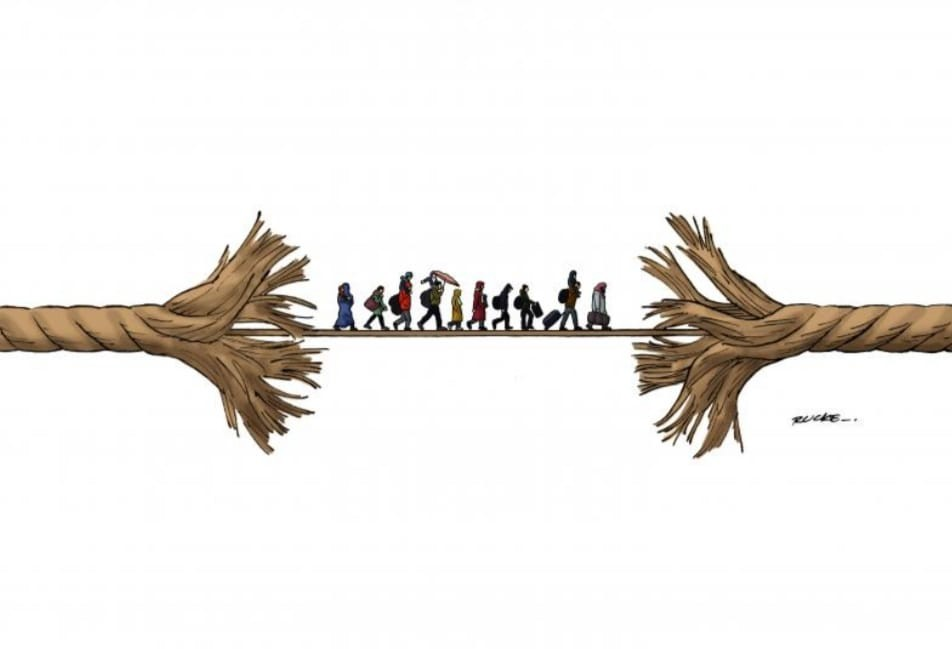
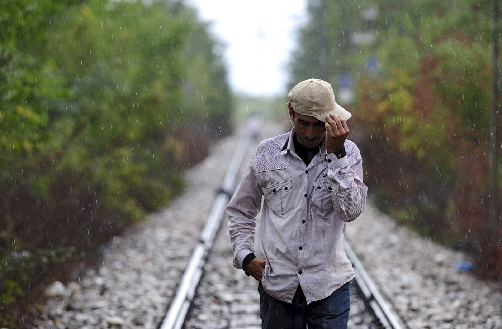

### AYS News Digest 12/10/22: Concerns tied to poor quality of asylum procedures and to breaches of fundamental rights in Greece
#### Τhe state of the border procedure on the Greek islands / Being compelled to accept so\-called ‘assisted returns’ / Western Europe doesn’t like the increasing number of people arriving, unless they are Ukrainian / **Eritreans can no longer be forced to get documents through the Eritrean embassy in Germany, Court ruled**

By Rucke Souza
#### FEATURE — Τhe state of the border procedure on the greek islands

The latest report by RSA examines the workings of border procedures implemented on the Greek islands over the past year \(June 2021 — June 2022\), revealing new concerns tied to the poor quality of asylum procedures and to breaches of fundamental rights\. These add to an abundant body of international criticism of the Greek asylum system and merit close scrutiny, not least in the context of ongoing EU\-level negotiations on the reform of the Common European Asylum System\.

> Severe delays persist when it comes to conducting vulnerability assessments even after the reception and identification procedure formally ends: The time delay ranges from ten days to longer than three months in some cases\. Yet, the Asylum Service and EUAA continue to process asylum claims before individuals have undergone a vulnerability assessment, and routinely disregard or deny special procedural guarantees afforded by EU law, even where they are specifically requested by the applicants in writing and/or orally prior to the interview\. They instead insist on completing the interview under the border procedure\. The medical cards issued to people undergoing reception and identification procedure do not clearly indicate whether and when a vulnerability assessment was conducted\. 

\(…\)

> As of September 2021, asylum seekers are obliged to pay a fee of €100 per person, in order to make a second and further subsequent application, a measure that has received criticism at national and EU level and has been challenged before the Greek Council of State\. 

The [report](https://rsaegean.org/wp-content/uploads/2022/10/BorderProcedure_Greek_islands_report.pdf) highlights that **core aspects of the asylum procedures in Greece fall short of ensuring that asylum seekers access their rights under EU and domestic law\.** In order to address these issues and drawing on the above findings, the Danish Refugee Council \(DRC\), Equal Rights Beyond Borders, HIAS Greece, Refugee Support Aegean \(RSA\) and PRO ASYL have put forward their recommendations which can be read in detail [**here**](https://rsaegean.org/en/border-procedure-greek-islands/?fbclid=IwAR3PbNywl0yqxs2UiP_uxXU1j-A8fCEyuDWzxy5tXKD2pcxZ_mMDDqJdpyw) \.
#### LIBYA
### Not so voluntary returns

The recent UN report finds \(what is already well known\) that in reality, many people on the move in Libya are unable to truly return in accordance with international human rights law and standards, including the principle of free, prior and informed consent\.

Many find that they have **no choice but to return to the same circumstances that made them leave their countries** in the first place, the report states\.

Read more: [‘unconscionable’ violations of migrants returning from Libya](https://news.un.org/en/story/2022/10/1129417?fbclid=IwAR3NETT6PFvGVIcdd_hbkoas035cO9RJHX2-zV6wlnd89zAwkiY2PHfx_K8) \.
#### SEARCH AND RESCUE AT SEA

The bodies of eight people were found off the coast of the southern Tunisian town of Zarzis on Monday\. An aid official said they were “probably migrants who had been traveling in a boat that left on 21 September\.”

Fishermen off Zarzis made the awful discovery early on Monday, 10 October\. The eight bodies are thought to be those of Tunisian migrants who had set off on a boat that sank two weeks ago\.

Find out [more](http://www.infomigrants.net/en/post/43905/tunisian-fishermen-discover-eight-bodies-off-zarzis?fbclid=IwAR3cEtXAtJCqXOyg7m9Llp6J-V1gwCkNGMVkhoTnni2Xj67glmQtTqUxmRI) \.

■■■■■■■■■■■■■■ 
> **[MSF Sea](https://twitter.com/MSF_Sea) @ Twitter Says:** 

> > 🔴 Our team just conducted a rescue following an allert by @[alarm_phone](https://twitter.com/alarm_phone). 9 people were on a small fiberglass boat in distress located in international waters near #Libya. Thanks to @[PVolontaires](https://twitter.com/PVolontaires)'s support they are now safe and cared for by the #GeoBarents team. https://t.co/jJSyYJ69xV 

> **Tweeted at [2022-10-12 19:37:07](https://twitter.com/msf_sea/status/1580281428516147200).** 

■■■■■■■■■■■■■■ 

Eight brave years for our fellow activists at Alarm Phone

■■■■■■■■■■■■■■ 
> **[Alarm Phone](https://twitter.com/alarm_phone) @ Twitter Says:** 

> > 🎂The Alarm Phone turns 8 today!

On 11 October 2014, we launched our hotline for people in distress at sea. Over the past 8 years, we have assisted over 5.000 boats in distress

We have fought for eight years.
We will continue.
We will never give up.

[alarmphone.org/en/2022/10/11/…](https://alarmphone.org/en/2022/10/11/8-years-of-struggle/?post_type_release_type=post) 

> **Tweeted at [2022-10-11 07:31:18](https://twitter.com/alarm_phone/status/1579736382897287168).** 

■■■■■■■■■■■■■■ 

#### SERBIA

In their latest info bulletin, InfoPark has reported on more deaths along the mountain path and border area with Bulgaria:

> Local media in southeastern Serbia have recently reported a railway accident on the tracks between the border towns of Pirot and Dimitrovgrad\. The first news report mentioned several injured migrants who had been walking on the tracks connecting Serbia and Bulgaria\. However, the official statements from the Serbian Railways Cargo company and the Ministry of the Interior soon confirmed two deaths and several injured migrants\. The bodies of E\.K \(24\) from Baghlan and Z\.C\. from Laghnam in Afghanistan were found near the tracks and now lie in the Pirot morgue, awaiting transportation to their homeland\. 

> The railway between the Bulgarian border crossing Gradina/Kalotina and Pirot is the main orientation point for everyone who enters Serbia irregularly via the mountainous region that connects the two countries\. It is visible from almost every point of entry to Serbia on the Stara Planina mountain, including the villages of Bačevo, Radejna amongst others\. To avoid walking in dense forests, migrants opt to walk down to the valley\. They sometimes hop on the slow cargo trains and bypass the 40km walk to Pirot, where they can find the amenities they need for further travel\. 
 

>  
 

> This corridor has recently exploded, with up to 400 new entries daily, creating a humanitarian hotspot in Pirot that no\-one has yet addressed seriously\. Most of the newcomers using small village roads orient themselves by either following power lines or, more frequently, the main rail tracks\. The railway traffic is in decline and the route is only used by a few slow cargo trains daily, so some migrants do not see the route as dangerous\. Unfortunately, on this occasion, the route became not only dangerous, but lethal\. 
 

>  
 

> With these cases, the death toll in this area reached three within the last ten days\. There are also unconfirmed rumours from locals in the village of Poljska Rzana \(near Pirot\) that on 30 September police stopped a car full of migrants containing two dead bodies\. Local police have refused to share any information, but it would not be the first time such news is hidden from the public; the overall death toll in Serbia since the beginning of the migrant crisis is greater than reported\. 
 

>  
 

> We are currently engaged in helping relatives of deceased migrants to arrange for transportation of the mortal remains back to Afghanistan in a humane and dignified way\. Some of these relatives are on their way to Pirot, where our team members will help them with translation and orientation through procedures and red tape\. Sadly, no help is either arranged or promised from the state institutions\. 

■■■■■■■■■■■■■■ 
> **[Seebrücke Frankfurt](https://twitter.com/SeebrueckeFfm) @ Twitter Says:** 

> > ⚫️ 2 #Refugees wurden in #Serbien🇷🇸 getötet, als sie an der Strecke Pirot - Dimitrovgrad nahe der Grenze zu #Bulgarien🇧🇬 von einem Zug erfasst wurden. People on the Move benutzen oft Eisenbahnstrecken zur Orientierung. #BordersKill

via @[fiedler_mathias](https://twitter.com/fiedler_mathias) 
[abcnews.go.com/International/…](https://abcnews.go.com/International/wireStory/migrants-struck-killed-train-eastern-serbia-91154279) 

> **Tweeted at [2022-10-11 20:17:51](https://twitter.com/seebrueckeffm/status/1579929291344998401).** 

■■■■■■■■■■■■■■ 

### Visa regime that makes entrance possible

The German minister of the interior is criticizing Serbian visa policy because it encourages illegal migration to Europe and the German government is happy to help them with transitioning to the EU visa system, it was [reported](https://rs.n1info.com/english/news/german-minister-says-serbias-visa-practice-is-unacceptable/?fbclid=IwAR1FsTXOdwuZSz9mnd6I-toWJVjbwlc4NBNIUNTvUvZXV8vL6XYKu5FQ5cU) \.
#### GERMANY
### Eritreans no longer forced to go to the embassies

Germany‘s Federal Administrative Court has ruled that refugees from Eritrea must obtain a travel document from the German authorities\. This [ruling is by Germany’s supreme administrative court](https://www.bverwg.de/pm/2022/62?fbclid=IwAR3lenMDmBTltrVTReLN1MhM7x9Usm9PJ2wtf5p-TA1ZweKnveyTzalnhr4) \.

As a result the refugees will no longer be forced to first obtain papers from the Eritrean embassy beforehand, which has required them submitting a “declaration of remorse\.” The court ruled that no one should be forced to declare a “crime” to get a passport\.

Persons entitled to subsidiary protection may not be refused a travel document for foreigners because they can obtain a passport from their country of origin if they submit a “declaration of remorse” with a self\-accusation of a criminal offence\. The submission of such a declaration is unreasonable, ruled the [Federal Administrative Court](https://www.lto.de/gerichte/aktuelle-urteile-und-adresse/bundesverwaltungsgericht-bverwg/) \(BVerwG\) in a judgment on Tuesday \(ruling of 11 October 2022, Az\. BVerwG 1 C 9\.21\) \.

An Eritrean national fled to Germany, where he was granted subsidiary protection, because those who have left Eritrea illegally are threatened with imprisonment, combined with torture or inhumane and degrading treatment\. The refugee later applied to the immigration authorities in Germany for a travel document for foreigners, but the application was rejected\. It is reasonable for him to apply for a passport at the Eritrean embassy\.
#### CZECH REPUBLIC
### “Not enough returns”

The EU should “substantially” increase the number of deportations, the Czech Presidency of the Council has proposed, in a document that sets out four “priority actions in the external dimension” of migration\. The Presidency also wants to pressure Serbia to change its visa policy, fight the “instrumentalisation of migration” by non\-EU states, and step up the work of information\-gathering networks to improve “monitoring of newly emerging trends and the related\-early warning activities”\. Read [more](https://www.statewatch.org/news/2022/october/eu-czech-council-presidency-wants-substantial-increase-in-deportations/?fbclid=IwAR3gGLqH_W7OlCsLonLlQ2NtVjgU_C-McE69Kt4dnqiLY-kFRqtl0967brA)
#### POLAND
### How to support people held in Protected Centers for Foreigners?

> It has been more than a year since the drama began on the Polish\-Belarusian border\. Some people crossing the border are affected by illegal push\-backs from Polish officials, and some are taken to closed centers where they are held for several months or even dozens of months\. 

> We will not forget about the people confined in Protected Centers for Foreigners\. We are supporting them by providing them with basic supplies, m\. in\. lingerie and clothes\. Monthly we prepare from 30 to as many as 50 packages\. Unfortunately, we are running out of things, which is why we are asking for your support\! \- [Egala](https://www.facebook.com/stowarzyszenieegala/?__cft__[0]=AZX_pPOdxWSycMwmuXZRk3hToBplHWqSA9wwqdtBJIF5IFGbdNoQg0ZmGLB6-pZ4BfSaMbJ3cYPUzwEe-Z0JWRaaPgrFud8dIKiehmEKqh8oF-T-IafIo9Q24MyjipXpAsiay45O3qcl4dKn4HPnJIQ6&__tn__=-UC%2CP-R) 

These things should be either new or in really good condition:
- Socks, rather warm, sizes from 37 upwards, especially 39–44;
- Men’s shoes in sizes 40–45, especially 41–44
- Men’s underwear, all sizes
- Men’s pants all sizes for adults, especially M and L, 32–36
- T\-shirts from small to xl;
- Men’s hoodies in sizes S, M, L, XL, especially M and L;
- Men’s jackets in sizes S, M, L;
- Men’s hats, scarves, gloves, chimneys, etc\.
- Cosmetics — toothbrushes and toothpastes, shampoos/shower gels, deodorants in a ball, body balms;
- Thermal cups, small thermos;
- Backpacks for everyday use, 20–40l;

With winter approaching, we need warmer things\. People confined in facilities report that they are freezing\. Additionally, for some of them, the clothes sent from outside will be the only clothes they will have upon leaving the resort\.

Most of the things go to the Guarded Center for Foreigners in Bialystok, located at 1 Armii Wojska Polskiego 7, 15–001, Bialystok, Poland\. It was converted into a men’s facility a few months ago\. “Monthly, depending on our capabilities, we prepare about 30–50 packages, but we have many more requests,” says one of the volunteers of the Egala Association\.

People interested in donating the mentioned articles are invited to contact us via email: magazynegala@gmail\.com\. There you will get all the information you need, including how to donate items\.

[Grupa Granica](https://www.facebook.com/grupagranica?__cft__[0]=AZX_pPOdxWSycMwmuXZRk3hToBplHWqSA9wwqdtBJIF5IFGbdNoQg0ZmGLB6-pZ4BfSaMbJ3cYPUzwEe-Z0JWRaaPgrFud8dIKiehmEKqh8oF-T-IafIo9Q24MyjipXpAsiay45O3qcl4dKn4HPnJIQ6&__tn__=-]K-R) — an informal initiative formed in response to the humanitarian crisis on the Polish\-Belarusian border\. We provide humanitarian, legal and medical assistance and monitor human rights\. Helping is legal, violence is a crime\!
#### FOR FURTHER READING

The EU’s decision to offer unprecedented rights and freedoms to refugees fleeing Russia’s invasion of Ukraine less than a month after the war began was widely celebrated\. What was not said at the time was that the policy was drawn up to intentionally exclude a considerable number of non\-European refugees fleeing the war\. — Don’t miss out on the latest work by the great Lighthouse Reports team and collaborators:

[How the EU Failed Ukraine’s International Students — Lighthouse Reports](https://www.lighthousereports.nl/investigation/how-the-eu-failed-ukraines-international-students/)
- [Wie ist die Situation auf der “Balkanroute”? \| Artikel \|](https://mediendienst-integration.de/artikel/wie-ist-die-situation-auf-der-balkanroute.html?fbclid=IwAR2RZkecpXCgsHIBgtPWg16NsVeEr0Ot-qoAysoCdJq5xBB5O4ACjRR3dI4)
- [Lebanon to start sending Syrian refugees back home despite ‘risk of abuse’ \| The Independent](https://www.independent.co.uk/news/world/middle-east/lebanon-syria-refugee-return-arrest-assad-b2201417.html?fbclid=IwAR0mieWHsZRSUJ-wQ08xuYBUQGjTyY40aJ4y3ApCVCCs908b4_0YViHPgIg)
- Why and how Germany detains Pakistanis — [deported amid concern over rights of migrants in detention — InfoMigrants](http://www.infomigrants.net/en/post/43951/germany-pakistanis-deported-amid-concern-over-rights-of-migrants-in-detention?fbclid=IwAR3lenMDmBTltrVTReLN1MhM7x9Usm9PJ2wtf5p-TA1ZweKnveyTzalnhr4)
- [Ukraine’s forgotten refugees: They fled Putin’s war too — but Britain won’t help because of their nationality \| The Independent](https://www.independent.co.uk/news/uk/home-news/russia-putin-ukraine-war-refugees-b2199443.html?fbclid=IwAR3VT_8xdBIUpGXCtJyAFVydeRdb3ucrBznWSttMWf_uDYj1-X5jITIt7bo)

**Find daily updates and special reports on our [Medium page](https://medium.com/are-you-syrious) \.**

**If you wish to contribute, either by writing a report or a story, or by joining the Info Gathering team, please let us know\!**

**We strive to echo correct news from the ground through collaboration and fairness\. Every effort has been made to credit organisations and individuals with regard to the supply of information, video, and photo material \(in cases where the source wanted to be accredited\) \. Please notify us regarding corrections\.**

**If there’s anything you want to share or comment, contact us through Facebook, Twitter or write to: areyousyrious@gmail\.com**

_Converted [Medium Post](https://areyousyrious.medium.com/ays-news-digest-12-10-22-concerns-tied-to-poor-quality-of-asylum-procedures-and-to-breaches-of-f5f9f01f3ee7) by [ZMediumToMarkdown](https://github.com/ZhgChgLi/ZMediumToMarkdown)._
