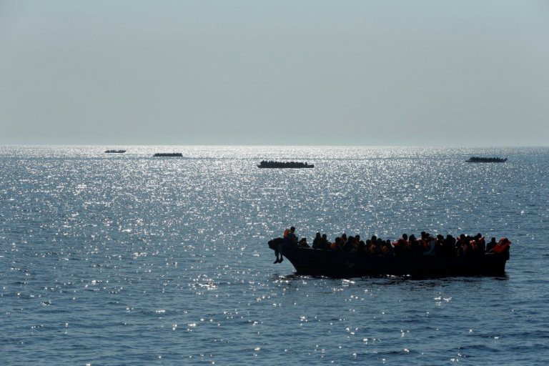
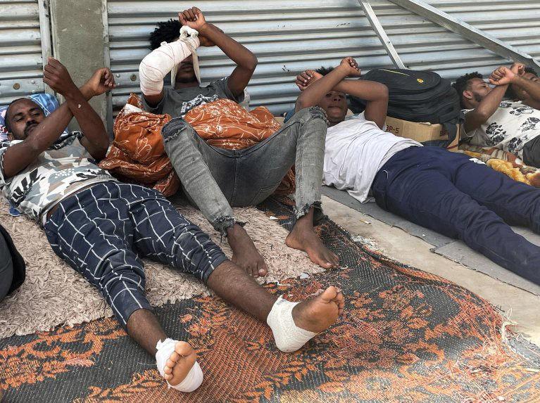

### AYS Digest 26/10/22: Call for Italy to revoke the 2017 Memorandum between the Libyan and Italian Governments

Serbia has halted visa\-free travel from Tunisia and Burundi/ Between 25th and 26th October, more than 1100 individuals were rescued in the Mediterranean/ NGOs and trade unions call for Italy to revoke the 2017 Memorandum between Libya and Italy/ An individual who desperately attempted to swim across the Channel was brought back to Calais, suffering from severe hypothermia/ Suella Braverman back in office/ and much more…

Source: InfoMigrants — Des embarcations de migrants en mer Mediterranee \(archive\) \. Credit: Reuters\.
#### GREECE
### Alarm Phone reports of a pushback they believe to be taking place this afternoon

At roughly 5pm Greek time, the GPS position of the boat showed that it had moved closer to Turkey, after the boat had been in contact with the Hellenic Coast Guard\.

■■■■■■■■■■■■■■ 
> **[Alarm Phone](https://twitter.com/alarm_phone) @ Twitter Says:** 

> > #PUSHBACK IN THE MAKING!? We are in contact with 29 people on a boat off the #Greek island of Euboea. Reportedly @[[HCoastGuard](https://twitter.com/HCoastGuard)](https://twitter.com/[HCoastGuard](https://twitter.com/HCoastGuard)) is with them, but when asked if they help, the people only reply:"No, they will bring us back".

@[[HCoastGuard](https://twitter.com/HCoastGuard)](https://twitter.com/[HCoastGuard](https://twitter.com/HCoastGuard)): Respect their rights, don't push them back! 

> **Tweeted at [2022-10-26 14:44:41](https://twitter.com/alarm_phone/status/1585281266689212418).** 

■■■■■■■■■■■■■■ 

#### SERBIA & HUNGARY
### Serbia has halted visa\-free travel from Tunisia and Burundi

After weeks of pressure from the EU, Serbia’s foreign minister notified the Tunisian embassy of this decision, which will come into effect on 20th November\.

The European Commissioner for Neighbourhood and Enlargement congratulated Serbia on the fact they have implemented a rule that fits with the EU’s perspective and approach to visa required third countries\.

This comes after weeks of EU\-fronted accusations that Belgrade has been directly pushing the rise in the number of migrants entering the EU due to Serbia’s visa\-free regulations with certain countries in Asia and Africa\. The idea is that often migrants enter Serbia and are then smuggled into neighbouring countries within the EU\.

[Serbia Ends Visa\-Free Regimes with Tunisia and Burundi \| Balkan Insight](https://balkaninsight.com/2022/10/25/serbia-ends-visa-free-regimes-with-tunisia-and-burundi/?fbclid=IwAR0pu-HtO-Cx6rEEP0WTPp9n23RLBar70FsEVhV2PI0WxQClZSNtQjJWT9E)

■■■■■■■■■■■■■■ 
> **[May Bulman](https://twitter.com/maybulman) @ Twitter Says:** 

> > Just got back from a few days on the Serbia-Hungary border, observing what's happening and speaking to some of the thousands of people - including families with young children - living in makeshift camps there and trying to cross to Hungary

A few thoughts/findings.. https://t.co/cNyVuPGWCf 

> **Tweeted at [2022-10-24 18:47:17](https://twitter.com/maybulman/status/1584617540247953408).** 

■■■■■■■■■■■■■■ 

#### SEA/SAR
### The Ocean Viking rescued 32 individuals in international waters, off Malta

■■■■■■■■■■■■■■ 
> **[SOS MEDITERRANEE](https://twitter.com/SOSMedIntl) @ Twitter Says:** 

> > #OceanViking evacuated 32 people from a 6 meter boat unfit for high seas, in international waters off Malta. They show high signs of exhaustion, dehydration &amp; severe burns after 3 days left at sea, without any food. 234 survivors are now being taken care of by @[SOSMedIntl](https://twitter.com/SOSMedIntl) &amp; @[ifrc](https://twitter.com/ifrc) https://t.co/ytlc2vaF9K 

> **Tweeted at [2022-10-26 19:15:52](https://twitter.com/sosmedintl/status/1585349510771134464).** 

■■■■■■■■■■■■■■ 

#### ITALY
### Between 25th and 26th October, more than 1100 individuals were rescued in the Mediterranean

The first rescue, by Diciotti, saved 416 individuals, whilst the second rescue, by the Italian Coast Guard, saved 663 individuals\.

Alarm Phone alerted the authorities about both boats\. According to their figures, they believe the number of individuals saved is as many as 1300\.

■■■■■■■■■■■■■■ 
> **[Alarm Phone](https://twitter.com/alarm_phone) @ Twitter Says:** 

> > 🆘! ~700 people in distress!!

We were alerted by a large wooden boat that left #Tobruk, #Libya, and is now in the SAR zones of #Malta and #Italy. Communication is difficult but we believe we heard they were 700 people on board! We urge authorities: launch a rescue operation!! https://t.co/oqXN5zXjTL 

> **Tweeted at [2022-10-25 06:18:49](https://twitter.com/alarm_phone/status/1584791573136494592).** 

■■■■■■■■■■■■■■ 

In placing these rescues within the current political context in Italy, the new Interior Minister, Matteo Piantedosi, aims to restrict the movements and activities of NGO ships trying to rescue asylum seekers at sea\. This is obviously a terrifying thought that could take the lives of thousands of individuals trying to seek safety\.

[Italie : plus de 1 100 migrants secourus en quelques heures en Méditerranée — InfoMigrants](http://www.infomigrants.net/fr/post/44291/italie--plus-de-1-100-migrants-secourus-en-quelques-heures-en-mediterranee?fbclid=IwAR0_RD49b75u3FMgSUHjGr5M9vgPiKx0Rb_xapUWKFAvRuE9eckvxv-i_8I)
### NGOs and trade unions call for the new government to revoke the 2017 Memorandum between Libya and Italy

This memorandum was implemented to combat irregular migration and human trafficking\.

The Italian government has until 2nd November to issue a suspension before it is automatically renewed for another three years\. It is a very dangerous memorandum, leading to the detention, torture, abuse, and exploitation of thousands of people\.

The collective of NGOs and unions have also questioned the European funds that are financing the Libyan coast guards\.

_Source: InfoMigrants; African migrants, some of them injured, sleep on the ground during a sit\-in to ask the international community to take them out of Libya, outside the UNHRC office in Tripoli, Libya, in October 2021 \| Photo: EPA_

> “The agreement, which was created with the objective of sending economic aid and support to Libyan coast guards to try to reduce migrant trafficking across the Mediterranean, fight illegal immigration and strengthen security at the border, did not reach any of the desired objectives” — Trade Unions 

[Italy: 40 NGOs, unions ask government to revoke Libya memorandum — InfoMigrants](https://www.infomigrants.net/en/post/44268/italy-40-ngos-unions-ask-government-to-revoke-libya-memorandum)
#### FRANCE
### An individual who, in desperation, attempted to swim across the Channel was brought back to Calais, suffering from severe hypothermia

A 22\-year\-old Nigerian male attempted to swim across the Channel to reach the UK, with a rucksack on his back\. He was quickly swept back to the beach by the waves, where people walking past alerted the authorities\.

Another individual had previously attempted to do the same thing in September and had been rescued by the local authorities\. A few individuals who had previously succeeded in swimming across the Channel, which is roughly 34 kilometres, had almost all been professional swimmers\.

[Un migrant qui tentait de traverser la Manche à la nage récupéré en état d’hypothermie — InfoMigrants](http://www.infomigrants.net/fr/post/44287/un-migrant-qui-tentait-de-traverser-la-manche-a-la-nage-recupere-en-etat-dhypothermie?fbclid=IwAR10G6AVaZBbrC2o25GkbdeQsjYd0acujTKJmxsOEMP2-ZRikOSj20FOv-o)

■■■■■■■■■■■■■■ 
> **[Utopia 56](https://twitter.com/Utopia_56) @ Twitter Says:** 

> > A Calais, l'instrumentalisation de la crise sanitaire du Covid-19 par @[Prefet62](https://twitter.com/Prefet62) aura coûté 20 000€ d'amendes à notre association. Leur fondement vient d'être jugé illégal par le tribunal de Lille. Explications de cette nouvelle victoire du principe de fraternité ⤵️ 

> **Tweeted at [2022-10-25 15:32:55](https://twitter.com/utopia_56/status/1584931017621934082).** 

■■■■■■■■■■■■■■ 

#### UK
### Suella Braverman back in office

Only a few days after Suella Braverman resigned for breaching the ministerial code, [Rishi Sunak has reinstated the hard\-right politician in her previous position of Home Secretary](https://www.independent.co.uk/news/uk/politics/suella-braverman-home-secretary-cruelty-b2210409.html) \.

Source: The Independent; Suella Braverman’s surprise return to Home Secretary was announced Tuesday evening

Ms\. Braverman’s drive to send asylum seekers to Rwanda, to alter human rights and modern slavery laws, and her general disregard for international human rights laws, makes her both a terrifying and an unsuitable candidate for such a powerful position in government\.

> “We need safe and legal routes, not deportation flights to foreign countries\. We need a fair and equitable visa system, not one which benefits from migrants’ wallets\. But mostly we need to build a society which respects all migrants as a vital part of our community\. 

> “With the appointment of the prime minister’s new cabinet we don’t see this happening\.” — spokesperson for the Migrant Voice campaign group 

### Home Affairs Select Committee held two evidence sessions 26th October regarding Channel crossings
- In 2022, 936 boats, carrying 38,000 people arrived in the UK across the Channel
- There is a very long backlog of asylum applications — only roughly 4% of those who arrive by boat in 2021 have received a decision on their claim
- Manston accommodation centre is currently holding roughly 3000 people, which is 1400 people over capacity\. The centre has had to hire non\-specialist staff to support the high numbers of people, which is highly concerning\.

You can read more here: [Home Affairs Select Committee oral evidence on Channel Crossings — Refugee Council response — Refugee Council](https://www.refugeecouncil.org.uk/latest/news/home-affairs-select-committee-oral-evidence-on-channel-crossings-refugee-council-response/)
### WORTH READING:
- Al Jazeera — Lebanon begins ‘voluntary’ repatriation of Syrian refugees

[Lebanon begins ‘voluntary’ repatriation of Syrian refugees \(msn\.com\)](https://www.msn.com/en-us/news/world/lebanon-begins-e2-80-98voluntary-e2-80-99-repatriation-of-syrian-refugees/ar-AA13oLBa)
- Institute of Race Relations — From GPS tagging to facial recognition watches: expanding the surveillance of migrants in the UK

[From GPS tagging to facial recognition watches: expanding the surveillance of migrants in the UK — Institute of Race Relations \(irr\.org\.uk\)](https://irr.org.uk/article/from-gps-tagging-to-facial-recognition-watches-expanding-the-surveillance-of-migrants-in-the-uk/)
- France 24 — Palestinians in crisis\-hit Lebanon plunge deeper into poverty: UN

[Palestinians in crisis\-hit Lebanon plunge deeper into poverty: UN \(france24\.com\)](https://www.france24.com/en/live-news/20221026-palestinians-in-crisis-hit-lebanon-plunge-deeper-into-poverty-un)
- The Guardian — The world has left Bangladesh to shelter 1m Rohingya refugees alone, says minister

[World has left Bangladesh to shelter 1m Rohingya refugees alone, says minister \| Global development \| The Guardian](https://www.theguardian.com/global-development/2022/oct/26/world-has-left-bangladesh-to-shelter-1m-rohingya-refugees-alone-says-minister)

**Find daily updates and special reports on our [Medium page](https://medium.com/are-you-syrious) \.**

**If you wish to contribute, either by writing a report or a story, or by joining the Info Gathering team, please let us know\!**

**We strive to echo correct news from the ground through collaboration and fairness\. Every effort has been made to credit organisations and individuals with regard to the supply of information, video, and photo material \(in cases where the source wanted to be accredited\) \. Please notify us regarding corrections\.**

**If there’s anything you want to share or comment, contact us through Facebook, Twitter or write to: areyousyrious@gmail\.com**

_Converted [Medium Post](https://medium.com/are-you-syrious/ays-digest-26-10-22-call-for-italy-to-revoke-the-2017-memorandum-between-the-libyan-and-italian-c84b456a4a36) by [ZMediumToMarkdown](https://github.com/ZhgChgLi/ZMediumToMarkdown)._
