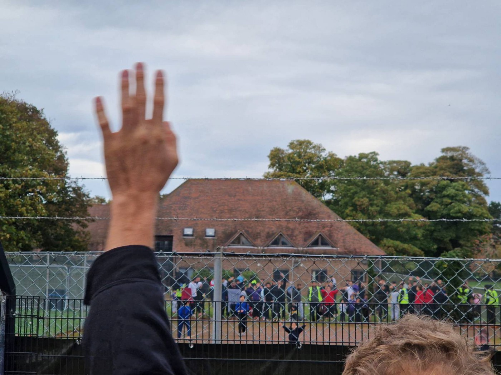

### AYS News Digest 01/11/2022: Limbo at Sea as safe ports refused by Italy and Malta
#### Unacceptable overcrowding at Manston detention facility in the UK, and Channel Crossings put in perspective // Pushback of 110 people feared in the Aegean // Turkey has deported 97,448 refugees this year // ‘Possible abuses’ being investigated at Baanstee\-Noord emergency shelter in The Netherlands // Tensions with Germany over border controls in Switzerland // EU drafts a plan to ‘voluntarily’ share the influx of migration // Evictions at La Chapelle and Utopia 56 intimidated // Iuventa crew has hearing postponed, again & much much more
#### FEATURE FROM THE MEDITERRANEAN
#### Limbo at Sea — Safe ports in Italy and Malta being refused to NGO rescue ships

Credit: Max Cavallari / SOS Humanity

Days after first requesting a POS \(Port of Safety\), with 11 requests now made, Malta and Italy have still not given a positive response to Humanity 1’s request to land\. A seven\-month\-old\-baby and 100 unaccompanied minors are amongst those on board\.

■■■■■■■■■■■■■■ 
> **[SOS Humanity (international)](https://twitter.com/soshumanity_en) @ Twitter Says:** 

> > There is still no allocation of a place of safety for the 179 rescued people on board our rescue ship after 11 requests by the captain of the #Humanity1.

All information on the current situation in our press release:
[sos-humanity.org/en/press/179-s…](https://sos-humanity.org/en/press/179-survivors-on-board-humanity-1-sos-humanity-urgently-calls-for-a-place-of-safety/) 

> **Tweeted at [2022-10-31 10:32:43](https://twitter.com/soshumanity_en/status/1587029795082321926).** 

■■■■■■■■■■■■■■ 

■■■■■■■■■■■■■■ 
> **[maydayterraneo](https://twitter.com/maydayterraneo) @ Twitter Says:** 

> > 🔴 3 largos días sobreviviendo a la crudeza del mar tras escapar de un país en guerra. 8 días a bordo alargando un sufrimiento innecesario. Personas inocentes y vulnerables necesitan un puerto seguro. ¿Cuánto tiempo más 🇪🇺? 

> **Tweeted at [2022-10-30 13:00:27](https://twitter.com/maydayterraneo/status/1586704585946812416).** 

■■■■■■■■■■■■■■ 

The medical conditions of those on board are serious\. One individual was airlifted on 27/10, and a flu\-like infection has been spreading\. _SOS Humanity_ report that [_“Several of the survivors carry traces of violence they suffered on their journey, including wounds from gunshots and beatings\.”_](https://sos-humanity.org/en/press/179-survivors-on-board-humanity-1-sos-humanity-urgently-calls-for-a-place-of-safety/)

MSF’s ship — the Geo Barents — rescued 268 people within four hours, from four different vessels, within Malta’s SAR zone\. The Maltese government’s inaction is becoming habit, and MSF write that:

> “We are outraged that the Armed Forces of Malta has neglected its legal obligation to coordinate the rescues and provide assistance, even though the relevant authorities have been informed from the very first moment\.” 

Whilst temporarily safe aboard the Geo Barents, the lack of allocated safe ports is becoming a worrying feature of NGO rescues in the Mediterranean — workers aboard the ship come under increasing pressure as time goes on: supplies dwindle, medical needs increase and fatigue sets in\. Furthermore, the time delays before landing enforced by EU nations not only acutely impact all those on board, but restrict the availability humanitarian vessels have to complete rescues, and subsequently restricts the number of people they might reach\.

> “There are currently another two other humanitarian vessels with hundreds more irregular migrants who were rescued in international waters between Libya and Malta — SOS Méditerranée’s Ocean Viking with 234 on board and SOS Humanity’s Humanity 1, which is carrying 180 rescued people aboard\. None of the ships have, however, been able to make port anywhere nearby as of Sunday afternoon\. 

> MSF’s Geo Barents was west of Malta and south of Sicily, the Ocean Viking was west of Malta and south of Sicily and the SOS Humanity was well north of Malta and east of Sicily with, between then, hundreds of rescued irregular migrants aboard needing to reach terra firma to receive proper care\.” 

With Giorgia Meloni’s more right\-wing Italian government in power, Italy is once again closing its ports to NGO ships\. This happened before, between 2018 and 2019, when there were **[“major standoffs between the Maltese and Italian governments over responsibility for rescued irregular migrants\.”](https://theshiftnews.com/2022/10/31/msf-appalled-outraged-by-maltas-inaction-in-its-search-and-rescue-zone/)**

On Twitter, Matteo Salvini wrote \(referring to Ocean Viking and Humanity 1\) that: “The first has a Norwegian flag while the second is German\. Let NGOs set course for their countries, not Italy\.”

The deflection of humanitarian obligations in the Mediterranean SAR zone is reflective of an overall trend, with Italy following Malta’s stance of non\-action: choosing to look away\. As pressure increases on asylum reception systems in Europe and humanitarian operations at sea, the answer to the question of ‘what happens next?’ looks increasingly frightening\.

Read more below:

[**Malta and Italy accused of delaying SOS request for rescued migrants**](https://famagusta-gazette.com/2022/10/31/malta-and-italy-accused-of-delaying-sos-request-for-rescued-migrants/?fbclid=IwAR3xgEHUUR8CDv2-vXfh6sHd2drLKaB6EhZq54hRDNerdRzkplKnhFbtaoQ) 
[_For more than a week, the rescue ship Humanity 1 has been waiting for a place of safety for 179 people rescued from…_ famagusta\-gazette\.com](https://famagusta-gazette.com/2022/10/31/malta-and-italy-accused-of-delaying-sos-request-for-rescued-migrants/?fbclid=IwAR3xgEHUUR8CDv2-vXfh6sHd2drLKaB6EhZq54hRDNerdRzkplKnhFbtaoQ)

#### FEATURE FROM THE UK
#### Unacceptable conditions at Manston detention centre in Kent

Credit: SOAS Detainee Support

The UK government is reportedly forcing 3,000 men, women and children to sleep in shared space, many on the floor, without sufficient medical care\. [Solidarity activists have heard chants of “freedom” and “we need your help” coming from inside the detention facility\.](https://twitter.com/BennnyH/status/1586776933685231618) People from Syria, Afghanistan, Pakistan, Iran and Sudan have been held for between 3 and 50 days, with no access to doctors or lawyers\.

■■■■■■■■■■■■■■ 
> **[SOAS Detainee Support (SDS)](https://twitter.com/sdetsup) @ Twitter Says:** 

> > Dozens of young children are being held at Manston detention camp in Kent.

Mothers, fathers, children and babies from Syria, Iraq, Afghanistan, Pakistan and elsewhere.

We went today and heard them chanting for their freedom.

This is persecution. FREE THEM AND CLOSE IT DOWN. https://t.co/3lWbGQT5LB 

> **Tweeted at [2022-10-30 17:43:08](https://twitter.com/sdetsup/status/1586775725763428352).** 

■■■■■■■■■■■■■■ 

Following the petrol bombing of an asylum facility in Dover, 700 more people arrived at Manston on 31/10\. The BBC has reported that numbers have reached 4,000 people, whilst the official capacity is capped it 1,600\.

SOAS Detainee Support

_LBC News_ reports that Suella Braverman is guilty of breaching UK law:

> “The processing centres have now suffered a breakout of the bacterial disease dipthheria, as well as the skin condition scabies” 

and this is the direct result of legal violations: under UK law, detention is limited to 24 hours whilst asylum seekers are processed and undergo ‘initial checks\.’

> “They can only hold someone if there is a reasonable prospect of their removal from the country in a sensible timeframe\. She was refusing to sign off on bail or pay for hotels which means she was illegally detaining people\. There is no legal grounds for them to be detained\. 

> Officials have been put in an impossible position because they can’t release people without Suella releasing the money\. This has been going on for more than three weeks\.” 

More here from [_LBC_](https://www.lbc.co.uk/news/suella-braverman-ignored-advice-that-she-was-breaking-the-law-by-keeping-migrant/?fbclid=IwAR1_aeT-dHaao8AGMbnewVKqlddK16DchhrIJUIB_Az04DaupWXpAYymNis) \.
#### PROTESTS

‘Close Down Mansion Detention Centre’ — Protest on 2nd November 2022 at 7PM\. Details below:
<<<<<<< HEAD

[**CLOSE DOWN MANSTON DETENTION CENTRE**](https://www.facebook.com/events/480982047330197/) 
[_Asylum seekers are being held in shocking conditions of overcrowding, with communicable diseases being allowed to…_ www\.facebook\.com](https://www.facebook.com/events/480982047330197/)
=======

>>>>>>> b8646ca (updates)

Protest on Sunday 6th November at 2PM:

#### **Man attacks immigration facility with petrol bombs in Dover**

Credit: Reuters

The overcrowding at Manston follows an attack on a UK processing centre for asylum seekers\. On 30/10, a man threw petrol bombs at the centre near Dover before killing himself\. The motive for the attack is unknown, but comes at a time where the UK’s public discourse around migration has become increasingly polarised\. Oly yesterday, [Home Secretary Suella Braverman absurdly and dangerously referred to immigration to the UK as an “invasion”](https://www.theguardian.com/uk-news/2022/nov/01/bravermans-invasion-claim-not-backed-by-facts-say-experts) \.
#### Channel Crossings: In Perspective

_Freemovement_ has looked through the data on immigration to the UK, and illustrates how the front\-page status of small boat irregular immigration is twisted into a political issue\.

> “It turns out that over the last year, only one quarter \(26% to be precise\) of refugee arrivals into the UK were by small boats, lorries or other spontaneous means\.” 

> “Let’s stop pretending we’re too full up or we can’t cope\. We take far fewer applications than comparable countries\. If we can set up schemes for Hong Kongers and Ukrainians that actually welcome far more people than arrive from the rest of the world combined, why can’t we extend those schemes to others and offer proper safe and legal routes of entry?” 

Full article [here](https://freemovement.org.uk/putting-small-boat-crossings-in-perspective/?fbclid=IwAR0SG5512iOGjKI7PIEJC1kn7SVOyuNb5l-pjTBSltAZlYxjkWJ6R8xQVcE) \.

This infographic speaks for itself: the backlog is not a correlative of an increase in arrivals\. So what has caused it?

■■■■■■■■■■■■■■ 
> **[Colin Yeo](https://twitter.com/ColinYeo1) @ Twitter Says:** 

> > Here's a chart for those who say the asylum backlog is due to the large number of asylum claims. Figures include dependents. https://t.co/HtffXA4kJ0 

> **Tweeted at [2022-10-31 11:49:07](https://twitter.com/colinyeo1/status/1587049020345786370).** 

■■■■■■■■■■■■■■ 

The UK Government’s response to the Home Affairs Committee’s [report](https://committees.parliament.uk/publications/23102/documents/169178/default/?fbclid=IwAR1URAf-H35m2u8zVpJftHmYdH5tqP9RY0_-i6kxvvPQyFICZq45KsIH58w) ‘Channel crossings, migration and asylum’ is available [here](https://committees.parliament.uk/publications/30524/documents/176109/default/?fbclid=IwAR1RUKjN-wX8GRMgxT7NRC5lm4BKbqF3CJZk1Xx4WEMUXrlRTqIWlwnuXq8) \.

■■■■■■■■■■■■■■ 
> **[Nando Sigona](https://twitter.com/nandosigona) @ Twitter Says:** 

> > Irregular crossings of the English Channel are not an  accident but a direct consequence of #Brexit &amp; the renationalisation of UK borders. The #Rwandaplan may be #SuellaBraverman's dream but is not a solution -even if you look at it from an anti-immigration perspective. #Dover 

> **Tweeted at [2022-10-31 08:57:21](https://twitter.com/nandosigona/status/1587005796629479424).** 

■■■■■■■■■■■■■■ 

This is also worth reading: The Institute for Public Policy Research \(IPPR\) has recently found that 70 per cent of people who had arrived in Britain in small boats via the English Channel since 2018 could have been granted asylum if their claims were properly considered\.
<<<<<<< HEAD

[**Most refugees arriving on boats win asylum claims**](https://www.voice-online.co.uk/news/uk-news/2022/10/29/two-thirds-of-refugees-arriving-on-boats-have-asylum-claims-approved/?fbclid=IwAR3uYGZJ9CVKXQLq91TeL3b12mVJ2HwxFECk_wvoEHrXSqfHoUp85nK_mUU) 
[_MOST REFUGEES fleeing their home countries to the UK on small boats could have successful claims for asylum if they…_ www\.voice\-online\.co\.uk](https://www.voice-online.co.uk/news/uk-news/2022/10/29/two-thirds-of-refugees-arriving-on-boats-have-asylum-claims-approved/?fbclid=IwAR3uYGZJ9CVKXQLq91TeL3b12mVJ2HwxFECk_wvoEHrXSqfHoUp85nK_mUU)
=======

>>>>>>> b8646ca (updates)
#### Ukrainian refugees fear homelessness in the UK

By next year, thousands of Ukrainian refugees in the UK might find themselves homeless\. The ‘Homes for Ukraine’ scheme has a minimum of six months \(soon to run out\), and one estimate predicts that 50,000 Ukrainian refugees will subsequently be made homeless\.

The scheme currently pays hosts £350 as a ‘thank you’ payment each month, but as the scheme runs out many households may find themselves unable to support Ukrainians without financial aid\.

Read and watch more below:

#### SEARCH AND RESCUE

■■■■■■■■■■■■■■ 
> **[Sea-Watch International](https://twitter.com/seawatch_intl) @ Twitter Says:** 

> > (CN: Dead)
Last week, almost daily, dead bodies arrived on #Lampedusa. Among them, two babies burned to death. Two more infant twins died of starvation, while rescue came too late. https://t.co/t7CUSgcok3 

> **Tweeted at [2022-10-28 14:54:21](https://twitter.com/seawatch_intl/status/1586008475435687939).** 

■■■■■■■■■■■■■■ 

#### Pushback of 110 people feared in the Aegean

Aegean Boat Report \(ABR\) have been following a group of people, mostly Afghan families, whose boat broke down in the Ionian sea between Greece and Italy\. A rescue recorded the people being towed towards the Greek village of Foinikounta, but all data and location sharing ended abruptly 550m from the shore\.

There has been no confirmation of any rescue in the area yet from HCG \(Hellenic Coastguard Greece\), and ABR are increasingly worried by the lack of information available 24 hours after the rescue operation began\. No contact with anyone onboard has been confirmed yet\.

All information from ABR is here:
<<<<<<< HEAD

[**登录或注册即可查看**](https://www.facebook.com/AegeanBoatReport/posts/pfbid02zmwBtEhEBMbeDe1PQCtymdSuvfLZRcBFVrxkUMr3nT5eRs2WGZsYmw3uZEL7eQCVl) 
[_到 Facebook 查看帖子、照片和更多内容。_ www\.facebook\.com](https://www.facebook.com/AegeanBoatReport/posts/pfbid02zmwBtEhEBMbeDe1PQCtymdSuvfLZRcBFVrxkUMr3nT5eRs2WGZsYmw3uZEL7eQCVl)
=======

>>>>>>> b8646ca (updates)
#### 150 people rescued by a merchant vessel have landed in Trapani, Sicily

■■■■■■■■■■■■■■ 
> **[Sea-Watch Italy](https://twitter.com/SeaWatchItaly) @ Twitter Says:** 

> > Felici per lo sbarco a Trapani delle 150 persone salvate dal cargo Christina V battente bandiera delle Isole Marshall.

Chiediamo che la stessa giusta accoglienza sia riservata alle persone al momento a bordo di #OceanViking, #Humanity1 e #GeoBarents
 [tp24.it/2022/10/30/imm…](https://www.tp24.it/2022/10/30/immigrazione/a-trapani-un-cargo-con-150-persone-salvate-in-mare/183238) 

> **Tweeted at [2022-10-30 10:29:47](https://twitter.com/seawatchitaly/status/1586666669442842625).** 

■■■■■■■■■■■■■■ 

Sea Watch hopes that humanitarian ships will receive a similar welcome, after months in which the allocation of safe ports has been slow to arrive for humanitarian vessels and further endangered the lives of those rescued at sea through such lengthy deliberation\.
#### 50 people in danger off Sicily have now been taken aboard an Italian Coastguard vessel and ashore

■■■■■■■■■■■■■■ 
> **[Alarm Phone](https://twitter.com/alarm_phone) @ Twitter Says:** 

> > 🆘 ~50 people in danger off #Sicily!
Early this morning we received a distress call from about 50 people, many in bad medical condition. They left #Benghazi 5 days ago and are now 90nm off Sicily. Their engine is broken and they have no food and water left. 
Rescue is needed now! https://t.co/VaGw8f22TY 

> **Tweeted at [2022-10-30 10:07:58](https://twitter.com/alarm_phone/status/1586661179736395777).** 

■■■■■■■■■■■■■■ 

#### 8 people rescued north of Samos, Greece

ABR, unusually, have written that,

> “It’s encouraging to see Greek coast guard performing their duties, in accordance to international laws and obligations, without political interference, this is how it’s supposed to be\. Kudos to personnel from HCG ΛΣ\-142 and Italian Frontex for a job well executed\.” 

It’s worth noting that the quality and availability of footage for this particular rescue is, however, not something that ABR nor the general public have access too… If only such transparency was the norm\. See below for footage\.

<<<<<<< HEAD

[**登录或注册即可查看**](https://www.facebook.com/AegeanBoatReport/posts/pfbid08W8nRCHXEMwMR95hxdqMiLmRY3LeWBSDSQ9CDV6v5iFnTxbcbmi2EBfoKCqEDAzQl) 
[_到 Facebook 查看帖子、照片和更多内容。_ www\.facebook\.com](https://www.facebook.com/AegeanBoatReport/posts/pfbid08W8nRCHXEMwMR95hxdqMiLmRY3LeWBSDSQ9CDV6v5iFnTxbcbmi2EBfoKCqEDAzQl)
=======

>>>>>>> b8646ca (updates)
#### TURKEY
#### Turkey has deported 97,448 refugees this year

Deportations from Turkey have increased by 149% since January 2021, and since 2016 422,957 people have been deported\.

_“Along the Türkiye\-Iran border, stretching 534km, a 295km long wall is being constructed to prevent the irregular entry of migrants\. Mainly Afghans and Pakistanis travel on foot along the borders with Iran to enter Türkiye\. Along the 911km long Türkiye\-Syria border, an 837km wall was finished in 2018\._

_Türkiye hosts the largest refugee population in the world, with a total of around 4 million people\. On October 24, the HRW \(Human Rights Watch\) claimed that authorities in Türkiye arbitrarily arrested, detained, and deported hundreds of men and boys to Syria between February and July\. According to the organization, Türkiye does not meet the EU’s safe third country criteria for refugees\.” —_ More [here](https://bianet.org/english/migration/269256-turkiye-has-deported-over-97-000-refugees-so-far-this-year-says-ministry?fbclid=IwAR2KTFd8-QCp4HVX6FXqqGJPyoVAgBAJoUMVXtmyrXKDsEnKEMB0IQPREhk) \.
#### ITALY
#### Iuventa crew has hearing postponed, again

The Iuventa’s crew rescued over 14,000 people from unseaworthy vessels from 2016 to 2017\. Now 4 crew members are on trial, charged by Trapani/Italy with “aiding and abetting illegal migration\.” The accusations came to court first in 2022, and trials are on\-going\.

> “On 29 October 2022 we are in Trapani, and once again the hearing has been postponed … and not due to unforeseen events or new evidence, nor for a change in the policy of criminalizing solidarity — no, once again a defendant was not properly invited to a meeting relevant to the proceedings, once again the sloppiness and ignorance of the Prosecutor’s Office led to a delay in the trial\. This shows how easy it is to keep a trial alive, thus maintaining an intimidating effect on the civilian fleet, even if a conviction cannot be obtained\.” 

■■■■■■■■■■■■■■ 
> **[iuventa-crew](https://twitter.com/IuventaCrew) @ Twitter Says:** 

> > AGAIN ANOTHER POSTPONEMENT! 

Again a postponement, again due to delays of the prosecution. Since our ship was seized 5 years ago people on the move continue to die every day off our coasts.

Our solidarity does not stop, we will continue our fight in and out of court! https://t.co/i0BwMhX9IC 

> **Tweeted at [2022-10-29 15:38:10](https://twitter.com/iuventacrew/status/1586381888679280641).** 

■■■■■■■■■■■■■■ 

#### UKRAINE
#### Over six million Ukrainian refugees have returned home, despite being asked not to by Ukrainian officials

Iryna Vereshchuk, Ukraine’s deputy PM, said on Tuesday that, “to return now is to risk yourself and your children, your vulnerable relatives\.”

In spite of warnings as to the war’s continuing impact, many Ukrainians remain undeterred in their desire to return\.

Over 7\.75 million Ukrainian refugees have been registered across Europe since Russia invaded Ukraine in February\. [A further 2\.9 million refugees have been recorded in Russia as of October 3, 2022\.](https://www.statista.com/statistics/1312584/ukrainian-refugees-by-country/?fbclid=IwAR3ydQH1oOLpKkIvcZmV_5wir1-Zr0m_TZtpoIZH6FqWm3Q_Oa6h8MufG6g)
#### EU GENERAL
#### EU drafts a plan to ‘voluntarily’ share the influx of migration

The EU is discussing a proposal for countries to voluntarily relocate a minimum of 5,000 or 10,000 migrants a year\. Previous attempts to set up a mandatory distribution system were blocked by opposition in Central European nations\.

[_Politico_ report:](https://www.politico.eu/article/eu-migration-plan-share-migrant-influx-voluntary/?fbclid=IwAR0pTAEasZE325ZHLjie_7s_RQTucOjnhFJ7-PNwesWkYtwqP_-gmX4C4CA)

> The proposal is set in the framework of “flexible solidarity,” allowing each country to decide whether to take in asylum seekers or offer financial help to countries facing a migration influx\. 

> Under existing law, asylum seekers are required to submit their applications with the first EU country they set foot in\. If they then move within the EU, these migrants can be sent back to that first EU country\. But exemptions for countries facing a large wave of migration are already under consideration\. And the document keeps open the possibility of introducing these exemptions if the Commission cannot find enough volunteers to accept the desired level of asylum seekers\. 

> So far, Mediterranean countries, the main EU access point for migrants arriving from Africa and the Middle East, have welcomed the Czech proposal, according to an EU official\. But countries like Belgium or the Netherlands, desired spots to move once within the EU, are less in favour _\._ 

The policy will be discussed until the end of November\.

More [here](https://euobserver.com/migration/156344?fbclid=IwAR0U-0yPFdFLBGhBIupqDszVgj6fO0JKYgMJZ4pMiX1pX5mXaqe7tJHfqxk) \.
#### THE NETHERLANDS
#### ‘Possible abuses’ being investigated at Baanstee\-Noord emergency shelter, which opened less than a month ago on 5th October 2022

A tented camp for 450 asylum seekers in Purmerend\. Credit: Cees Hartman\.

Testimonies from residents and former staff at the emergency shelter on Baanstee\-Noord were so alarming that the council has launched an investigation, as well as an independent investigation\. Threats, corruption, abuses of power and discrimination have all been reported\.

This comes after reports of dire conditions this summer at the Ter Apel camp in the centre of the Netherlands, [which failed to meet EU standards according to a ruling by Dutch judges\.](https://globeecho.com/news/europe/germany/refugees-in-the-netherlands-eating-and-drinking-on-bare-ground/?fbclid=IwAR3HCOMxTpq43lZISadhs03gFKuGHGoXIV3zixDV2-Us59NQpUE51zBtJTg)

Reports of people eating, drinking and sleeping rough outside the camp have been attributed to a financial cuts by the Dutch refugee agency, with Martijn van der Linden stating that:

> “In recent years, the Netherlands has cut staff and reception places, which has led in particular to the system becoming full\.” 

More [here](https://globeecho.com/news/europe/germany/refugees-in-the-netherlands-eating-and-drinking-on-bare-ground/?fbclid=IwAR3HCOMxTpq43lZISadhs03gFKuGHGoXIV3zixDV2-Us59NQpUE51zBtJTg) \.
#### POLAND
#### Pushbacks ruled unlawful in Polish Court

On a daily basis, violating international law, Polish border guards pushback asylum seekers attempting to cross the Polish\-Belarus border\. _Human Rights Watch_ report:

> “However, a Warsaw court has renewed hope that this practice might end by ruling a November expulsion order to be unlawful\. 

> The case, brought by the Polish Helsinki Foundation for Human Rights using reports from Human Rights Watch and other nongovernmental organizations, concerned a Syrian man who, after being hospitalized in Poland, was returned to the Belarus border\. On the basis of a summary expulsion order, he was forced back to Belarus, where he faced serious human rights abuses, including beatings, rape, and restriction on his movement\. The court noted that border guards denied the Syrian man his express wish to apply for asylum in Poland\.” 

Full article [here](https://www.hrw.org/news/2022/06/27/polish-court-rules-pushback-asylum-seekers-unlawful?fbclid=IwAR2BR8JQQrAIzvMpBw_qYkDssoW5g8GQ0NXpHimG661DioKTJpobc38ctr4) \.
#### GERMANY
#### Regional councils struggle without help from the central government

1 million Ukrainian refugees have been registered in Germany, as of October 8, 2022\. Whilst housing is often not an issue, local councils are struggling with the educational and medical demands of incorporating people into the local school and healthcare systems\.

Centralised distribution of funding means that certain areas go significantly under\-funded, and in Cottbus, the mayor has accused the government of leaving them in the lurch: [_“Rich Germany can do everything, but that money is not spread around evenly_ \.”](https://www.dw.com/en/ukrainian-refugees-push-german-cities-to-their-limits/a-63582661?fbclid=IwAR2BR8JQQrAIzvMpBw_qYkDssoW5g8GQ0NXpHimG661DioKTJpobc38ctr4)

More here:

#### AUSTRIA
#### Actively discouraging immigration through externalisation and hostile reception

Austria’s role in border externalisation policies has been documented in [this publication](https://www.transform-network.net/fileadmin/user_upload/epaper_at_the_heart_of_fortress_europe_final.pdf) , which notes:

> In 2021, a parliamentary request for information specifically focussed on Austria’s plans to return people to the states of the Western Balkans, while another asked specific questions about the role of BiH\. One line of argument used by the interior minister in these documents is to strengthen the fact that Austria is ‘only’ providing good practice, expertise and training, while the country concerned voices specific needs and is, in the end, responsible for ensuring that the human rights of those concerned will be upheld\. This is a common rhetorical practice in the context of EU border externalisation policies, with EU countries only providing knowledge and equipment, while ‘accession’ countries in the Balkans have to fulfil the dark side of Europeanisation\. 

Read more below about the un\-welcome, hostile environment Austria has created, which forced 16 young asylum seekers to protest against poor conditions by hunger striking:

<<<<<<< HEAD

=======

>>>>>>> b8646ca (updates)

#### SWITZERLAND
#### Tensions with Germany over border controls

German authorities have criticised Switzerland for allowing migrants to transit to neighbouring countries instead of sending them back to the first safe country of arrival as demanded by European accords\.

A spokesperson for the German government has said that “Switzerland must fulfil its obligations as a member of the Schengen area and take action against illegal migration”\.

Full article [here](https://www.swissinfo.ch/eng/switzerland-criticised-for--waving-through--migrants/48017188?fbclid=IwAR09R1HtRTJ1LRZklu3qkpovqk8ZjLLCvGk9wvlhID1PH3Z8csz8lH7Akng) \.
#### FRANCE
#### Evictions at La Chapelle, Paris, put over 200 people on the street for three nights now, as Utopia 56’s volunteers are intimidated by police

Following a heavy handed \(see below\) eviction on 28th October 2022, more than 200 hundred people remain on the street\.

■■■■■■■■■■■■■■ 
> **[Utopia 56](https://twitter.com/Utopia_56) @ Twitter Says:** 

> > Il est 7h00, suite a l’expulsion de La Chapelle à Paris. @[prefpolice](https://twitter.com/prefpolice) continue le harcèlement sur les 450 personnes laissées sans solution. Nombre d’entre elles ont fuit la guerre pour ne trouver ici que le non-accueil et la violence. 
Pays des droits de l’Homme vous dites ? https://t.co/dqxPihWC9X 

> **Tweeted at [2022-10-28 06:04:51](https://twitter.com/utopia_56/status/1585875222036619266).** 

■■■■■■■■■■■■■■ 

Prevented from returning to their old camp, the French policy of ‘errance’ \(wandering\) is essentially one of enforced, persecuted homeless\-ness\.

■■■■■■■■■■■■■■ 
> **[Utopia 56](https://twitter.com/Utopia_56) @ Twitter Says:** 

> > La Chapelle - Jour 3 : plus de 200 personnes exilées toujours sur les trottoirs, empêchées d’accès a l’ancien campement par @[prefpolice](https://twitter.com/prefpolice) . Cette politique de l’errance doit s’arrêter là @[GDarmanin](https://twitter.com/GDarmanin) . Un accueil digne est possible, il commence par une mise à l’abri immédiate. https://t.co/sS80hyfLmP 

> **Tweeted at [2022-10-29 14:42:38](https://twitter.com/utopia_56/status/1586367911362379778).** 

■■■■■■■■■■■■■■ 

> _Utopia 56 write that:_ 

> “A dignified welcome is possible, it begins with immediate shelter\.” 

The violent treatment surrounding people on the move is being extended to volunteers\. On 29th October, volunteers for Utopia 56 were forced to lie on the ground by the police, being shouted out and threatened\. These are calculated acts of intimidation\.
#### SPAIN
#### Olympic Refuge Foundation and IOC Refugee Olympic Team receive the 2022 Princess of Asturias Award for sports

Founded in 1981, the Princess of Asturias Awards aim to foster [“scientific, cultural and humanistic values that form part of the universal heritage of humanity\.”](https://www.fpa.es/en/princess-of-asturias-awards/)

The first ever Refugee Olympic Team \(ROT\) was founded in 2015, and at Tokyo 2020 the team comprised of 29 athletes competing in 12 sports\. The ROT will also compete at Paris 2024, and the Olympic Refuge Foundation continues to run 13 programmes globally \(in Congo, Jordan, Kenya, Mexico, Rwanda, Turkey and Uganda\) that aim to improve well\-being and social inclusion for refugee populations\.

IOC President, Thomas Bach, said on receiving the award that:

> “this is why the IOC created the Refugee Olympic Team\. These athletes had no flag, no anthem and no home anymore\.” 

#### **WORTH READING**
- In January 2014, 11 people died off the island of Farmakonisi while being towed by the Greek Coastguard\. The survivors complain, but little happens\. Only in 2022 will the Human Rights Court condemn Greece on all central points\. The case shows how PRO ASYL and its partners have been fighting for justice for years\.

<<<<<<< HEAD

=======

>>>>>>> b8646ca (updates)

- On the Move in Pursuit of Peace — A South Sudanese man recounts a life of continued displacement

- Niger: analysis of a “humanitarian border” — Interview with Silvia Pitzalis and Fabio De Blasis, research fellows at the University of Urbino

<<<<<<< HEAD

=======

>>>>>>> b8646ca (updates)

- Podcast: Migrant Smuggling’s Human and Political Effects

- Europe’s ‘shadow army’: Refugees forced to join gangs to patrol borders

- Brief informative and emotive piece on Lampedusa’s status as a “hotspot” for refugees rescued from surrounding waters

**Find daily updates and special reports on our [Medium page](https://medium.com/are-you-syrious) \.**

**If you wish to contribute, either by writing a report or a story, or by joining the Info Gathering team, please let us know\!**

**We strive to echo correct news from the ground through collaboration and fairness\. Every effort has been made to credit organisations and individuals with regard to the supply of information, video, and photo material \(in cases where the source wanted to be accredited\) \. Please notify us regarding corrections\.**

**If there’s anything you want to share or comment, contact us through Facebook, Twitter or write to: areyousyrious@gmail\.com**

_Converted [Medium Post](https://medium.com/are-you-syrious/ays-news-digest-01-11-2022-limbo-at-sea-as-safe-ports-refused-by-italy-and-malta-unacceptable-9b06c8812614) by [ZMediumToMarkdown](https://github.com/ZhgChgLi/ZMediumToMarkdown)._
