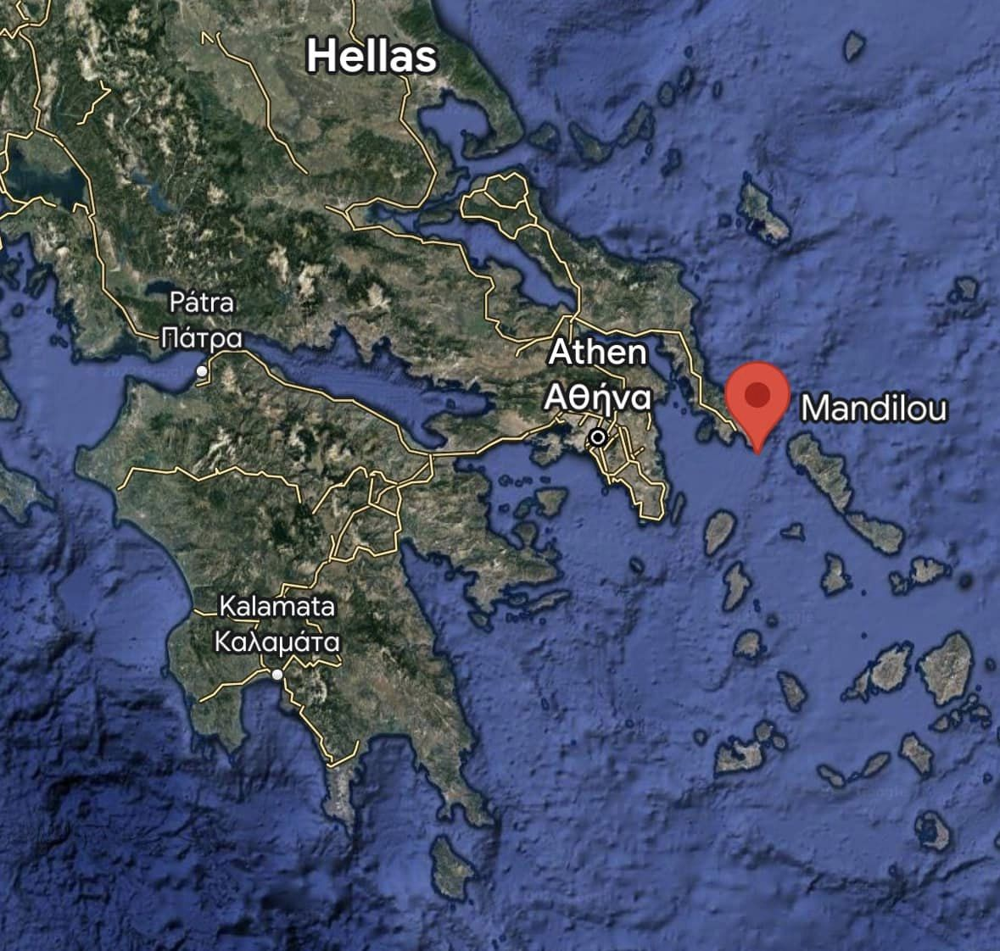
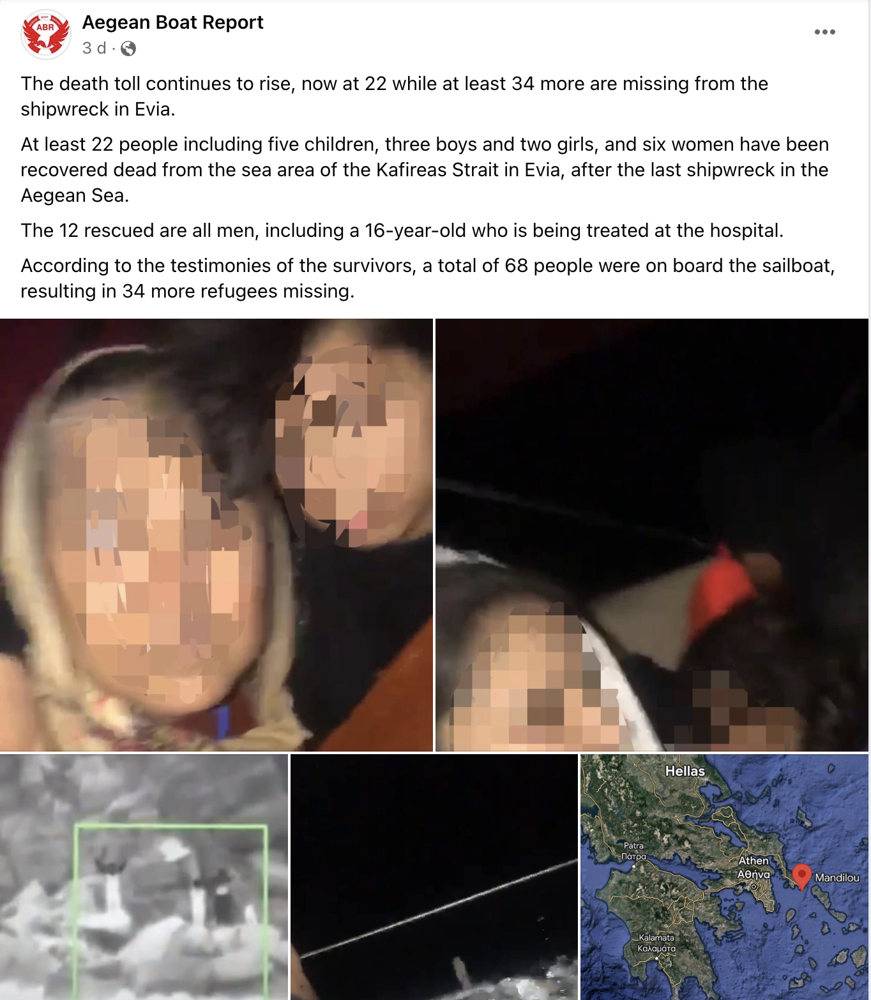
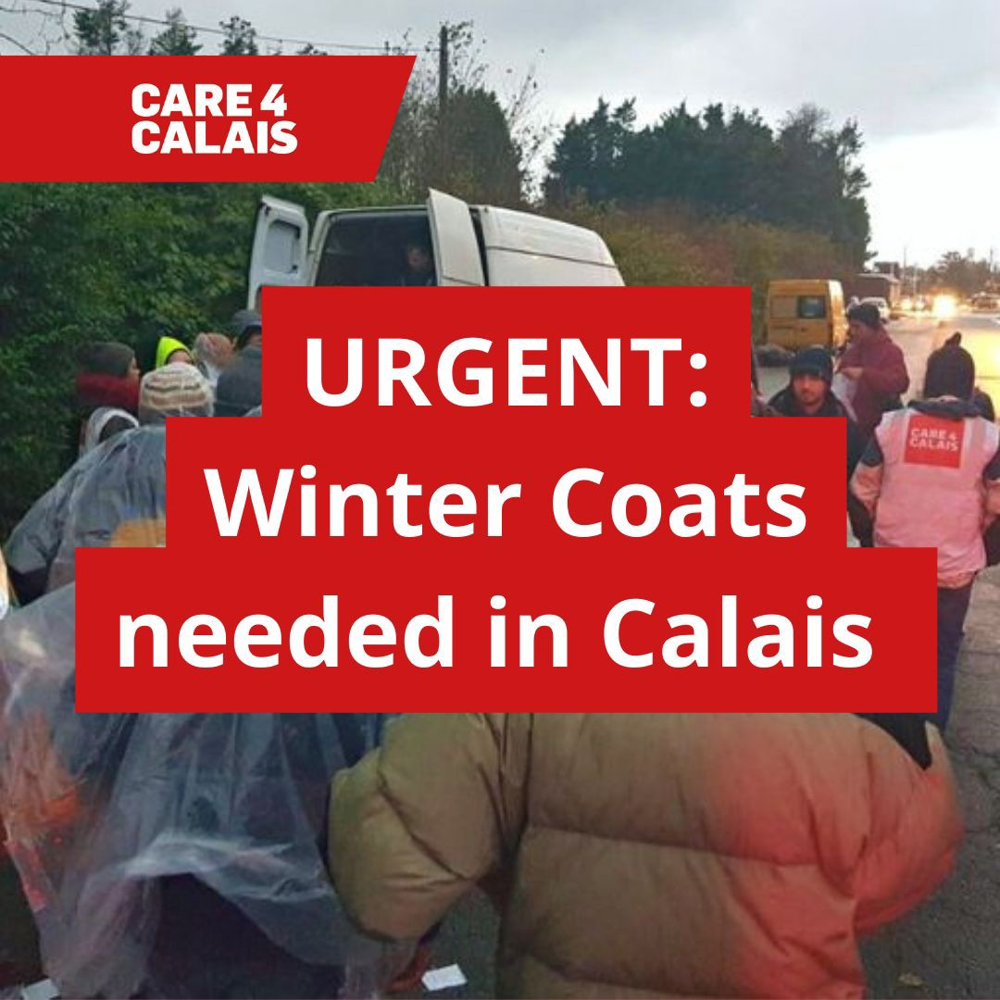
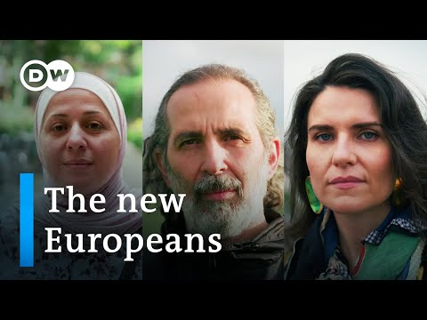

#### **AYS News Digest 04\.11\.2022:** Mass loss of lives continues in the Mediterranean and the Aegean sea — In Greece, death toll reaches 23, many more still missing after two deadly shipwrecks, while 300 people were adrift for days

In other news, over a thousand people are still stranded in rescue ships off Italy, Algeria expels people on the move to Niger’s desert without water or food, and Poland and Latvia reinforce border control in fear of migrant influx\.

Photo credits: Aegean Boat Report
#### Greece

Dozens of people remain missing after two deadly shipwrecks took place in the Agean Sea within 24 hours, on Monday and Tuesday this week\. One occurred off the island of Samos, in the Eastern Sporades, opposite Turkey; the other near the islands of Evia and Andros, in the Kafireas strait\.

[According to the latest updates](https://apnews.com/article/europe-middle-east-greece-turkey-migration-b0e8f550dfa0590e1043ca5eb4531cfa) and the Agean Boat Report group, a boat carrying 68 people sank in the Kafireas strait, off the island of Evia on November 1\. At least 23 people have been found dead, including five children, three boys and two girls, and six women, and 34 more are still missing\.

Agean Boat Report on Facebook

The 12 rescued are all men, including a 16\-year\-old who is being treated at the hospital\. Among the survivors, two of the men were arrested on charges of forming a criminal organization and for intentionally causing a shipwreck, as they were believed to have served as pilot and co\-pilot of the boat, [Greek authorities said](https://www.keeptalkinggreece.com/2022/11/04/migrants-shiprwreck-kafireas-arrested-men/) \.

Off the coast of Samos island, a dinghy carrying 12 people sank on Monday\. Local fishermen rescued two people and Frontex another two\. Eight people are still missing\.

Finally, a boat carrying 300 people remained in distress at sea for almost a week when they were eventually rescued by the Italian Coast Guard on November 3\.

Alarm Phone first reported their situation and informed the Greek Coast Guard when it drifted 40 miles south of Crete in bad weather close to capsizing on October 28\.

■■■■■■■■■■■■■■ 
> **[Alarm Phone](https://twitter.com/alarm_phone) @ Twitter Says:** 

> > We’re still in contact with the over 300 people who are facing bad weather and high waves. They are drifting less than 40 miles from #Crete and close to capsizing, according to the people on board. @[HCoastGuard](https://twitter.com/HCoastGuard) needs to rescue without delay! #DontLetThemDrown https://t.co/nTLOUonmEA 

> **Tweeted at [2022-10-28 21:43:23](https://twitter.com/alarm_phone/status/1586111411523985408).** 

■■■■■■■■■■■■■■ 

Even though the Greek authorities were alerted to the emergency of the situation, especially the lack of food and water, they failed to rescue or assist\. After its engine broke down, the boat drifted south of Peloponnesos close to Kalamata and then to the Italian SAR zone, where the Italian coast guard rescued it\.

■■■■■■■■■■■■■■ 
> **[Alarm Phone](https://twitter.com/alarm_phone) @ Twitter Says:** 

> > This group of at least 300 people in distress is still at sea! They report that their engine broke down and that they are adrift, west of #Kalamata. A rescue operation must immediately be launched to prevent a disaster. #DontLetThemDrown! 

> **Tweeted at [2022-11-01 08:44:24](https://twitter.com/alarm_phone/status/1587364924946268161).** 

■■■■■■■■■■■■■■ 

■■■■■■■■■■■■■■ 
> **[Alarm Phone](https://twitter.com/alarm_phone) @ Twitter Says:** 

> > According to the Italian Coast Guard, there is an ongoing rescue operation to bring the people to safety. We are glad and relieved that the people reached their destination after such a long and dangerous journey. 
Safe routes are needed now!! 

> **Tweeted at [2022-11-03 00:50:34](https://twitter.com/alarm_phone/status/1587970454375088129).** 

■■■■■■■■■■■■■■ 

#### **Rescue at sea: For two weeks, over 1000 people remain adrift at sea while NGOs urge EU states associated to help**
#### Mediterranean

After more than two weeks and 21 requests to the Coordination Centers for Rescue at Sea \(MRCC\) of Malta and Italy, according to [NGO SOS Humanity](https://sos-humanity.org/en/press/illegal-decree-italy-announces-to-push-back-protection-seekers-on-board-humanity-1/) , people aboard four ships, part of the humanitarian rescue fleet, have been denied their fundamental rights to apply for asylum\.

[https://twitter\.com/SeebrueckeH/status/1588856718163070976](https://twitter.com/SeebrueckeH/status/1588856718163070976)

Humanity1, Ocean Viking, Geo Barents, and Rise Above have aboard 1,078 people rescued from a dangerous situation at sea, including pregnant women and more than 100 minors, some of them unaccompanied, in immediate need\. The four ships have urged Italian or Maltese authorities to respect maritime law and allow them to disembark in one of their ports as the weather situation is getting worse\.

While Italy is refusing to receive them, with the Italian Interior minister stating that Italy will take care of emergencies and those who have the right will be helped, Malta never responded to their requests\.

■■■■■■■■■■■■■■ 
> **[Migrant Rescue Watch](https://twitter.com/rgowans) @ Twitter Says:** 

> > 1/3 - 04.11.22 🇮🇹 Ministry of Interior Press Conference - Min. Piantedosi: "We will only take care of emergencies, those who have the right will be helped". #NGO #migrantcrisis #DontTakeToTheSea #seenotrettung #Frontex https://t.co/PybHIVe5tY 

> **Tweeted at [2022-11-05 18:36:23](https://twitter.com/rgowans/status/1588963455557849089).** 

■■■■■■■■■■■■■■ 

> “The decree of the Italian Minister of the Interior is undoubtedly illegal\. Rejecting refugees at the Italian border violates the Geneva Refugee Convention and international law\. All 1,078 people rescued at sea aboard Humanity 1, as well as aboard the civilian rescue vessels Ocean Viking, Geo Barents and Rise Above, are in need of protection\. Italy is obliged to immediately disembark all survivors ” _says Mirka Schäfer, Head of Advocacy at SOS Humanity\._ 

> **“It would be inadmissible, according to international law and from a humanitarian perspective, to disembark only a selection of the surviving castaways “** \. 

■■■■■■■■■■■■■■ 
> **[MSF Sea](https://twitter.com/MSF_Sea) @ Twitter Says:** 

> > 📢 572 people aboard #GeoBarents, 234 on #OceanViking, 179 on #Humanity1 are still waiting for a place of safety to disembark.

❗️ Without the life-saving work of the #civilfleet, 985 people would have been left to drown in the #CentralMed.

🔴 They need a port of safety NOW. https://t.co/f1CkXqyVsq 

> **Tweeted at [2022-11-02 17:17:59](https://twitter.com/msf_sea/status/1587856558645563393).** 

■■■■■■■■■■■■■■ 

The German Embassy responded to the Italian authorities, who refuse to disembark the rescued people from the ship Humanity1 flying the German flag, urging the Italian government to help quickly\.

For Germany, which reaffirms a position already expressed in the past and also validated by the interventions of the European Court of Human Rights and by repeated pronouncements of the United Nations, says Italian [media](https://www.avvenire.it/attualita/pagine/la-germania-risponde-al-governo-meloni-dovete-far-sbarcare-i-migranti?fbclid=IwAR1Mj21FDEBsWFn8AslPZNiyg3pzRTbZRL8iOQec47RVmdmCu900OhHuk6Q) , “the civil organizations involved in the rescue of migrants provide an important contribution to the rescue of human lives in the Mediterranean\. Saving people in danger of life is the most important thing”\.

Humanitarian rescue ships are still adrift today, with food and supplies running out and weather conditions worsening\.

Read more [here](https://mediterranearescue.org/news/civil-fleet/decreto-illegale-litalia-annuncia-di-respingere-i-richiedenti-protezione-a-bordo-della-humanity-1/) , [here](https://www.aerzte-ohne-grenzen.de/presse/mittelmeer-gerettete-sicherer-hafen?utm_source=msf.de&utm_medium=shortener&fbclid=IwAR0YuXoAyQbuvxR6hh2sL4tDmthIf-EsS9yJT-HNUu5P-3EQHuXl3MXY-mE) and [here](https://sosmediterranee.it/comunicato-stampa-3-novembre/?fbclid=IwAR1Mj21FDEBsWFn8AslPZNiyg3pzRTbZRL8iOQec47RVmdmCu900OhHuk6Q)

At the same time, another boat at risk of capsizing with 383 people on board was rescued on November 1 south of Sicily, according to Alarm Phone\.

■■■■■■■■■■■■■■ 
> **[Alarm Phone](https://twitter.com/alarm_phone) @ Twitter Says:** 

> > A total of 383 people on board of the large boat in distress were rescued to Italy by several assets south of #Sicily. We are so relieved they survived this very dangerous journey! 

[twitter.com/scandura/statu…](https://twitter.com/scandura/status/1587513542038659076?t=7ZlMC-DGAzKhO4RHmU7l_w&s=19) 

> **Tweeted at [2022-11-01 19:13:53](https://twitter.com/alarm_phone/status/1587523337542160389).** 

■■■■■■■■■■■■■■ 

#### Atlantic

In the Atlantic, a boat in distress with 33 people on board on their way to the Canary Islands was intercepted by the Moroccan authorities on Thursday, November 3, says Alarm Phone\.

■■■■■■■■■■■■■■ 
> **[Alarm Phone](https://twitter.com/alarm_phone) @ Twitter Says:** 

> > 🆘 in the #Atlantic!

Alarm Phone was alerted to 33 people in distress on the way to the #CanaryIslands. @[salvamentogob](https://twitter.com/salvamentogob) has been alerted and is coordinating the cargo ship Lion. The people are under Spanish responsibility and must be brought to safety in Europe! https://t.co/xRyXCFXTxv 

> **Tweeted at [2022-11-02 17:27:20](https://twitter.com/alarm_phone/status/1587858911025106945).** 

■■■■■■■■■■■■■■ 

■■■■■■■■■■■■■■ 
> **[Alarm Phone](https://twitter.com/alarm_phone) @ Twitter Says:** 

> > @[[salvamentogob](https://twitter.com/salvamentogob)](https://twitter.com/[salvamentogob](https://twitter.com/salvamentogob)) We have confirmation that people risking their lives in the #Atlantic to reach #Europe have been intercepted by the Moroccan navy in an operation coordinated by @[[salvamentogob](https://twitter.com/salvamentogob)](https://twitter.com/[salvamentogob](https://twitter.com/salvamentogob)).
#rutacanaria #FreedomOfMovement #fronterasur 

> **Tweeted at [2022-11-03 13:02:58](https://twitter.com/alarm_phone/status/1588154771806031873).** 

■■■■■■■■■■■■■■ 

#### Algeria
#### **Algeria forces Syrian and Palestinian asylum seekers into Niger’s desert and leaves them without water or food**

Algerian authorities have forced more than 60 mainly Syrian and Palestinian asylum seekers, including women and children, to the desert border of Niger, where they were abandoned without food or water, report [media](https://northafricapost.com/62243-algeria-abandons-syrian-and-palestinian-refugees-in-niger-border-desert.html?fbclid=IwAR1dCsESqSwj18FaN7V9hxklpWhDqhX5emhxvcuJyQo0a2U5sCvlIIhjOdY) \.

Insufficient funds prevent them from returning to Syria or moving to another country\. Their appeals for assistance to the Syrian Embassy in Algiers have gone unanswered\.

> “We are currently on the border with Niger,” Masoud Qader, one of the Syrian refugees, _said to [Middle East Monitor\.](https://www.middleeastmonitor.com/20221102-algeria-sends-sores-of-syria-refugees-to-niger-desert/?fbclid=IwAR11AnVM-7AjjQCxCB54NlqIjp-vTBAg77nX9VA0mjBoprWnwWntezUu2cU)_ “There are Palestinians and Yemenis among us\.” 

This is not the first time that Algerian authorities have treated people on the move in this way\. In fact, the country has been accused by NGOs of treating migrants brutally, including arresting and dumping them in the desert without food or water\.
#### Italy
#### **New government spreads xenophobic propaganda, says former national spokesman for the Coast Guard**

Admiral Vittorio Alessandro, who was interviewed by Sergio Scandura for Radio Radicale, describes Giorgia Meloni’s comments as “dangerous”, according to [media](https://www.globalist.it/news/2022/11/02/migranti-lammiraglio-contro-meloni-pericoloso-far-credere-che-chi-soccorre-in-mare-sia-un-pirata/?fbclid=IwAR3r8z7LOG5sdkA5EX-k52v03MLa2bt7eZspdnwZBFPVFh3v5bQHK9T3uKE) \.

Newly appointed Italian PM Georgia Meloni has described immigration as ‘dangerous’ and volunteers who rescue people in distress as ‘pirates’ in a book by Bruno Vespa\.

The PM says, “here we must remember what is the law of the sea, often invoked inappropriately\. If you accidentally encounter a boat in distress at sea, you are bound to rescue whoever is on board\. But if you commute between the African coasts and Italy to ferry migrants, you are openly violating the law of the sea and international law\. And if an NGO ship flies a German flag, let us say, there are two cases: either Germany recognizes it and takes charge of it or it becomes a pirate ship\.”

> “The commitment of volunteers must be rewarded and not offended with the label of ‘pirate’”, said Admiral Alessandro\. “If we were to open a hospital where a State does not intervene, it is not that we go there to look for the wounded: they are there, they are already there”, _he explained\._ 

#### France
#### **Calais4Calais urgent call for winter clothes**

As the weather is worsening and people on the move remain without regular access to shelter in northern France, the volunteer\-run humanitarian organization Calais4Calais sends out an appeal for help\.

Instead of leaving your old coats to collect dust in your closet, please pass them along to a person in need\. You can donate a coat you no longer wear to your nearest drop\-off point: care4calais\.org/thedropoffmap

If you can’t do that you can give £20 to help buy a refugee a new coat: care4calais\.org/donate
#### Denmark

All refugees have the right to protection\!

As the law has tightened up in Denmark, the Danish refugee council calls for support by setting four proposals for better protection of refugees in Denmark\. A move that all European countries should follow\.

Sign NOW [here](https://help.drc.ngo/da/sadan-hjaelper-du/stotteerklaering/alle-flygtninge-har-ret-til-beskyttelse/?utm_source=facebook&utm_medium=paid&utm_campaign=stoet_flygtning&utm_content=push_ad2&fbclid=IwAR2kStppo39wzK0CAmwJg9hKnw8Z1TWOUXY2tsSgZF16lEFVVswbKeUHP84)

**Four proposals for better protection of refugees in Denmark**
- All refugees should be guaranteed continued protection in Denmark until there have been fundamental, lasting and stable changes in their country of origin\. Refugees need protection from being sent back to a country of origin that is still characterized by unrest, conflict and arbitrariness and where there is a high risk of individual persecution\.
- Refugees’ residence permits should be of longer duration and it should be easier to gain access to a permanent residence permit\. All refugees should receive a residence permit for a minimum of five years at a time\.
- All refugees should be able to apply for family reunification as soon as they are granted asylum\. War and conflict very often lead to families being separated, and the separation will often be long\-term because the flight itself can take months and sometimes years\.
- Connection to the labour market, education, language and family considerations must be given greater weight when assessing whether a residence permit can be revoked\.

#### Worth reading & watching
- Europe’s shifting immigration policy \| DW Documentary

- Refugees Are Being Targeted by Kremlin Sympathisers in Germany \| Vice World News

- \#3 Travel diary — On the “Liberty” camp, hope does not give life to anyone

<<<<<<< HEAD

**Find daily updates and special reports on our [Medium page](https://medium.com/are-you-syrious) \.**

**If you wish to contribute, either by writing a report or a story, or by joining the Info Gathering team, please let us know\!**

**We strive to echo correct news from the ground through collaboration and fairness\. Every effort has been made to credit organisations and individuals with regard to the supply of information, video, and photo material \(in cases where the source wanted to be accredited\) \. Please notify us regarding corrections\.**

**If there’s anything you want to share or comment, contact us through Facebook, Twitter or write to: areyousyrious@gmail\.com**
