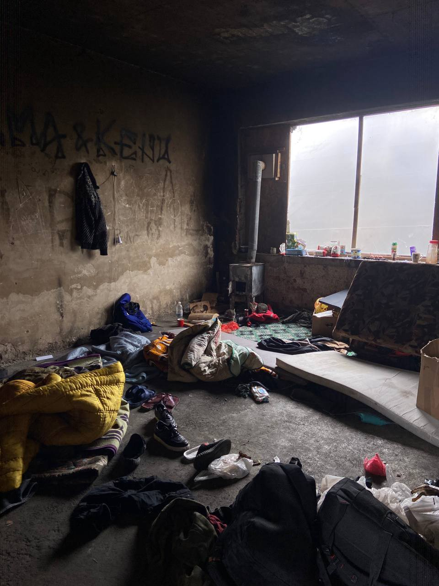
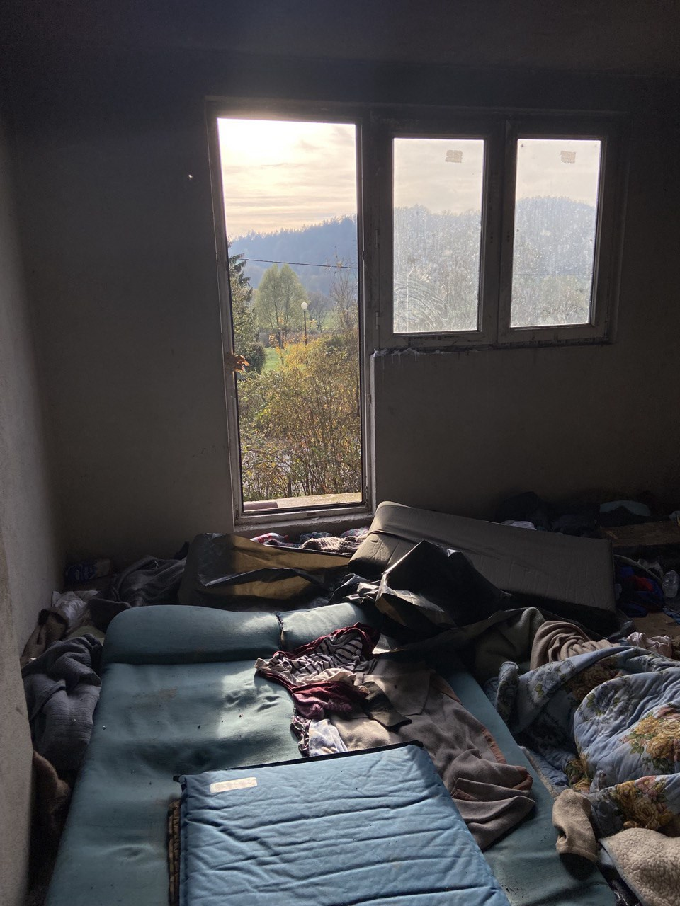
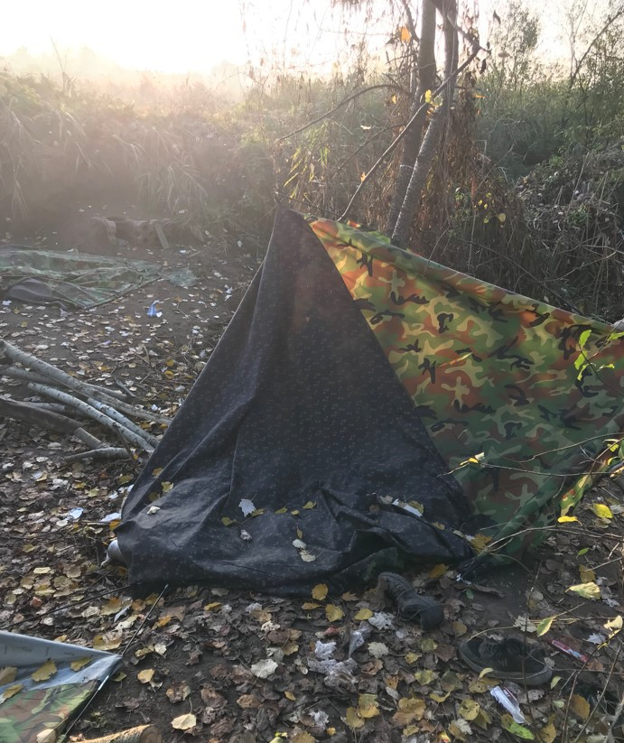
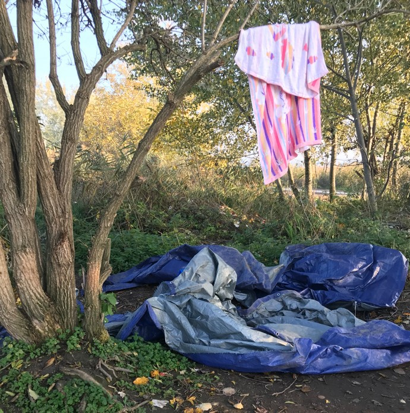

### AYS News Digest 10–11\.11\.22 — Croatia to join Schengen: freedom of movement for some but pushbacks continue\.
#### Further deaths at sea confirmed in Greece // Evictions in Bosnia, Serbia and France // Worth reading and more…

 \)](assets/93fc5d42c3dc/1*iE0WLSfQ3GsqPWIiL7dOsQ.jpeg)

\(‘Who Resists, Wins\.’ Photo Credit: [No Name Kitchen](https://www.facebook.com/NoNameKitchenBelgrade/photos/pcb.1608388879559390/1608386929559585/) \)
#### Feature: Croatia to join Schengen: freedom of movement for some but pushbacks continue

MEPs have voted overwhelmingly [in favour of Croatia joining Schengen](https://www.europarl.europa.eu/news/en/press-room/20221107IPR49610/meps-back-croatia-s-schengen-accession) in the culmination of a process which began in 2018\. Freedom of movement between Croatia and other Schengen countries is scheduled to begin before the end of 2022, a swiftly moving process\. The press release from the European Parliament states that:

> To ensure fundamental rights at EU external borders are respected, MEPs urge Croatia to inform the Parliament and Council of how it implemented its action plan \(see the Commission [communication](https://eur-lex.europa.eu/legal-content/EN/TXT/?uri=CELEX%3A52019DC0497) for more details\) for managing EU external borders, and particularly the independent mechanism to monitor the actions of police officers\. Following reports of pushbacks at Croatia’s borders, MEPs want the Commission to assess Croatia’s external border management and fundamental rights aspects \(including thorough on\-site visits\) as part of the Schengen evaluation programme\. 

[The Communication](https://eur-lex.europa.eu/legal-content/EN/TXT/?uri=CELEX%3A52019DC0497) they mention goes into further details as to what is apparently expected as a result of the EUR 6\.8 million in emergency funding granted to Croatia in December 2018 for border management and monitoring of fundamental rights\. They highlight refoulement \(pushbacks\) and ‘alleged’ mistreatment of migrants and refugees at the external borders and outline the processes which need to be put in place:

> independent monitoring of activities carried out by the Croatian border police, including through the review of procedures, operational arrangements and manuals, training and support of relevant staff and assistance with complaints and incidents reported\. 

In July 2022, [the European Council on Refugees and Exiles \(ECRE\) highlighted the problems still present in the monitoring mechanism](https://ecre.org/balkan-route-systematic-pushbacks-continue-across-the-balkans-shortcomings-in-croatias-monitoring-mechanism-hungary-apply-double-standards-in-approach-to-arrivals-latest-update/) , quoting from the Border Violence Monitoring Network’s \(BVMN\) Balkan Regional Report which stated that [Croatian police officers had entered Bosnian territory while perpetrating pushbacks](https://www.borderviolence.eu/balkan-regional-report-may-2022/) \.

In fact, [the most recent report of a pushback from Croatia to Bosnia is from 21st October 2022](https://www.borderviolence.eu/violence-reports/october-21-2022-0600-sturlic-bosnia/) , less than a month before the European Parliament’s Schengen vote\. This pushback was of 80 people of all ages from Burundi\.

> Reportedly, as soon as they were spotted, the police officers switched off the big light and started to shoot with their guns in the air to scare them\. They approached the transit\-group shouting “ _go back”_ , chased them and beat them\. The respondent reports that all the group members were hit, including women and children\. The women were pushed, kicked and beaten on the back\. The men, reportedly, were beaten even harder with batons, as well as kicked with knees and feet, all over their bodies\. Moreover, the respondent declares that one of the members of the group was hit so hard that the police thought he was dead\. 

When they asked for asylum, the responses given by the police included:

> The asylum is finished\. 

> You will never get to our country\. 

> We don’t care if you die here, you won’t get into our country\. 

The next morning, the 26\-year\-old woman who reported the incident stated that they were chased back over the border by the police\. There are 117 reports of Croatian pushbacks from 2022 alone\. Of course, not all pushbacks are documented, but even with the evidence available it is clear that the monitoring mechanism is still not functioning in any way\.
#### GREECE
#### Twenty\-eight bodies have now been found

[The body of a man has been found](https://www.ekathimerini.com/news/1197570/migrant-shipwreck-death-toll-rises-to-28/?fbclid=IwAR1zK1rTd0EN1q3ZkEzaySusZ-NTsyZf6gUNVo3U0D72no-HzkkOnUDqZ9c) on a beach on the south coast of the island of Evia and is believed to be from the shipwreck of 1st November\. Twenty\-eight people are still missing\.

Safe and accessible routes must be made available to people fleeing their countries to prevent further devasting loss of life\.
#### BOSNIA
#### Evictions in Velika Kladuša

 \)](assets/93fc5d42c3dc/1*gnZqteRzpJ2LLNeeYxrSsw.jpeg)

\(Photo Credit: [No Name Kitchen](https://www.facebook.com/NoNameKitchenBelgrade/photos/pcb.1608388879559390/1608386936226251/) \)

[No Name Kitchen report](https://www.facebook.com/NoNameKitchenBelgrade) that on the morning of the 11th all active squats in Velika Kladuša were evicted by the police and people were forcibly removed to Lipa Camp, which is 23km from the nearest commercial centre\.

> This isn’t the first time the authorities have done this and it won’t be the last, but we will stay even if they don’t want us to\. As far as they continue destroying we will continue rebuilding\. 

#### SERBIA
#### Eviction near Subotica

 \)](assets/93fc5d42c3dc/1*PBgX3LSLWnnrmGNZaYzPvQ.jpeg)

\(Photo Credit: [No Name Kitchen](https://www.facebook.com/NoNameKitchenBelgrade/photos/pcb.1608290289569249/1608283002903311) \)

On the morning of the 11th, [No Name kitchen reports](https://www.facebook.com/NoNameKitchenBelgrade) that a group of approximately 200 people were evicted from the area outside Subotica Camp and told that they were be taken to Macedonia\. Some people had guns held to their heads and they were all forced onto buses\. They are thought to have been taken to Preševo camp\.

> We cannot stop emphasizing that this form of human rights violation is untenable and must be condemned in the strongest possible terms\! Overcrowded camps in the north of Serbia are no reason to drive people back to the south\. In addition, the living conditions are terrible and people have neither proper, nutritious food nor heated rooms or access to medical care\. 

#### FRANCE
#### Eviction in Grande Synthe

■■■■■■■■■■■■■■ 
> **[Human Rights Observers](https://twitter.com/HumanRightsObs) @ Twitter Says:** 

> > Une nouvelle #expulsion a eu lieu ce 9 novembre à #GrandeSynthe. 

HRO dénombre la destruction d'au moins 11 tentes.  Le mois passé, au moins 148 tentes et bâches ont été détruites durant ces opérations. 

Malgré l'approche de l'hiver, les destructions ne cessent d'augmenter. https://t.co/hWoCXY0IXO 

> **Tweeted at [2022-11-10 14:31:19](https://twitter.com/i/status/1590713720912875522).** 

■■■■■■■■■■■■■■ 

#### WORTH READING AND WATCHING

[ECHOES Issue 3, November 2022 —](https://civilmrcc.eu/echoes-from-the-central-mediterranean/echoes3-nov2022/?fbclid=IwAR3wLnLnvTYbG3_BND7fjScwZaKjAVdw9q18vC_ZEZBBRSPiLdrA4xgPi_8) _At the end of September 2022, the arrival in power in Italy of a post\-fascist party has reinforced a discourse of hatred, promoting racism and closed borders\. As more pronounced attacks against civil sea rescue NGOs already begin to take place, it is clear that civil society will feature as one of the targets of the new government\. We, as Civil MRCC repeat loud and clear: against fascism, solidarity will win\! We will continue to fight together and with people on the move for an open Mediterranean\! In “Echoes“, the bimonthly publication of the CMRCC, significant aspects of SAR in the Central Med are reflected upon, current topics discussed, analysis and research presented and the self\-organized struggles of refugees and migrants highlighted\._

[Grinding bureaucracy, scant resources and far\-right rhetoric fuel an asylum crisis in Belgium](https://hyphenonline.com/2022/11/09/grinding-bureaucracy-scant-resources-and-far-right-rhetoric-fuel-an-asylum-crisis-in-belgium/?fbclid=IwAR0-JD415hlCWiObyrvyw1FTcUsDVTbxwFDjGWrYmj3m_pf2yKxgjE61TB0) — Long read on the rising homelessness problem and the rise of the far right\.

[How Do People Become Undocumented?](https://l.facebook.com/l.php?u=https%3A%2F%2Fwww.youtube.com%2Fwatch%3Fv%3D1M_pyDspI6I%26fbclid%3DIwAR2hQl7wDKnpDaXPrFuiV-JEt4t0qZ7XMrXHmp5K_new8ADbvuLNXtUjmt8&h=AT2SXyQ1cycxEuu3m6gJb7ouULhJcbb5Maq6f984YwiEejeNFKdtqP_mXaF0K_UrVvH9W757A3ZtUcR_pODm05ZIrfoSnw_bM356AmP4jSt7MncjKtE54GWydej4jUZW7HXsb3DqWpMVye6rPQ&__tn__=R]-R&c[0]=AT1jFNSvzVzemC5ixNEoA7Agk2c2Fh34ZYUsvkgMDbWON6s5tuyyqb0oYkScDzZCtmxKwA3FGDCICftjoJ4AImtk__a0SSGMS_C-pv4LHRot3XFFXmVguWoTtd1d61sH9nTCQW3DPjsrOjGoGPUYw3ILeEND0vXw9HRakCt-ft8Thi_VOgA-AtNliCH4k_ClSPHPpWCvzkbR6baA) — A video explaining the many routes which lead to a person being undocumented in the UK\.

[After a year of waiting, our asylum application has been refused — I will appeal, but still can’t work](https://www.theguardian.com/commentisfree/2022/nov/11/year-waiting-asylum-application-refused-appeal-home-office?fbclid=IwAR2vIU9YQv25HCR6ME7n3FKxVa1oT2B8RiLrBMLYIn0aRoOPFTxURPYDRzk) — The story of a family in the UK whose asylum has been refused in the middle of a pregnancy\.

**Find daily updates and special reports on our [Medium page](https://medium.com/are-you-syrious) \.**

**If you wish to contribute, either by writing a report or a story, or by joining the Info Gathering team, please let us know\!**

**We strive to echo correct news from the ground through collaboration and fairness\. Every effort has been made to credit organisations and individuals with regard to the supply of information, video, and photo material \(in cases where the source wanted to be accredited\) \. Please notify us regarding corrections\.**

**If there’s anything you want to share or comment, contact us through Facebook, Twitter or write to: areyousyrious@gmail\.com**

_Converted [Medium Post](https://medium.com/are-you-syrious/ays-new-digest-10-11-11-22-93fc5d42c3dc) by [ZMediumToMarkdown](https://github.com/ZhgChgLi/ZMediumToMarkdown)._
