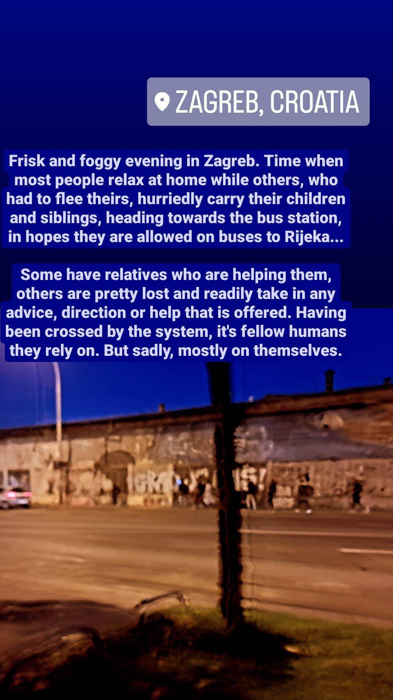
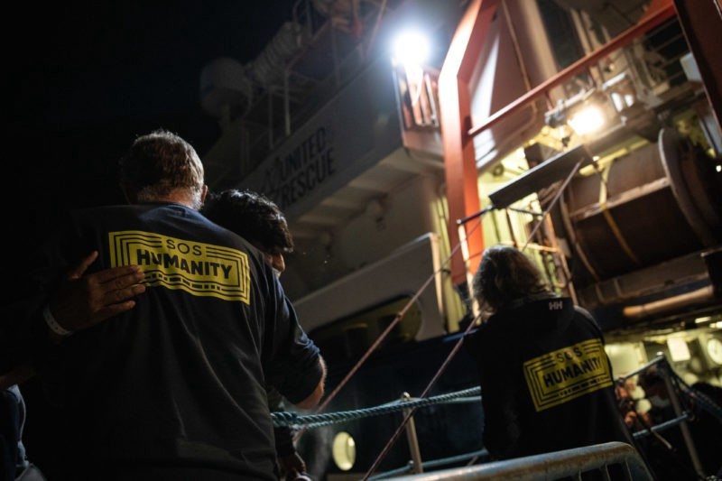
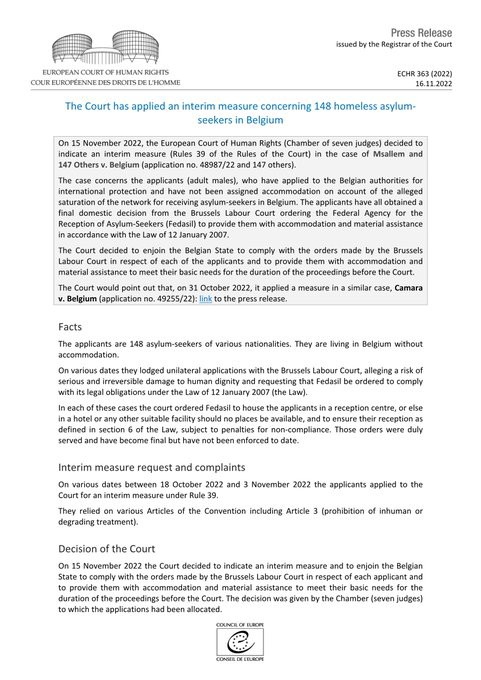

### AYS News Digest 16/11/22: Selectively “inclusive European cities” or the real deal?
#### Some good news from the courts, bad news from the ground and tragic news from the sea…

](assets/64f0cafd6f36/1*LA1SbWZytqyF1r4rdYAahw.jpeg)

Photo: [Tinka Ines Kalajzic](https://www.facebook.com/tinka987?__tn__=-UC*F)
#### FEATURE

Today, at the 10th edition of the [Integrating Cities Conference](https://eurocities.eu/latest/10th-integrating-cities-conference/) in Utrecht, the cities of **Antwerp,** **Pesaro, Vantaa, Warsaw** and **Zagreb** signed the **Integrating Cities Charter** , joining 42 cities in an initiative\.

The media reported that “by becoming signatories, cities commit to **providing equal opportunities** for all residents and to embracing and promoting the diversity of their populations\.”

**Eurocities** is the name of a network of more than 200 major cities in Europe who launched the Charter in 2010\. “It sets out cities’ commitments to the integration of migrants in their role as policymakers, service providers, employers and buyers of goods and services\.”

The signing ceremony was hosted by the Deputy Mayor of Utrecht, Rachel Streefland and by Eurocities Secretary General, André Sobczak\. As AYS representatives visited Utrecht organisations, activitsts, but also city structures, we can say they do tend to be a role model in many ways for their European counterparts, but knowing, following, reporting, and providing solutions for some other cities in the network, we can only hope that this initiative will not stop at lovely visibility activities and will instead work to address the real issues, challenges and dire needs of the people coming to or passing through their cities\.

“Every two years, Eurocities produces a monitoring report assessing the progress signatory cities have made in implementing the charter\. [This year’s edition](https://eurocities.eu/wp-content/uploads/2022/09/5th-Integrating-Cities-Report-2022.pdf) shows that while responding to immediate challenges and crisis, cities never stop implementing policies for the broader integration of migrant communities\.

For instance, more and more cities report having developed a strategic vision of their identity, making the promotion of inclusion, the fight against hate speech and discrimination, the backbone of all work done in the city administrations\.”

This sounds like a nice initiative and starting point within the city officials, and we hand it to the City of Zagreb for having worked \(inclusively\) on the only Action Plan for integration in the country, but the situation at hand asks for much more\.

Since some months ago, as we have been reporting, Zagreb \(and Rijeka\) have been the most prominent points in the country for people who have been given what is referred to as seven\-days notice, a document that deprives them of any rights, options and possibilities and merely lets them know they must leave the European economic space within seven days\. In the meantime, these people in these friendly European cities are left with nothing but the kindness of strangers\.

Both the cities of Zagreb and Rijeka have said they will provide the basic containers for hygiene and some NFI provision, but that seems to have been halted and nothing, except citizens’ own initiatives, has so far appeared in reality\. We intend to publish a Special on this topic, but as this warmly [reported](https://www.themayor.eu/en/a/view/pesaro-vantaa-warsaw-and-zagreb-pledge-to-create-inclusive-cities-for-refugees-and-migrants-11214) event from Utrecht caught our attention, something had to be said \(again\) about the situation\.

Nothing will change without the political will and some concrete steps that don’t end with the hopes of the Red Cross doing something and the expectations that NGOs will take the lead\. There has been enough of that\.

“In addition to promoting transnational learning and fostering real change on the ground, the partners have produced four [toolkits](https://eurocities.eu/projects/connection/) to guide cities willing to develop integration strategies, improve the gender dimension of their integration activities, foster the labour market integration of migrants or set up a one\-stop shop,” says the report on the Utrecht meeting, and as a part of the community who put some of those things in place, we hope to see this systematically defined and put into practice in reality, too, very soon\.
#### GREECE

This Wednesday evening the team of Alarm Phone were informed about a sinking boat near Kos\. They then immediately alerted the Greek authorities, who launched a rescue operation\.

> For one passenger, help came too late — we learned today that one person passed away after being brought to the hospital\. 

■■■■■■■■■■■■■■ 
> **[Alarm Phone](https://twitter.com/alarm_phone) @ Twitter Says:** 

> > We mourn this death in the #Aegean Sea and send strength to all survivors and relatives. People should not be forced to sail in the dark and to take such risks on their journey. #BordersKill 
2/2 

> **Tweeted at [2022-11-17 11:01:59](https://twitter.com/alarm_phone/status/1593197753576083456).** 

■■■■■■■■■■■■■■ 

### More victims of shipwrecks in desperate tries to reach safety

One more body has been recovered in the sea south of the island of Evia, following a shipwreck earlier this month of an overloaded smuggling boat in the western Aegean Sea, raising the tragic confirmed death toll to 29\.

27 people remain missing\.

Twelve men from Egypt, Afghanistan and Iran survived the sinking of a sailing boat that took place on 1 November, which survivors said had set sail from Izmir in Turkey with a total of 68 people on board and ran into trouble on very rough seas in a treacherous strait between two islands east of Athens\.

Two of the survivors who, authorities said, had been identified as having piloted and crewed the sailing boat, were later arrested as suspected migrant smugglers, reported the local media\.

Safe routes are a matter of dire urgency and if you read this and have the opportunity to lobby for it, we are prepared to provide you or link you to those who can provide you with all the information needed to support these efforts\.
#### THE ‘BALKAN ROUTE’

■■■■■■■■■■■■■■ 
> **[Blindspots](https://twitter.com/blindspots_ev) @ Twitter Says:** 

> > 🔥We support people on the move in their fight against the winter cold and the cold of the EU's migration policy by installing stoves, distributing firewood and installing windows and doors in makeshift shelters in the Serbian border region.🔥@[lnob2020](https://twitter.com/lnob2020) 1/2 https://t.co/Go04ys0cp1 

> **Tweeted at [2022-11-17 18:16:21](https://twitter.com/i/status/1593307067787448321).** 

■■■■■■■■■■■■■■ 

#### ITALY
### Mounting pressure on SAR teams

“What we have experienced over the past week has been an enormous media onslaught, focusing both on us, as a relatively small NGO, but also on other search and rescue organisations,” writes the team of SOS Humanity\.

They were the first NGO to be affected by the new measures taken against NGO ships by Italy’s Prime Minister Meloni\.

> “The beginning of the disembarkation went smoothly: as usual, as the most vulnerable group, the unaccompanied minors disembarked first, including three young women and a baby\. Then the process was interrupted\. Two female staff from the Ministry of Health came on board, sent for our doctor and in no time at all turned the onboard clinic into a selection room\. This was in the middle of the night\. **The atmosphere was eerie; no one on deck spoke a word** \. 

> Every few minutes the door of the small clinic opened and a person who had been rescued came out\. Roughly every second person had to sit back down on deck again, while the rest were allowed to leave the ship\. Confusion and speechlessness reigned\. It was **an arbitrary, undignified selection process\.** 

> The mood of the crew was depressed and helpless\. There was nothing we could do,” 

reads part of their diary that explains in detail what happened on the waters, how they face growing pressure, but also how they resisted and persisted in doing everything they could\.

Photo: SOS Humanity

The team now awaits to rejoin others in the Med SAR activities once again\. 
Read their blog [here](https://sos-humanity.org/en/blog-from-aboard/blog-from-aboard-07-part-2/) \.
#### FRANCE

It’s the 10th day people have been squatting in a local gym as there seems to be no other solution for moving them indoors from sleeping rough, the French activists of Utopia 56 warn\.

■■■■■■■■■■■■■■ 
> **[Utopia 56](https://twitter.com/Utopia_56) @ Twitter Says:** 

> > Rennes - Occupation gymnase de l'Ille,  jour 10 : toujours aucune solution proposée. Pourtant 49 personnes dont 15 enfants (sur)vivent toujours sur place. Sans cette solution, elles seraient dehors, sous la tempête. @[bretagnegouv](https://twitter.com/bretagnegouv) une (ré)action ? https://t.co/P2ul1KMfBx 

> **Tweeted at [2022-11-16 21:52:31](https://twitter.com/utopia_56/status/1592999080057536514).** 

■■■■■■■■■■■■■■ 

#### BELGIUM
### Interim measure for people who didn’t get accommodation because there were supposedly too many people in need

On 15 November 2022, the European Court of Human Rights decidedon an interim measure in the case of Msallem and 147 Others v\. Belgium\. The case concerns applicants who have applied to the Belgian authorities for international protection and have not been assigned accommodation on account of the alleged saturation of the network for receiving asylum\-seekers in Belgium\.

These people have all obtained a final domestic decision from the Brussels Labour **Court ordering the Federal Agency** for the Reception of Asylum\-Seekers \(Fedasil\) **to provide them with accommodation and material assistance in accordance with the Law** of 12 January 2007\.

The Court decided to enjoin the Belgian State to comply with the orders made by the Brussels Labour Court in respect of each of the applicants and to provide them with accommodation and material assistance to meet their basic needs for the duration of the proceedings before the Court\.

**Find daily updates and special reports on our [Medium page](https://medium.com/are-you-syrious) \.**

**If you wish to contribute, either by writing a report or a story, or by joining the Info Gathering team, please let us know\!**

**We strive to echo correct news from the ground through collaboration and fairness\. Every effort has been made to credit organisations and individuals with regard to the supply of information, video, and photo material \(in cases where the source wanted to be accredited\) \. Please notify us regarding corrections\.**

**If there’s anything you want to share or comment, contact us through Facebook, Twitter or write to: areyousyrious@gmail\.com**

_Converted [Medium Post](https://medium.com/are-you-syrious/ays-news-digest-16-11-22-selectively-inclusive-european-cities-or-the-real-deal-64f0cafd6f36) by [ZMediumToMarkdown](https://github.com/ZhgChgLi/ZMediumToMarkdown)._
