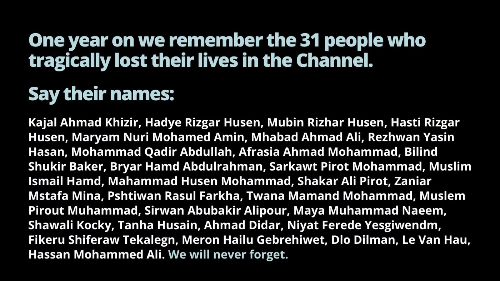

### AYS News Digest 24–25/11/22: Vigils held for people who died in the Channel

A person in distress in northern Greece — rescue needed now\! // Shipwreck off Grand Canaria // Criminalisation of human rights defender in Greece // Updates from Serbia // SAR in the Med // Worth reading and more…

\(Image Credit: @ChannelRescue\)
#### FEATURE: Vigils held for people who died in the Channel

On 24th November 2021, 32 people died in the French/British Channel as a direct result of the UK’s hostile environment policy and a systematic disregard for life on the night in question\. Among those who lost their lives were a pregnant woman and three children\. Only two people survived\.

■■■■■■■■■■■■■■ 
> **[SOAS Detainee Support (SDS)](https://twitter.com/sdetsup) @ Twitter Says:** 

> > A letter written by the wife of one of the men who died in the Channel is read out: 

“You didn’t deserve how you was treated in your last moments in this cruel world. Am still hoping for justice. I know you are still smiling and being the kind man I know you are.” https://t.co/4zUqtpLBb0 

> **Tweeted at [2022-11-24 19:36:03](https://twitter.com/i/status/1595863838431531008).** 

■■■■■■■■■■■■■■ 

In a recent report the time wasting by authorities which lead to these people’s deaths was laid bare:

> Crucially, we can see that 02:06am, a telephone conversation between the English and French coastguards indicated the position of the boat, which was then 0\.6 nautical miles from English waters\. Let it sink in: at just after two am both authorities learned the exact location of those in distress\. They chose not to send rescue services until 12 hours later\. 

> At 02:33, a position is again sent by a passenger to the French authorities, who then reply to say to call 999 as they are in English waters\. So we know that for a significant part of the time that the boat was sinking it was in British waters and that is likely where many people drowned\. 

> At 02:45, a passenger contacted the French authorities and asked for assistance\. Screams could be heard in the background\. 

> Around 3am the boat overturned spilling all passengers into the water and some began to drown because of the waves\. At 03:31, a passenger called the French authorities, explaining that they were now all literally in the water\. The authorities replied “yes, but you are in English waters Sir”\. 

> At 04:16, a passenger contacted the French authorities and said that 40 people are in the water and that “it’s over”\. He asks for a helicopter because they are dying\. 

> Email exchanges between the French and British authorities indicate that the boat arrived in English waters at 2\.30am\. The British coastguard said in another email that they had contacted a passenger and that a French dial tone had revealed that the boat was in French waters\. 

> At 04:34, the French authorities “closed the operation” of the wrecked boat, considering that there was no longer any distress given the cessation of calls for help and the probable intervention of the British rescue services\. — [_Care4Calais_](https://care4calais.org/news/vigil-for-the-channel-drownings-november-24/) 

■■■■■■■■■■■■■■ 
> **[Calais Appeal](https://twitter.com/CalaisAppeal) @ Twitter Says:** 

> > This evening we are marching in Dunkirk commemorating those who lost their lives crossing the channel one year ago. When 🇫🇷 & 🇬🇧 play politics over sea rescues, lives are lost. Safe and legal passages now. https://t.co/7nIlw9bmRC 

> **Tweeted at [2022-11-24 17:55:59](https://twitter.com/i/status/1595838657021333507).** 

■■■■■■■■■■■■■■ 

At least [325 people have died at this border since 1999](https://www.instagram.com/p/ClYqGX9oyy8/?igshid=YmMyMTA2M2Y%3D&fbclid=IwAR0r9GDu_MPeQ0tpmVhin2DCs8wma_BcqPvQCBtYYcuND33MBkCco-oQbSc) \. This week v [igils were held on both sides of the Channel](https://mobile.twitter.com/FreeFromManston/status/1595868472533213196?fbclid=IwAR3-_xfthoLpkifhHE2WpxQGdEUPCPM4FXkFaGQvGFV4F8Ixivw7Sm2TTao) \. There remain no safe routes to claim asylum in the UK bar those for a handful of accepted nationalities \(and even these are exceptionally limited\) \.
#### SEARCH AND RESCUE

**Nine people missing**

A boat capsized in the Atlantic on Tuesday, [according to Alarm Phone](https://twitter.com/alarm_phone/status/1595832782621753347) \. The only survivor is still in hospital\. Nine people are still missing and it is unlikely that they will now be found\.

**Geo Barnets back to sea**

C [ontinued delays in disembarking people](https://www.middleeasteye.net/news/mediterranean-ngo-rescue-ship-return-sea?utm_source=Twitter&utm_medium=Social&utm_campaign=Social_Traffic&utm_content=ap_ukn56d1bo5&fbclid=IwAR14VFAP6WPKencxgCV9TPEx7Pcm6L2zTfRCThKXltjNP_EhgNpQELoM9LQ) from rescue ships, along with [repeated attempts at criminalisation](https://mobile.twitter.com/MSF_Sea/status/1596108136162754561?fbclid=IwAR3MLCc3KuurqyMtUSPSEu3eX7L0lLJRBV6vwHQawGo42qmYEzW0w0-yKcw) , are putting people’s lives at risk\. The Geo Barnets will now return to sea but it has lost several weeks of operations\. A lack of SAR operations does not stop people from making the crossing\. People still flee, but do so at greater risk to their lives\.
#### GREECE

**Rescue needed in the north of Greece**

A person with a severely injured leg is in need of assistance in the north of Greece\. [Alarm Phone have contacted the Hellenic police](https://twitter.com/alarm_phone/status/1596141974641577985) but have lost contact with the individual and have not received word from the authorities\. Where is he?

\(Photo Credit: @alarm\_phone\)

**Criminalisation of human rights defender**

[Panayote Dimitras of the Greek Helsinki Monitor](https://www.fairtrials.org/articles/news/panayote-dimitras-fair-trials-denounces-criminalisation-of-human-rights-defenders/) has appeared before an investigating judge in relation to actions carried out as a human rights defender\. She faces charges of forming and joining a criminal organisation, facilitating entry to the Greek territory for a citizen of a third country for profit and by profession, and facilitation of illegal residence of a citizen of a third country for profit\.

> Fair Trials denounces this continued harassment and the criminalisation of solidarity, which not only has serious implications for the individuals involved but also a chilling effect, dissuading people from human rights activism and shrinking the capacity for civil society to promote reform\. 

> … 

> Fair Trials is deeply concerned about the criminalisation of human rights defenders in Greece and elsewhere in Europe, which reflects the continued overreliance on prosecution and punishment to tackle social issues\. Civil society plays a crucial role in ensuring the protection of migrants’ rights, particularly in the absence of safe routes for migration and adequate support systems for those in need of assistance\. Fair Trials continues to show support to Dimitras and strongly urges the Greek government to stop weaponising criminal law powers against human rights defenders and migrants\. 

#### SERBIA

**Update from Sid**

[A video shared by a resident of Adasevci Camp](https://www.instagram.com/reel/ClYbecLjWe_/?igshid=YmMyMTA2M2Y%3D&fbclid=IwAR14VFAP6WPKencxgCV9TPEx7Pcm6L2zTfRCThKXltjNP_EhgNpQELoM9LQ) shows rusting bunkbeds stacked right up against each other, stained foam matresses, a bare concrete floor\. The video is taken inside a large single skin tent\. There is no sign of a heating system, and the elements are kept out with only badly fitting plywood doors\. There are no comforts bar a few mismatched blankets which in this environment appear to be a luxury not everyone can enjoy\. The doctor only comes once a week and gives the same pill for every ailment\.

No Name Kitchen have resumed their visits to residents of the camp\. Though they cannot enter the space, they offer tea to those who come out to meet them\.

> People tell us their stories\. Ahmed told us how he and others had to cross Bulgaria on foot, in eleven or twelve days, sleeping in the open, wrapped in a blanket, hiding from the Bulgarian police, whose brutality we often hear about: kicks, sticks, punches, money and stolen mobile phones… 

This is only the beginning of the story of another European winter for people on the move\.
#### WORTH READING

[Manston: state violence in a no\-access border zone — Institute of Race Relations \(irr\.org\.uk\)](https://irr.org.uk/article/manston-state-violence-in-a-no-access-border-zone/?fbclid=IwAR1YsctyqpZreUSY-Qd0MfOu0k2GAFWM15dmnlnlieQdqY7fam-ICEAJH7o) _The Manston camp has been emptied following the death of a man who was detained there\. But this will not put an end to the humanitarian crisis facing newly arrived migrants and refugees, which is caused by policies of criminalisation and deterrence\._

[Nightmare of a refugee: death at the EU’s external border \(fr\.de\)](https://www.fr.de/politik/tod-an-der-eu-aussengrenze-hassans-albtraum-91934425.html?itm_source=story_detail) _Akram Abdulkadir is dead, but Hassan Abdulkadir is alive\. He can tell what happened to his brother, who was two years older, on July 7, 2022\. The 26\-year\-old Syrian witnessed Akram being maltreated by Greek militias\. He can describe how Akram died in the militia vehicle, while Hassan held him helplessly in his arms and the Greeks did not help\. He can tell how he was forced to leave his brother’s body behind\._

**Find daily updates and special reports on our [Medium page](https://medium.com/are-you-syrious) \.**

**If you wish to contribute, either by writing a report or a story, or by joining the Info Gathering team, please let us know\!**

**We strive to echo correct news from the ground through collaboration and fairness\. Every effort has been made to credit organisations and individuals with regard to the supply of information, video, and photo material \(in cases where the source wanted to be accredited\) \. Please notify us regarding corrections\.**

**If there’s anything you want to share or comment, contact us through Facebook, Twitter or write to: areyousyrious@gmail\.com**

_Converted [Medium Post](https://medium.com/are-you-syrious/ays-news-digest-24-25-11-22-vigils-held-for-people-who-died-in-the-channel-b22d118d5503) by [ZMediumToMarkdown](https://github.com/ZhgChgLi/ZMediumToMarkdown)._
