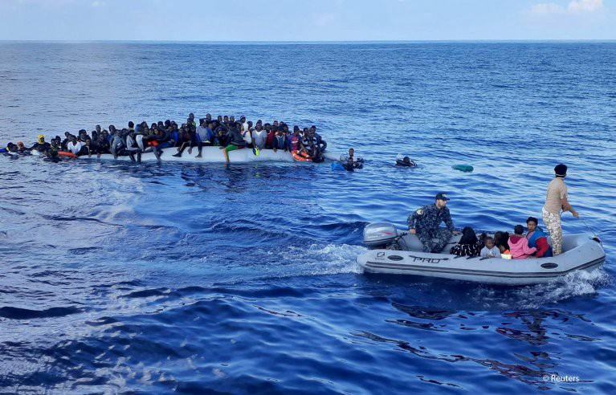

### AYS News Digest 30/11/22: UK Home Office plan to rollout ‘smartwatches’ to monitor the movement of asylum seekers
### Germany’s immigration reform — securing more skilled workers//Shocking figures on the UK\-Afghan Resettlement Scheme//Fair Trials documentary explores fundamental rights abuses by Frontex//Lighthouse Reports has been investigating the events in Melilla on 24th June//Forty\-four charities call for an independent investigation into Manston// and much more…

_InfoMigrants — From file: Migrants on a rubber dinghy are pictured during a rescue operation, off the coast of Libya in the Mediterranean Sea, 13 November 2020\. Picture taken 13 November 2020 \| Photo: REUTERS/Stringer_
#### GREECE
### Destitution among recognised refugees in Greece

In the Greek asylum system, recognised refugees have 30 days to leave the government\-provided accommodation after obtaining their positive asylum claim\.

They must therefore tackle the multitude of obstacles preventing them from accessing accommodation within a very short period of time\. In order to access rent subsidies in Greece, you must have a rental agreement, however, landlords won’t rent without evidence of subsidies\. On top of this, delays in processing relevant documents can mean recognised refugees are left for months without the essential papers they need to access the housing market, social welfare, healthcare, etc\. They can end up homeless, relying on charities, and food banks to be able to survive\.

The only programme that does exist for refugees is the Helios programme\. It is notoriously bureaucratic and does not meet the needs of those who rely on it\.

[‘Destitution is almost inevitable’: Afghan refugees in Greece left homeless by failed system \| Migration and development \| The Guardian](https://www.theguardian.com/global-development/2022/nov/30/destitution-is-almost-inevitable-afghan-refugees-in-greece-left-homeless-by-failed-system)
#### Sarah Souli has published her investigation on the deaths of three Afghan women who were found dead on the border between Turkey and Greece: [A Matter of Honor — The Atavist Magazine](https://magazine.atavist.com/a-matter-of-honor-murders-greece-afghanistan-istanbul/)
#### Der Spiegel have taken down an article they wrote about a young girl who died on an islet in the Evros

At the time, the young girl was part of a group of 38 asylum seekers, mainly from Afghanistan and Syria, who were stuck on the islet\. She was reportedly stung by a scorpion and as a result died shortly afterwards\.

However, it has since been questioned whether this girl did in fact die and whether she ever existed\. This comes at a time when the Greek authorities make it difficult for journalists and NGOs to access the Evros region as it is a military zone\. In addition, the government has been targeting organisations, activists, and journalists who report and support asylum seekers in Greece\. They have actively challenged, attempted to discredit, and criminalise the work of NGOs and journalists\. Despite lots of testimonies of individuals who have been stuck in the Evros region, the Greek media rarely reports on this\. As a result of all these factors, there is still an ongoing discussion regarding the young girl on the islet and there is no clear understanding as to what happened\.

[Greece\-Turkey: Mystery around alleged death of refugee girl — DW — 30 November 2022](https://www.dw.com/en/greece-turkey-mystery-around-alleged-death-of-refugee-girl/a-63936746)
#### Free Movement report on pushbacks, and how Greece fails to protect asylum seekers and their right to claim asylum:

[Frontex, pushbacks and the failure to protect the right to claim asylum in Greece — Free Movement](https://freemovement.org.uk/frontex-pushbacks-and-the-failure-to-protect-the-right-to-claim-asylum-in-greece/)
#### GENERAL
### This new Fair Trials documentary explores fundamental rights abuses by Frontex, including their involvement in illegal pushbacks in the Aegean Sea

It further examines how EU agencies, including Frontex and Europol, are being given more and more power, with little oversight\.

The interviewees provide damning evidence and this is very interesting to watch: [Frontex: Why is the EU funding human rights abuses? — YouTube](https://www.youtube.com/watch?v=3pejvQe9rDA)
### New EU Migration Plan — building on a failed mechanism and avoiding the necessary action

As previously reported, the EU Migration Plan, continues to use old models that have proven time and time again that they are ineffective, and discriminatory\.

It ignores the idea to bring back state\-led search and rescue operations, as well as a precise mechanism for disembarkation in a port of safety\. It further fails to implement a process by which individuals get relocated to other EU countries so that there is a greater shared responsibility\.

Instead, it focuses on supporting Libya to increase its border control, under the false pretence that the EU and Libya are working collaboratively to prevent smuggling and human trafficking\.

[New EU Migration Plan, Same Rights Violations \| Human Rights Watch \(hrw\.org\)](https://www.hrw.org/news/2022/12/01/new-eu-migration-plan-same-rights-violations)
#### SEA/SAR
### ‘No Crime Without Criminals’

On 29 November 2022, the European Center for Constitutional and Human Rights \(ECCHR\), based on evidence from Sea\-Watch and other civil society organizations, filed a criminal complaint with the International Criminal Court \(ICC\) under Article 15 of the Rome Statute\.

Evidence suggests alleged criminal activities from high\-ranking officials of EU States and authorities\.

> The accusation: serious deprivation of physical liberty of refugees as a crime against humanity\. And with a plan\. They work closely with Libyan actors, intercept refugees at sea and bring them illegally to Libya\. 

Sea Watch name several of the individuals including;
- Joseph Muscat — the former Prime Minister of Malta
- Robert Abela — Prime Minister of Malta
- Fabrice Leggeri — Former Executive Director Frontex
- Chief Inspector Admiral Giovanni Pettorino — Commander General of the Italian Coastguard

[No crime without criminals • Sea\-Watch e\.V\.](https://sea-watch.org/en/no-crime-without-criminals-2/)

■■■■■■■■■■■■■■ 
> **[LouiseMichel](https://twitter.com/MVLouiseMichel) @ Twitter Says:** 

> > The Louise Michel is back in the central Mediterranean. As part of the #CivilFleet, we stand in Solidarity with people on the move, while Europe builds new walls every day. 
#FreedomOfMovement #NoBorders https://t.co/26tqm02kCN 

> **Tweeted at [2022-12-01 11:49:10](https://twitter.com/mvlouisemichel/status/1598283057798451200).** 

■■■■■■■■■■■■■■ 

#### SPAIN/MOROCCO
### Lighthouse Reports has been investigating the events in Melilla on 24th June

They have used video footage and have spoken to over 40 eyewitnesses to understand the extent of what happened on that day, and to expose the police brutality\.

■■■■■■■■■■■■■■ 
> **[Beatriz Ramalho da Silva](https://twitter.com/bearamalhosilva) @ Twitter Says:** 

> > 🧵1/ For the past six months at Lighthouse Reports we have been investigating the horrific police brutality in Melilla - that left 23 people dead and at least 77 missing on June 24th. We set out to find how exactly the tragedy unfolded & where exactly people died. https://t.co/jea1bpb3Li 

> **Tweeted at [2022-11-30 12:12:40](https://twitter.com/bearamalhosilva/status/1597926583494639616).** 

■■■■■■■■■■■■■■ 

#### GERMANY
### Immigration reform in the hope of securing more skilled workers

The government has announced it wants to boost immigration in order to tackle their skills shortage and economic woes\. Particular sectors that are lacking a skilled workforce are healthcare, IT, and construction\.

The government are looking to grant access to their job market for an unlimited amount of time to individuals from the Western Balkan countries that are not in the EU, such as Albania, Bosnia\-Herzegovina, Kosovo, North Macedonia, Montenegro and Serbia\.

The new policy change introduces a point system based on five categories; qualifications, German language skills, career experience, connections to Germany, and age\. These will factor into the overall decision and accessibility to the country’s labour market\.

[Germany seeks looser immigration rules for non\-EU workers — InfoMigrants](https://www.infomigrants.net/en/post/45093/germany-seeks-looser-immigration-rules-for-noneu-workers)
#### THE NETHERLANDS

■■■■■■■■■■■■■■ 
> **[InfoMigrants](https://twitter.com/InfoMigrants) @ Twitter Says:** 

> > 📷 Sudanese refugees held a protest in The Hague yesterday, demanding residency permits.

Earlier this year, Dutch authorities suspended asylum decisions for Sudanese citizens, given the uncertain security situation in the west African country, leaving asylum seekers in limbo. https://t.co/3VAyvwPPFB 

> **Tweeted at [2022-12-01 13:07:00](https://twitter.com/infomigrants/status/1598302645155819520).** 

■■■■■■■■■■■■■■ 

#### FRANCE
### ‘Black, Blanc, Beur’

This Al Jazeera article delves into the history of immigration within French football\.

The 1998 World Cup win was a pinnacle moment, as the team was made up of players of Algerian, Armenian, Ghanaian, Senegalese and Guadeloupean descent\. Zidane, the attacking midfielder, became a household name, with fans shouting ‘Merci Zizou’ and calling him ‘Zidane President’\. This win became a celebration of integration, and diversity in France\.

However, it very quickly became a political debate, where the team was being used by both sides of the political spectrum in regard to immigration\. Racism among football fans also became a huge concern\.

In 2018, France won the World Cup once again — 17 of the 23 players were eligible to play for at least one other country\. In the 2022 tournament, once again the team is ethnically diverse, and the country hopes that their success will bring a sense of unity once again and overshadow the recent racial conversations throughout the recent presidential campaign\.

![Kylian Mbappe celebrates with his teammates after scoring France’s fourth goal against Argentina at the 2018 World Cup in Russia \[File: Pilar Olivares/Reuters\]](assets/92277fd19c12/0*nXUV5X2QQs_JU4EC)

Kylian Mbappe celebrates with his teammates after scoring France’s fourth goal against Argentina at the 2018 World Cup in Russia \[File: Pilar Olivares/Reuters\]

[How immigration ‘made French football better’ \| Qatar World Cup 2022 News \| Al Jazeera](https://www.aljazeera.com/news/2022/11/30/how-immigration-made-french-football-better#:~:text=The%20relationship%20between%20French%20football%20and%20immigration%20to,mining%20communities%20composed%20of%20Polish%20and%20Italian%20immigrants.)
#### UK
### Home Office plan to rollout ‘smartwatches’ to monitor the movement of asylum seekers

These are very similar to ankle monitors, however, instead of a GPS tag on the ankle, individuals would be required to wear a ‘smart watch’ and provide data to the Home Office up to five times a day\. This data includes taking a photo of themselves, with facial recognition technology built in to cross\-reference the photo with their database, as well as providing their date of birth, full name, and nationality\. Smartwatches monitor the location of the individual 24/7\!

Buddi Limited — the UK company that has signed a contract with the Home Office to provide these ‘smart watches’\. They signed in March 2022, with the intention of starting the scheme in autumn 2022\.

Whilst Buddi Limited sells products such as alarm wristbands for the elderly, their biggest annual revenue comes from the UK criminal justice system\. They sell tagging technology to government healthcare and criminal justice institutions\.

There is substantive research showing that this sort of tagging and monitoring equates to ‘psychological torture’\. A company like Buddi Limited is using asylum seekers as an opportunity to make money and develop their business\.

[Buddi Limited — Immigration Enforcement’s favourite tracking buddy \| Privacy International](https://privacyinternational.org/long-read/4991/buddi-limited-immigration-enforcements-favourite-tracking-buddy)
#### More than 4500 hosts under the Homes for Ukraine Scheme have signed a letter calling on Rishi Sunak to improve refugee support in the UK

The letter includes specific demands, such as, increasing the financial support offered to Ukrainians arriving in the UK, and for local authorities to act as guarantors for privately rented accommodation\.

More than 45% of Ukrainians have reported that they have struggled to access the private rental sector\. Rates of homelessness among Ukrainians have increased and there is not enough government support to ensure individuals are able to access rental accommodation now that many of their six\-month host accommodations will be coming to an end\.

[Thousands of Homes for Ukraine hosts urge Rishi Sunak to increase refugee support \(politicshome\.com\)](https://www.politicshome.com/news/article/homes-for-ukraine-sanctuary-foundation-letter-refugees-support-rishi-sunak)

#### 44 charities call for an independent investigation into Manston

By October 2022, 4000 people were being held in Manston, which has the capacity to hold no more than 1600 individuals\. As a result, they were being kept in cramped and inhumane conditions\.

In addition, one individual passed away from diphtheria and another 50 people are believed to have contracted it from being in Manston\.

> “The home secretary should now initiate an independent enquiry into what happened at Manston and the wider handling of this issue\. Like the independent Windrush review it must focus on identifying the key lessons for the Home Office going forward,” — as stated in the letter 

[Charities call for Windrush\-style inquiry into Manston asylum failings \| Manston asylum centre \| The Guardian](https://www.theguardian.com/uk-news/2022/nov/29/charities-call-for-windrush-style-inquiry-into-manston-asylum-failings)

Cramped and unsanitary conditions at Manston risked the health of refugees and Home Office staff, say the charities\. Photograph: Henry Nicholls/Reuters
#### Shocking figures on the Afghan Resettlement Scheme

Only four individuals have been resettled\! \! \!

■■■■■■■■■■■■■■ 
> **[JCWI](https://twitter.com/JCWI_UK) @ Twitter Says:** 

> > 🚨BREAKING: This government has boasted about its Afghan Resettlement Scheme for months. We knew it wasn’t moving quickly enough to bring people to safety.

But we didn’t know HOW slowly it was moving. 

Just 4 people have been resettled through it. 4! https://t.co/VvRTp44yj7 

> **Tweeted at [2022-12-01 10:57:31](https://twitter.com/jcwi_uk/status/1598270061042491397).** 

■■■■■■■■■■■■■■ 

Following on from this, the Metro released an article by someone in Afghanistan who has been trying to apply for a UK visa for a while and is currently in hiding in Afghanistan\. They are among other climate activists who are wanted by the Taliban as they are falsely believed to be ‘spies’ and because they worked too closely with Afghan women and girls\.

> We advised the former Afghan government on climate policy, we trained Afghan women and girls on how to raise their voices for change, and we spoke up on behalf of Afghanistan’s climate victims\. It felt like my dream job and I continued to learn and grow as a climate expert and activist\. 

[I’m on a Taliban hit list and desperate to get out of Afghanistan \| Metro News](https://metro.co.uk/2022/08/25/im-on-a-taliban-hit-list-and-desperate-to-get-out-of-afghanistan-17229080/)
### WORTH READING/WATCHING:
- New film ‘Farha’ on Netflix — the story of a young girl who survived the Nakba — [Netflix’s Farha: Palestinians bemused by Israeli anger over Nakba film \| Middle East Eye](https://www.middleeasteye.net/discover/farha-netflix-palestine-nakba-film-israel-anger-defended)
- State Business: Virtual Reality Event\. Experience the lived reality of Israeli settler violence in the occupied West Bank through an innovative virtual reality event — \. [B’tselem VR event \(yachad\.org\.uk\)](https://secure.yachad.org.uk/page/117699/donate/1)
- [Maïmouna’s tale: ‘Returning home from Libya, I was so scared of my family’s judgment’ — InfoMigrants](https://www.infomigrants.net/en/post/45045/maimounas-tale-returning-home-from-libya-i-was-so-scared-of-my-familys-judgment)
- [Fact check: Three myths that migrant smugglers tell — InfoMigrants](http://www.infomigrants.net/en/post/45032/fact-check-three-myths-that-migrant-smugglers-tell)

**Find daily updates and special reports on our [Medium page](https://medium.com/are-you-syrious) \.**

**If you wish to contribute, either by writing a report or a story, or by joining the Info Gathering team, please let us know\!**

**We strive to echo correct news from the ground through collaboration and fairness\. Every effort has been made to credit organisations and individuals with regard to the supply of information, video, and photo material \(in cases where the source wanted to be accredited\) \. Please notify us regarding corrections\.**

**If there’s anything you want to share or comment, contact us through Facebook, Twitter or write to: areyousyrious@gmail\.com**

_Converted [Medium Post](https://medium.com/are-you-syrious/ays-news-digest-30-11-22-uk-home-office-plan-to-rollout-smartwatches-to-monitor-the-movement-of-92277fd19c12) by [ZMediumToMarkdown](https://github.com/ZhgChgLi/ZMediumToMarkdown)._
