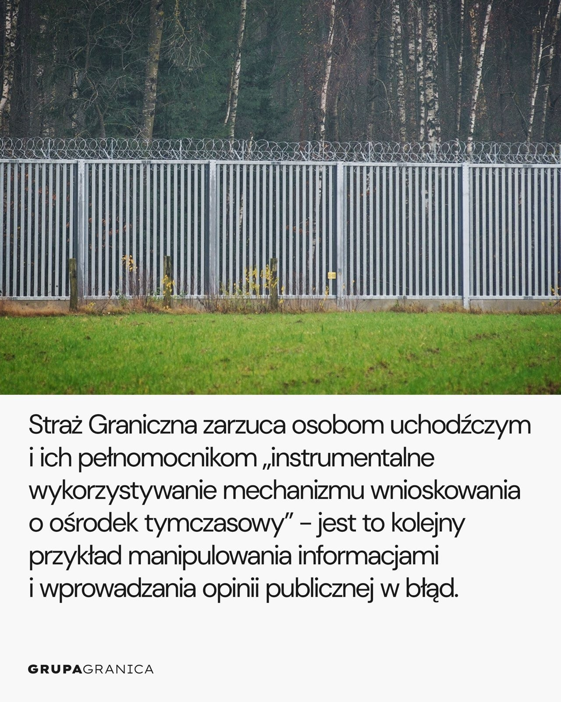
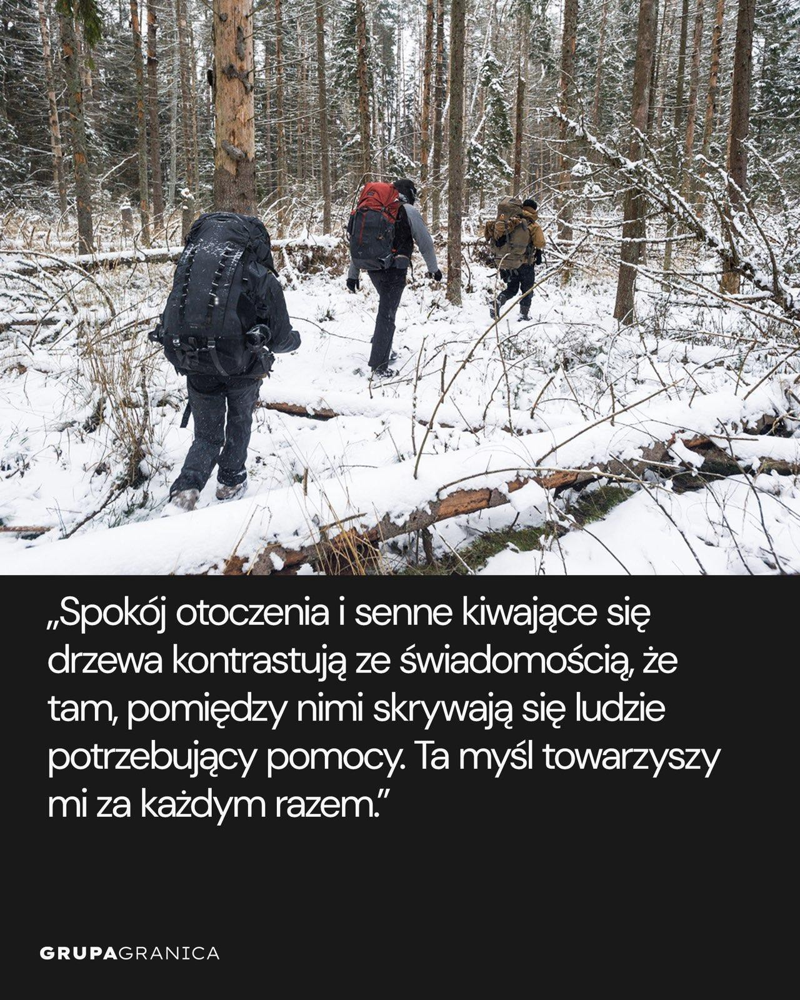
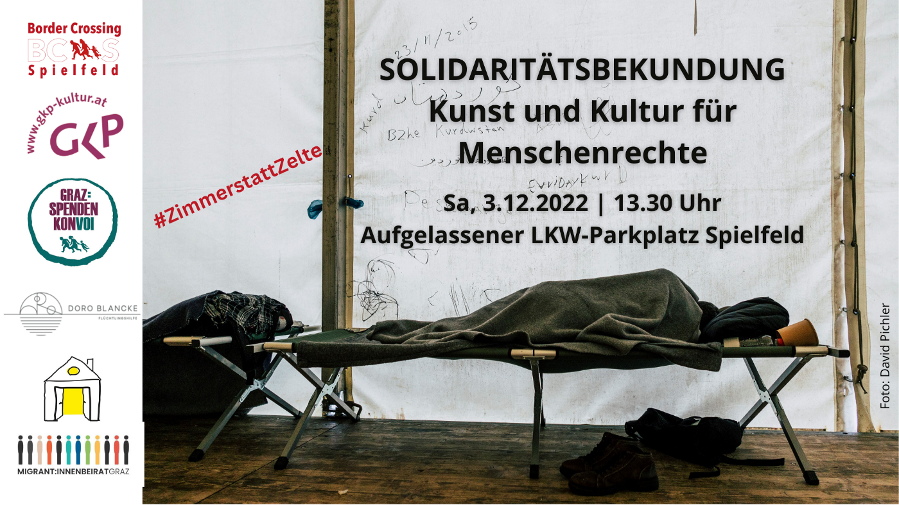

### AYS News Digest 2/12/22: The seizure of the rescue ship IUVENTA was a tragedy — but the trial against the crew members is a farce\!

**Louise Michel is back at sea//Volunteers needed in Rijeka//Interim measures issued in 100 cases at Polish//Belarussian border//Solidarity call at Spielfeld**

 \. in front of the NATIONAL ASSEMBLY at the call of the Solidarity March against the new immigration bill >>> let’s be numerous and numerous, indignant and determined\!](assets/223ce2325458/1*stItph9_v-iOF-rq7bi2xA.jpeg)

\( [RALLY TUESDAY December 6 at 4 p\.m](https://www.facebook.com/photo/?fbid=508720414627549&set=a.459198466246411) \. in front of the NATIONAL ASSEMBLY at the call of the Solidarity March against the new immigration bill >>> let’s be numerous and numerous, indignant and determined\!
#### FEATURE: The seizure of the rescue ship IUVENTA was a tragedy — but the trial against the crew members is a farce

> I don’t trust the investigative authorities to be willing and able to ensure that my rights are respected\. How could I if they even fail to respect their own rules and regulations\. **_Dariush Beigui, Iuventa_** 

In March 2021, four members of the crew of the civil rescue ship Iuventa were charged, after a five\-year long investigation, with “aiding and abetting unauthorized entries to Italy”\. The Iuventa crew is also accused of having colluded with smugglers in relation to three rescue operations despite there being no evidence to back up this claim\.

The [trail against the Iuventa crew is ongoing](https://daten.solidarity-at-sea.org/s/rxQS93LH3b8pL2Y?dir=undefined&path=%2Fenglish&openfile=696138) in Trapani and still the defendants face difficulty in accessing appropriate translation into German\. This is the third time that questioning had to be stopped because the prosecutor's office had not provided translation after the defendants had travelled there specifically\. The person that they tried to use was a retired police officer who was not listed in the official list of interpreters admitted to the court\. He has no experience in interpreting and therefore could not complete the interrogation\.

> The basic right to a fair trial has been denied to the defendant for the third time, showing that the prosecutor is not interested in knowing the factual background in order to decide if the case is worth \[being heard in\] court\. **_Francesca Cancellaro, lawyer of the defense\._** 

Meanwhile, the Louise Michel is back at sea\.

**CROATIA**
#### Volunteers needed in Rijeka

#### POLAND

**Interim measures issued in 100 cases at Polish/Belarussian border**

The European Court of Human Rights has issued interim measures in 100 cases at the border between Poland and Belarus on the grounds that the individuals’ fundamental rights cannot be guaranteed in Belarus\. [Grupa Granica](https://www.facebook.com/grupagranica?__cft__[0]=AZU3HtRD5WYd2IQprsa_WrP8Jev9JD9rEwFHQATpQoY5hwnXeifBi3XOkUoNhoisQohz7LgYKMJuBTqkyg-U5452XhvTznz6giIHjV6hX27XlsRvgGs_VOYVca8asXeqBhvYNKN6PXKPNXbKv6Q7vS_0&__tn__=-UC%2CP-R) [have raised concerns about the border guards’ basic understanding of human rights law in this regard](https://www.facebook.com/grupagranica/posts/pfbid02L952xLWnPNJ1NuNZFPuugKrooNV4PxjYJn5pRcCq3qrKhJMHrLVdrxHyC5ouVPTel) \. Pushbacks are still a common practice at the border, including of disabled people and pregnant women leading to miscarriage\. Pushbacks of all people remain illegal under international law\.

#### AUSTRIA
#### Solidarity call at Spielfeld

Today \(3\.12\.22\) many artists and cultural workers will gather at Spielfeld for a solidarity action to highlight the difficulties faced by people forced to live in the “waiting zone”\.

> More than 150 escape survivors are still suffering in wet and freezing cold in tents\. Many have been staying here for over two weeks, hungry\. People with injuries or illnesses are not treated\. There is an immediate need for solid, warm emergency shelters as well as sufficient food and medical care for the Balkan route survivors\! 

> We immediately demand from the Ministry of the Interior and the Styrian provincial government humanity and rooms instead of tents\! 

You can support them through donations [HERE](https://gkp-kultur.at/solidaritaetsbekundung-zimmerstattzelte-kunst-und-kultur-fuer-menschenrechte/?fbclid=IwAR3MZ5AM7KD59SLv34yZnzxJZv-WLjym3GM5RGO6xez1CAGW30FKyn844YQ) \.

**Find daily updates and special reports on our [Medium page](https://medium.com/are-you-syrious) \.**

**If you wish to contribute, either by writing a report or a story, or by joining the Info Gathering team, please let us know\!**

**We strive to echo correct news from the ground through collaboration and fairness\. Every effort has been made to credit organisations and individuals with regard to the supply of information, video, and photo material \(in cases where the source wanted to be accredited\) \. Please notify us regarding corrections\.**

**If there’s anything you want to share or comment, contact us through Facebook, Twitter or write to: areyousyrious@gmail\.com**

_Converted [Medium Post](https://medium.com/are-you-syrious/ays-news-digest-2-12-22-the-seizure-of-the-rescue-ship-iuventa-was-a-tragedy-223ce2325458) by [ZMediumToMarkdown](https://github.com/ZhgChgLi/ZMediumToMarkdown)._
