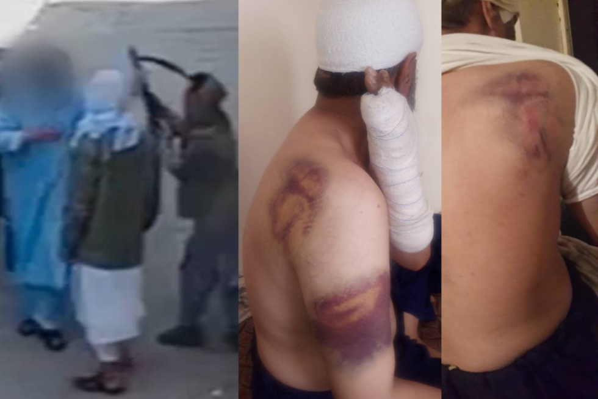
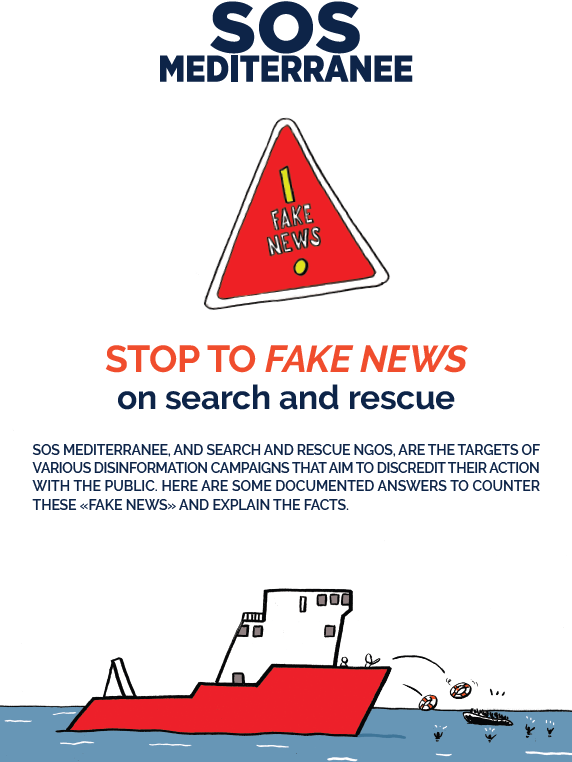

### AYS News Digest 5/12/22: “No one is in touch with us\. We’re hopeless\.” UK fails to resettle Afghans
#### Afghans promised resettlement by the UK nearly a year ago have suffered torture and death awaiting relocation // Reports on pushbacks at sea // Human Rights Watch’s critique on the European Commission’s Action Plan // The UNHCR has challenged the UK’s attempts to classify the entry of refugees as illegal

Photo: Lighthouse Reports
#### FEATURE

Not one person has been accepted and evacuated from Afghanistan under the Home Office scheme launched with such fanfare this January, [Lighthouse Reports](https://twitter.com/LHreports) say after several months of investigation\.

The UK pledged to launch a resettlement programme that would bring 5,000 at\-risk people out of the country in its first year\. The Afghan Citizens Resettlement Scheme \(ACRS\) was officially launched four months later in January 2022\. As it turns out, only a few people really did get a chance to be brought to safety from the Taliban regime\.

Government sources told the investigators there was ‘unfairness’ in the difference in approach to ACRS and to the Ukraine programmes, as well as ‘a lot of ping pong’ over which government department the scheme falls under\.

■■■■■■■■■■■■■■ 
> **[Lighthouse Reports](https://twitter.com/LHreports) @ Twitter Says:** 

> > Using open source intelligence, insights from forensic physicians &amp; interviews with more than a dozen Afghans awaiting relocation, a joint investigation by @[LHreports](https://twitter.com/LHreports) &amp; @[ObserverUK](https://twitter.com/ObserverUK) reveals that Afghans left behind have faced severe harm https://t.co/HLJXauXya7 

> **Tweeted at [2022-12-04 11:03:39](https://twitter.com/lhreports/status/1599358768742952961).** 

■■■■■■■■■■■■■■ 

Concerning the methodology, the team spent three months tracing more than a dozen Afghans who fit into the three categories the ACRS pledged to relocate\. They followed them as they navigate a new world under Taliban rule, “in which they are suddenly viewed as the enemy and, some told us, they are being “hunted down”\. We have obtained and verified documents showing their previously roles working for or associated with the UK\.”

Through in\-depth interviews, the team then gathered witness testimonies from these individuals about the physical harm they and their family members have suffered at the hands of the Taliban\.

Among other cases, they outline the example of a two year old who died because of delays accessing medical care due to Taliban threats towards her father, a former British Council teacher\.

> We gathered witness accounts & obtained medical records confirming Najwa’s death & showing she suffered from acute hepatitis, septicemia & liver failure\. 

> We obtained messages & voice notes that Taliban fighters sent to her father, Batoor, in which they threaten to behead him\. 

> Recalling Najwa’s death, Batoor says: ‘They were dark days\. If I had not been in hiding, I would have been able to help \[…\] I was to blame’\. 

“Zaid, who worked for the British embassy for 11yrs, was brutally beaten by the Taliban\. They ‘tortured’ him, said a witness\. Forensic analysis of Zaid’s injuries in photos found they ‘cd be from kicking’ or ‘other blunt force means such as a hard object & were ‘typical of an assault’”

■■■■■■■■■■■■■■ 
> **[Lighthouse Reports](https://twitter.com/LHreports) @ Twitter Says:** 

> > Nazir, the brother of fmr UK embassy interpreter Aziz, was apprehended by the Taliban outside his home earlier this year, beaten &amp; forced into their truck before being driven away

OSINT analysis of CCTV footage obtained by @[LHreports](https://twitter.com/LHreports) of the incident verifies this account https://t.co/5hL1zuTUhn 

> **Tweeted at [2022-12-04 11:03:46](https://twitter.com/lhreports/status/1599358795192602627).** 

■■■■■■■■■■■■■■ 

The Lighthouse Reports team could not share the documentation related to the forensic analysis of photos of injuries Nazir sustained while held\. However, the analysis found they were ‘attributed to whipping’\.

> “Aziz is on a list of 175 UK embassy staff we’ve seen which was handed to UK government\. Only five of them on the list have been relocated\.” 

Please, take the time to read the entire report [here](https://www.lighthousereports.nl/investigation/the-left-behind/) \.
#### SEARCH AND RESCUE \(SAR\) AT SEA

A coalition of civil society SAR NGOs has compiled a joint document providing rebuttal of the main ‘fake news’ points that are often levelled against them by right wing media sources\.

> Faced with polemics and hate speech against people rescued at sea and against the professionals respecting the obligations to save lives at sea, SOS MEDITERRANEE responds to preconceived or false ideas with its publication “Stop to fake news on search and rescue”\. 

> To re\-establish the truth, we rely on reliable sources, facts documented by recognised organisations \(UN, universities, etc\. \) and on the legal texts governing search and rescue\. Finally, for the sake of transparency, we only report direct observations at sea, attested by the journalists who embark on the Ocean Viking on each mission and who do their work in complete independence\. 

[**Response to the most frequent “fake news” about search and rescue operations at sea in the central Mediterranean\.**](https://en.sosmediterranee.org/wp-content/uploads/2022/11/2022-11_FAKES-NEWS_ENG_WEB.pdf) 
[**DOWNLOAD THE PUBLICATION\.**](https://en.sosmediterranee.org/wp-content/uploads/2022/11/2022-11_FAKES-NEWS_ENG_WEB.pdf)
### Pushbacks

A compiled set of reports on the pushbacks in the Aegean:

■■■■■■■■■■■■■■ 
> **[Aegean Boat Report](https://twitter.com/ABoatReport) @ Twitter Says:** 

> > In November @[ABoatReport](https://twitter.com/ABoatReport) have registered 109 illegal pushbacks in the Aegean Sea, performed by @[HCoastGuard](https://twitter.com/HCoastGuard), 2592 people, children, women and men, have been denied their right to seek asylum, their human rights have been violated by the 🇬🇷 government. https://t.co/TL7RQa6dHR 

> **Tweeted at [2022-12-02 12:19:40](https://twitter.com/aboatreport/status/1598653121730953217).** 

■■■■■■■■■■■■■■ 

The newest vessel to join the civil SAR fleet, Sea Punk 1, continues her journey to the Mediterranean through challenging conditions in the Bay of Biscay:

#### EUROPE

**The EU’s latest proposed Central Mediterranean policy is a doubling\-down on existing policies that will violate fundamental human rights, further empower criminal organisations and further restrict civil society NGOs**

The [action plan](https://ec.europa.eu/commission/presscorner/detail/en/ip_22_7068) on the Central Mediterranean, proposed this November 21 and [endorsed](https://www.consilium.europa.eu/en/meetings/jha/2022/11/25/?utm_source=twitter.com&utm_medium=social&utm_campaign=20221125-JHA-results&utm_content=photo) by home affairs ministers a few days later, is another missed opportunity for the EU to reset its myopic and harmful policies on this crucial migration route, Human Rights Watch say\.

> The new plan ignores [recommendations](https://www.hrw.org/news/2021/06/16/plan-action-twenty-steps-protect-people-move-along-central-mediterranean-route) to re\-introduce state\-led, proactive search and rescue operations under the auspices of the EU and to establish a clear mechanism for [predictable disembarkation](https://sea-watch.org/en/joint-letter-timely-and-predictable-european-arrangements-for-disembarkation/) in a place of safety of people rescued in the Central Mediterranean\. The plan also fails to incorporate a process for relocation of people to other EU countries, to share responsibility and alleviate the pressure on the country of disembarkation\. 

> Instead of dealing with EU member states’ [refusals](https://www.hrw.org/news/2020/02/18/eu-turns-its-back-migrants-distress) to undertake and coordinate the rescue of migrant boats in distress and [to allocate](https://www.hrw.org/news/2022/11/08/italy-allow-everyone-rescued-disembark) safe places of safety to ships operated by nongovernmental rescue groups, the European Commission continues to constrain these organizations’ life\-saving work at sea, referring to an alleged “need for a specific [framework and guidelines](https://home-affairs.ec.europa.eu/eu-action-plan-central-mediterranean_en) for vessels\.” 

> As rescue [groups state repeatedly](https://www.politico.eu/article/eu-privatizing-migration-policy-mediterranean-migrant-rescue-boats/) , international maritime law already establishes a legal framework for rescue at sea, which civilian rescue ships already respect\. It is high time EU governments do the same\. 

Read [more](https://www.hrw.org/news/2022/12/01/new-eu-migration-plan-same-rights-violations?fbclid=IwAR2PSJKtmeVhJp5uR6p1FaOhLi_MMaZ9FGqiDVahGEcmSy2Usbc1x4x_ySo) \.
#### UK
### “…at odds with international law”

The UNHCR has challenged the UK’s attempts to classify the entry of refugees as illegal, arguing that it is at odds with international law:

_“An appropriate response to the increase in arrivals and to the UK’s current asylum backlog would include strengthening and expediting decision\-making procedures, ensuring that those without well\-founded claims are returned to their own countries; and stepping up cooperation with its European neighbours, including through multilateral transfer systems\. Expanding safe, regular pathways for refugees to travel to the UK would also offer real alternatives to dangerous, irregular journeys\._

_We continue to urge the UK Government to pursue humane and cost\-effective measures to ensure that refugees receive the protection they need, while addressing the complex challenges presented by the rise in Channel crossings\.”_
#### WORTH READING
- [Beyond Transit : Precarious Emplacement and the Wavering Reception of Migrants in the City of Zagreb](http://su.diva-portal.org/smash/record.jsf?fbclid=IwAR18qn0FHeN12IpMe_IA9_zE2CCJb9Ui4lVMvQKQv5ZWvJXEzIGA-UCf-xI&aq2=%5B%5B%5D%5D&c=1&af=%5B%5D&searchType=SIMPLE&sortOrder2=title_sort_asc&query=igor+petri%C4%8Devi%C4%87&language=en&pid=diva2%3A1704302&aq=%5B%5B%5D%5D&sf=all&aqe=%5B%5D&sortOrder=author_sort_asc&onlyFullText=false&noOfRows=50&dswid=-4988) :

_“The territory of the Republic of Croatia has historically been a place of forced and economic migration, mainly consisting of population movements between former Yugoslav states and other neighbouring European countries\. Since the 2000s, these borderlands have become sites of continuous transit migration from the Middle East and Africa\. Based on ethnographic fieldwork conducted in Zagreb over several periods between 2016 and 2020, this thesis seeks to understand how non\-European migration and places of transit in the Balkans interrelate and transform each other\.”_
- Lighthouse Reports have compiled a forensic open\-source report on the Moroccan/Spanish border, in Melilla\. With many lives lost, persons still missing and both Moroccan and Spanish denials and obfuscations, they have highlighted an event that needs to be brought into the open:

[](https://l.facebook.com/l.php?u=https%3A%2F%2Fwww.lighthousereports.nl%2Finvestigation%2Freconstructing-the-melilla-massacre%2F%3Ffbclid%3DIwAR3I6_ljQNG_zE0b1BRgUsE9Y6gdXMf_ukoKPw6EWlGc8j_4XH43IUuWy-Q&h=AT1Xvp08vfqdalG9KvMLlAAEfzVAFC6St5uT-9sjLfufGGdjVty5pZJDmqORrH1NrEKJM0NhMhbrq9fhqXMOk6CpoUOIuIXddNNJo3MYi92I6decHEIpfKEyse-9FPgNqZXV3SrQ0n60mc9rFuA6BFfhjoYFgg&__tn__=R]-R&c[0]=AT15era7VkjJT-RvpgnTXW7bsz89SSJUXW7vTGdr11bmZnmOAMd8VGQ-fLLweOuCM6ukBjWQP5X72fPVC0D82f_0bNJkj6nDsqPB5SGK45ZBPhzuSZI9fwdoX_sDsaspWvLSwIHwue4cLSc8_yTfiQ0vGp4akOvoyJFbX6ieMG1RHEzUcGiyH5ENRoMRV-XGpCKkn8w-tuFl0WSV)

- [UNHCR calls for support, solidarity amid rise in risky Andaman Sea crossings](https://www.unhcr.org/news/briefing/2022/12/6389bed04/unhcr-calls-support-solidarity-amid-rise-risky-andaman-sea-crossings.html?fbclid=IwAR0WwTM5ttcth5httZOLW3zpdFY4idXL3-IRHncdnvmM1tBeqg56guzreag)

**Find daily updates and special reports on our [Medium page](https://medium.com/are-you-syrious) \.**

**If you wish to contribute, either by writing a report or a story, or by joining the Info Gathering team, please let us know\!**

**We strive to echo correct news from the ground through collaboration and fairness\. Every effort has been made to credit organisations and individuals with regard to the supply of information, video, and photo material \(in cases where the source wanted to be accredited\) \. Please notify us regarding corrections\.**

**If there’s anything you want to share or comment, contact us through Facebook, Twitter or write to: areyousyrious@gmail\.com**

_Converted [Medium Post](https://medium.com/are-you-syrious/ays-news-digest-5-12-22-no-one-is-in-touch-with-us-a0e058f356aa) by [ZMediumToMarkdown](https://github.com/ZhgChgLi/ZMediumToMarkdown)._
