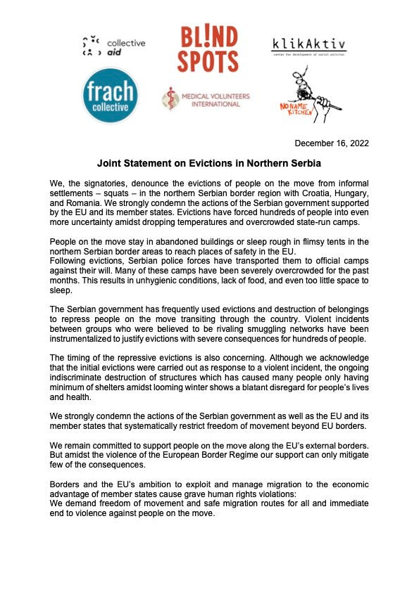
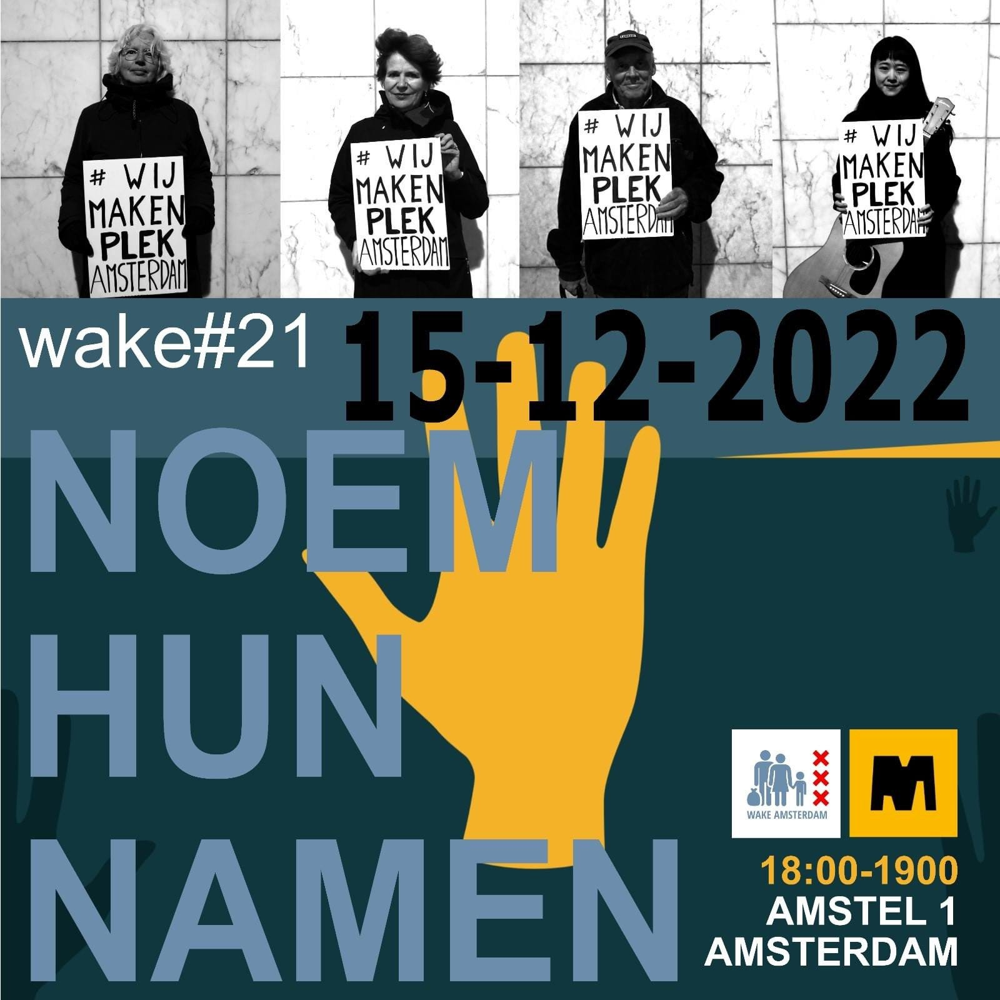
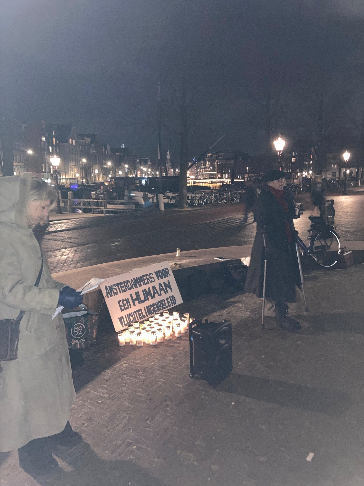
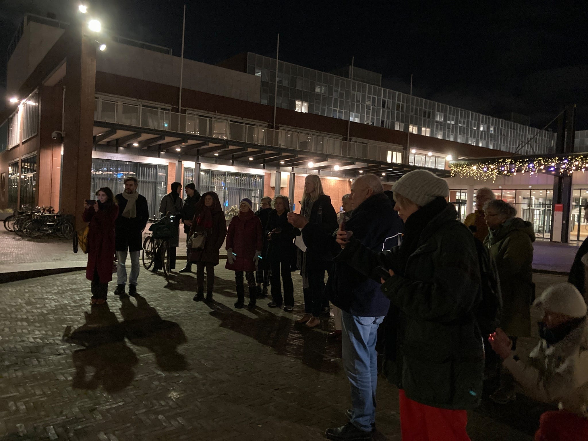

### AYS News Digest 15–16/12/22: 15 people pushed back to Turkey

**No rescue in Evros despite ECHR ruling // Next court date set in ongoing Lesvos trial // Greek migration minister’s Christmas balls // Joint statement against evictions in Northern Serbia // Protest against pushbacks held in Amsterdam // Protests and vigils in UK and France // New OLAF investigation into Frontex**

 )](../assets/ab93205eb11f/1*QmKRgJmZ-PcngZRW-5r2XQ.jpeg)

(Since 2020, BVMN has recorded 16 testimonies from people on the move who have been intercepted and apprehended in Hungary and North Macedonia and pushed back to Serbia and Greece respectively, with the involvement of Czech officers. Photo Credit: [@Border\_Violence](https://twitter.com/Border_Violence) )
#### FEATURE: 15 people pushed back to Turkey

[On the 15th of December, Alarm Phone received a call from 15 people](https://twitter.com/alarm_phone/status/1603440288688738304) stranded on Lipsi, a small island between Leros and Samos. They reported the situation to the Hellenic Coast Guard and Port Authority, but received no further news from the authorities. Remaining in contact with the group, they later discovered they had been pushed back to Turkish waters, having been beaten and robbed of their possessions and forced onto a small life raft. The Turkish Coast Guard confirmed the rescue.

[Border Violence Monitoring Network have taken testimonies from 207 separate pushbacks from Greece to Turkey since 2019](https://www.borderviolence.eu/violence-reports/?ri-incident-location-geo-radius=50&ri-pushback_from=Greece&ri-pushback_to=Turkey&ri-underage-involved=all&ri-intention-asylum-expressed=all&ri-page=1) . These have involved thousands of people illegally removed from the territory by masked men who cannot be identified and high levels of violence. This figure represents only a small number of the incidents which have occurred. Each pushback is illegal. Every single one puts lives at risk either immediately, through the violence enacted, or because they are returned to a country where they are at risk without having had their asylum claim heard. There are no comprehensive figures for the number of deaths caused as a direct result of pushbacks, many border deaths are invisible with bodies taken by the Evros river or the Aegean sea, or buried without names far from home and without the presence or knowledge of their loved ones.
#### GREECE

**No rescue despite ECHR ruling**

In a [further update to our previous digests](https://medium.com/are-you-syrious/ays-news-digest-12-12-2022-spotlight-on-bulgaria-70-facing-criminal-charges-7a9e79a5a071) , a group of people remain trapped on an Evros islet despite the European Court of Human Rights issuing interim measures. [They are in immediate need of healthcare and assistance](https://twitter.com/alarm_phone/status/1603725333957644288) and report that four young men were taken yesterday by masked men. Their location is now unknown. Several people have also sustained injuries inflicted by border guards.

The territory of the islet is split between Greece and Turkey and this has been used to delay assistance to people for fifteen days now. [As Syrians, they are at direct risk of being deported to Syria if they are returned to Turkey.](https://balkaninsight.com/2022/10/24/hrw-turkey-deporting-refugees-to-syria-using-force/#:~:text=Human%20Rights%20Watch%2C%20HRW%2C%20the,between%20February%20and%20July%202022.) It is illegal to deport people to a country were they are at risk of violence and persecution.

**Greek migration minister’s Christmas baubles**

On a lighter, if somewhat bizarre, note, staff of the Migration Ministry were this week tasked with putting Migration Minister Mitarakis’ face on Christmas tree decorations. We see no point in asking why, but one thing we can say is that few people have brought less joy to the world than this man who has arranged for families with young children, disabled people, torture survivors and other people with vulnerabilities to be evicted onto the street from [the ESTIA program](https://www.fenixaid.org/articles/closure-of-estia-ii-thousands-of-extremely-vulnerable-asylum-seekers-to-be-left-without-humane-and-adequate-accommodation-and-proper-care) me throughout the ‘festive’ period, while promoting pushbacks leading to deaths at sea and preventing people from claiming asylum by overseeing a dysfunctional website portal for registering claims.

■■■■■■■■■■■■■■ 
> **[Twitter User](https://twitter.com/i/status/1602776612214390787) @ Twitter Says:** 

> >  

> **Tweeted at .** 

■■■■■■■■■■■■■■ 

#### SERBIA

**Joint statement against evictions**

#### THE NETHERLANDS
#### Protest held in Amsterdam

A protest was held at the town hall in Amsterdam on 15th December against pushbacks in Greece, Albania and Romania and in support of the group facing trial on Lesvos, which includes a Dutch national, Pieter Wittenberg.

 )](../assets/ab93205eb11f/1*tPdlFup5I8YG5WTX2DVGYQ.jpeg)

(Photo Credit: [@rosagroen](https://twitter.com/rosagroen) )

In t [he ongoing campaign of criminalization against over 20 humanitarian volunteers](https://www.facebook.com/HIASGreece/posts/pfbid029SyyDpeGDNyMCMBGgRr75Zos1uqDSpwcWYw7kzayCbH5ntHPYpuCqupN6C5SHQgTl) who worked with an NGO on Lesvos, the next misdemeanor hearing has been scheduled for January 10, 2023. At this time it is still unclear whether the prosecution have been able to compile a sufficient case for prosecution. [This case is now in its fourth year](https://www.theguardian.com/world/2021/nov/14/on-trial-for-saving-lives-the-young-refugee-activist-facing-a-greek-court) .
#### UK and FRANCE

**Protests and vigils**

> Hello brother we are in a boat and we have a problem please help. Uh, we have children and family in a boat. And a boat, water coming … we don’t have anything for rescue for … safety. Please help me bro please please. We are in the water we have a family. — [_Last voice note received by Utopia 56 from boat in distress_](https://alarmphone.org/en/2022/12/14/the-deadly-line-militarised-borders-lead-to-more-deaths-in-the-english-channel/) 

 )](../assets/ab93205eb11f/1*tcsShB_Um8FQ0weyGYwzYQ.jpeg)

(‘Neither forget nor forgive’. Photo Credit: [@Utopia\_56](https://twitter.com/Utopia_56) )

Following the deaths of four people in the Channel on December 14th, there have been protests and vigils on both sides of the border. [On the night of the 15th](https://twitter.com/Utopia_56/status/1603475388482654218) , people gathered to commemorate those who have lost their lives at borders in Calais, while in London a silent vigil was held.

■■■■■■■■■■■■■■ 
> **[Stand Up To Racism](https://twitter.com/AntiRacismDay) @ Twitter Says:** 

> > A minutes silence for those that died in the channel last night #RefugeesWelcome #SafePassage https://t.co/BcEfRxum57 

> **Tweeted at [2022-12-15 19:15:42](https://twitter.com/i/status/1603468864012095495).** 

■■■■■■■■■■■■■■ 

In Leeds, UK, [a protest and collection has been called for Saturday 17th](https://www.facebook.com/events/s/solidarity-with-refugees-no-to/3302428030016129/) .

> The importance of welcoming refugees safely was highlighted starkly today by the tragic and horrific deaths of 4 people in a small boat crossing across the English Channel. — [_Stand Up To Racism_](https://www.facebook.com/StandUTR/) _and [Leeds Stand Up To Racism](https://www.facebook.com/leedssutr/)_ 

On the same night that four people lost their lives, [another boat in distress called for help 15 times](https://twitter.com/Utopia_56/status/1603806424949309452) and did not receive rescue. They had to come back to the coast alone in a boat full of water.
#### FRONTEX

**New OLAF Investigation into FRONTEX**

The director of the European coast guard and border guard agency, FRONTEX, is being investigated by the European Union’s anti-corruption watchdog (OLAF) according to a joint investigation, [reveals Lighthouse Reports](https://mobile.twitter.com/LHreports/status/1603720971659026432) . This latest scandal is due to the agencies’ refusal to pay the rent on properties leased for its employees and comes only eight months after the previous director, Fabrice Leggeri, stepped down when [internal documents made it clear that FRONTEX was aware of and involved in pushbacks](https://www.lighthousereports.nl/investigation/frontex-the-eu-pushback-agency/) .
#### WORTH READING

[‘Swamping’, ‘Cockroaches’, ‘Invasion’: How Language Shapes our View of Migration — Byline Times](https://bylinetimes.com/2022/12/16/swamping-cockroaches-invasion-how-language-shapes-our-view-of-migration/?fbclid=IwAR2leXDzfp8qPYQLrXV1mrljquT8R4NB-yoX_ID8_NLd51pP0eue4oF9T18) : A look at the dangers of language and how we use it with a focus on the British Government.

[Scars like this never heal — Afghan evacuee Zahra speaks out on Channel tragedy — Refugee Council](https://www.refugeecouncil.org.uk/latest/news/scars-like-this-never-heal-afghan-evacuee-zahra-speaks-out-on-channel-tragedy/?fbclid=IwAR3BwSW6MpUAKv-qDV3HeK_b5Gj_Mv3y_dAiixWLAgbU_f21yp4dEonJq88) : _Zahra is a journalist, women’s rights activist and mother. She was evacuated from Afghanistan when Kabul fell to the Taliban last summer._

**Find daily updates and special reports on our [Medium page](https://medium.com/are-you-syrious) .**

**If you wish to contribute, either by writing a report or a story, or by joining the Info Gathering team, please let us know!**

**We strive to echo correct news from the ground through collaboration and fairness. Every effort has been made to credit organisations and individuals with regard to the supply of information, video, and photo material (in cases where the source wanted to be accredited). Please notify us regarding corrections.**

**If there’s anything you want to share or comment, contact us through Facebook, Twitter or write to: areyousyrious@gmail.com**

_[Post](https://medium.com/are-you-syrious/ays-news-digest-15-16-12-22-15-people-pushed-back-to-turkey-ab93205eb11f) converted from Medium by [ZMediumToMarkdown](https://github.com/ZhgChgLi/ZMediumToMarkdown)._
