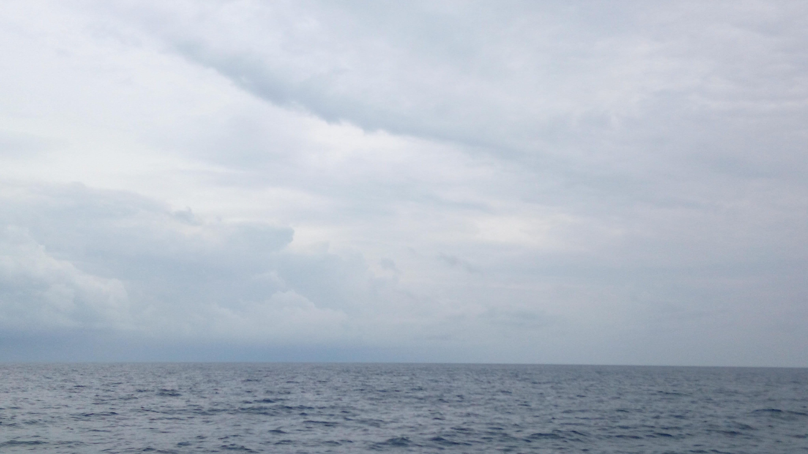

### AYS News Digest 21/12/22: EU Member States attempt to cover up their crime
#### Alarm Phone’s official statement on the tragic death of a two-month-old infant off Lesvos // UNHCR against the UK’s decision to send people off to Rwanda // Reactions to Priti Patel’s Christmas Card // Report on the loss of lives of people entering EU through Spain // Reports, long reads worth your time and other useful information

Since 2014, Alarm Phone has reacted to more than 5000 distress calls from people on the move in different regions of the Mediterranean Sea and the Atlantic Ocean.
#### FEATURE
### Alarm Phone’s official statement on the tragic death of a two-month-old infant off Lesvos

Alarm Phone, like all other NGOs remaining on the island, face official obstruction from Greek authorities.

“When we were contacted by the group, we alerted Greek authorities and, as always, we also sent the distress call to UNHCR and to several NGOs that are active in the region. This is a procedure we always follow, and since October 2014, we have done the same in about 2000 emails. Greek authorities are well aware of how we operate for the past eight years. There is nothing new in the way we proceeded that day.”

Since 2014, Alarm Phone has reacted to more than 5000 distress calls from people on the move in different regions of the Mediterranean Sea and the Atlantic Ocean. “The level of violence and the crimes against people on the move by different state authorities that we witness each day when people call us are something we can never forget,” they write.

> We are lacking words to express the deep grief and anger that every loss of life at the European borders leaves within all of us! 

> In reaction to the incident, the Greek police published a press release attributing their presence and the blocking of medical assistance to a criminal investigation opened against the Alarm Phone in 2020. Since 2020, when it was publicly announced that Alarm Phone would be under investigation, no official questions were addressed to our network. We published a statement shortly after the press release circulated in Greek media. 

> In times of repeated attacks by Greek state authorities against minorities — with the most recent incident being the murder of a 16-year-old Roma person — our deep solidarity is with everyone who suffers from and opposes the deadly racist violence. 

> The Hellenic Police’s press release is a desperate attempt to cover up their crime. 

> Access to the people in distress was needlessly blocked. 

Read their entire statement [here](https://alarmphone.org/en/2022/12/20/another-attempt-to-cover-up-the-real-crimes/?post_type_release_type=post&fbclid=IwAR1AG1lGXThrrivT6EKvFUSrclXnSp2UsHCeSWh2Ni8A5KDS4NqDy9XVRv0) .
#### SEARCH AND RESCUE AT SEA

The Intercept details the long-running, extensive and futile attempts by the Italian state to prove that the Iuventa was engaged in people smuggling:

[Inside Italy’s Crackdown on Humanitarian Rescue (theintercept.com)](https://theintercept.com/2022/12/21/italy-iuventa-humanitarian-rescue/?fbclid=IwAR3NppHX8wrwJQ22d7H8P_QvYPcS3qzZufyUvTSjCxMsyuZdY0XNHTqGHHU)
#### SPAIN
### On average, six lives lost per day

Spanish NGO Caminandos Fronteras has just published a report detailing the cumulative human cost of people attempting to enter Europe via Spanish borders — approx 11,000 people since 2016, an average of six lives lost per day.

This report provides an analysis over time which shows the shift towards increasingly dangerous migration routes.

According to them, the second most dangerous route is between Algeria and Spain where 1,526 people died over the same period. The other two routes to Spain analyzed in the report are between Morocco’s Atlantic coast and mainland Spain as well as via the Alboran Sea, the westernmost portion of the Mediterranean between Morocco and mainland Spain.

> Over the last five years, the Spanish State has worked with countries such as Morocco, Algeria, Mauritania and Senegal to establish bilateral migration policies. The arbitrary nature of these policies has significantly diminished protection for the rights of people on the move. 

> The right to life is not recognised at the shared borders with these countries, allowing them to apply migration control policies that seek to defend the territory in ways that cause harm and even death to migrants. These policies are implemented via global rulings on territorial control in the European context. Victims are left defenceless and highly vulnerable by the lack of mechanisms for protection. 

> The data presented in this report shows that the loss of the lives of these 11,286 people is due not to chance but to a structured necropolitics that is sustained over time and underpins the construction of global migration systems in the 21st century. In the context of European migration control, especially in the Spanish State, most victims missing as corpses are rarely found on sea routes. 

Read this important and well-framed report [here](https://caminandofronteras.org/wp-content/uploads/2022/12/Victimes-of-the-necrofrontier-18-22-ENG.pdf) .
#### UK
### “Doubling down with the same failed approach”

UK Home Secretary and panto villain Suella Braverman is “unhappy with the rate at which her civil servants are processing the refugee caseload”.
Reportedly, the [Home Office](https://www.theguardian.com/politics/home-office) is looking at ideas for using alternative accommodation other than hotels to house people seeking asylum, and she suggested officials were in talks with ship companies.

> “The average decision-making rate of a decision-maker per week is one. We need to increase that considerably. 

> We want to end the use of hotels as quickly as possible because it’s an unacceptable cost to the taxpayer, it’s over £5m a day on hotel use alone,” said the Home Secretary. 

57,000 people are housed by local authorities under the asylum dispersal scheme.

The reality of those several weeks was that outflow was being exceeded by the inflow because it was very difficult to procure a sufficient numbers of beds from across the country. It was a very challenging situation, said Suella Braverman.

“Her ludicrous proposals to house refugees in cruise ships will once again be ineffective and incredibly expensive,” the Liberals’ spokesman [said](https://www.theguardian.com/uk-news/2022/dec/21/suella-braverman-says-civil-servants-productivity-on-asylum-claims-is-too-low) reacting to these statements and the proposed solution to the state of things.
### Reactions to Patel’s Christmas Card

Former Home Secretary and instigator of the Rwanda policy Priti Patel, has blown the anti-refugee dog whistle loudly yet again with her newly-released Christmas Card.

Reactions didn’t fail.

> “We have seen Priti Patel’s lack of basic human decency time and time again — why should we expect anything less at Christmas time?” 

> “This is the Christmas card of someone who read the nativity story and thought King Herod had the right idea. 

> “If Priti Patel had been around, Mary, Joseph and Jesus would have been on their way to Rwanda before the three wise men could arrive,” _the Liberal Democrats’ home affairs spokesperson said._ 

It is worth mentioning that the senior judges rejected arguments that the plans to provide one-way tickets to the Rwanda were unlawful.

Lord Justice Lewis, sitting with Mr Justice Swift, dismissed the challenges against the policy as a whole, but ruled in favour of eight asylum seekers, finding the government had acted wrongly in their individual cases, the English media [report](https://www.thelondoneconomic.com/politics/priti-patel-sends-out-xmas-card-depicting-her-magicking-up-deportations-to-rwanda-340892/?fbclid=IwAR0dlMVrgvqGCFEQH-n_lAblFTsYQCpJUUi3FXdSvChnqY6AjcbRci0kDHY) .

In more heartening reports, it may be the case that despite forced Rwanda deportations being judged legal by the UK High Court, as we reported in the [previous News Digest](https://medium.com/are-you-syrious/ays-news-digest-20-12-2022-uk-rwanda-plan-not-unlawful-judges-rule-a727a23de9de) , pressure from civil society continues to make this air charter activity unpalatable to civil air transport operators. Read more:

[Government yet to find airline to transport migrants to Rwanda](https://www.thelondoneconomic.com/politics/government-yet-to-find-airline-willing-to-transport-migrants-to-rwanda-340898/?fbclid=IwAR1NTO2OAaGN5kiUtU01EcO6jKzF593VlTTpudihf71GhQhqDbLuvT_r4uY)
#### WORTH READING
- SOS Humanity has released an overall chronological summary of key events of 2022 within the Central Med SAR situation: [Europe Continues to Wall Itself Off — SOS HUMANITY](https://sos-humanity.org/en/press/2022-annual-review-of-search-and-rescue-europe-continues-to-wall-itself-off/?fbclid=IwAR1j855AsFGwBsTezoIz39_9vd6PJ81iIVY-vLyyPqcfqcTRxjh8R1Z836A)
- UK Refugee charity ‘The Other Side of Hope’, which showcases literature written by the refugee community, has released its 2022 annual magazine: [online editions — the other side of hope | journeys in refugee and immigrant literature](https://othersideofhope.com/online-editions.html?fbclid=IwAR2HvFUh0CTDjTPD5CUb6y2CfqTcOdmjoirvuWGF7lWRSgaiZMGjKpCuu78)

**Find daily updates and special reports on our [Medium page](https://medium.com/are-you-syrious) .**

**If you wish to contribute, either by writing a report or a story, or by joining the Info Gathering team, please let us know!**

**We strive to echo correct news from the ground through collaboration and fairness. Every effort has been made to credit organisations and individuals with regard to the supply of information, video, and photo material (in cases where the source wanted to be accredited). Please notify us regarding corrections.**

**If there’s anything you want to share or comment, contact us through Facebook, Twitter or write to: areyousyrious@gmail.com**

_[Post](https://medium.com/are-you-syrious/ays-news-digest-22-12-22-eu-member-states-attempt-to-cover-up-their-crime-510739fad7ed) converted from Medium by [ZMediumToMarkdown](https://github.com/ZhgChgLi/ZMediumToMarkdown)._
