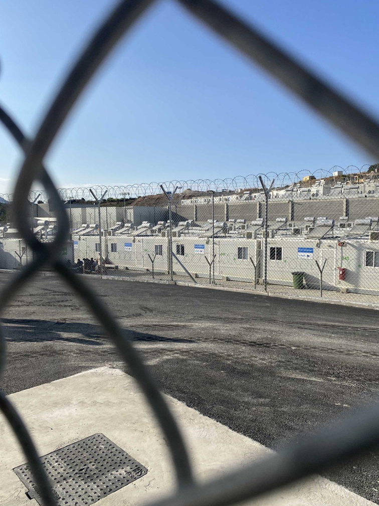
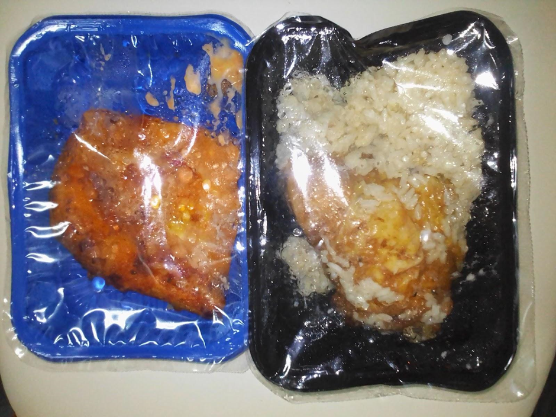
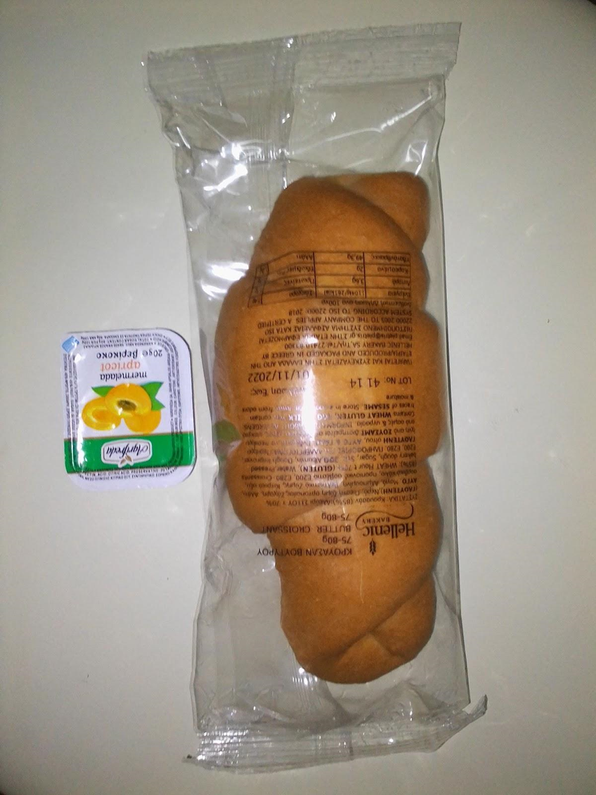

### AYS Special from Greece: **The Eye —** _An asylum-seeker’s account on pushbacks and life in Samos Refugee Camp_
#### ‘The Eye’ is a collection of short articles written by S., a resident of the Samos Closed Controlled Access Centre (CCAC). Due to fear of reprisal, S. wishes to remain anonymous. “I thought it was important to write a few articles for people to know the situation when you are an asylum seeker.”

Containers in the Samos Closed Controlled Access Centre “CCAC” behind barbed wire
### **Part 1: Bedbugs and Police Beatings: Inside Samos Refugee Camp**

It has been said by many that the Samos Refugee Camp (the Closed Controlled Access Centre) was meant to be a camp with a difference, one that could host refugees with modern facilities including a free wifi/hotspot for asylum seekers, good food and unlimited access to running water…

> As an asylum seeker presently in the camp I would like to make it categorically clear that if measures are not put in place the camp will soon look like an “African prison in Europe”. 

Asylum seekers in Samos risk their precious lives crossing the Aegean Sea after they have run from war, violence, political persecution etc., for a life worth living, a safe life, with good food, good health, shelter, and moreover freedom and security just like ordinary European citizens. The absence of any of the above might cause more harm than good to those who are seeking safety in Europe.

There are testimonies from the quarantine section of the camp that police beat asylum seekers. The police ask “do you want coffee or cigarettes”, depending on what people say, they are separated into groups and then beaten. The fact is that not even yours truly writing this piece has the guts to come out publicly and point out some of those police officers.

My honourable readers, it will interest you to know that, in addition to police brutality, there are other burning issues in the Samos refugee camp like the insufficient food supply, unhealthy and crowded containers.
### **A Spoonful of Rice and a Leg of Chicken: Food in Samos Camp**

An asylum seeker, who does not wish to be named, described the food to me as tasteless and worthless to the different nationalities. Most asylum seekers have been unable to eat the food unless they add other condiments like pepper, mayonnaise etc., in order to make the food palatable.

The asylum seeker also pointed out that since he entered the camp three months ago, he has not received the financial stipends from the Greek authorities that he was promised to be receiving every month. Instead, he has been forced to call friends and loved ones to send him money so that he could buy the necessary condiments and other stuff. This is a reality for the majority of us in the Samos camp.

It is common to see people rushing to the food distribution on Mondays and Wednesday afternoons because, on these days, we are given a spoonful of rice and a leg of chicken. After we receive the supply, people often put their chicken legs together and re-cook them with other ingredients like oil, onions, chicken stock etc. to get a pot of soup that will serve them for a few more days.

> That is why in summer this year many will try to beat the system on Mondays and Wednesdays by either reproducing their food coupons or keeping the breakfast coupons to try and get more food. 

People also try to get the police papers of others before leaving the camp for them to collect food on their behalf. The camp authorities soon caught onto these tricks and have been even stricter with the food distribution lines.

_Leg of chicken and rice in the Samos CCAC_

_Breakfast in the Samos CCAC_
### **Containers and Disease: Accommodation at Samos Camp**

Six to eight people occupying a container is a very serious risk for the transmission of diseases, especially in a COVID-19 pandemic. For example there have been several outbreaks of scabies at Samos Camp in this year.

Until November this year, only one of the two sections of the CCAC was opened. In my opinion, it was heartless on the part of the camp administration to have six to eight occupants in one container knowing very well that there are new containers that have not been used since the construction of the camp. If you’re a woman, imagine eight people using the same bathroom and toilet every day.

Someone was making fun of the camp and said the camp has been divided into three sections: the bedbugs section, the cockroach section and the section of flies and if you are looking for me just ask for the cockroach section where we compete with cockroaches to eat the “tasteless food”.

> Until I moved to Samos Camp, I never knew that cockroaches could bite you. Now I am covered in bites, and I sleep in long sleeved clothes to protect myself. 

One reason for insects taking over the containers is — we have observed that people are moved from one container to the other without disinfecting the containers which will also help remove contaminants and decrease risk of infection of any disease.
### **Life in Lines: Control and Management at Samos Camp**

The microphone system at the camp serves as the channel of communication between the camp authorities and the asylum seekers. Every morning, even though it sounds horrible, the different nationalities wake up early before 8am to listen to the calls on the loudspeakers. The words “good morning, please pay attention” are the first words of every announcer of each language followed by the information he/she may want to communicate to the asylum seekers.

Most times these are announcements made to direct people in the camp to go to different places like the asylum department, “info point” (information point), first reception or second reception.

The newcomers are waiting most of the time for a call to 2nd reception room number 4, the “info point’’, or the Greek asylum department for them to complete their registrations and asylum interviews. People who have lived at the camp for longer, are usually waiting for a call to reception room 2 and 3. If you are called to room 2, your fellow camp residents will be waiting patiently to know if you have been given an open card (an open card lifts your geographical restriction from one of the hotspot islands and allows you to travel to the mainland) or whether your final decision is positive or negative.

> People have different opinions when it comes to asylum decisions inside the camp. The Africans believe they are kept in the camp for a very long period only to be given open cards that transfer them to another camp without any decisions. Whilst for those from Asia and elsewhere, the longest they stay at the camp is three months until they are provided with documents that allow them to move freely within the European Union. 

It’s important to note that the Africans think they are treated poorly because of their race, and this hurts more than when other nationalities celebrate at the camp after a huge number of them have been issued positive decisions.

Lines form every morning for breakfast supplies, in the afternoon for lunch and dinner supplies, it is important to note that lines also form for other reasons like entering and leaving the camp. These lines are full of confusion, mostly created by the people themselves. Especially when it comes to entering the bus or the camp. People will come from the back of the line and join their countrymen at the front.

The most recent incident was a fight between some Africans and Asians in which one Asian was punched and sustained seriously injury to his nose while on the bus.

A census is taken every Tuesday. It starts at eight and goes on until evening. People stand in line from 8am till 4pm and wait on a first-come-first-served basis but most often the lines shorten because the process is fast, as you only need maybe two minutes once you enter the office.

Even though the reasons for the census are not clear nor is it clear how the authorities use the data, camp authorities let residents wait every week. People are not allowed to leave the camp until they register for the census. After the registration every Tuesday they are given a small document which provides information to show they have completed the registration for the week. Why is this done every week and why not every month or even every three months? Is it that they do not have records of the asylum seekers coming and going from the camp?
### **Part 2: Pushbacks: How to Kill with Impunity**

Pushbacks are state measures by which asylum seekers are forced back over the Turkish border immediately after they have crossed into Greece. This happens without any consideration of their individual circumstances and asylum claims. This is a gross human-rights violation because European and international law provide for the right to seek asylum in another country and to be protected.

Article 33 of the 1951 Geneva Convention defines the principle of _non-refoulement_ ; it “forbids the act of pushing back asylum seekers to the places where they believe their lives and freedom are threatened because of their membership to a social group, their political opinion, race, nationality or religion”.

> In this, my small-scale investigation as an asylum seeker, I spoke with a lot of people. It’s alarming that most accidents on the Aegean Sea that have caused the deaths of many in recent times are due to pushbacks by the Greek coast guard. These incidents must be investigated and stopped so that many lives can be saved. 

For this article I talked with survivors of pushbacks in the Closed Controlled Access Centre (CCAC) on Samos and in Turkey. During this investigation I talked to several persons who experienced a pushback on 30 June 2022 during which two people died. The group was trying to cross from Turkey to Samos. At around 1:30am a boat from the Greek coast guard intercepted their vessel.

The coast guard came so close that the people in the vessel were splashed with water. While the coast guard tried to overtake their boat for over ten minutes, their boat was pushed up against a rock. Several people fell into the water. The two victims, one called “Officer” and one called “Ali”, drowned while others managed to swim to shore. The coast guard didn’t do anything to save those in the water. They switched off their boat and later took nine people, mainly women and children, to the Samos CCAC.

According to an eye witness whom I spoke with over the phone in Turkey, they were arrested by the Greek police on 2 September 2022. They were a group of seven, three men and four women. While waiting for the UN or Medicines San Frontiers (MSF) to collect them and take them to the CCAC on Samos, the group was arrested by the Greek police. The next day, 3 September 2022, the group was taken out to sea.

> They were given three life jackets for the three women. The four men were told to hold on to those who had the jackets. Then they were pushed into the water. One of them drowned. His name was Alimammy Kamara alias “Champion”. The others had to swim their way to Turkey where they were arrested by the Turkish police. 

There are many similar allegations of such behaviour when the coast guard officers mistreat asylum seekers, both on land and at sea. I was told that the coast guard officers wear balaclavas, gloves and are dressed in black from head to toe. You only see their eyes. You are forced to keep your head down so you will not recognise them. Afterwards, they take all your things, including your phone and money.

> I have heard reports in which coast guard officers undress and search people’s private parts in front of everyone who has been arrested, both men and women, young and old. 

During these investigations, I realised that there are two ways in which people are pushed back by the Greek coast guard and it’s important to note that both ways are very risky and can lead to multiple deaths.

The first way is when fewer than ten people have been arrested. In these cases, the coast guard will take them out to sea, give them a few life jackets and push them into the water. If you’re not lucky to be given a life jacket and you do not know how to swim, say your last prayers.

The other pattern is when a larger group is being pushed back. They are taken out to sea by a large coast guard vessel to the area between Greece and Turkey and, one by one, they are pushed onto a life raft. They are left to be buffeted by the wind until they are rescued or arrested by the Turkish coast guard. If you are unlucky, the raft, which is made of plastic, is damaged before you are rescued and, if you can’t swim, you will all die. But also, if you’re unlucky and you are not pushed onto the raft but directly into the water and are unable to swim, you will die.

> The patterns shown above with which the Greek coast guard does their pushback, shows us the reason why most of the people dying in the Aegean Sea end up in Turkey. This clandestine strategy makes it look as if they died in Turkish territorial waters. 

But the big question, one that most of those I interviewed could not answer, is why the Greek coast guard does their pushbacks in a way that causes the death of so many people. Are they under instructions to do it this way? Is it a way of threatening the people or trying to stop them from seeking asylum in Greece? Or just a way to kill people with impunity?

**_Written by S., a resident of the Samos Closed Controlled Access Centre_**

**Find daily updates and special reports on our [Medium page](https://medium.com/are-you-syrious) .**

**If you wish to contribute, either by writing a report or a story, or by joining the Info Gathering team, please let us know!**

**We strive to echo correct news from the ground through collaboration and fairness. Every effort has been made to credit organisations and individuals with regard to the supply of information, video, and photo material (in cases where the source wanted to be accredited). Please notify us regarding corrections.**

**If there’s anything you want to share or comment, contact us through Facebook, Twitter or write to: areyousyrious@gmail.com**

_[Post](https://medium.com/are-you-syrious/ays-special-from-greece-the-eye-an-asylum-seekers-account-on-pushbacks-and-life-in-samos-refugee-111792b7cd1b) converted from Medium by [ZMediumToMarkdown](https://github.com/ZhgChgLi/ZMediumToMarkdown)._
