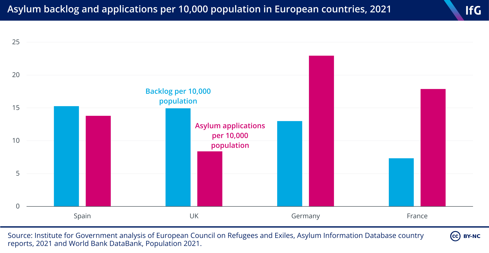
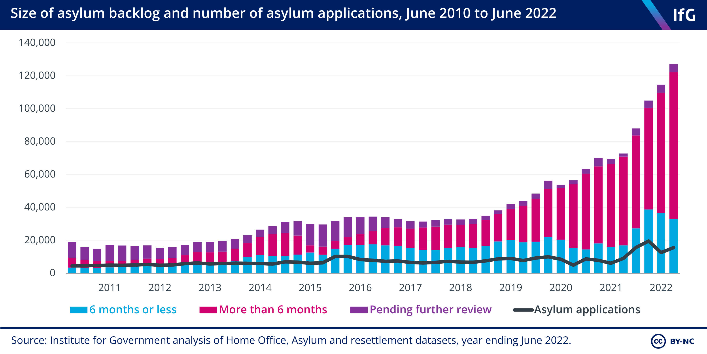

### AYS UK Special: Another year of Home Office negligence, incompetence, and chaos

Nationality and Borders Act 2022 setting the scene for this year // The legality and next steps of the UK-Rwanda Agreement // Backlog of asylum applications // Use of unlawful and unsuitable accommodation to house asylum seekers // Lack of safeguarding and the disappearance of unaccompanied minors

Source: The Independent, Home Office told to ‘get a grip’ on issues at Manston immigration centre as watchdog warns over failings, 1/11/22
### Introduction

The Council of Europe Human Rights Commissioner has recently shared her concerns over growing human rights issues in the UK, [particularly in relation to refugees and asylum seekers](https://www.ein.org.uk/news/council-europe-human-rights-commissioner-finds-significant-regression-uks-protection-rights) .

> ‘The Commissioner highlights numerous issues of concern relating to the UK’s existing policies towards refugees, asylum seekers and migrants, including the newly introduced inadmissibility rules for asylum claims, the possibility of removing persons to Rwanda, the criminalisation of asylum seekers arriving irregularly, and the differential treatment of refugees based on the manner of their arrival. She also warns against the use of practices that would result in pushbacks of people crossing the Channel.’ 

The concerns mentioned above are not new, but measures have been put into place these last few years that degrade and restrict the rights of asylum seekers and refugees. This article will highlight some of the most concerning issues that have been raised this last year. By no means will it cover everything — however this article seeks to provide a basic description of the breadth of human rights concerns faced through 2022.
### Nationality and Borders Act 2022

Criticisms of the 2022 Nationality and Borders Act have come from many sources and angles and below is an overview of some of the main issues with the Act.

Firstly, it states that if you enter the UK without a visa, from a country where you need a visa to enter the UK, then you are entering illegally and risk being imprisoned for up to 4 years. As there is no asylum seeker visa, this criminalisation applies to most asylum seekers. [It is unlikely, however, that many asylum seekers will be charged simply because this would put a great deal of pressure on the UK judicial system](https://righttoremain.org.uk/what-does-the-nationality-and-borders-act-mean-for-uk-asylum-and-immigration-law/) .

■■■■■■■■■■■■■■ 
> **[Care4Calais](https://twitter.com/Care4Calais) @ Twitter Says:** 

> > Now that Braverman has admitted the only was to claim asylum in the UK is to travel here illegally, why do we still have the Nationality and Borders Act? https://t.co/DMJUJaoXpt 

> **Tweeted at [2022-11-25 12:32:50](https://twitter.com/care4calais/status/1596119719782014976).** 

■■■■■■■■■■■■■■ 

What, then, are the legal options available for asylum seekers? Despite the UK’s previous Home Secretary, Priti Patel, promising that the new Act would introduce more safe and legal routes, [there is in fact no mention of such new routes](https://www.theguardian.com/uk-news/2022/apr/17/fury-as-patels-borders-bill-found-misleading-on-safe-routes-for-migrants) . By the end of 2022, Suella Braverman, the new Home Secretary, [still struggled to answer a question on legal and safe routes](https://twitter.com/BBCPolitics/status/1595381835491835905?s=20&t=dYjDV5IZ2UsqGzjaMSNkdw) . Whilst the Afghan, Ukrainian, and Hong Kong schemes have many faults, they have at least allowed several thousand people to reach the UK on a visa and seek safety.

However, there is no scheme or plan that addresses those crossing the Channel, which at the moment, is one of the primary concerns for the government. **This year, [almost 46,000 individuals have crossed from France to the UK](https://www.theguardian.com/uk-news/2022/dec/26/ninety-people-cross-channel-in-small-boats-on-christmas-day?amp) , compared to an estimated 28,526 in 2021.** Instead of creating a scheme that would actually reduce the numbers of people attempting to make such a dangerous journey across the Channel, [the government attempts to ban such individuals from seeking asylum](https://www.independent.co.uk/news/uk/suella-braverman-home-secretary-charities-rwanda-conservative-party-b2213977.html) . In the case of refugees from Albania, the UK government even went so far as to begin discussions with the Albanian government regarding initiating deportations.

More than a year after the fall of Afghanistan’s government to the Taliban, [there are still many people eligible for the Afghan schemes who are stuck in Kabul. Many have been beaten and tortured by the Taliban, and have been let down by the UK government.](https://medium.com/are-you-syrious/ays-news-digest-5-12-22-no-one-is-in-touch-with-us-a0e058f356aa) Many are [forced to hide from the Taliban](https://www.theguardian.com/world/2022/dec/03/revealed-uk-has-failed-to-resettle-afghans-facing-torture-and-death-despite-promise) , and/or flee to neighbouring countries and attempt a journey to the UK, where if they manage to arrive, will have fewer rights and experience greater hostility than if the UK actually fulfilled its promises through the scheme and supported them in getting out of Afghanistan in the first place. This highlights such failures in both the Afghan visa schemes and the logic behind the asylum system in general.

Source: The Guardian, Revealed: UK has failed to resettle Afghans facing torture and death despite promises, 3/12/22

In addition, the Act discusses the ‘ _inadmissibility_ ’ of claims. According to the Act, if an asylum seeker has a connection to a ‘safe third country’ then their claim is _inadmissible_ and they are sent to that country. **They can also potentially be sent to another country that the UK deems ‘safe’, even if they don’t have any connection to that particular country e.g. Rwanda.** The ‘link’ can mean many things, such as, if the individual has a refugee status there; or has claimed asylum but is still waiting on the decision; or has received a negative decision. It can also mean if an individual could have applied for asylum in a country but didn’t. Even if someone is shown to have an admissible claim, this extra step slows down the asylum process. [The UN 1951 Convention Relating to the Status of Refugees does not state that an individual should be prevented from applying for asylum in a country if they have travelled through a ‘safe’ country](https://www.unhcr.org/3b66c2aa10) — as a result, this ‘ _inadmissibility_ ’ clause, once again, does not comply with the UN 1951 Convention.

Following on from this, this Act separates individuals into different ‘groups’. This outrageous plan aims to separate those who reach the UK without going through any safe countries, Group 1, from those who have travelled through safe third countries, Group 2. Group 1 asylum seekers will be able to apply for leave to remain, whereas, Group 2 will only be able to apply for a ‘ _temporary refugee permission_ ’ which grants them 30 months of leave to remain. If the individual wants to stay longer, they need to renew their status every 30 months for 10 years until they can receive permanent residence. Once again, they are categorising and separating asylum seekers, trying to deter individuals from seeking asylum in the UK, and are therefore restricting the opportunities for those who have crossed the Channel.

[UK: Priti Patel’s Borders Act is ‘unlawfully rewriting’ what it means to be a refugee | Amnesty International UK](https://www.amnesty.org.uk/press-releases/uk-priti-patels-borders-act-unlawfully-rewriting-what-it-means-be-refugee)

[What Does the Nationality and Borders Act Mean for UK Asylum and Immigration Law? — Right to Remain](https://righttoremain.org.uk/what-does-the-nationality-and-borders-act-mean-for-uk-asylum-and-immigration-law/)
### Rwanda plan

**The idea:** A small group of asylum seekers arriving in the UK will receive an initial screening by the Home Office and will then be sent to Rwanda for their asylum application to be processed according to Rwandan immigration law. If they receive a positive claim, they will obtain a recognised refugee status in Rwanda — there is no route for them to come back to the UK. If their claim is rejected, it is Rwanda’s responsibility to deport the individual back to their country of origin.

Source: The Independent, Government’s Rwanda policy to deport asylum seekers is lawful, High Court rules

So far the UK government has spent £140 million on this scheme. Due to an interim measure introduced by the European Court of Human Rights in the Summer, as of yet no one has been deported to Rwanda, although dozens of people were initially slated to be deported on a plane earlier this year.

Rwanda has a history of human rights abuses, corruption, torture, and has reported using refugees in conflict. Nonetheless, this month, the UK High Courts determined that the Rwanda plan is legal. The court case did not assess the legality of Rwanda’s asylum system, but rather that the UK-Rwanda agreement, including the [Memorandum of Understanding](https://www.gov.uk/government/publications/memorandum-of-understanding-mou-between-the-uk-and-rwanda/memorandum-of-understanding-between-the-government-of-the-united-kingdom-of-great-britain-and-northern-ireland-and-the-government-of-the-republic-of-r) and Notes of Verbales, would be upheld by the Rwandan government. This means that historical information about the mistreatment of refugees was irrelevant in this case, as they believe the agreement means refugees sent from the UK will be treated fairly and humanely.

Similarly, the claimants argued that the UK-Rwanda plan further breaches Articles 31 and 33 of the UN 1951 Convention. These articles relate to non-penalisation and non-refoulement respectively. In terms of Article 31, the court found that, whilst there are differences between the Dublin system and the Rwanda agreement, the basic concept is similar. There has not previously been any conflicts between the Dublin system and the Refugee Convention, so as a result, the court found this not to be a concern for the Rwanda deal. In relation to Article 33, the court had already agreed that they believe Rwanda will uphold their end of the agreement, so would not expel a refugee to a country where they risk persecution, directly or indirectly.

■■■■■■■■■■■■■■ 
> **[Caroline Lucas](https://twitter.com/CarolineLucas) @ Twitter Says:** 

> > ICYMI: it’s time to bring a permanent end to this Govt’s uselessly cruel #Rwanda policy, and set up safe routes *now*.

[indy100.com/politics/carol…](https://www.indy100.com/politics/caroline-lucas-vile-government-rwands)

https://t.co/FfsE1AvtWX 

> **Tweeted at [2022-12-20 16:55:31](https://twitter.com/carolinelucas/status/1605245522687791112).** 

■■■■■■■■■■■■■■ 

#### What now?
- Notices of intent have been sent to asylum seekers who the Home Office are considering sending to Rwanda. With the support of lawyers, these will be appealed.
- While these appeals are ongoing, the interim measure implemented by the European Courts states that no flights can leave to Rwanda _‘until 3 weeks after delivery of the final domestic decision in ongoing judicial review proceedings’_ .
- The Court of Appeal will be assessing the cases, and the UK Supreme Court will likely also need to make their own assessment on the cases.
- Lastly, another airline needs to agree to carry asylum seekers to Rwanda, as Privilege Style backed out.

Considering the glaring human rights violations involved in deporting asylum seekers to a separate country against their will, refugee rights activists continue campaigning for the Home Office to revise their plans and construct legitimate plans for asylum seekers’ settlement within the UK.
### Backlog of asylum applications

Due to the slow asylum process, errors, and lack of training, there is an increasing number of individuals waiting on their decision. Of those who arrived by boat in 2021, 96% are still waiting on their asylum decision!

93% of the 46,000 individuals who have arrived this year have applied for asylum, and the vast majority do eventually receive a positive decision. Whilst it is true that the numbers of asylum seekers arriving in the UK has increased dramatically in the last few years, the House of Commons Home Affairs Select Committee state;

> ‘that the slow processing of applications has been a bigger driver in increases to the backlog than the increase in the number of applications themselves’. 

70% of asylum seekers are waiting over 6 months, an increase from 43% in 2017. During this time there has been increase in the number of caseworkers, but a decrease in productivity. The Institute for Government delves into why this has happened: [Asylum backlog | The Institute for Government](https://www.instituteforgovernment.org.uk/explainers/asylum-backlog#:~:text=In%202021%2F22%2C%20there%20were%20614%20caseworkers%20who%20made,a%20productivity%20rate%20of%2013.7%20decisions%20in%202011%2F12.)

The main impacts of the backlog include deteriorating mental and physical wellbeing of asylum seekers, overcrowding in accommodation facilities, such as Manston immigration centre, and rising government costs on temporary accommodation and financial support for asylum seekers.
#### **What is being done?**

Rishi Sunak’s speech included the plan to streamline the asylum process in an effort to reduce the backlog of those waiting on their asylum claims. This includes, shortening interviews, doubling the number of caseworkers, having more regular interviews, and increasing the rates of decision making. The government plans to recruit and train 2400 new caseworkers by the end of 2023.

You can take the Refugee Action quiz that gives you an idea of the sorts of questions asked: [Refugee Action quiz (refugee-action.org.uk)](https://act.refugee-action.org.uk/page/119439/data/1?locale=en-GB)
### Inadequate accommodation

It has now been widely reported that there are huge concerns with Home Office accommodation provided to asylum seekers. There have been multiple testimonies of safeguarding issues, overcrowding, lack of access to WIFI, and so much more. The pandemic highlighted the unsuitability of these accommodations as many centres had to be shut down in 2020 and 2021.

■■■■■■■■■■■■■■ 
> **[CJ McKinney](https://twitter.com/mckinneytweets) @ Twitter Says:** 

> > The immigration and borders inspector, David Neal, tells MPs he was left "speechless" after visiting the short-term migrant detention centre in Manston, Kent on Monday and seeing the overcrowding and staffing situation. https://t.co/hWL31ogcHT 

> **Tweeted at [2022-10-26 13:41:56](https://twitter.com/mckinneytweets/status/1585265476166459393).** 

■■■■■■■■■■■■■■ 

#### **Overcrowding**

In October this year, Manston immigration centre which had a capacity of 1600 individuals, was accommodating 4000 people. It is intended to house individuals for no longer than 24 hours after arrival to the UK, however, it was clear that in November, there were individuals who had been kept there for weeks.

Emails among senior civil servants after Suella Braverman’s visit in early November made it abundantly clear that they knew the conditions in Manston were unsuitable:

> “Their detention is no longer legal as they can only be detained whilst their identity is locked down and then only for a maximum of 5 days,” one email read. 

> “Most have been there for a number of weeks, longer than some Manston cases. We need to move them to hotels ASAP…” 

These emails reference overcrowding, tents being used in the centre to accommodate asylum seekers, the risk of diseases spreading, [illegal detention of individuals](https://www.bbc.com/news/uk-64037136) , and untrained staff supervising individuals.

The Home Office has now cleared the centre.
#### **Spread of diphtheria**

Over 70 asylum seekers in Manston are thought to have contracted diphtheria, a contagious illness that has been uncommon in the UK since the introduction of a vaccine in the 1940s. It is considered a [notifiable disease](https://www.gov.uk/government/collections/diphtheria-guidance-data-and-analysis) , meaning medical practitioners in England and Wales have a duty to report to the local authorities if an individual has contracted diphtheria. It can result in hospitalisation and potentially death. [One individual at Manston passed away in November](https://www.theguardian.com/uk-news/2022/nov/19/man-being-processed-at-manston-detention-centre-in-kent-dies) — it is still unclear as to the cause of death but he had contracted diphtheria.

Reports suggest several individuals contracted the illness prior to arriving in the UK. However, the conditions in Manston allow for it to spread rapidly and there is not enough protection and and healthcare support to reduce the risk of diseases spreading. The Home Office [have since introduced vaccinations against diphtheria in Manston](https://www.theguardian.com/uk-news/2022/nov/12/manston-asylum-centre-diphtheria-vaccinations-ukhsa-home-office) .
#### **Asylum seekers left in central London**

When the Home Office decided to clear out Manston in November, they ended up leaving groups of asylum seekers alone on the street in central London.

](../assets/1b998fe55279/0*fRSZ5S2ydZrS4kBl)

Source: [Manston asylum seekers ‘abandoned’ at London station ‘with nowhere to stay’ | The Independent](https://www.independent.co.uk/news/uk/politics/manston-asylum-seekers-london-victoria-b2216464.html)

A group of 11 people, and another group of around 50 people, had been left at Victoria coach station. Witnesses of the group of 11 stated that [they didn’t have any warm winter clothes and were left there, not knowing where they could go](https://www.independent.co.uk/news/uk/politics/manston-asylum-seekers-london-victoria-b2216464.html) . They hadn’t been given any money by the Home Office and weren’t given any information about where to go.

Despite the Home Office claiming that the group of 11 being left was an ‘operational’ error, Abbas, from the organisation ‘Under One Sky’ stated:

> “A British Transport Police officer at Victoria told me that that has been going on since Saturday — coaches of refugees are just being dumped here,” 

Witnesses had not seen any Home Office staff present at Victoria station.
#### Homelessness and concerns about accommodation for Ukrainian refugees

Whilst the government supported households to accommodate Ukrainian refugees under the ‘Homes for Ukraine’ scheme, which was set up very quickly as a response to the Russian invasion, there was a great deal of mismanagement and delays in visa processing, and essential safeguarding measures.

Delays in DBS checks on hosts resulted in refugees being housed with families and individuals who had not yet received a proper background check. This left individuals, who had already fled war and violence, exceptionally vulnerable and at a high risk of abuse and exploitation. Many did then experience abuse in the household and others were kicked out within weeks of arriving in the UK, adding to the emerging homelessness crisis among Ukrainian refugees that had already started in March and April 2022.

The numbers of [homeless Ukrainian refugees by the end of this year has risen by 30%](https://www.thetimes.co.uk/article/homeless-ukrainian-refugees-uk-host-families-czpjgcxnb) as host agreements are coming to an end. Between October and November 2022, roughly [550 households who arrived via the Homes for Ukraine Scheme had contacted their local councils](https://www.politicshome.com/news/article/ukrainian-refugees-homelessness-risk-rise-40-per-cent-in-single-month) , stating that they were at risk of homelessness. What is even more concerning is that the number could be much higher as some local councils have not provided such data. The government never set out a long-term move-on plan and have known for months that eventually the host agreements would come to an end.

Lastly, without any formal move-on plan, there is limited support for those leaving their host accommodation. Within the context of a housing crisis and shortage of affordable housing in the UK, a large proportion of hosts live in wealthier areas where there can often be an even more limited supply of affordable and social housing.

[‘There’s nowhere else for them to go’: what next for 100,000 Ukrainians and the Britons who took them in? | Ukraine | The Guardian](https://www.theguardian.com/world/2022/nov/29/homes-for-ukraine-refugees-ukrainian-britons-scheme)

[Ukrainian refugees in UK face homelessness crisis as councils struggle to find hosts | Refugees | The Guardian](https://www.theguardian.com/world/2022/oct/30/ukrainian-refugees-uk-homelessness-councils-hosts)

[Thousands of Homes for Ukraine Hosts Urge Rishi Sunak To Increase Refugee Support (politicshome.com)](https://www.politicshome.com/news/article/homes-for-ukraine-sanctuary-foundation-letter-refugees-support-rishi-sunak)
#### Asylum seekers moved back to Napier Barracks

After Rishi Sunak stated that the government was attempting to tackle the issue of accommodation of asylum seekers, the Home Office decided to move people back to Napier Barracks at very short notice and just before Christmas.

[A High Court ruling in 2021](https://www.bailii.org/ew/cases/EWHC/Admin/2021/1489.html) stated that Napier Barracks is completely unsuitable for the housing of asylum seekers and is unlawful to use. In 2021, there had been a Covid outbreak, affecting 200 people in Napier, and a fire. The All Party Parliamentary Group on Immigration Detention claimed its ‘ _alarming’, ‘insanitary, crowded, prison-like_ ’. However, Napier Barracks is referred to as ‘contingency accommodation’ rather than ‘asylum accommodation’ which reduces the responsibility of the Home Office, and [enables them to get away with continuing to house asylum seekers there](https://lordslibrary.parliament.uk/the-use-of-napier-barracks-to-house-asylum-seekers-regret-motion/) .

■■■■■■■■■■■■■■ 
> **[Hackney Anti-Raids](https://twitter.com/AntiRaidHackney) @ Twitter Says:** 

> > CALLOUT we just recieved: 
7 asylum seekers currently housed at the National Hotel, Queens Avenue, N10 have been told they will be removed to Napier Barracks TODAY. Please get down there to show support ASAP and share on your network 

> **Tweeted at [2022-12-20 11:10:53](https://twitter.com/hackneyantiraid/status/1605158792685006848).** 

■■■■■■■■■■■■■■ 

[Haringey Council and Haringey Welcome have publicly condemned this move](https://www.lgcplus.com/services/housing/borough-appalled-at-decision-to-move-asylum-seekers-to-napier-barracks-21-12-2022/) . Whilst hotels are not ideal for asylum seekers, the council and local organisations have worked hard to support individuals in establishing a network and community around them. This last minute move will completely shatter this progress and support. The Home Office response focuses on the amount of tax payers’ money being spent on hotels and emphasises the fact that they would apparently never send asylum seekers to inadequate accommodation.

■■■■■■■■■■■■■■ 
> **[Stand Up To Racism](https://twitter.com/AntiRacismDay) @ Twitter Says:** 

> > Good statement opposing the attempts to remove asylum seekers from from Haringey to Napier barracks today #RefugeesWelcome https://t.co/ZKoWX4zd4U 

> **Tweeted at [2022-12-20 14:43:37](https://twitter.com/antiracismday/status/1605212330626883585).** 

■■■■■■■■■■■■■■ 

### Unaccompanied minors going missing

This year, [more than 70 children have disappeared](https://www.brightonandhovenews.org/2022/12/12/more-than-70-children-disappear-from-hove-hotels-housing-asylum-seekers/) from hotels in Hove, including 30 children from just one hotel. Out of the 30 children, 9 have now been located. In addition, [another 40 Albanian children](http://www.infomigrants.net/en/post/45178/almost-40-albanian-child-migrants-missing-from-uk-care) have gone missing from Kent authorities’ care between January and October 2022.

One predominant issue is the pressure on local authorities that has been mounting in the last few years. Under the Borders Act 2009 and the Children Act 1989 and 2004, the Home Office and local authorities, respectively, have a duty of care to protect and promote the safeguarding and welfare of children. It is therefore the role of both bodies to ensure children within the local authority are properly supported and the correct safeguarding mechanisms are in place. However, the Home Office [doesn’t provide enough resources nor funding](https://www.thestar.co.uk/news/people/sheffield-city-council-caring-for-rising-number-of-asylum-seeking-children-arriving-in-country-alone-3940743) to meet the increase in unaccompanied minors being supported by the local authorities.

> “There has been a big jump in the number of children put in unregulated placements, up by 23 per cent, and without the right safeguards, these young people are at a massive disadvantage and risk of going missing, being sexually exploited, groomed or coerced into criminal activity like county lines.” — Marieke Widmann, Children’s Society policy and practice advisor 

Between July 2021 and June 2022, the Home Office has housed 1606 unaccompanied minors in hotels — which is unlawful. Many unaccompanied minors will be kept in hotels until local authority foster care is arranged. In these hotels, there is [not enough welfare support, and often there is inadequate food and hygiene facilities](https://www.infomigrants.net/en/post/39951/unaccompanied-minors-face-neglect-in-uk-refugee-accommodation) . The local authorities often blame the Home Office, and vice versa, which means there is uncertainty about who is responsible, and this has a damning effect on the welfare and safeguarding of these minors.

Unaccompanied minors have even been accommodated in Manston immigration centre. Some testimonies highlight the trauma experienced by young individuals who have already lived through horror and have endured even more mental distress from staying in Manston: [‘When did we stop being human?’ How our migrant detention centres are failing vulnerable children — Prospect Magazine](https://www.prospectmagazine.co.uk/politics/migrant-detention-centres-manston-age-dispute-project)

You can read more about the critical conditions unaccompanied minors are faced with, at the hands of the Home Office:

[Home Office pays out over child refugee hotel blunders | News | The Times](https://www.thetimes.co.uk/article/home-office-pays-out-over-child-refugee-hotel-blunders-t6l86qt5f)

[Afghan boy, 5, who died in Sheffield hotel fall named as Mohammed Munib Majeedi | Sheffield | The Guardian](https://www.theguardian.com/world/2021/aug/19/five-year-old-afghan-refugee-falls-to-death-from-sheffield-hotel)

[Dozens of lone Albanian child migrants in care missing, council admits | The Independent](https://www.independent.co.uk/news/uk/home-news/albanian-child-migrants-missing-kent-b2238391.html)

[Unaccompanied minors face neglect in UK refugee accommodation — InfoMigrants](https://www.infomigrants.net/en/post/39951/unaccompanied-minors-face-neglect-in-uk-refugee-accommodation)
#### WORTH READING:

[‘When did we stop being human?’ How our migrant detention centres are failing vulnerable children — Prospect Magazine](https://www.prospectmagazine.co.uk/politics/migrant-detention-centres-manston-age-dispute-project)

[The New Humanitarian | Five migration solutions for Europe for 2023](https://www.thenewhumanitarian.org/opinion/2022/12/06/migration-solutions-Europe-2023-policy-ideas)

[When will there be another Rwanda removal flight? — Free Movement](https://freemovement.org.uk/when-will-there-be-another-rwanda-removal-flight/)

[Rwanda judgment: details of 8 individual cases show incompetent and unfair Home Office decisions — Refugee Council](https://www.refugeecouncil.org.uk/latest/news/rwanda-judgment-details-of-8-individual-cases-show-incompetent-and-unfair-home-office-decisions/)

[Impunity Entrenched: Policing the Borders — Institute of Race Relations (irr.org.uk)](https://irr.org.uk/article/policing-the-borders-impunity-entrenched/#_edn1)

[How we can challenge the ‘Anti-Refugee’ Bill (gal-dem.com)](https://gal-dem.com/how-to-oppose-nationality-borders-bill/)

[“We also want to be safe” — undocumented migrants facing COVID in a Hostile Environment | Joint Council for the Welfare of Immigrants (jcwi.org.uk)](https://www.jcwi.org.uk/we-also-want-to-be-safe-report)

[Stop ‘vilifying’ asylum seekers and let them work, says former refugees minister (telegraph.co.uk)](https://www.telegraph.co.uk/news/2022/12/23/stop-vilifying-asylum-seekers-let-work-says-former-refugees/)

[Parliamentlive.tv — Justice and Home Affairs Committee](https://parliamentlive.tv/event/index/d21c8bde-dd13-4180-885e-a1e904fb842b)

**Find daily updates and special reports on our [Medium page](https://medium.com/are-you-syrious) .**

**If you wish to contribute, either by writing a report or a story, or by joining the Info Gathering team, please let us know!**

**We strive to echo correct news from the ground through collaboration and fairness. Every effort has been made to credit organisations and individuals with regard to the supply of information, video, and photo material (in cases where the source wanted to be accredited). Please notify us regarding corrections.**

**If there’s anything you want to share or comment, contact us through Facebook, Twitter or write to: areyousyrious@gmail.com**

_[Post](https://medium.com/are-you-syrious/ays-uk-special-another-year-of-home-office-negligence-incompetence-and-chaos-1b998fe55279) converted from Medium by [ZMediumToMarkdown](https://github.com/ZhgChgLi/ZMediumToMarkdown)._
