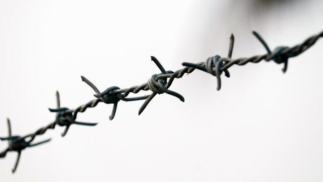

### AYS News Digest 18/1/23: Croatia in violation of Convention, and has to pay fire survivor, ECHR ruled
#### New Human Rights breach from Croatia, says European Court for Human Rights / Forensic reconstruction video evincing the Greek authorities’ illegal expulsion of 200 people off the coast of Crete in 2020 / Mitsotakis lies, doesn’t deny, and repeats accusations of treason / Campaign calling Frontex officials: see something, say something / & more important information

Once again, the internationals courts confirm a consistent issue found with those putting Croatian migration and asylum policies (more importantly, border management) in practice, that is that “no attempt had been made to establish whether there had been broader institutional shortcomings”.

Broader institutional shortcomings have indeed exacerbated the already seriously bad situation regarding human and other rights stemming from the core documents signed by this new Schengen area member, also an EN Member state (with the longest terrestrial border with third countries) and NATO member.

As the European Court for Human Rights press release reads:

**The Situation**

On 27 March 2015 in the early hours of the morning the border police found the applicant and three other persons in a lorry who had clandestinely entered Croatia from Serbia. They were taken to Bajakovo police station, arrested and put in a basement room used for the detention of illegal migrants pending their expulsion back to Serbia the next day. However, later that evening a fire broke out in the basement room. According to the Government, the applicant and other detainees set fire to their mattresses, bedsheets and clothes, probably using a cigarette lighter. The fire was intense and spread uncontrollably.

A number of police officers rushed into the basement area to rescue the detainees. One of the detainees died at the scene of the incident, while two others later succumbed to their injuries. The applicant suffered burns to his forearms, hands, lower legs and feet, requiring surgery. The authorities immediately conducted an on-site inspection, interviewed the applicant and about 30 police officers, conducted an autopsy (on the detainee who had died during the fire) and obtained an expert opinion on the cause of the fire.

Disciplinary proceedings were brought against those two officers at the recommendation of a report drawn up by an independent team of experts formed by the Ministry of the Interior. The team’s report concluded that there were failings in the surveillance of the migrants at the crucial moment when the fire was lit: one of the police officers responsible for guarding them had left to write a report, while the other had gone to the kitchenette to prepare them dinner.

It also concluded that a search of the migrants had not been thorough since cigarette stubs had been found in the detention room, indicating that they had been smoking. One of the officers was acquitted in those proceedings, while the other was found responsible for a serious breach of official duty for not supervising the detainees, allowing them to start the fire.

He was fined 10% of his monthly salary for three months, taking account of mitigating factors such as his risking his life to rescue the detainees. The disciplinary court noted that the tragic event had also been caused by other factors, including “the inadequacy of the space, and some organisational shortcomings.”

In May 2018 the Attorney’s Office opened a criminal investigation against the applicant on the suspicion that he had started the fire together with the other — deceased — migrants. That investigation was terminated in June 2019 because he had, in the meantime, been expelled from Croatia to Morocco.

**Conclusions**

The case concerned a fire that broke out in the basement room of Bajakovo police station, which at the time was serving as an illegal-migrant detention centre. Three people detained in the room had died in the fire and the applicant, also a detainee, had suffered severe injuries.

The Court found that the police station and its personnel were clearly ill-prepared to deal with the outbreak of a fire, and that a number of questions have been left unanswered, despite a prompt start to the investigation. In particular, there were shortcomings in the searching and monitoring of the detainees, who had apparently managed to keep a cigarette lighter and set fire to their bedding when left unguarded.

Nor had the authorities looked into the applicant’s very serious allegations with regard to the adequacy of the premises and any fire precautions in place. Moreover, no attempt was made to establish whether there had been broader institutional shortcomings which could have prevented a similar such tragedy happening again in the future.

**The Court held that Croatia was to pay the applicant** € **15,000 in respect of non-pecuniary damage and** € **5,000 in respect of costs and expenses.**
#### GREECE
### Forensic reconstruction shows the Greek authorities’ illegal expulsion of 200 people off Crete in 2020

In October 2020, nearly 200 people who had departed from Turkey to seek asylum in the European Union were caught in a storm off the coast of Crete, Greece. Finding themselves in a state of emergency the passengers made a distress call to the Hellenic Coast Guard requesting assistance. Greece confirmed that they received an emergency call on 20 October 2020 from a boat in distress off the coast of Crete.

However, what happened next is what is in dispute in the case S.A.A. and Others v Greece (app. no. 22146/21), before the European Court of Human Rights. Τhe Greek authorities have denied that the pushback took place.

The Legal Centre Lesvos commissioned an independent forensic research team to conduct interviews with survivors of the pushback, analyse testimonies and available evidence of the pushback, including evidence from Greek authorities and Frontex, and produce this reconstruction video of the events on 20–21 October 2020.

This video demonstrates that the Hellenic Coast Guard, instead of rescuing the approximately 200 people who were in distress at sea, violently attacked, detained, and ultimately abandoned them at sea in a massive coordinated and illegal pushback operation.

[")](https://www.youtube.com/watch?v=YvEIhXEcyHU)

The evidence, including the published forensic reconstruction, not only illustrates that the Greek authorities conducted this violent pushback and therefore are liable for the associated human rights violations, but also that this operation was consistent with the Greek authorities’ systematic practice of collective expulsions that has been extensively documented and reported — both before and since the time of the events in question. Check out the full statement [here](https://t.co/hq3OrIrDsF) .

[")](https://www.youtube.com/watch?v=YvEIhXEcyHU)

### Consistent with — saying things that aren’t true

The prime minister described the trapped refugees on Evros Island as “illegal immigrants” at a press conference in Alexandroupolis on Saturday, ignoring the fact that these people, most of them from Syria, had told Greek authorities from the outset that they wished to seek asylum, **a right that Greece stubbornly denied them** for about a month. In fact, these people joined the asylum process immediately after their very late rescue, and some, including little Maria’s family, have now been granted asylum, [**Dimitris Angelidis**](https://www.efsyn.gr/authors/dimitris-aggelidis) writes.

> ● In spite of the Prime Minister, who previously claimed in Parliament that the refugees supposedly invented the name of the little girl to resemble the name of the Virgin Mary, little Maria existed. Her name was declared from the outset to the authorities and the European Court of Justice and is not disputed. 

> ● What the Greek authorities dispute is her death, however, as Spiegel wrote, the evidence is not enough to rule categorically, since the parents and other refugees in the group insist. 

> ● Apart from Spiegel, there are many publications in authoritative foreign media outlets that have not retracted their reports. 

And to connect this to the next news item, here is the symbiosis between the prolonged hand of the restrictive policies together with the enablers:

■■■■■■■■■■■■■■ 
> **[Frontex](https://twitter.com/Frontex) @ Twitter Says:** 

> > Aija Kalnaja, #Frontex Executive Director ai., joined @[PrimeministerGR](https://twitter.com/PrimeministerGR) and Minister of Migration @[nmitarakis](https://twitter.com/nmitarakis) in Athens for a presentation of the EU co-financed national programme for migration and home affairs funds https://t.co/zjJInJJJz5 

> **Tweeted at [2023-01-17 15:07:20](https://twitter.com/frontex/status/1615365159802789888).** 

■■■■■■■■■■■■■■ 

#### FRONTEX
### A call to Frontex officials: see something, say something

FraagDenStaad started a campaign that calls on the staff of EU border police force Frontex to blow the whistle when they see wrongdoing.

Human rights violations have become routine and the norm at Europe’s borders that are being patrolled, overseen and whose securitisation is led by the Frontex teams. Over the past years, multiple investigations and evidence have exposed Frontex’s participation and complicity in human rights violations.

> [(OLAF) revealed](https://fragdenstaat.de/en/blog/2022/10/13/frontex-olaf-report-leaked/) during its recent Frontex investigation, when rights violations take place, Frontex officials who bear witness often document and report what has happened. What OLAF also uncovered is a concerted and systematic effort within Frontex to cover up these reports and evidence. The result is widespread impunity and a continuation, if not escalation, of violence at the EU’s borders. 

As Frontex staff drive or commute to the Frontex headquarters in Warsaw, they will now also encounter billboards like these ones:

Whether Frontex’s illegal acts will become practices of the past is something only actions, not statements, can guarantee. It starts by Frontex officials raising their voices and blowing the whistle when they witness abuse and wrongdoing, [says](https://fragdenstaat.de/en/blog/2023/01/17/frontex-whistleblowing/?fbclid=IwAR2LYTzoCiImkOCoUeAkCwjvoyPHmZF5PhsnzizWE2pAWIa_WZz160FywHY) Frag Den Staad.
#### FRANCE
### What is the role of OFII?

Fellow activists of [**Utopia 56**](https://twitter.com/Utopia_56) question the purpose of [OFII](https://twitter.com/OFII_France) “when in a single accommodation center 37 asylum seekers are being put back on the street in just seven days”.

“Note the space in the window dedicated to street releases “exit from the CAES” and the empty space for events and news.”

> These people mostly come from Afghanistan and are seeking asylum in France. Many have already spent months on the sidewalks of Paris. They were able to obtain accommodation after a sheltering operation by the Ile-de-France prefecture on 8 May 2022. 

> This policy, limited to accommodating and ultimately returning particularly vulnerable people to the streets, is an aberration for integration and unheard of violence for those who suffer from it. 

> Please restore all of their Material Conditions of Reception immediately (CAES Empreintes in Melun). It’s not too late. 

#### SPAIN

[**Here**](https://docs.google.com/forms/d/e/1FAIpQLScZhnMVHDBBIUdgOjnS2rRGSvss1IRkmfzQ2PCZa1undX6Mtw/viewform?fbclid=IwAR18MblHlPZTZJp_HV7aSnXtwGI7Dchwe2gZaIxewV3nDjIzBQf29aquNI4) is a signable **statement from The Federation of the African Union Spain and the Movement against the Massacre of Melilla.**

Ahead of the rally on the 24th, the text reads:

> **From the Federation of the African Union Spain and the Movement against the Massacre of Melilla WE DENOUNCE that:** 

> The central government has proposed at the NATO summit that immigration be considered a “hybrid threat” 

> Racist and discriminatory policies are practiced at the border and European territory against human beings fleeing wars, plunder, exploitation… 

> Categorize the notion of Refugee as “First Level and Second Level Refugees” as the fact of the war in Ukraine and Russia. 

> Huge amounts of public money are poured into the control and externalization of borders to countries that systematically violate countless human rights. 

> The African and European embassies and diplomats accredited in Madrid and Morocco have not condemned this tragedy or made a declaration of feeling of consideration for the African body and people. 

> The central government banalizes the more than 37 migrants, killed, injured, detained and psychologically damaged on 24 June 2022, praising the performance of the Moroccan authorities. 

> **The Federation of the African Union Spain and the Movement against the Massacre of Melilla DEMAND:** 

> **THE IMMEDIATE REOPENING OF THE INDEPENDENT INVESTIGATION INTO THE DEATHS THAT OCCURRED ON 24 JUNE 2022** 

> **THE RELEASE OF AFRICAN MIGRANTS WHO SURVIVED THE MASSACRE.** 

> The identification and repatriation of the fatalities, with information to their families, and the reparation of the damages suffered by the injured persons. 

> Financial compensation to the relatives of the Victims. 

> The end of hot returns and the repeal of the Citizen Security Law that legalized them. 

> The protection of Human Rights on the Southern Border, respecting international agreements, especially the Status of Refugees, and taking into account the particular vulnerability of children, adolescents and women. 

> Transparency in relation to the “new stage” of partnership between the Spanish State and Morocco and accountability regarding European funding to the Kingdom of Morocco for border control. 

> The establishment of legal and safe channels and the repeal of the Aliens Act. 

> The Regularization of all Migrants in an irregular administrative situation in Spain. 

#### UK

■■■■■■■■■■■■■■ 
> **[AfghanHRF](https://twitter.com/AfghanHRF) @ Twitter Says:** 

> > A Glasgow based Afghan asylum seeker application for asylum has been refused by the home office. He is told 2go back to Kabul &amp; it’s safe for him to live there

If the UK government thinks it’s safe to live under the BARBARIANS then why bothering resettling Afghans in the UK 

> **Tweeted at [2023-01-18 12:26:34](https://twitter.com/afghanhrf/status/1615687090217406464).** 

■■■■■■■■■■■■■■ 

### On 2 January, the British Coastguard abandoned 38 people adrift in the North Sea who were trying to reach the UK

The coastguard section of Solidaires Douanes is alerting us to a tragedy narrowly avoided, reports Rémi 𝚅andeplanque.

From 12 December to 11 January, the Coast Guard around Brest, Kermovan, was sent out to support the SAR position in the North Sea area around the Gravelines, in order to meet the people heading towards the UK.

After several days of ceaseless strong wind, the meterological conditions from the beginning of January offered some hope to the people on the move across the Channel. On 2 January the people crossing, who were previously observed at around 6pm by Kermovan in the French waters heading towards their neighbouring territory, were met by the BY Typhoon vessel in the British waters, which informed them that there was not enough room to land, and that another British vessel would meet them to bring them to safety. Safety never arrived and the people ended up once again in the French waters.

As the night was falling, there was poor visibility (a maximum of 200 metres). Over the next two hours, in spite of the cold, poor visibility and other unfavourable conditions, the people on the move neared the British coast, but “in vain”, as the report states. No help arrived and safe disembarkment was not possible. At some point, around 11pm they sent out a call for help and on board the Kermovan they were provided with aid, blankets, hot drinks and food. Later on, they disembarked in Calais, having by chance avoided death due to the fact that rescue by the British Coast Guard was denied them.

See the entire report (in French):

Putting things into a contemporary perspective, it’s worth noting that the UK Culture Secretary now proposes that videos showing refugee landings in a positive light could be deemed criminal activity:

[**Videos that show migrant crossings 'in a positive light' could be outlawed under new Tory rules**](https://l.facebook.com/l.php?u=https%3A%2F%2Fwww.thelondoneconomic.com%2Fnews%2Fvideos-that-show-migrant-crossings-in-a-positive-light-could-be-outlawed-under-new-tory-rules-342114%2F%3Ffbclid%3DIwAR0-r26l7nONUhJUsDQn94oEBu0lTdtSWztBFlYwoXnud-Z31IZBSRNXxKk&h=AT3lWu6qmidmc3Ar6xOCqMUdX5F5ABDtFAXSTeCvNu00LfcVt_G_z-o3e8Blzyov73EEfMLUzPzfyuRiuk-RM9EUBYN35MggHydXGWDOXJ1tggU2bNNlvnGEIqsPgdEjlli7BrSyqkyEqMRnCy8yE6eLIzdggw&__tn__=R]-R&c[0]=AT0LkTEHtaISDX79KMwZdPGTzAndH4tq0Dc-bWE4IoT3hU7RWuFeRwAK3J-NmOvgZXZizt9UzkP81kdyn0SFe50vTnQMpfe4v_yF5vAESrpX4rRpar2q_jLE3yiJPOU6M2hPYyLXQm0VvFE25uWpV7a59br_1HykSc3wugC5is8xDopgVRr6ccWNOhH5wor4hQCZFICP7WbWd5WI6Wy4OQ0) 
[_Culture secretary Michelle Donelan said posting positive videos of crossings could be aiding and abetting immigration…_ l.facebook.com](https://l.facebook.com/l.php?u=https%3A%2F%2Fwww.thelondoneconomic.com%2Fnews%2Fvideos-that-show-migrant-crossings-in-a-positive-light-could-be-outlawed-under-new-tory-rules-342114%2F%3Ffbclid%3DIwAR0-r26l7nONUhJUsDQn94oEBu0lTdtSWztBFlYwoXnud-Z31IZBSRNXxKk&h=AT3lWu6qmidmc3Ar6xOCqMUdX5F5ABDtFAXSTeCvNu00LfcVt_G_z-o3e8Blzyov73EEfMLUzPzfyuRiuk-RM9EUBYN35MggHydXGWDOXJ1tggU2bNNlvnGEIqsPgdEjlli7BrSyqkyEqMRnCy8yE6eLIzdggw&__tn__=R]-R&c[0]=AT0LkTEHtaISDX79KMwZdPGTzAndH4tq0Dc-bWE4IoT3hU7RWuFeRwAK3J-NmOvgZXZizt9UzkP81kdyn0SFe50vTnQMpfe4v_yF5vAESrpX4rRpar2q_jLE3yiJPOU6M2hPYyLXQm0VvFE25uWpV7a59br_1HykSc3wugC5is8xDopgVRr6ccWNOhH5wor4hQCZFICP7WbWd5WI6Wy4OQ0)
### “Your words have consequences”

Stop scapegoating refugees, start helping them — this is the message of a Holocaust survivor’s letter to the British Home Secretary Suella Braverman.

Find and sign the open letter [here](https://secure.freedomfromtorture.org/page/120582/petition/1?fbclid=IwAR3He9nJD6nYqT4ig_EnlFpDeNvnOz4bjgjJWVdeROk-J__W8jJ21zBkVko) .

[**Govt trying to remove video of Braverman's 'cruel' reply to Holocaust survivor**](https://l.facebook.com/l.php?u=https%3A%2F%2Fwww.thelondoneconomic.com%2Fnews%2Fwatch-suella-braverman-response-holocaust-victim-video-341942%2F%3Ffbclid%3DIwAR17iTJLSW8KlLZd1xJO_WmcR6zv6SPr_z_qqr1A9OA6G08xdHw8x6G44Ws&h=AT3Rt_ZzCLCOOZhd3PgnprXQAnT4JMRCbykIhnK2jYoA9B-yU9KS5ugxQspP0E92crp_4FUocW5NHQzvQB75G_T4x9dTQF3E_8m5_Nq1F29qZgWXXLTZhfUIEOtSOSRFfdcJ_C1jg61wIL6e0TXCeGulUeh32A&__tn__=R]-R&c[0]=AT0LkTEHtaISDX79KMwZdPGTzAndH4tq0Dc-bWE4IoT3hU7RWuFeRwAK3J-NmOvgZXZizt9UzkP81kdyn0SFe50vTnQMpfe4v_yF5vAESrpX4rRpar2q_jLE3yiJPOU6M2hPYyLXQm0VvFE25uWpV7a59br_1HykSc3wugC5is8xDopgVRr6ccWNOhH5wor4hQCZFICP7WbWd5WI6Wy4OQ0) 
[_The Home Office has demanded the removal of a video, which features a cold exchange between Suella Braverman and a…_ l.facebook.com](https://l.facebook.com/l.php?u=https%3A%2F%2Fwww.thelondoneconomic.com%2Fnews%2Fwatch-suella-braverman-response-holocaust-victim-video-341942%2F%3Ffbclid%3DIwAR17iTJLSW8KlLZd1xJO_WmcR6zv6SPr_z_qqr1A9OA6G08xdHw8x6G44Ws&h=AT3Rt_ZzCLCOOZhd3PgnprXQAnT4JMRCbykIhnK2jYoA9B-yU9KS5ugxQspP0E92crp_4FUocW5NHQzvQB75G_T4x9dTQF3E_8m5_Nq1F29qZgWXXLTZhfUIEOtSOSRFfdcJ_C1jg61wIL6e0TXCeGulUeh32A&__tn__=R]-R&c[0]=AT0LkTEHtaISDX79KMwZdPGTzAndH4tq0Dc-bWE4IoT3hU7RWuFeRwAK3J-NmOvgZXZizt9UzkP81kdyn0SFe50vTnQMpfe4v_yF5vAESrpX4rRpar2q_jLE3yiJPOU6M2hPYyLXQm0VvFE25uWpV7a59br_1HykSc3wugC5is8xDopgVRr6ccWNOhH5wor4hQCZFICP7WbWd5WI6Wy4OQ0)

She seems to leave the impression of someone who can actually do something — to help or to harm. So, a gay Rwandan refugee is pleading with the UK government to back away from its much-criticised Rwanda plan and to see asylum seekers as human beings.

Find his story here: [Rwanda gay man reminds Suella Braverman refugees are people](https://www.thepinknews.com/2023/01/16/rwanda-refugee-lgbtq-gay-suella-braverman/?fbclid=IwAR33UgR4UJcwlix0ycyHvmDDAT5djOUuIB8F-m1YokvDkfqiZM4sBQNJFpk) .

■■■■■■■■■■■■■■ 
> **[Migrants Organise](https://twitter.com/migrantsorg) @ Twitter Says:** 

> > 🏡‘Home Bitter Home 🏡 How Clearsprings Profit from the Hostile Environment’ 

🗓️Sat 21st Jan, N London 

Join us for exhibition highlighting the realities of asylum accommodation and how big companies are making big profits. 

Sign up: info@migrantsorganise.org https://t.co/N358AU4T3g 

> **Tweeted at [2023-01-16 14:35:44](https://twitter.com/migrantsorg/status/1614994818656092161).** 

■■■■■■■■■■■■■■ 

#### AFGHANISTAN
### Afghan female member of Parliament murdered

Mursal Nabizada, one of the handful of female parliamentarians in Afghanistan before the Taliban took over the country in August 2021, was found dead at her residence in Kabul.

Her death comes amid an intense clampdown on women’s rights in the country as the Taliban bans girls from education and employment opportunities.

This is the first time an MP from the previous administration has been killed in the city since the takeover, media [reported](https://www.independent.co.uk/asia/south-asia/mursal-nabizada-trailblazing-former-female-afghan-mp-shot-dead-in-her-home-b2262812.html) .
#### WORTH READING
- A recent article about the situation on the Bulgarian-Turkish border: [jungle.world — Flüchtlinge im Visier](https://jungle.world/artikel/2022/51/fluechtlinge-im-visier)
- regarding the upcoming presidency of Sweden:

[Six ways the new Swedish Presidency of the EU Council can create a Europe that protects, welcomes and empowers | The IRC in the EU (rescue.org)](https://eu.rescue.org/article/six-ways-new-swedish-presidency-eu-council-can-create-europe-protects-welcomes-and-empowers?fbclid=IwAR3wI1N4Z7nwefYQ3vzSGP-xPop3EP6XnW5yXzQWocQ9tqmXKtf7XQZyplQ)

[**As countries normalize with Syria, refugees remain in limbo - Nowlebanon**](https://l.facebook.com/l.php?u=https%3A%2F%2Fnowlebanon.com%2Fas-countries-normalize-with-syria-refugees-remain-in-limbo%2F%3Ffbclid%3DIwAR22tJ9mB3e8YRAp5rtAFuFCGYnxrXP4DtjKiujS1ed5emmONM7Gs0yDu_I&h=AT1yltYLmtX4VsSQppwNpe448WDqMFHtcTBsuFH5bu4nRnr0nzGt9CdvINKR3UvkKa255Fsd9VkN1q9oafTWKUNfzvN5bvP1dTJrVD_9y_yF4XWMhvx5PeiyvPaQppdZv_EKrVD07Lo1uZtRYg&__tn__=%2CmH-R&c[0]=AT3h9slG0gyoC6c3Jc3t7qYaiDPIA0lqGubHdG-cCsYz1xjepbpqADr-ZdvLjnRdlM-UdGMv48qNamEpILTwBuIPorp01-eVOnwPLHgXSK1Dv-hIdlRkXL1enXBKmMkpBi6XLmXwSesGGEZv4Z5thUvZKH0crgm3WvHizS-OR4fHKG7WxGXLz3XgOJrm8eeqdEAyqmZXnmjQrS6khziUa8g) 
[_Not all countries broke off relations with Syria after the start of the civil war, however. Oman, for example…_ l.facebook.com](https://l.facebook.com/l.php?u=https%3A%2F%2Fnowlebanon.com%2Fas-countries-normalize-with-syria-refugees-remain-in-limbo%2F%3Ffbclid%3DIwAR22tJ9mB3e8YRAp5rtAFuFCGYnxrXP4DtjKiujS1ed5emmONM7Gs0yDu_I&h=AT1yltYLmtX4VsSQppwNpe448WDqMFHtcTBsuFH5bu4nRnr0nzGt9CdvINKR3UvkKa255Fsd9VkN1q9oafTWKUNfzvN5bvP1dTJrVD_9y_yF4XWMhvx5PeiyvPaQppdZv_EKrVD07Lo1uZtRYg&__tn__=%2CmH-R&c[0]=AT3h9slG0gyoC6c3Jc3t7qYaiDPIA0lqGubHdG-cCsYz1xjepbpqADr-ZdvLjnRdlM-UdGMv48qNamEpILTwBuIPorp01-eVOnwPLHgXSK1Dv-hIdlRkXL1enXBKmMkpBi6XLmXwSesGGEZv4Z5thUvZKH0crgm3WvHizS-OR4fHKG7WxGXLz3XgOJrm8eeqdEAyqmZXnmjQrS6khziUa8g)
- Rohingya refugees in detention:

[**Rescued at sea, why do Rohingya refugees end up in Sri Lankan detention centers?**](https://l.facebook.com/l.php?u=https%3A%2F%2Fglobalvoices.org%2F2023%2F01%2F17%2Frescued-at-sea-why-do-rohingya-refugees-end-up-in-sri-lanka-detention-centers%2F%3Ffbclid%3DIwAR29qQCiPU8KctIoIxjmR8OUew0-Dx1n-VMe7MnTwreh0if5R6pMZnUuX9U&h=AT06ghxLNb7KSnL52Fq7IYjFb3n6QIqY78A6ep3enM0WEnT8IGYKfjREGmmURLEJ2jNutTKJieBwcS5EmLVKhk9HJae-cgZ1eiy9h3bihGXbOKLO0_5BnIdPsInemSN-morHkkIZWFBm-A6m7V_GcpSN5B5nLA&__tn__=R]-R&c[0]=AT3h9slG0gyoC6c3Jc3t7qYaiDPIA0lqGubHdG-cCsYz1xjepbpqADr-ZdvLjnRdlM-UdGMv48qNamEpILTwBuIPorp01-eVOnwPLHgXSK1Dv-hIdlRkXL1enXBKmMkpBi6XLmXwSesGGEZv4Z5thUvZKH0crgm3WvHizS-OR4fHKG7WxGXLz3XgOJrm8eeqdEAyqmZXnmjQrS6khziUa8g) 
[_This article by Ruki Fernando was originally published in Groundviews, an award-winning citizen media website. An…_ l.facebook.com](https://l.facebook.com/l.php?u=https%3A%2F%2Fglobalvoices.org%2F2023%2F01%2F17%2Frescued-at-sea-why-do-rohingya-refugees-end-up-in-sri-lanka-detention-centers%2F%3Ffbclid%3DIwAR29qQCiPU8KctIoIxjmR8OUew0-Dx1n-VMe7MnTwreh0if5R6pMZnUuX9U&h=AT06ghxLNb7KSnL52Fq7IYjFb3n6QIqY78A6ep3enM0WEnT8IGYKfjREGmmURLEJ2jNutTKJieBwcS5EmLVKhk9HJae-cgZ1eiy9h3bihGXbOKLO0_5BnIdPsInemSN-morHkkIZWFBm-A6m7V_GcpSN5B5nLA&__tn__=R]-R&c[0]=AT3h9slG0gyoC6c3Jc3t7qYaiDPIA0lqGubHdG-cCsYz1xjepbpqADr-ZdvLjnRdlM-UdGMv48qNamEpILTwBuIPorp01-eVOnwPLHgXSK1Dv-hIdlRkXL1enXBKmMkpBi6XLmXwSesGGEZv4Z5thUvZKH0crgm3WvHizS-OR4fHKG7WxGXLz3XgOJrm8eeqdEAyqmZXnmjQrS6khziUa8g)
- on the American pushbacks at sea: [US Coast Guard crews repatriate over 900 Caribbean migrants — Jamaica Observer](https://www.jamaicaobserver.com/latest-news/us-coast-guard-crews-repatriate-over-900-caribbean-migrants/?fbclid=IwAR0r-uwF_RoH9OS0ePHaxTBJjuTqPbuh7PDcowmP8sO9pQsV-Tb-vjElhTQ)
- [ECHOES Issue 4, January 2023 — CivilMRCC](https://civilmrcc.eu/echoes-from-the-central-mediterranean/echoes4-jan2023/?fbclid=IwAR3s792kdsP5erwwZiyew0G4-Puz0_R5oWg5_wpNZCjbuZGssYt1tR3JmCY)
- following the previous AYS reports on the new Italian law, here is more on the subject and how it will affect people’s lives: [NGOs lament ‘human cost’ of Italy’s push to curb refugee arrivals](https://www.aljazeera.com/news/2023/1/17/ngos-denounce-human-cost-of-italys-anti-immigration-turn?fbclid=IwAR2DUcoUSuwKv1TBT93Yl_AviIlI5DQm4GNiIkVYUAd0xV213XKUarOo_yE)

**Find daily updates and special reports on our [Medium page](https://medium.com/are-you-syrious) .**

**If you wish to contribute, either by writing a report or a story, or by joining the Info Gathering team, please let us know!**

**We strive to echo correct news from the ground through collaboration and fairness. Every effort has been made to credit organisations and individuals with regard to the supply of information, video, and photo material (in cases where the source wanted to be accredited). Please notify us regarding corrections.**

**If there’s anything you want to share or comment, contact us through Facebook, Twitter or write to: areyousyrious@gmail.com**

_[Post](https://medium.com/are-you-syrious/ays-news-digest-18-1-23-croatia-in-violation-of-convention-and-has-to-pay-fire-survivor-echr-90527898ee66) converted from Medium by [ZMediumToMarkdown](https://github.com/ZhgChgLi/ZMediumToMarkdown)._
