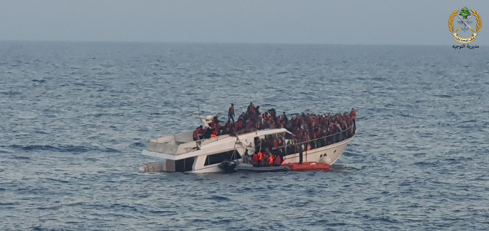
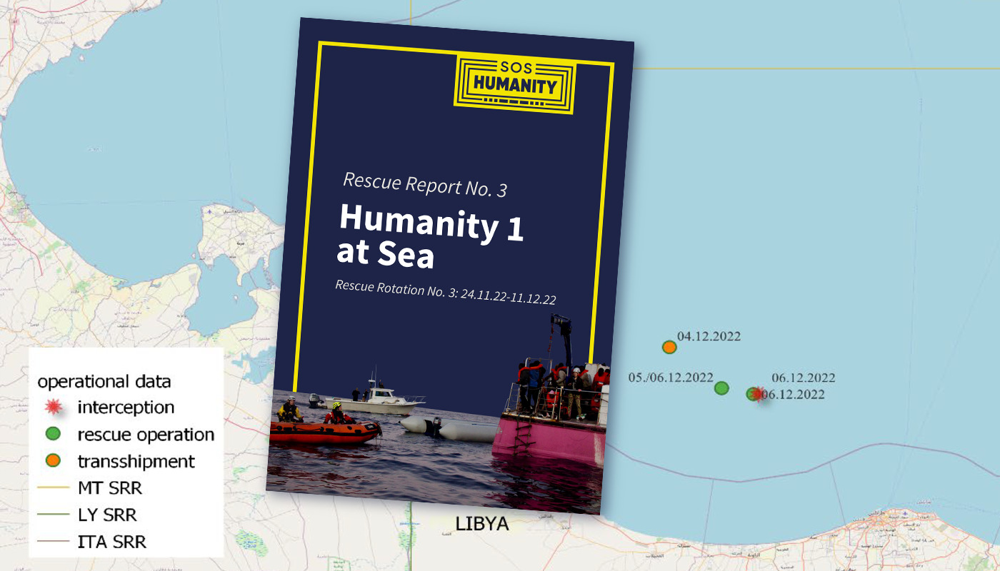

### AYS News Digest 20.01.23: Refugees ignored and abandoned by the UK

Human Rights Watch commented on the UK’s refugee policy// Lebanese army unlawfully deported back Syrians who survived a sinking baoat// The consequences of the new Italian decree on rescuing// Lighthouse Report’s investigation revealed the “black sites” of pushbacks from Italy to Greece// And more

](../assets/a5f09a79c043/1*EL28qJM9vHX7jeh0YIqNEA.jpeg)

Manston detention centre in October 2022, UK. The UK’s migration policies have been subject to much criticism in recent months. Credit: [Soas Detainee Support](https://twitter.com/sdetsup)
#### LEBANON
### The Lebanese army illegally repatriated Syrian survivors intercepted at sea

> “They escaped the war in Syria, endured harsh conditions as refugees in Lebanon and then survived the sinking of their boat… only, it seems, to then be unlawfully delivered back into the hands of the very authorities they fled” 

Said Aya Majzoub, Amnesty International’s Deputy Director for the Middle East and North Africa. Allegedly 200 people were handed to Syrian authorities by the Lebanon army. After risking their lives at sea they were intercepted by Lebanese authorities, which deported them back to Syria: an unlawful practice that put those people in a grave danger, returning them back to the country they were escaping from.

Read here Amnesty International denouncement:

#### SEA/SAR
### NGOs against the new Italian decree

Only one rescue per mission. In the new Italian decree by Interior Minister Piantedosi on sea rescuing, it is mandatory to not save other people in distress while sailing toward port after a first rescue. It means it is mandatory to let people die.

> “(we are forced to) leave after the first rescue while before we conducted four to five rescues on average per mission” 

said MSF mission chief Juan Matias Gil. Togheter with many other NGOs, MSF denounces the inhumanity of the new decree. NGOs are considering appealing the decree and are strongly standing against it. Indeed, they urged that a commission of inquiry be set up to investigate the decree. They stated:

> “Is not amendable and should simply be abrogated since it hinders rescues at sea” 

Read more [here](http://www.infomigrants.net/en/post/46166/ngos-call-for-commission-to-investigate-italys-latest-migrant-decree?fbclid=IwAR2fm8seQjJvfGjGc6yAqGfT2qulFekvWvTeicwXSXyN4fyiF4G_ehL61xQ) on the topic

While the law is abandoning people by leaving them to die at sea, explicitly illegal practices have become systematic. NGOs such as SOS Humanity have denounced many pushbacks carried out by Libyan coast guards .

In their last report, SOS Humanity described how they were able to witness these unlawful returns. However, according to them, under the new decree it will become even rarer in the future to bear testimony to this illegal practice.

Read the report here:

#### GREECE
### Europe’s black sites are also at sea

People on the move are detained in secret prisons on private ships while being pushed back from Italy to Greece.

A collaborative investigation by Lighthouse Reports, Al Jazeera,SRF, ARD Monitor, Il Domani and Solomon shows the brutal reality of life under decks for refugees found on board ferries (operated by the Greek Attica shipping group) as they are forcibly returned to port of embarkation away from the public eye.

In December. a Lighthouse Reports [investigation](https://www.lighthousereports.nl/investigation/europes-black-sites/) on Europe’s black sites had highlighted the existence of places where people seeking asylum are detained and tortured and then illegally turned back along the Balkan route. Last Wednesday, a more recent investigation unveiled how people are pushed back by sea within European borders

> “We’ve found that asylum seekers, including children, are being detained in unofficial jails — in the form of metal boxes and dark rooms — for sometimes more than a day at a time in the bowels of passenger ships headed from Italy to Greece, as part of illegal pushbacks by the Italian authorities” 

Read more here:
