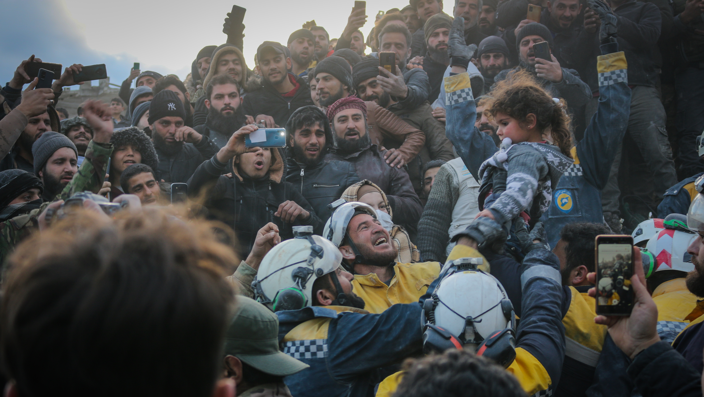
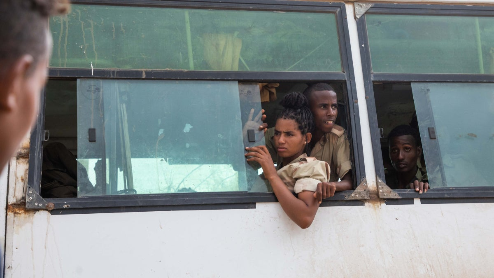

### AYS News Digest 8/2/23: Clock ticks for rescue operations in northwest Syria and in Turkey

Donate to trusted relief organisations in Turkey and Syria // Internet access restricted in Turkey // Conscription-oriented human rights abuses in Eritrea // Frontex’s ‘interoperable’ data collections systems // A pregnant woman who tried to burn herself alive in Moria 2 is convicted of arson by a Greek court // & more
#### FEATURE
#### Clock ticks for rescue operations in northwest Syria, with aid beginning to arrive via Turkish border

Credit: The White Helmets via Twitter

Working around the clock since the first earthquake struck at 4.20am on Monday, 6th February, the White Helmets (a Syrian Civil Defence organisation) continue to search desperately for survivors. In NW Syria, 1900 people’s lives have already been lost, and a further 2,950 people are severely injured.

■■■■■■■■■■■■■■ 
> **[Twitter User](https://twitter.com/SyriaCivilDef/status/1623598579892854791) @ Twitter Says:** 

> >  

> **Tweeted at .** 

■■■■■■■■■■■■■■ 

In Jinideres, north of Aleppo, the White Helmets reported that 418 homes have been irreparably destroyed, with a further 1300 severely damaged. With temperatures well below freezing at night, access to shelter, heat, hot food and basic medical supplies will be critical in the coming weeks.

Updates from the Syrian side of the affected area are limited — the White Helmets being one of the few organisations present on the ground. Crossing over from Turkey at Bab-al-Hawa, [the first UN aid convoys are reportedly arriving in Syria now.](https://www.reuters.com/world/middle-east/first-un-aid-quake-convoy-reaches-syria-sources-say-2023-02-09/)

**Why is getting aid to Northern Syria so complicated?**

[_Reuters_ has reported](https://www.reuters.com/world/middle-east/first-aid-convoy-bound-nw-syria-turkey-nears-border-sources-2023-02-09/) that since August 2021, UN aid (via Turkey and Bab-al-Hawa) reached 2.7 million people in rebel-held NW Syria every month. By contrast, only 43,500 people received aid via internal routes within Syria.

Syrian President Bashar-al-Assad has been shunned by the West since 2011, and there has been no coordination between his government and aid relief agencies in light of this political situation. Almost all Western aid arrives via the Turkish border, particularly to rebel-held areas. However, the damage to infrastructure on the Turkish-Syrian border means that cross-border aid flows — relied upon by some four million people — are significantly reduced at this critical time.

The complexity of the political situation only augments pressure upon over-stretched relief workers such as the White Helmets, so we call for those who can to support those in more isolated areas, particularly across NW Syria.

Please see this list of trusted relief and aid organisations, who require help or donations and are active in areas affected by the earthquake:

**Syria:**
- The White Helmets:

- Caritas Syria: [https://www.caritas.org/.../earthquake-in-turkey-and.../](https://www.caritas.org/.../earthquake-in-turkey-and.../?fbclid=IwAR1-RwwsG-XNlkfYiq5X6DboYsjEqydyZvh-jykWBlrXr57j9E3fQhPtpwQ)
- Montreal-based Melkite Fondation d’Alep: [https://melkite.ca/donation/](https://melkite.ca/donation/?fbclid=IwAR1AnvqPfBghdsohX6t0TWwSOT97fCXfDm9G2BoYCvtYks0nkpN7GM7BFgI) ...
- Molham — The team at Molham are currently on the ground helping displaced families in Turkey and Syria who have been affected by the earthquake. Donate here: [https://t.co/4LzNXvvSzP](https://l.facebook.com/l.php?u=https%3A%2F%2Ft.co%2F4LzNXvvSzP%3Ffbclid%3DIwAR1AnvqPfBghdsohX6t0TWwSOT97fCXfDm9G2BoYCvtYks0nkpN7GM7BFgI&h=AT2ByTqnXMPMwY__Dn6oZVxrSCNOYtMR-rf8ztCnM395SL6C8lQpLxRV0DwRkbCGx9zTFvyOMBF8QQhIOPvFadrO5da-f-p95KuG6vu6JerbppcyR4nOIZ4ukv_mra-EM06rFq0&__tn__=R]-R&c[0]=AT1kDGVa8IviSZ6JyWPgWxDHWAL7JgAPyvgakvAjeCwZep5731C6yZW-yV5zzSWO8J1a3N5YLSo3Fkiv7gMln3sNoZapPwzdlVsUIX-6JmaMfH6rXfczyxjyCIl4BYul3W0XstKqg_bEdIGVZF9_KuPcAm8kopxgqtLVMYuil9SDhUoXPwOOxNi34Oeza_g3-azFtFlERX_7E8Ds)
- AFAD, Turkish Search and Rescue Team
- AHBAP- [https://ahbap.org/bagisci-ol](https://l.facebook.com/l.php?u=https%3A%2F%2Fahbap.org%2Fbagisci-ol%3Ffbclid%3DIwAR1SinsFbnXvzVThdUkOenl7g-eLteAmE9Au4xqdl-6G2_VlwDLWaMX8LoA&h=AT0C08X163Mw9cnjcXdsIjSZkUq_qsJfV7KC9qdwoqyU-5Vuyo-3IcDb7tBREtck9nL1ho5nOZQ6XLxeUYKfQcLAzjrD_u7tr3HYJdWo2zeuUQcj73zwzmOxeHHw2ygsrdUGzIc&__tn__=R]-R&c[0]=AT1kDGVa8IviSZ6JyWPgWxDHWAL7JgAPyvgakvAjeCwZep5731C6yZW-yV5zzSWO8J1a3N5YLSo3Fkiv7gMln3sNoZapPwzdlVsUIX-6JmaMfH6rXfczyxjyCIl4BYul3W0XstKqg_bEdIGVZF9_KuPcAm8kopxgqtLVMYuil9SDhUoXPwOOxNi34Oeza_g3-azFtFlERX_7E8Ds)
- Turkey Mozaik Foundation
- Doctors without Borders: [https://donate.doctorswithoutborders.org/.../help-save](https://l.facebook.com/l.php?u=https%3A%2F%2Fdonate.doctorswithoutborders.org%2F...%2Fhelp-save%3Ffbclid%3DIwAR11RJNZT-ZcqoR9vKjXzINAGCJjcr9iMhgiE0i4rIFf8ccNy0Ag78C8rGY&h=AT2CBvJUfgjZ2-FVPplW6b4iLTxJt2daKwBagDS_kEuHItFyyG0yl2BFom_A8JcD0uVmdKQVDTL_mIGiWX2FUmtruNaX0TraWcqSNb7G-1ezRSfH7k1n8XnemhdBmmRbBaz7GJs&__tn__=R]-R&c[0]=AT1kDGVa8IviSZ6JyWPgWxDHWAL7JgAPyvgakvAjeCwZep5731C6yZW-yV5zzSWO8J1a3N5YLSo3Fkiv7gMln3sNoZapPwzdlVsUIX-6JmaMfH6rXfczyxjyCIl4BYul3W0XstKqg_bEdIGVZF9_KuPcAm8kopxgqtLVMYuil9SDhUoXPwOOxNi34Oeza_g3-azFtFlERX_7E8Ds) ...
- Antiochian Orthodox Christian Archdiocese (North America): [https://antiochian.org/regulararticle/1498](https://l.facebook.com/l.php?u=https%3A%2F%2Fantiochian.org%2Fregulararticle%2F1498%3Ffbclid%3DIwAR1rSNUYbSPcQLdSS_TJW0xSFBWc7NqByn-3K5Lb6qHXZmf1zPjPPTR0IqE&h=AT3UMAmOjhVZ6H4Zx0wB0a4lwTjpVqx3JC8vSNs1Dq_yZxGK-wxz7uRZ0jI7kVub6lK8oZGRtllPcc1vuDX0GyLhAS18ak0yfB2xsxVTbXAerfqs7Vgg8hf65T5tVq5EbmMch04&__tn__=R]-R&c[0]=AT1kDGVa8IviSZ6JyWPgWxDHWAL7JgAPyvgakvAjeCwZep5731C6yZW-yV5zzSWO8J1a3N5YLSo3Fkiv7gMln3sNoZapPwzdlVsUIX-6JmaMfH6rXfczyxjyCIl4BYul3W0XstKqg_bEdIGVZF9_KuPcAm8kopxgqtLVMYuil9SDhUoXPwOOxNi34Oeza_g3-azFtFlERX_7E8Ds) and [https://antiochian.networkforgood.com/.../185127](https://l.facebook.com/l.php?u=https%3A%2F%2Fantiochian.networkforgood.com%2F...%2F185127%3Ffbclid%3DIwAR1dzsCCL5jr0tayELnCkkWJ3I-1Mh3CC-qL1Wy-f3G7HChTwIarFgk8kHU&h=AT3mjonzWsFtPYTMrEbGd5KeiS1NF7CG9kvY7bL7GZF9hfT-ZMHSy7jhWEwgYzvGe4cYQ6XNVBJJRP-S5LAxevKMz3PjBDmdmfcJVcLMZzQl2e3nehPpX4GcbvV0CvUU8OJdMBI&__tn__=R]-R&c[0]=AT1kDGVa8IviSZ6JyWPgWxDHWAL7JgAPyvgakvAjeCwZep5731C6yZW-yV5zzSWO8J1a3N5YLSo3Fkiv7gMln3sNoZapPwzdlVsUIX-6JmaMfH6rXfczyxjyCIl4BYul3W0XstKqg_bEdIGVZF9_KuPcAm8kopxgqtLVMYuil9SDhUoXPwOOxNi34Oeza_g3-azFtFlERX_7E8Ds) ...

**Turkey:**
- BTF: [https://bridgetoturkiye.org/](https://bridgetoturkiye.org/?fbclid=IwAR2TLJcMOUc8k7sxOXj_abxkIaR8rkzlZUET4offxX7ilYB_N30yt-b3y0s)
- TPF: [https://donate.tpfund.org/.../tpf-turkiye-earthquake/c465112](https://donate.tpfund.org/.../tpf-turkiye-earthquake/c465112?fbclid=IwAR31HsdggxYMtPGyaYFs07G3DIGWhqWWsX3mwcS21jL8Qp_yubbutrQvQk0)
- AHBAP: local NGO — [https://bagis.ahbap.org/bagis](https://bagis.ahbap.org/bagis?fbclid=IwAR3Wa2WpDcvaP1lexBdQfPVFG64vZcUN5pk_2z8yer1h-Jv7egTkL03D3s8)
- AKUT: local NGO: [https://www.akut.org.tr/en/donation](https://www.akut.org.tr/en/donation?fbclid=IwAR0dXkM3G7UVtx_-2DVqxE2yY1L0775fo0DuB8JIeyzqLfuLHn4UUZzG5yE)
- IHH Humanitarian Relief Fundation: [https://ihh.org.tr/en/stand-with-turkey](https://ihh.org.tr/en/stand-with-turkey?fbclid=IwAR03sbTyGVoxH6QZWAk4qSAdzQOs8XWiYaCdXCQWbHoEYrA4cJ7s4V93xpc)

#### **Accessing a VPN in Turkey**

Internet in certain parts of Turkey seems to be restricted at the moment: people are no longer able to post geolocations or make phone calls as before.

■■■■■■■■■■■■■■ 
> **[NetBlocks](https://twitter.com/netblocks) @ Twitter Says:** 

> > ⚠️ Confirmed: Real-time network data show Twitter has been restricted in #Turkey; the filtering is applied on major internet providers and comes as the public come to rely on the service in the aftermath of a series of deadly earthquakes

📰 Report: [netblocks.org/reports/twitte…](https://netblocks.org/reports/twitter-restricted-in-turkey-in-aftermath-of-earthquake-oy9LJ9B3) https://t.co/3884wMpYD2 

> **Tweeted at [2023-02-08 13:37:53](https://twitter.com/netblocks/status/1623315180867186690).** 

■■■■■■■■■■■■■■ 

Proton VPN has been recommended to bypass these restrictions, it is free to use and has no bandwidth restrictions:

#### **ERITREA**
#### Families of alleged draft evaders are evicted and detained

](../assets/3ab5132bbcbb/0*zik4pZ2y6Pjw50kL)

[https://twitter.com/GiuliaRastajuly/status/1623630398029803523/photo/1](https://twitter.com/GiuliaRastajuly/status/1623630398029803523/photo/1)

In recent months, Eritrean authorities have been rounding up and repressing relatives of those who are deemed to be dodging military service. As part of an intensive forced conscription campaign, thousands of people have been imprisoned to coerce their relatives into becoming reservists.

“Everyone has always lived with the dreadful feeling of the risk of being conscripted, but this is at a whole different level,” an Asmara resident said.

> Some forms of conscription for military service are permitted under international human rights law. However, Eritrea uses violent methods including the threat of penalty and punishment for those who do not participate, and [collective punishment of relatives](https://www.hrw.org/report/2009/04/16/service-life/state-repression-and-indefinite-conscription-eritrea) . Officials also show a lack of respect for the right to conscientious objection and provide no opportunity to challenge arbitrary enforcement and the [indefinite nature of conscription](https://www.hrw.org/report/2019/08/08/they-are-making-us-slaves-not-educating-us/how-indefinite-conscription-restricts) . These factors constitute abuse, Human Rights Watch said. 

#### **FRONTEX**
#### **‘Interoperable databases** ’ — Frontex’s soon-to-be-unlimited access to data

 on Unsplash](../assets/3ab5132bbcbb/0*bz8d-oUcXH4nPzFJ)

Photo by [Etienne Girardet](https://unsplash.com/@etiennegirardet?utm_source=medium&utm_medium=referral) on Unsplash

_Statewatch_ have published a report on the European Commission’s creation of a “comprehensive digital identity architecture for non-EU nationals, under the moniker of ‘interoperability.’”

In essence, existing databases have been linked and new ones set up, all with the aim of closing “information gaps” and “blind spots”. The result: the gross expansion of surveillance and data collection.

Frontex will have access to two forms of data:

i) Operational data — this facilitates “the agency’s role in border control or deportation tasks e.g. through access to the Visa Information System and the Schengen Information System.”

ii) Statistical data — “is aimed at making Frontex’s risk analyses and vulnerability assessments — and thus its policy recommendations — more fine-grained, detailed and influential.”

Full report [here](https://www.statewatch.org/frontex-and-interoperable-databases-knowledge-as-power/) .
#### **GREECE**
#### A pregnant woman who set herself on fire in Moria has today been charged with arson and property damage in Lesvos

Attempting suicide in February 2021 due to the unbearable living conditions in which she was held, the 29 year-old woman is now being criminalised by the Greek legal system.

[Borderline Europe](https://www.borderline-europe.de/unsere-arbeit/kriminalisierung-von-gefl%C3%BCchteten-erreicht-neue-eskalationsstufe-junge-frau-muss-sich?l=en) report the following:

> “The prosecution of M.M. for her suicide attempt, which is not punishable under the Greek penal code and is now brutally classified as ‘intentional arson‘, is an escalation of the criminalisation of people seeking protection. It is also a distraction from the responsibility of the Greek state and the EU to ensure adequate living conditions for people seeking protection.” 

It seems that the asylum and legal systems in Greece today are being weaponised in tandem to function as a deterrent.

■■■■■■■■■■■■■■ 
> **[borderline-europe](https://twitter.com/BorderlineEurop) @ Twitter Says:** 

> > ⭕The woman was found guilty. She was sentenced to 15 months suspended for 3 years. @[HIASGreece](https://twitter.com/HIASGreece) has appealed the sentence. 
Punishments are supposed to be deterrents for others - if ppl are to be deterred from setting themselves on fire, their living conditions must be improved! 

> **Tweeted at [2023-02-08 18:29:14](https://twitter.com/BorderlineEurop/status/1623388502405652482?s=20).** 

■■■■■■■■■■■■■■ 

#### FRANCE
#### La Cimade: 90 proposals to better protect unaccompanied minors
[https://drive.google.com/viewerng/viewer?url=https%3A//www.lacimade.org/wp-content/uploads/2023/02/Rapport\_MNA-VERSION-DEFINITIVE-07022023.pdf&embedded=true](https://drive.google.com/viewerng/viewer?url=https%3A//www.lacimade.org/wp-content/uploads/2023/02/Rapport_MNA-VERSION-DEFINITIVE-07022023.pdf&embedded=true)

French NGO La Cimade has put together 90 proposals to improve protections for unaccompanied minors in France. They write that, a year on from the ‘Loi Taquet’, thousands of children continue to have their rights violated: sleeping rough, having their basic needs neglected.

> ‘Solutions _do_ exist to move beyond policies that are informed by an attitude of suspicion, rather than one that prioritises protection.’ 

Full PDF available [here](https://www.lacimade.org/wp-content/uploads/2023/02/Rapport_MNA-VERSION-DEFINITIVE-07022023.pdf) .

> _JOIN OUR TEAM — Reach out via Facebook, Instagram or by email at: areyousyrious@gmail.com_ 

**Find daily updates and special reports on our [Medium page](https://medium.com/are-you-syrious) .**

**If you wish to contribute, either by writing a report or a story, or by joining the Info team, please let us know!**

**We strive to echo correct news from the ground through collaboration and fairness. Every effort has been made to credit organisations and individuals with regard to the supply of information, video, and photo material (in cases where the source wanted to be accredited). Please notify us regarding corrections.**

**If there’s anything you want to share or comment, contact us through Facebook, Twitter or write to: areyousyrious@gmail.com**

_[Post](https://medium.com/are-you-syrious/ays-news-digest-8-2-23-clock-ticks-for-rescue-operations-in-north-west-syria-and-turkey-3ab5132bbcbb) converted from Medium by [ZMediumToMarkdown](https://github.com/ZhgChgLi/ZMediumToMarkdown)._
