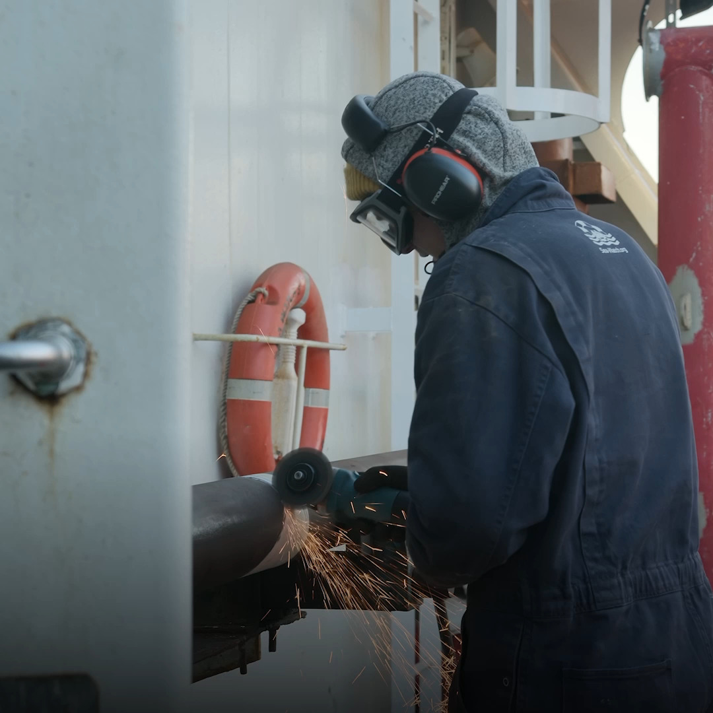
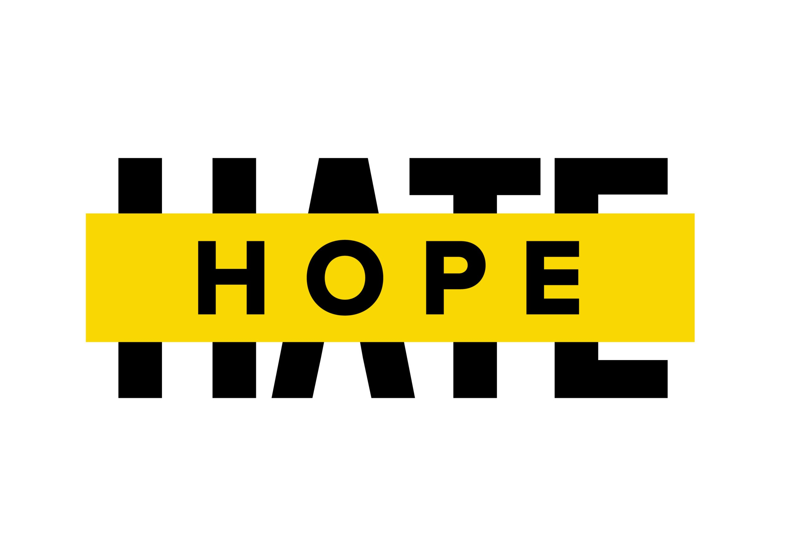
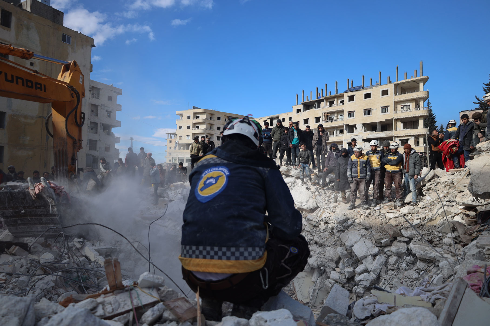

### AYS News Digest 13/02/2023: More deaths at Europe’s borders

Two bodies were found in a river in Bosnia-Herzegovina // A woman died while being pushed back to Belarus at the Polish border // Updates on Iuventa trial case // Amnesty International denounced the Greek Court’s decision to convict a woman attempting suicide // A violent anti-migrants protest creates fear among asylum seekers in UK hotel // And more

 calls for an investigation on the death of the woman at the border](../assets/7130710629af/1*NcP9Ad15nnHyGy0xuKSxVw.jpeg)

[Grupa Granica](https://twitter.com/GrupaGranica/status/1625117369071726595) calls for an investigation on the death of the woman at the border
#### SEA / SEARCH and RESCUE (SAR)
### Updates on Iuventa trial case

The latest update in the long-running legal proceedings against the Iuventa volunteers, which involved poor preparation for their case on the part of the Italian authorities. Some impressions of the first hearing in 2023 (with other dates planned for the end of February and March) were shared by the Iuventa crew. Kathrin Schmidt, one of the defendants, said:

> _“The judge refuses to fully guarantee our rights to a defence, to understand the charges against us, to participate effectively and to ensure the fairness of the trial. This is happening in a case with much public attention, so it is easy to imagine the devastating consequences in countless cases against people on the move.”_ 

Read more here:

[**Italian government apologises for erroneous and defamatory motion to join trial as a joint…**](https://iuventa-crew.org/en/2023/02/11/italian-government-apologises-for-erroneous-and-defamatory-motion-to-join-trial-as-a-joint-plaintiff/?fbclid=IwAR0p74wUOdHQoLNPIqE105fyLFzcC7Ton-gt9xpjonyPFMudWJLxtXh-jWw) 
[_11.02.2023 - Court of Trapani. Lasting ten hours, the longest and most heated hearing in the iuventa case took place…_ iuventa-crew.org](https://iuventa-crew.org/en/2023/02/11/italian-government-apologises-for-erroneous-and-defamatory-motion-to-join-trial-as-a-joint-plaintiff/?fbclid=IwAR0p74wUOdHQoLNPIqE105fyLFzcC7Ton-gt9xpjonyPFMudWJLxtXh-jWw)
### More updates on sea rescue

After the previous very challenging mission the crew of the SEA-EYE 4 received permission from the Italian authorities to leave the port of Naples.

■■■■■■■■■■■■■■ 
> **[Sea-Eye](https://twitter.com/seaeyeorg) @ Twitter Says:** 

> > Am Freitag erhielt die Crew der SEA-EYE 4 die Erlaubnis von den italienischen Behörden, den Hafen von Neapel zu verlassen. Die vergangene Rettungsmission der SEA-EYE 4 war besonders herausfordernd und sehr tragisch. Wir betrauern den Tod von drei schutzsuchenden Menschen. 1/2 https://t.co/dYimMjeGhe 

> **Tweeted at [2023-02-11 17:40:10](https://twitter.com/seaeyeorg/status/1624463315425456131?fbclid=IwAR1QHbE0cTNn2Z6X8h-4dgQod4sRXGWho-3GTmZbHd1LYRK8DeszNoUKDQs).** 

■■■■■■■■■■■■■■ 

Sea Watch have posted a video with updates on the progress of the shipyard conversion of their new SAR vessel SEA WATCH 5 as an offshore platform supply vessel to vital Central Med SAR.

#### GREECE
### Amnesty International have denounced the Greek court’s decision to convict an Afghani woman attempting suicide in Lesvos in 2021

More than once Amnesty International, together with many other organisations and activists, have highlighted the poor conditions suffered by people living in camps in Lesvos. In particular “NGOs have deemed the conditions in the Mavrovouni camp as sub-standard for residents”, as stated in an [Amnesty tweet](https://twitter.com/AmnestyEU/status/1625126209485938692) . It was in that camp where M. attempted suicide on February 21st 2021, after having lived for months in the poorly equipped Moria camp. A mother of four children, her extreme and desperate attempt to cope with an impasse that left her hopeless, was condemned by the Greek court. The court convicted the woman, after two years, of arson and damage. Amnesty International condemns the sentence:

■■■■■■■■■■■■■■ 
> **[Amnesty EU](https://twitter.com/AmnestyEU) @ Twitter Says:** 

> > We are very concerned about a Greek Court’s decision to convict M., a 27-year-old Afghan refugee and mother of four, who attempted to take her own life by setting herself on fire in the Mavrovouni camp on Lesvos in February 2021

[bit.ly/3E08ykq](https://bit.ly/3E08ykq) 

> **Tweeted at [2023-02-13 13:34:14](https://twitter.com/AmnestyEU/status/1625126199595831302?fbclid=IwAR0hDlS50rLGufuERydknyKqfIs2R1bV_J4SWhzfF_7aql6Kbkw8sH9ioRc).** 

■■■■■■■■■■■■■■ 

#### BOSNIA-HERZEGOVINA
### Two unidentified bodies found in the Sava river

According to the authorities, the reasons for the death of the two unknown people are not yet clear. However, they stated that the bodies seem to be from Asia or Africa. Many people on the move trying to cross the border along the so-called ‘Balkan Route’ face death because of the increasing securitisation of the borders that make the path more dangerous for the people seeking a safe place. [Read more here](https://www.index.hr/vijesti/clanak/uz-savu-kod-slavonskog-broda-nadjena-dva-tijela/2437577.aspx?fbclid=IwAR0zcmBijkHkfgH2knkImsSyRb8u2CdPfbkCnD_H0xm8b-HZOn9yUZsuRKo)
#### POLAND-BELARUS
### Grupa Granica calls for an investigation into a woman’s death at the border

> “We demand investigation of circumstances of the death, as well as holding responsible the authorities, who according to the group’s relation, not only did not undertake rescue activities, but also pushed back to Belarus people who were seeking help for their companion.” 

Grupa Granica denounces the circumstances of the woman’s death, finding the authorities responsible. They urgently call for an investigation to make clear the dynamics of one more death at the border.

The woman was trying to cross the Polish-Belarus border together with five other people. They found no help and violent treatment by the Polish authorities who pushed them back to Belarus. In addition to the illegality already inherent in the pushback itself, when the woman started to feel sick the officers didn’t provide any help, even having promised to, according to the other people travelling with her. In the morning, she was found dead.

■■■■■■■■■■■■■■ 
> **[Grupa Granica](https://twitter.com/GrupaGranica) @ Twitter Says:** 

> > 5/5 We demand an end to deadly policy of government which legitimizes violence and illegal push-backs and instrumentalizes people who seek for safety. Urgent actions must be undertaken to to prevent further cases of torture and death.
In solidarity with the victims of violence. 

> **Tweeted at [2023-02-13 12:59:11](https://twitter.com/GrupaGranica/status/1625117379012308993).** 

■■■■■■■■■■■■■■ 

#### UK
### A violent anti-migrants protest creates fear among asylum seekers in Merseyside hotel

A violent anti migrants protest was held in front of Merseyside asylum seeker hotel (Knowsley) last Friday night. The extreme violence carried out by the far-right protesters led to the arrest of three people. Despite the arrest, fear remained high among the people living in the hotel who felt insecure in a country where they have come to seek safety. Clare Moseley, founder of refugee charity Care4Calais, was at the anti protest, supporting asylum seekers. She told the [BBC](https://www.bbc.com/news/uk-england-merseyside-64600806) ,

> “I was really frightened for us, I was really frightened for the people in the hotel. These are people who have come from war zones. I can’t imagine how terrifying it would be for them.” 

■■■■■■■■■■■■■■ 
> **[Statewatch](https://twitter.com/StatewatchEU) @ Twitter Says:** 

> > UK: Three arrested after protest at Merseyside asylum seeker hotel

Three arrests on suspicion of violent disorder after disturbance outside the Suites Hotel in Knowsley for providing refuge to asylum seekers, in which a police van was set on fire.  

[bbc.co.uk/news/uk-englan…](https://www.bbc.co.uk/news/uk-england-merseyside-64600806) 

> **Tweeted at [2023-02-13 15:14:00](https://twitter.com/StatewatchEU/status/1625151307551064064?fbclid=IwAR2ih-GhXdxl4QBWeLhHzqW1zyJDOkvunl_5owfBKsJVrgAKixnvBBfhV4o).** 

■■■■■■■■■■■■■■ 

Care4Calais returned to the Suites Hotel in Kirkby, Knowsley, to visit the people there following the far right riot outside on February 11th. The people there are traumatised by the event, as Care4Calais have said:

> “They are trapped in that hotel. They can’t leave. They can’t go to the shop to buy a snack or cigarettes. So many told us they can’t sleep. The situation is overwhelmingly sad. Every person in that hotel has had to leave their homes and their loved ones behind because of situations that they cannot control and did not ask for. No one does that by choice. 

[Read more here](https://care4calais.org/news/knowsley-hotel-update/?fbclid=IwAR3C0F-VnAKsIlsZFwLJGZCefsTGyHeWzFuJ5tsO1e7qGhcV4PJXhGhcul0)

You can read an initial analysis by the NGO Hope Not Hate about the Extreme Right Wing personalities and organisations that were involved in the protest outside the hotel:

#### EU
### European summit on migration

The European Summit was held over the previous days focusing on migration as one of the main topics. During the Summit greater securitisation, more freedom to operate for FRONTEX and a greater role for sinister tech in policing borders were discussed:

■■■■■■■■■■■■■■ 
> **[ECRE](https://twitter.com/ecre) @ Twitter Says:** 

> > ➡️Commission “helpfully” contextualises discussion by 1) referring to “illegal” border crossings and 2) misrepresenting the protection rate – again. 

> **Tweeted at [2023-02-10 15:28:28](https://twitter.com/ecre/status/1624067786732339202?fbclid=IwAR2ih-GhXdxl4QBWeLhHzqW1zyJDOkvunl_5owfBKsJVrgAKixnvBBfhV4o).** 

■■■■■■■■■■■■■■ 

### News about visas, refugees status and residence permits in EU

Denmark and Sweden have agreed to offer women and girls fleeing Afghanistan asylum, residence permits and refugee status. Denmark’s decision follows the EU Asylum Agency’s (EUAA) statement that “women and girls are in general at risk of persecution” under Taliban rule and “hence eligible for refugee status.” Sweden already announced this decision in December. Read more here:

More news about visas:

Switzerland, the Netherlands, Belgium, and Germany expressed their intention to facilitate visa applications of Turkish and Syrian citizens residing in their countries so that they can temporarily host their relatives affected by last Monday’s earthquakes.

[Read it here](https://twitter.com/RefugeePolitics/status/1625064227705655296?fbclid=IwAR18ge8FE46NSSRfwLbdG5vrrjOSj2cftKZbme-Jk7iZ5VYI9lwihfHdrzA)
#### WORTH READING
- A coalition of civil society NGOs, including (Border Violence Monitoring Network) BVMN, have launched a new website named ‘Protect Not Surveil’. It has been set up to draw attention to and to challenge the proposed EU Artificial Intelligence Act:

[**EU AI | Protect Not Surveil**](https://protectnotsurveil.eu/?fbclid=IwAR1QHbE0cTNn2Z6X8h-4dgQod4sRXGWho-3GTmZbHd1LYRK8DeszNoUKDQs#partners) 
[_Vote to Protect the Human Rights of people on the move and migrants in the Artificial Intelligence Act From lie…_ protectnotsurveil.eu](https://protectnotsurveil.eu/?fbclid=IwAR1QHbE0cTNn2Z6X8h-4dgQod4sRXGWho-3GTmZbHd1LYRK8DeszNoUKDQs#partners)
- BVMN’s December report is live:

■■■■■■■■■■■■■■ 
> **[Border Violence Monitoring Network](https://twitter.com/Border_Violence) @ Twitter Says:** 

> > 🟡 BVMN December 2022 Monthly Report is live!
[borderviolence.eu/balkan-regiona…](https://www.borderviolence.eu/balkan-regional-report-december-2022/)

Seven new testimonies impacting 60 people on the move across the Western Balkans and Greece

More inside... https://t.co/JF6i76tXNN 

> **Tweeted at [2023-02-11 11:34:08](https://twitter.com/Border_Violence/status/1624371199835885570?fbclid=IwAR3C0F-VnAKsIlsZFwLJGZCefsTGyHeWzFuJ5tsO1e7qGhcV4PJXhGhcul0).** 

■■■■■■■■■■■■■■ 

- Report on the Syrian White Helmet rescue operation after the earthquake:

- [Useful tool to record pushbacks for researchers](https://aegean.forensic-architecture.org/?fbclid=IwAR3es74wNMKGy4HO6SrzSNnHDKQSDikgov4FLt_A5wXdT8yyihr9g622jkw)

> _JOIN OUR TEAM — Reach out via Facebook, Instagram or by email at: areyousyrious@gmail.com_ 

**Find daily updates and special reports on our [Medium page](https://medium.com/are-you-syrious) .**

**If you wish to contribute, either by writing a report or a story, or by joining the Info team, please let us know!**

**We strive to echo correct news from the ground through collaboration and fairness. Every effort has been made to credit organisations and individuals with regard to the supply of information, video, and photo material (in cases where the source wanted to be accredited). Please notify us regarding corrections.**

**If there’s anything you want to share or comment, contact us through Facebook, Twitter or write to: areyousyrious@gmail.com**

_[Post](https://medium.com/are-you-syrious/ays-news-digest-13-02-2023-more-deaths-at-europeans-borders-7130710629af) converted from Medium by [ZMediumToMarkdown](https://github.com/ZhgChgLi/ZMediumToMarkdown)._
