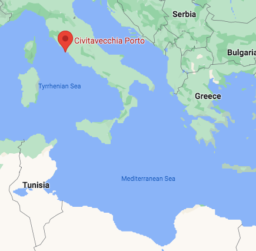
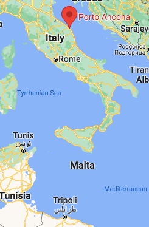
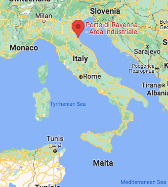

### AYS News Digest 17/02/23: A growing refugee crisis in Somaliland as 60,000 people flee conflict in the Sool region
#### Italian decree is preventing the civil fleet from operating in the central Mediterranean zone // Deaths on the Polish/Belarusian Border // Schaerbeek Squat — home to hundreds of people — has been evacuated, putting people on the streets of Brussels // Further anti-migration protests planned in the UK & more
#### FEATURE
#### More than 60,000 Somalis have fled Laascaanood in Somaliland to the Somali region of Ethiopia, following recent clashes in the disputed Sool region

](../assets/fbd4b1c17ca2/1*1EYYkZ7YSkz9n1oe-YiOiA.png)

Credit: Markus Hoehne via [AfricanArguments](https://africanarguments.org/2023/02/crisis-in-lasanod-insecurity-border-disputes-and-the-future-of-somaliland/?fbclid=IwAR2UJmMcyxA_JItNZsenGvHcsZLyf_irKZzRG-JoYOwp5KDW01M-cKo0oVQ)

[UNHCR report](https://www.unhcr.org/news/briefing/2023/2/63ef3fcc4/tens-thousands-arrive-ethiopia-fleeing-recent-clashes-somalia.html?fbclid=IwAR03Ewp9J_lLhh5NNMkenXrv8k7MwESWs6xePrGUwOOKn8pS_W1p3MkcMIo) that over 30,000 people have arrived in the past week, with an average of 1000 people crossing into Ethiopia on a daily basis. Families have temporarily settled across 13 locations in the Somali region of Ethiopia (pictured to the south of Laascaanood within the Ethiopian border). In the Doolo zone, the towns of Bookh, Galhamur and Danot Woredasiin have “generously welcomed the refugees, sharing whatever resources they have. But these are quickly depleting”.

Many of those who have recently arrived have lost loved ones in the clashes, or been separated from their families.

](../assets/fbd4b1c17ca2/1*KBjIBDEfXQQBQ5amh3XT3w.jpeg)

Refugees from Laascaanood, sheltering in the open at the Qoriley site in the Somali region of Ethiopia. Credit: Aden Harun via [UNHCR](https://www.unhcr.org/news/briefing/2023/2/63ef3fcc4/tens-thousands-arrive-ethiopia-fleeing-recent-clashes-somalia.html?fbclid=IwAR03Ewp9J_lLhh5NNMkenXrv8k7MwESWs6xePrGUwOOKn8pS_W1p3MkcMIo)

185,000 people have already been internally displaced from Laascaanood town since early February this, taking refuge within Somaliland. Other people have crossed into northern Somalia’s Puntland region, as well as villages bordering Ethiopia to escape the outbreak of violence.
#### What’s the nature of the conflict in Somaliland?

Somaliland is an autonomous region in northern Somalia, which broke away from Somalia in 1991. With a population of 3.5 million people, it is the largest unrecognised state in the world: no foreign power recognises the sovereignty of the self-governing state, which has its own currency, internationally recognised democratic elections, and military. The region is incredibly poor, with the World Bank estimating its [GDP per capita is $348,](https://www.actionaid.org.uk/about-us/where-we-work/somaliland/somalia-somaliland-differences-explained) making it the fourth poorest country in the world were it independent.

The conflict that broke out at the beginning of February is between Somaliland’s armed forces and the SSC (Sool, Sanaag and Cayn) militias, from the Togdheer region, which has long been disputed over by Somaliland and the Puntland state of Somalia. The fighting reportedly broke out in Laascaanood, the administrative centre of the Sool region, when a committee of local clan leaders, religious scholars and civil society groups said they no longer recognised the Somaliland administration, and wanted to re-join Somalia. They have accused the authorities of failing to tackle insecurity in the town, and now reject their authority in the region:

> “We have decided that the Federal Republic of Somalia will administer the (SSC) regions until federalization of Somali territory is completed”, the committee said. — SSC via [_Reuters_](https://www.reuters.com/world/africa/least-34-killed-clashes-somaliland-two-doctors-public-hospital-2023-02-06/) _._ 

Reuters also reported that Adaan Jaamac Oogle, spokesman for the protestors, stated:

> “Somaliland forcefully occupied Laascaanood and failed to secure it. We are demanding that they leave” 

The conflict between the Somaliland forces and local militia loyal to SSC semi-autonomous regions has been deadly; around 80 people are thought to have been killed in the conflict, with another 400 people injured. [As of Friday 10th February there was a ceasefire in place.](https://www.reuters.com/world/africa/fighting-breakaway-somaliland-kills-nine-official-medic-say-2023-02-11/) It is unclear who the ‘aggressors’ of the recent clashes are.
#### A drought-induced crisis: climate and conflict migration combined

The region of Eastern Africa in which Somaliland and the Somali region of Ethiopia are located have been particularly badly hit by droughts. The rainy season has failed for five consecutive years.

In a region where resources are already stretched, the escalation of conflict is hugely concerning. [The necessity of emergency support in drought-hit regions was already feared.](https://riftvalley.net/news/what-are-causes-somalilands-drought-crisis) The need for food, nutritional support, water and sanitation facilities is now particularly urgent, especially in rural areas.
#### SEA/SAR
#### Italian decree is preventing the civil fleet from operating in the central Mediterranean zone

Italy’s SAR decree — in direct contravention of the United Nations Law of the Sea — is reducing the capacity of the civil fleet to operate effectively in the central med SAR zone. This legal shift will have life-changing repercussions: death.

Civil fleet SAR ships, assigned remote ports of disembarkation, will now be unavailable for longer periods of time. Consequently, the deadly crossing route will be less comprehensively monitored, and the threat to life will be even greater in the absence of humanitarian actors.

Two days ago, [73 people lost their lives off the Libyan coast when an overcrowded dinghy was shipwrecked.](https://l.facebook.com/l.php?u=https%3A%2F%2Fwww.infomigrants.net%2Fen%2Fpost%2F46870%2Fmediterranean-73-migrants-presumed-dead-in-shipwreck-off-libya%3Ffbclid%3DIwAR32BKd9jYYPeZKMDwrrTU5oy-4ZTeqQMViny-sAQdPKdRHcKcCkLiEzbmk&h=AT1eOQj-ZddPWMJh8y6y58QlBuuSJ2L2LME9Wx3NSZ50aAIOWfwH-K4en9ovysC5Sx6CuthM3Xw7CV_lGvbJle-egiUvRiSGRVILi9hfLMUS9ywaQu0RKJfpBN_-ksXZGWh1fE-L6hM5XBkEn8s&__tn__=R]-R&c[0]=AT005nLnGLqKN-gmrN61uhyRtX6KOm6lDkYv2QTCk2IQrgaL_LzZesOqN0zPSxMFLKSk0xE7hKtOFYyDzDj9Nrq0GWftOIj4P4GJThhRWLuf4GWUhUqWl67A6jhyUIyMhFZ3qnT0Q9iaSaEQOlSOr1-_EliVQCI_VkFvbdeY1-z91O0dk0IBQyXQIaevY6jCjQQzLJk2nKjrdq0U) Civil fleet SAR vessel Ocean Viking saved 84 people off Libya on Tuesday, 58 of whom were unaccompanied minors. Civil rescue ships save lives, and Italy’s policies are hampering their activity:
- Italian authorities have allocated SAR vessel MV Life Support — operated by the NGO Emergency — the port of Civitavecchia for disembarkation.

■■■■■■■■■■■■■■ 
> **[Twitter User](https://twitter.com/emergency_ngo/status/1626255749822222340?fbclid=IwAR2LcwRzYtb42M6lCn2WI6RY8fSaktD40sJK2ATz06WIdWEAhUST271vw18) @ Twitter Says:** 

> >  

> **Tweeted at .** 

■■■■■■■■■■■■■■ 

Civitavecchia is north of Rome:

Credit: Google Maps

This obliges MV Life Support — by Italian law — to unnecessarily cross the Tyrhennian sea, travelling hundreds of miles away from the central SAR zone (pictured below). Not only does this add fuel costs and needlessly keep people at sea, but critically costs lives: there will be holes in the civil fleet’s coverage of the central med.

](../assets/fbd4b1c17ca2/1*_IN0-tscRhBZf9j4K5kBtw.png)

Credit: Civil MRCC Coordination and Documentation Platform via [Think Magazine](https://thinkmagazine.mt/adrift-at-sea-laws-morals-and-policies-in-maltas-search-and-rescue-region/)
- MV Geo Barents and MV Ocean Viking — both with lots of people aboard — have also been assigned distant ports of disembarkation in the Northern Adriatic, at Ancona and Ravenna respectively.

■■■■■■■■■■■■■■ 
> **[Twitter User](https://twitter.com/Seebruecke_intl/status/1626232013245272067?fbclid=IwAR3ZdUyse0LiNbl2TKSaabQtW2PfUeD55lgMI-bg6m8Q94UDc-NI8jk2iEo) @ Twitter Says:** 

> >  

> **Tweeted at .** 

■■■■■■■■■■■■■■ 

See maps below for a visual reference of the hugely harmful, politically-willed diversion of the civil fleet.

Credit: Google Maps
#### POLAND
#### Deaths on the Polish/Belarusian Border

Grupa Granica, who monitor the situation on the Polish-Belarusian border, write today that:

■■■■■■■■■■■■■■ 
> **[Grupa Granica](https://twitter.com/GrupaGranica) @ Twitter Says:** 

> > 1/4 Three more victims of the deadly policy of push-backs. Three more deaths that could have been avoided. https://t.co/yPvdmo3igD 

> **Tweeted at [2023-02-16 21:22:22](https://twitter.com/GrupaGranica/status/1626331173839421440/photo/1).** 

■■■■■■■■■■■■■■ 

They report:

> “Three more deaths that could have been avoided. 

> The first body was found around 12pm during a search operation organized by activists from POPH — Podlaskie Ochotnicze Pogotowie Humanitarne. It was a dark-skinned man. The head of the District Prosecutor’s Office in Hajnówka said that clothes and photographs were found with the corpse; the latter show the figure of a man around 20–30 years old. As Czaban robi raban later informed, the dead man’s identity is confirmed and family was already contacted. We extend our deepest condolences to all relatives. 

> Two more bodies were found in the Świsłocz river this afternoon. They belong to a woman and a man. The deceased’s identities are unknown. The prosecutor’s office launched an investigation into the death. We will receive more information soon.” 

#### 4th Anniversary of NGO Fundacja: The Hope Project

Founded on Lesbos in 2019, Fundacja grew from the desire of three individuals to spend more than a few weeks a year working with people on the move.

Since then, Fundacja has sent humanitarian aid to Greek camps, launched educational workshops about the situation in the Mediterranean, and spoke about the reality of refugee migration at the University of Warsaw — at the opening of Janka Ochojska’s parliamentary office.

They write that

> “Today we continue our struggle for the dignified treatment of refugees, and although we often lack the time and strength — we continue to act. From this place we would like to thank you — because without your support we would have no room for action. It was you who collected and sorted more than 55 tons of humanitarian aid with us, it was thanks to you that we paid for legal aid for refugees, it was you who made those in need of medical support receive it. And we ask you very much: be with us for years to come!” 

#### BELGIUM
#### Schaerbeek Squat — home to hundreds of people — has been evacuated

](../assets/fbd4b1c17ca2/1*AJNYWV2PcvksuyDWeTmE4w.png)

From 22/12/22: Naqibullah in front of his dome tent in front of the “Klein Kasteeltje” reception center. Credit: Tessa Kraan via [Instagram](https://www.instagram.com/p/CowySpFMh8Q/?fbclid=IwAR2UJJLRTHOhHA7IlELSnzBFwnUluMnkTbFKQzP99BruNnEWKB-sHYz34Pk)

Following the reports of a chaotic official operation to clear the squat, i [n which a person died](https://medium.com/are-you-syrious/ays-news-digest-15-3-2023-italy-sar-decree-becomes-law-18e6a0e3928) , hundreds of people have now been forced to sleep on the street. Around 200 former occupants of the squat, most of whom are legally entitled to shelter as per their asylum statuses, joined around 50 people who are living along the canal.

Now camped outside the reception centre ‘Klein Kasteeltje’, they are yet to be informed about a possible solution. [The Flemish media are mostly concerned with the mis-communications between central and local governments](https://www.brusselstimes.com/belgium/372833/kafkaesque-163-asylum-seekers-moved-from-schaerbeek-squat-to-flemish-hotel) , not the people who have been put on the street as a result.

■■■■■■■■■■■■■■ 
> **[Twitter User](https://twitter.com/BenjaminPeltier/status/1625960530945925123?ref_src=twsrc^tfw|twcamp^tweetembed|twterm^1625960530945925123|twgr^be52cce65b68a95c7b3a95dcabb05a5115333124|twcon^s1_) @ Twitter Says:** 

> >  

> **Tweeted at .** 

■■■■■■■■■■■■■■ 

#### UNITED KINGDOM
#### Further anti-migration protests planned in the UK

Following a violent anti-migration protest in Liverpool last week, reported [here](https://medium.com/are-you-syrious/ays-news-digest-10-02-23-eu-commission-summit-will-the-eu-commit-to-funding-border-fences-7d1f5f2ee0a4) and [here](https://medium.com/are-you-syrious/ays-news-digest-13-02-2023-more-deaths-at-europeans-borders-7130710629af) by AYS, _Hope not hate_ warn that, distressingly, more protests are planned for this weekend.

■■■■■■■■■■■■■■ 
> **[HOPE not hate](https://twitter.com/hopenothate) @ Twitter Says:** 

> > 🧵 The number of anti-migrant demonstrations happening over the next 3 days is deeply concerning.

We have repeatedly raised the alarm about harmful rhetoric from politicians and the media which is emboldening the far-right.

See below for info on the upcoming demos.

1/ https://t.co/Fa36IeKKAY 

> **Tweeted at [2023-02-16 19:14:09](https://twitter.com/hopenothate/status/1626298906228269059?fbclid=IwAR33j_-YhUKunkKr3DzPwfKCngpApO_c-00a2TyHnHY8pdB-R-zP9fbXO5M).** 

■■■■■■■■■■■■■■ 

Demonstrations have been planned in Kirkby, Liverpool, Rotherham, Aldershot and Erskine, and are strongly linked to fascist group Patriotic Alternative and Britain First. Particularly distressing is the conscious targeting of temporary accommodation sites, where people on the move will be the direct targets of hateful rhetoric.

We stand with _Hope Not Hate_ and all groups who have planned **counter-demonstrations, such as Yorkshire Against Hate.**

> “This is a volatile time. But we must remain steadfast and stand united in opposition to hate.” — Hope Not Hate 

#### **Infographic from Care4Calais against the Rwanda policy**

This two minute video from Care4Calais is an informative reminder of the change needed: “The reality is there is no valid reason” for Europe’s current border policies.

> “The Rwanda plan won’t end small boat crossings. Expensive deals with France won’t stop people smugglers. Neither will keep refugees safe.” — _Care4Calais_ 

■■■■■■■■■■■■■■ 
> **[Care4Calais](https://twitter.com/Care4Calais) @ Twitter Says:** 

> > The Rwanda plan won’t end small boat crossings. Expensive deals with France won’t stop people smugglers. Neither will keep refugees safe. 

There is a kinder, safer and more effective option.
Watch &amp; share this video #SafePassage @[pcs_union](https://twitter.com/pcs_union) [bit.ly/3g50HZY](https://bit.ly/3g50HZY) https://t.co/MA0pNnrTCz 

> **Tweeted at [2022-11-16 08:00:01](https://twitter.com/Care4Calais/status/1592789572643069953?fbclid=IwAR0SEV0bX0XkUJjwzpQrMdJ-m_EtIB-6IFpl-8BQ5a6CPHpiKFtnNkTJRJs).** 

■■■■■■■■■■■■■■ 

> _JOIN OUR TEAM — Reach out via Facebook, Instagram or by email at: areyousyrious@gmail.com_ 

**Find daily updates and special reports on our [Medium page](https://medium.com/are-you-syrious) .**

**If you wish to contribute, either by writing a report or a story, or by joining the Info team, please let us know!**

**We strive to echo correct news from the ground through collaboration and fairness. Every effort has been made to credit organisations and individuals with regard to the supply of information, video, and photo material (in cases where the source wanted to be accredited). Please notify us regarding corrections.**

**If there’s anything you want to share or comment, contact us through Facebook, Twitter or write to: areyousyrious@gmail.com**

_[Post](https://areyousyrious.medium.com/ays-news-digest-17-02-23-a-growing-refugee-crisis-in-somaliland-as-60-000-people-flee-conflict-in-fbd4b1c17ca2) converted from Medium by [ZMediumToMarkdown](https://github.com/ZhgChgLi/ZMediumToMarkdown)._
