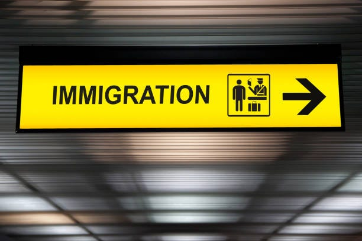

### AYS News Digest 22/2/23: What causes serious asylum backlog in the UK?
#### 150 people living in tents in Brussels // On the UK asylum backlog in detail // Violence at the Serbian-Hungarian border // Update on the arson attack in Berlin last month which killed a woman with six children // Recommended long reads, analysis and reports

#### FEATURE

The UK has accumulated a large backlog of asylum cases, reports the Migration Observatory. On 13 December 2022, Prime Minister Rishi Sunak [pledged](https://hansard.parliament.uk/commons/2022-12-13/debates/DB61C374-16B5-411C-9A29-CC3DCA119EB3/IllegalImmigration) to clear the backlog by the end of 2023.

This briefing note they published examines what they know about the UK’s asylum backlog, its causes, and its consequences.

The backlog of around 117,000 applications on 30 September 2022 reflects an eighteen-fold increase compared to 30 September 2010, when it stood at 6,485. Most of this increase happened over the last four years. On 30 September 2018, the backlog stood at 24,000 applications and increased by almost five times in four years.

According to data compiled by the [Asylum Information Database](https://asylumineurope.org/reports/) (AIDA), at the end of 2021, the only other European country with an asylum backlog larger than the UK’s, which stood at around 101,000, was Germany, with around 108,000 people awaiting an initial decision on their asylum claim (Figure 3). Spain’s backlog was around 72,000 and France’s 50,000. These figures comprise both principal applicants and family members.

In recent years, the larger staff of asylum caseworkers at the Home Office has made fewer decisions than in the past. A decline in the number of decisions per caseworker provides perhaps the single strongest explanation for the increase in the UK’s asylum backlog.

According to a [report](https://assets.publishing.service.gov.uk/government/uploads/system/uploads/attachment_data/file/1034012/An_inspection_of_asylum_casework_August_2020_to_May_2021.pdf) on asylum casework by the Independent Chief Inspector of Borders and Immigration, the lack of a service standard has “exacerbated delays”. On 20 September 2022, the Home Office [said](https://questions-statements.parliament.uk/written-questions/detail/2022-09-02/45768) that it is working to reintroduce a service standard.

The inadmissibility rules add two additional steps to the asylum process, which may have added to asylum processing times. First, the Home Office assesses an individual for inadmissibility, which takes time. Second, the Home Office will try to find a safe country to accept an individual it deems to be inadmissible. If the Home Office cannot remove a person it deems inadmissible within six months, then they would normally consider the asylum claim in the UK. This would have the effect of adding more time to the period between an applicant’s initial submission of the claim, and their initial decision.

Approaches to dealing with asylum backlogs typically fall into one of the following categories:
- Increasing the resources dedicated to processing cases, such as increasing staff numbers;
- Attempting to make the asylum process more ‘efficient’, such as by simplifying guidance or introducing specialisation);
- Prioritising applicants from groups with particularly high or low success rates, to make faster decisions on those cases;
- Granting status to people with longstanding, unprocessed claims without completing the full asylum casework process.

Some backlog-reduction proposals involve granting status to people who have been waiting for long periods without a full consideration of their asylum claim.

Read the entire detailed briefing note written by Peter William Walsh and
Madeleine Sumption on the [asylum backlog](https://migrationobservatory.ox.ac.uk/resources/briefings/the-uks-asylum-backlog/?fbclid=IwAR1izaLEMtvQdvupS9-KKlNUQHRNOwI5LPO0b5j3QWw_dHg8rwE1zYu93JY) .
#### SERBIA

■■■■■■■■■■■■■■ 
> **[Twitter User](https://twitter.com/frachcollective/status/1628078271609942036?s=20) @ Twitter Says:** 

> >  

> **Tweeted at .** 

■■■■■■■■■■■■■■ 

Violence and precarious living conditions at the EU external borders are part of the EU’s structural violence against people on the move, writes team Blindspots.

At the Serbian-Hungarian border, physical violence against people on the move is a brutal normality. The 4–6 meter high border fence is topped with razor wire which causes deep cuts when people try to cross it. The jump from the fence results in broken bones.

In Serbia, precarious living conditions in makeshift shelters damage the health of people on the move. Injuries often cannot be treated adequately and healing processes are delayed. The inability to warm up and rest and the lack of healthy food weaken the immune system.

Police violence inside Hungary, where pushbacks are official policy, includes beatings, kicks and dog attacks. People have to endure hours in the cold, being threatened and humiliated.

■■■■■■■■■■■■■■ 
> **[Blindspots](https://twitter.com/blindspots_ev) @ Twitter Says:** 

> > 🚨Diagnosis: sick border regime 🚨

Violence and precarious living conditions at the EU external borders are part of the EU's structural violence against People on the Move. 1/5

📹credits: Ellen Rothfuß https://t.co/OKxeQVoXwU 

> **Tweeted at [2023-02-21 18:13:02](https://twitter.com/blindspots_ev/status/1628095467069251585?s=20).** 

■■■■■■■■■■■■■■ 

#### SEARCH AND RESCUE AT SEA

■■■■■■■■■■■■■■ 
> **[@alarmphone](https://twitter.com/alarm_phone) @ Twitter Says:** 

> > @[Armed_Forces_MT](https://twitter.com/Armed_Forces_MT) @[guardiacostiera](https://twitter.com/guardiacostiera) More than 24 hours after our first alert to RCC #Malta &amp; MRCC #Rome, the 34 people in distress are still at sea. 
While governments are unable to protect the lives of vulnerable people, they are forced to struggle to survive, putting their lives at risk.
Stop it and rescue them! https://t.co/ASjp07UOZ8 

> **Tweeted at [2023-02-23 11:29:33](https://twitter.com/alarm_phone/status/1628718703771615233?s=20).** 

■■■■■■■■■■■■■■ 

#### ITALY
### People arriving to Lampedusa in greater numbers

In spite of all the political pressures and decisions leading away from saving lives, finding solutions and providing safety, people continue arriving to Lampedusa.

The Mediterranea team reports that with bad weather the departures stop or at least slow down, but as soon as the wind dies down and the sea calms, the arrivals start again.

> Of the NGOs, as has been repeated in recent days, not even the shadow: even in recent days they have been assigned ports of disembarkation very far away, to large and small ships that had rescued a few dozen people. And yet, people — with their stories, their faces, their desires — here they are. 

In less than a week, about 5,000 people arrived. It is difficult to imagine what it means to stay at the Favaloro pier and not have the space to walk, or see yourself in front of the Coast Guard patrol boat that, while shuttling between the quay and the next event, must maneuver carefully in the port because before it there are also two patrol boats of the Guardia di Finanza, the Swedish structure of Frontex, and that of the carabinieri, all engaged in landing and rescue operations.

Read their entire [report on the situation](https://mediterranearescue.org/news/tremila-persone-nellhotspot-di-lampedusa-non-e-unemergenza-ma-una-scelta-politica/?fbclid=IwAR1UNAaGxlxMgm3a431pInUi1pD-eBMIeFTH04C_cqFSaNdJ1mLoyKJBCgc) that documents the exacerbation of the already dangerous situation in Italy.
#### BELGIUM

Housing remains a great problem in the Netherlands, as we’ve previously been reporting, but also in Belgium. Now, following the evacuation of a squat in Schaarbeek, lots more of the asylum seekers remain without proper housing.

■■■■■■■■■■■■■■ 
> **[InfoMigrants](https://twitter.com/InfoMigrants) @ Twitter Says:** 

> > 📷Every day new tents are seen in front of the Petit Chateau (Klein Kasteeltje) in Brussels near the asylum arrival center. Approx. 150 people are currently living in tents. 

Following the evacuation of a squat in Schaarbeek, lots of asylum seekers remain without proper housing https://t.co/jnwitjfDMy 

> **Tweeted at [2023-02-21 16:59:00](https://twitter.com/InfoMigrants/status/1628076834268278784?s=20).** 

■■■■■■■■■■■■■■ 

#### GERMANY

■■■■■■■■■■■■■■ 
> **[Twitter User](https://twitter.com/Seebruecke_intl/status/1628333658330345474?s=20) @ Twitter Says:** 

> >  

> **Tweeted at .** 

■■■■■■■■■■■■■■ 

#### WORTH READING
- [Ukraine war: a year on, here’s what life has been like for refugees in the UK (theconversation.com)](https://theconversation.com/ukraine-war-a-year-on-heres-what-life-has-been-like-for-refugees-in-the-uk-199923?fbclid=IwAR04Ze-zHra84H-e7WqLgkX3JZNzeasmtIdVPu4aTsnasx1ianBjKWobx1c)
- “What has emerged is a raw picture of incredible hosting solidarity within a context of ongoing trauma, family separation and specific and long-term needs that are not being met by national social protection schemes.” — [Hidden Hardship: One Year Living in Forced Displacement for Refugees from Ukraine | NRC](https://www.nrc.no/resources/reports/hidden-hardship/?fbclid=IwAR1j6Fnmva8G0VXUCnMk9hvrjJGJY59rJBj4EXuk6nWwCjBUPNeQ6t3Fvco)
- EU and externalisation: [The secrecy behind the EU’s plans to ‘externalise’ migration (euobserver.com)](https://euobserver.com/opinion/156713?fbclid=IwAR0_phCdHI08RdMa8DDnDFa0e0rXWRLG4NmImfSLMy7OTsY6D_kGac1Idz0)

> Join our team! 

**Find daily updates and special reports on our [Medium page](https://medium.com/are-you-syrious) .**

**If you wish to contribute, either by writing a report or a story, or by joining the Info team, please let us know!**

**We strive to echo correct news from the ground through collaboration and fairness. Every effort has been made to credit organisations and individuals with regard to the supply of information, video, and photo material (in cases where the source wanted to be accredited). Please notify us regarding corrections.**

**If there’s anything you want to share or comment, contact us through Facebook, Twitter or write to: areyousyrious@gmail.com**

_[Post](https://medium.com/are-you-syrious/ays-news-digest-22-2-23-what-causes-serious-asylum-backlog-in-the-uk-48ff4db7385a) converted from Medium by [ZMediumToMarkdown](https://github.com/ZhgChgLi/ZMediumToMarkdown)._
