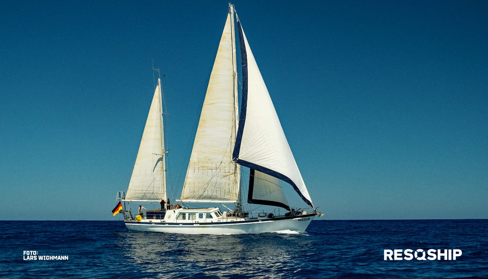
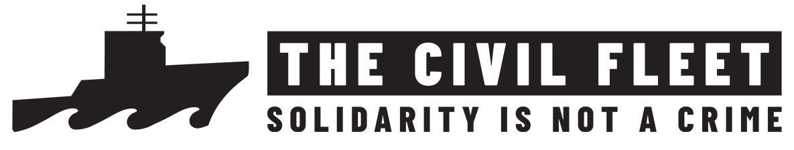
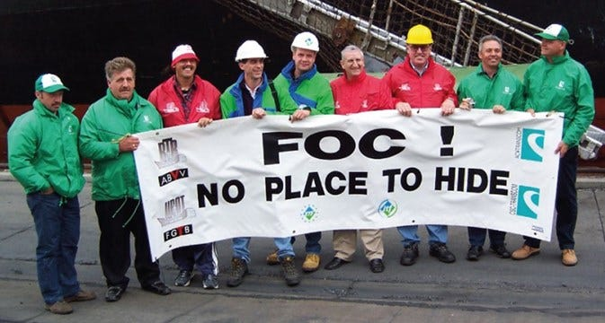

### AYS News Digest 04/03/23: Strangling the civil fleet SAR operations — how far will European governments go?
#### Voices from inside Serbia’s detention centres //Court ruling in favour of humanitarian activists in Poland // Hope not Hate’s report on the UK’s political climate // Statewatch’s report on the occlusion of data, and the rejection of freedom of information requests & more.
#### FEATURE
### Strangling the civil fleet SAR operations: how far will European governments go?

Credit: ResQship via Twitter

As reported [here](https://areyousyrious.medium.com/ays-news-digest-3-2-23-civil-fleet-ships-diverted-from-sar-zones-by-italian-authorities-5b15b69c0ec6) and [here](https://areyousyrious.medium.com/ays-news-digest-15-3-2023-italy-sar-decree-becomes-law-18e6a0e3928) by AYS, European governments are hard at work to make the operations of civil fleet SAR vessels almost impossible. Having enshrined a new law in Italy that will reduce operational capacity in the central Med by diverting SAR ships to distant ports, the German government are proposing a new measure that means German-registered vessels will have to adhere to much stricter rules. Civil fleet vessels will have to re-classify as commercial ones, rather than recreational.

The German Ministry of Transport is proposing to forcefully decommission all members of the SAR Civil Fleet who operate under a German flag. Currently classified as recreational yachts or motor vessels, boats over 24 metres long will be forced to re-classify as commercial vessels. The international regulations on such vessels are far stricter, and will make it impossible for smaller vessels to continue operating.

Everything from vessel design and construction, equipment and pollution regulations to crew work/rest periods will have to be reformulated. This imposes a **huge rise in operational costs** for civil fleet actors, making it far harder for current operators of smaller craft — Lifeline, ResQShip, Sea Punks — to continue, and for new civil fleet actors to launch SAR operations.

■■■■■■■■■■■■■■ 
> **[Sea Punks e.V. | seapunks.bsky.social](https://twitter.com/sea_punks) @ Twitter Says:** 

> > Ist das euer scheiß Ernst?!?

"Die zivile Seenotrettung darf nicht behindert werden." Dieser Satz findet sich genau so im Koalitionsvertrag der Bundesregierung. Der erneute Anlauf des Verkehrsministeriums, humanitäre Einsätze mit Sportbooten zu verbieten, ist genau das Gegenteil. https://t.co/opPdOxrCkj 

> **Tweeted at [2023-02-28 20:16:19](https://twitter.com/sea_punks/status/1630663209194496019).** 

■■■■■■■■■■■■■■ 

Whilst the German Transport Minister may argue that such restrictions will require more stringent safety measures for NGOs, it will undoubtedly reduce the capacity of the civil fleet, and endanger far more lives in the central Mediterranean. These are life-threatening proposals, not the life-saving ones they are sold as.

SAR NGO Lifeline have already reported that both their MVs — Rise Above and Marwa — will be unlikely to meet new criteria.

■■■■■■■■■■■■■■ 
> **[Sea-Watch](https://twitter.com/seawatchcrew) @ Twitter Says:** 

> > Volker @[Wissing](https://twitter.com/Wissing) behindert zivile #Seenotrettung:

Auch wenn das @bmdv das Gegenteil behauptet, die Mehrheit der zivilen Rettungsschiffe, die unter deutscher Flagge im Einsatz sind, wäre durch die geplante Änderung der #Schiffssicherheitsverordnung blockiert! https://t.co/vOxRlS5fFt 

> **Tweeted at [2023-03-01 17:19:28](https://twitter.com/seawatchcrew/status/1630981090478374912?fbclid=IwAR3woNvh6Tqazo220ximRGr3keCgNl-JyioEOOc8BmSGvYMDHskYpiEEJBU).** 

■■■■■■■■■■■■■■ 

Such intricate restrictions constitute a threat to SAR operations on multiple levels. Indeed, it restricts the capacity of wider society to support, participate in solidarity and understand the first-hand reality of life in the central Mediterranean. This is an attempt to remove civil actors, and so restrict what is visible to the wider public.
#### **Double standards: flags of convenience**

Credit: ITF — International Transport Workers’ Federation — advocates for social justice on the high seas.

The German Ministry of Transport’s case — requiring high levels of compliance to assure safety — is, on the face of it, a sound one.

But look again: **two-thirds of the world’s merchant shipping partake in what is called re-flagging** . Re-flagging is a business practice, whereby a ship is re-registered to a country different to that of its owners, usually one without the means or desire to ensure compliance. While in international waters, it is the law of the ‘flagged’ country that will be enforced. So, in this way, vessels can ‘legally’ have lower safety standards, reduce operating costs, pay lower wages and enforce worse conditions, and avoid income taxation.

As of 2021, more than 40% of the world fleet was registered to three countries: Panama, Liberia and the Marshall Islands.

It gets dodgier. Germany has its own ‘flag of convenience’ — a means of side-stepping stricter compliance, called the [German International Ship (GIS)](https://www.itfglobal.org/en/sector/seafarers/flags-of-convenience?fbclid=IwAR1pKsADdUoQkT0B-PWXQseFdMGcDDM8Zu6e-U07_1Y_nX2tpVLMG3YfoF8) . The GIS allows ship-owners to register in Germany, whilst paying lower wages: [“it allows them to employ foreign seafarers to the wage conditions of their home country when flying the German flag.](https://www.deutsche-flagge.de/en/german-flag/registration/gis/gis) ”

The double standards at play here are shocking: the safety of crew and their welfare is not the German Ministry of Transport’s priority. So why the sudden need to ensure NGO’s safety standards in the Central Med, which will essentially decommission SAR civil fleet actors? It seems to be another instrumentalisation of the law to disempower civil society, put more lives at risk, and to do so out of sight.
#### SEARCH AND RESCUE
#### Update from the detention of the Geo Barents

MSF’s SAR rescue ship remains in the Sicilian port of Augusta. It was detained on 20th February 2023 for 20 days, and fined 10,000 euros.

■■■■■■■■■■■■■■ 
> **[MSF Sea](https://twitter.com/MSF_Sea) @ Twitter Says:** 

> > "Those who will truly suffer the consequences (of Geo Barents' detention) are the people who will be left without assistance in the #CentralMediterranean sea"

🎙️ Anabel Montes, MSF Search and Rescue Team Leader https://t.co/Z6X3ho1Akf 

> **Tweeted at [2023-03-02 19:02:27](https://twitter.com/MSF_Sea/status/1631369395208331431?fbclid=IwAR1gVBawIc7nSCaYy9IOw-VeLGUBI7ZRC9DCQiY5Yb_7SN7q59sxqR5JCBw).** 

■■■■■■■■■■■■■■ 

Note: the ‘VDR’ she refers to is the Voyage Data Recorder, a ‘black box’ on the bridge which records all critical information and bridge conversations. The VDR only becomes a thing after an accident or an incident, and is not something that has to be presented to authorities routinely. So why the exceptional attention being put on the civil fleet? Another act of systemised discouragement aimed to restrict civil actors.
#### SERBIA
### Voices from inside Serbia’s detention centres — UNHCR Data vs. Reality

 on Unsplash](../assets/582fd011d89f/0*DskwYijzfbBGzTBv)

Photo by [jules a.](https://unsplash.com/@julesea?utm_source=medium&utm_medium=referral) on Unsplash

Solidarity NGO _Blindspots_ have exposed the truth. Two realities are being reported from Serbia. One reality is voiced by data, and another by human voices. Which one should we be listening to?

UNHCR’s data tells us that detention centres are not over capacity. Their impersonal, vague “traffic light system” notes that they have adequate or partial internet, electricity, hot water, privacy, waste management, medical treatment, activities and language classes, food provisions and child protection across the Serbian detention centres.

See here for detail:

Were such provisions true, would that be good enough? Given that the voices of detained people tell another story entirely, it unequivocally isn’t.

**The human story**

Ellen Rothfuß’s recent video tells a story of woefully inadequate provisions. She learns of the unavailability or ineffectiveness of medical care in detention centres, where outbreaks of skin diseases such as scabies are normal. Moreover, freedom of movement is absolutely restricted:

> “If you go outside police take you back” 

UNHCR’s data tells us that the freedom of movement is unrestricted within the centre, and that public services are freely available.

](../assets/582fd011d89f/1*dVJzYWkZE3OWhEhlMJ2a6w.png)

[https://data.unhcr.org/en/documents/details/89400](https://data.unhcr.org/en/documents/details/89400)

Is that true? Clearly not.

_Blindspots_ have also received reports of coerced labour:

> “People on the move also told us that they have to fulfil tasks like cleaning in order to get food or a bed. Often they encounter violence and harassment” 

Please watch Rothfuß’s video in full below — it’s only one minute long.

■■■■■■■■■■■■■■ 
> **[Blindspots](https://twitter.com/blindspots_ev) @ Twitter Says:** 

> > ‼️No Borders - No Camps‼️

📹: Ellen Rothfuß
🎵: Fingers In The Noise -  Sleeping Sun

The video footage showing the conditions in the camps was provided by residents of the camps in northern Serbia in February 2023. 1/7 https://t.co/VbvR9r29io 

> **Tweeted at [2023-03-01 22:42:23](https://twitter.com/blindspots_ev/status/1631062352194940928?fbclid=IwAR3C6l1hlLAKVDE1t9wFEymm9hImHPzggxiFs1NbbdbbDW9XVF3YmaVqDjM).** 

■■■■■■■■■■■■■■ 

The normalisation of dehumanising conditions is being hidden by depersonalised data reporting. Crammed sleeping places, abuse by drunken guards, dangerously poor hygiene conditions and bedbugs, fleas and scabies are ‘normal’. This is conscious and systemic dehumanisation, and is absolutely unacceptable. We need to listen to human voices from inside, not just look at hopelessly non-specific data from the outside.
#### POLAND
#### Court ruling in favour of humanitarian activists

Following an incident of uniformed state repression — detention, interrogation and theft of electronic hardware — against the humanitarian volunteers of the Catholic Intelligentsia Club (CIC), the CIC have won their court case! There is **no grounds to detain people helping victims of displacement** on the Polish-Belarussian border, nor anywhere in Europe.

The Polish court has ruled that the officers violated the law in their actions against the activists.

■■■■■■■■■■■■■■ 
> **[Grupa Granica](https://twitter.com/GrupaGranica) @ Twitter Says:** 

> > 1/4 Przełomowe orzeczenie sądu! Po raz kolejny sąd potwierdził, że pomaganie jest legalne, a służby nie mają podstaw do zatrzymywania osób niosących pomoc ofiarom kryzysu humanitarnego na pograniczu PL-BY! https://t.co/uRPXO7HVYt 

> **Tweeted at [2023-03-02 14:19:32](https://twitter.com/GrupaGranica/status/1631298195069206530?fbclid=IwAR0vu4NIXSw5pB9DDbD_l8RsL_Ybmi9yl5Yn6UROadB-iIGDfmYuNzum3zg).** 

■■■■■■■■■■■■■■ 

#### UNITED KINGDOM
#### Report on anti-migrant activism from NGO Hope Not Hate (HNH)

Following the release of their annual [‘State of Hate’ Report last week](https://hopenothate.org.uk/2023/02/26/state-of-hate-2023-rhetoric-racism-and-resentment/) , in which they document their concern for political flux giving way to growth of the UK’s far-right, HNH have profiled the ringleaders of extreme anti-migrant activists. The despicably self-named ‘migrant hunters’ have harassed people at asylum seeker accommodations 253 times this year.

Although we don’t wish to platform such fascistic behaviour, it is depressingly important to be aware of the far-right extremism circulating within Britain, and HNH’s work to promote HOPE over hate is perhaps more important than ever in an increasingly polarised island nation. We stand with and promote their values:

> ‘community not individuals; peace not conflict; solidarity not self-interest; respect not abuse; resilience not fragmentation; togetherness not isolation; collaboration not competition.’ 

#### WORTH READING
- On refugee reception inequality in Europe:

An op-ed from US-based independent news provider ‘Democracy Now!’, in the wake of the Crotone shipwreck last week. They summarise discrepancies between the reception of refugees from Ukraine and from other countries, as well as the official attempts to further restrict SAR civil fleets.

- Access to freedom of information DENIED by the enforcement of migration policies in Europe. _Statewatch_ report at length about how Frontex obscures the border regime :

> “Freedom of information law has provided a vital means for civil society, and particularly journalists, to hold the powerful to account. This is also the case when it comes to the externalisation of migration controls.” 

BUT

> “The general strategy of the hardliners is to harass, delegitimise, demoralise and criminalise migrant support activities through various means: evoking possible collusion with traffickers, framing their activities as organised crime, or challenging their right to oppose state policy. Of course, many of those policies involve criminal acts and the negation of positive values including non-discrimination, the rule of law and the frameworks of international and human rights law. The ultimate aim is to neutralise checks, balances and accountability.” 

This bid for neutralisation is an existential threat to justice, and one that we **must** oppose proactively. The full report below is a **must read** :

> _JOIN OUR TEAM — Reach out via Facebook, Instagram or by email at: areyousyrious@gmail.com_ 

**Find daily updates and special reports on our [Medium page](https://medium.com/are-you-syrious) .**

**If you wish to contribute, either by writing a report or a story, or by joining the Info team, please let us know!**

**We strive to echo correct news from the ground through collaboration and fairness. Every effort has been made to credit organisations and individuals with regard to the supply of information, video, and photo material (in cases where the source wanted to be accredited). Please notify us regarding corrections.**

**If there’s anything you want to share or comment, contact us through Facebook, Twitter or write to: areyousyrious@gmail.com**

_[Post](https://medium.com/are-you-syrious/ays-news-digest-04-03-23-strangling-the-civil-fleet-sar-operations-how-far-will-european-582fd011d89f) converted from Medium by [ZMediumToMarkdown](https://github.com/ZhgChgLi/ZMediumToMarkdown)._
