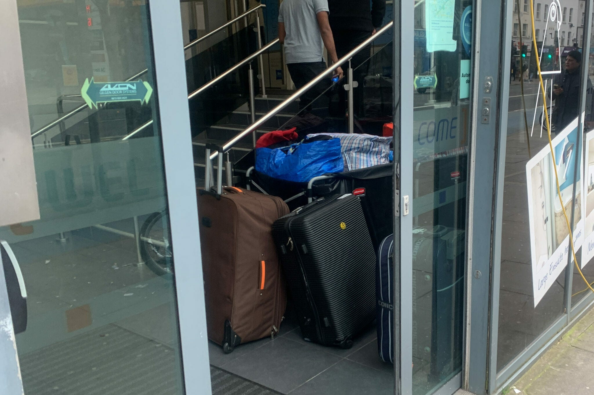

### AYS News Digest 22/3/23: Eleven people on hunger strike
#### Hunger strike in Paranesti // Proposed Immigration Code of Greece under scrutiny — Punitive bill for asylum seekers and unaccompanied minors // A rise in anti-immigration protests in Ireland // Iceland to tighten asylum laws // + Things we find important for you to know and calls for action

](../assets/4851371b1efc/0*fp2N1HT9lhzzJPST)

Paranesti detention centre / Photo [source](https://www.efsyn.gr/ellada/dikaiomata/382745_apergia-peinas-enteka-prosfygon-sto-paranesti)
#### FEATURE

Policies put in place on an international scale enable and exacerbate the violation of rights aimed at preventing people from entering the countries and at the same time from accessing their basic rights.

Appalling conditions and repeated incidents of police arbitrariness in the detention centres of **Greece** are the subject of many denouncements by organisations, but also protests of different kinds by the people affected most by the conditions. Unfortunately, another hunger strike was needed to bring attention to the situation faced by people at **Paranasti** .

The hunger strike began on 16 March by five prisoners and expanded in the following days, as they note in solidarity in a text on the counter-information website indymedia.

> Many prisoners are forced to sign untranslated documents in Greek, without understanding them, while, if they refuse, they are subjected to physical violence or signed by police officers instead of them. 

> Many are forced to sleep on damaged mattresses, in rooms full of cockroaches, without constant access to hot water, while they are forced to drink water from the toilet sink, if the filter works, or buy bottles for 2.5 euros per liter, while the food is scarce and poorly cooked. 

Given the circumstances and that as upon entering Paranesti the mobile phones are confiscated and the cameras are destroyed, it is difficult if not impossible to document the violence and other things taking part at the facility, especially in such a way that would produce valid evidence for any possible procedure to follow.

> An average of 10 prisoners live in each container and that the covers and mattresses are dirty, that they are not given cleaning supplies or hygiene items, nor warm clothes or blankets for the winter, and that the medicines given are mainly painkillers and hypnotics, while access to the psychologist is delayed. 

[Dimitris Angelidis](https://www.efsyn.gr/authors/dimitris-aggelidis) has more on this particular case, but as it’s a common and very present practice elsewhere, it’s upon everyone to open their eyes and see what’s taking place in detention centres around you.
#### GREECE

On 7 March 2023, the Ministry of Migration and Asylum submitted the draft “Immigration Code” to public consultation. Although the bill counts a total of 180 articles, yet it was tabled in a truncated one-week consultation, until last Tuesday, 14 March. This is an unjustified deviation from the general two-week rule laid down in law, while no “sufficiently substantiated grounds” have been put forward for resort to shorter deadlines, **Refugee Support Aegean (RSA)** reports.

**In their opinion, the process of public consultation is an extremely important indicator of the functioning of a rule of law, and should be given substantial importance — and sufficient time for its conduct** .

**The organisation submitted its detailed recommendations to the public consultation of the Ministry of Migration and Asylum, based on its experience and action** , in the context of legal assistance combined with social support, as well as research and advocacy for highlighting broader issues and challenges of the asylum system at the Greek and European level.

[See more](https://rsaegean.org/en/immigration-code/?fbclid=IwAR1xUVJyxdKYNfb5-9bc518omZaZk1Y_cC3iKA5nAIMou243cf132ewFDcM) .

Ambulances attending to refugees and Roma are required to [**have a police escort despite the fact that they are particularly violent to both groups.**](https://www.hlhr.gr/%ce%b5%ce%ba%ce%b1%ce%b2-%cf%81%ce%bf%ce%bc%ce%ac-%cf%80%cf%81%cf%8c%cf%83%cf%86%cf%85%ce%b3%ce%b5%cf%82/?fbclid=IwAR2etU_FpWfA2UCeHZTDxKjRhwK62Rm1WWk4YzKxEPDiRCCan0sQUJR1FRM)
#### SERBIA

The EU seems to be counting the points for a potential entry status through human rights abuses:

■■■■■■■■■■■■■■ 
> **[InfoMigrants](https://twitter.com/InfoMigrants) @ Twitter Says:** 

> > The European Union’s Home Affairs Commissioner Ylva Johansson has praised Serbia’s handling of migration, a day after Serbian authorities rounded up nearly 700 migrants and moved them to reception centers. https://t.co/hse5tjG7JC 

> **Tweeted at [2023-03-21 14:30:27](https://twitter.com/InfoMigrants/status/1638186310656557057?s=20).** 

■■■■■■■■■■■■■■ 

#### SEARCH AND RESCUE AT SEA
### Buying boats to escape

According to recent reports in the mainstream [media](https://www.middleeastmonitor.com/20230320-tunisia-migrants-fearing-deportation-following-statements-by-president-resorted-to-buy-boats-to-escape-to-italy/?fbclid=IwAR3fuTVSWARCXJqNmh8Wimd7lyWaFNLGH9bVCwlHREZ1YaqazWqigXzxqa0) , Ivorians now “rush to buy fishing boats to leave Tunisia”, where they faced arrests and violence at the instigation of the country’s president.

> The Tunisian president recently stressed that “urgent measures” must be taken to stop the flow of “hordes of irregular migrants”, and the resulting situation of “violence, crimes and unacceptable practices, as well as legally criminalised”. This statement provoked condemnation from Tunisian human rights organisations. 

### Updates from the sea

During the first two months of the year 2023:
- 14,543 people arrived in Italy by boat and of which a significant number arrived autonomously (UNHCR figure until the 6th of March).
- 995 people were rescued by the civil fleet from 16 boats in distress (CMRCC figure). • 3,046 people were pushed back to Libya after they were intercepted by the EU-supported so-called Libyan Coast Guard (IOM figures until the 4th of March).

This number is additional to the shipwreck in front of Crotone where 70 people who departed from Turkey lost their lives. Three hundred thirty/-five people who fled Libya died or are reported missing (IOM figure), ECHOES From the Central Mediterranean report in their latest newsletter that you can read [here](https://civilmrcc.eu/echoes-from-the-central-mediterranean/echoes5-mar2023/?fbclid=IwAR1HrwKAFr8xbOLRHBsJ2rNc-5mHQmNjufoUixsib2rUjfA0XkY2Eek9Ye0) .
### Ousman’s story

> When 16-year-old Ousman was rescued from distress at sea by Ocean Viking in February, it was his third attempt to escape from Libya. 

> Twice he was intercepted, once he was arbitrarily detained. 

> “My mother had to sell her clothes to get me out of this place.” 

■■■■■■■■■■■■■■ 
> **[SOS MEDITERRANEE Deutschland](https://twitter.com/SOSMedGermany) @ Twitter Says:** 

> > Als der 16-jährige Ousman* im Februar von der #OceanViking aus Seenot gerettet wurde, war es sein 3. Versuch, #Libyen zu entkommen. 2 mal wurde er abgefangen, einmal wurde er willkürlich inhaftiert. "Meine Mutter musste ihre Kleider verkaufen, um mich aus diesem Ort zu befreien." https://t.co/lJ1WUyyQ6U 

> **Tweeted at [2023-03-22 13:32:40](https://twitter.com/i/status/1638534156253634561).** 

■■■■■■■■■■■■■■ 

#### GERMANY
### More people opt for smuggling routes as a last resort

A family with four children, an unaccompanied minor and a young man were found near the German-Austrian border in a van registered in Germany, traveling from Croatia towards Germany, InfoMigrants says.

[Reportedly](https://www.infomigrants.net/en/post/47670/syrian-migrants-cross-german-border-in-suspected-smugglers-van?fbclid=IwAR0ZTTIEnslTrnixlGNniyh-rvzBUJ-HCMNLSohieonbRU-MGPK9-Pbk2Y0) , in the first two months of 2023 there was a significant [rise](https://www.infomigrants.net/en/post/46259/switzerland-records-uptick-in-irregular-entries) in the number of people who entered the country without documents. In [January](https://www.infomigrants.net/en/post/45870/germany-federal-police-thwarts-smuggling-of-syrians) , there were 7,587 documented entries, while in February the number was 5,367, an increase of nearly 40% compared with the same month last year.
#### IRELAND
### Rise in anti-immigration protests

A convicted terrorist who is one of the main players in organising anti-refugee protests has been arrested for threatening to burn down a hotel housing over 40 refugees, Irish media [report](https://www.independent.ie/irish-news/crime/organiser-of-anti-refugee-protests-is-arrested-over-threat-to-burn-down-hotel-42281960.html?fbclid=IwAR2qzn_BEk8NbjaxoB0tQtpLJrO4ODeujZ0SALVN8-bT91R0fpiF82bDBfU) .

“The chilling threat was allegedly made by the 43-year-old to a staff member of a hotel in Athy, Co Kildare which is currently hosing just over 40 asylum seekers.”
#### UK
### Refusing to be moved

More than 40 people resisted removal from a Tower Hamlets hotel on Monday, with some disembarking the coaches they were loaded on to after speaking to other asylum seekers and activists.

Vulnerable individuals and families feared they could be taken to either a remote, rural location, or a Bedfordshire hotel that has been aggressively targeted by the far right, Novara media [reports](https://novaramedia.com/2023/03/21/more-london-asylum-seekers-are-refusing-to-be-flung-across-the-country-by-profit-seeking-private-companies/?fbclid=IwAR1PVTtofAy7eoqNt-vqw4ldam3gUW_x71NuBdqxT9XWZKt6mTDUkmZ4TiU) .

The asylum seekers at Tower Hamlets were not provided with interpreters to explain the situation, nor did they receive any correspondence from the Home Office.

Some said they were only told where they were going on the day, with individuals seemingly arbitrarily assigned to one of two London locations, Bedfordshire, or a hotel more than two hours away in the Sussex countryside.

Asylum seekers were told to pack their bags and board 8am buses out of London. They refused. Photo: Charlotte England
### **Scampton asylum seekers could be housed in ‘shipping containers’ on runway**

As a shock to everyone locally, the government plans to have people potentially use “Greek style portacabins, so shipping containers” placed on the airfield’s hard standing, on RAF Scampton’s runway, in Lincolnshire.

“We’re really not happy with the situation. West Lindsey and other partners have worked so hard over the past two years to have a place, a future for the camp and it’s really disheartening, that the government can come in at this last minute and potentially override everything,” Lincolnshire County Councillor said.

Find out more on the story by Lincolnlite: [Scampton asylum seekers could be housed in ‘shipping containers’ on runway](https://thelincolnite.co.uk/2023/03/scampton-asylum-seekers-could-be-housed-in-shipping-containers-on-runway/?fbclid=IwAR0uEp4gEvoUVdnA0z325Lzq30f2-8RtDHFYefNxlACDZsy-WedxWWfk2eI)
### UK Refugee Council warns of high costs if migration bill becomes law

Continuing the heating argument around the proposed bill we reported previously about, another issue seems to be that of funding.

Refugee Council [published its assessment of costs](https://www.refugeecouncil.org.uk/wp-content/uploads/2023/03/Refugee-Council-Asylum-Bill-impact-assessement.pdf) based on available data related to migration and detention costs. According to its assessment, over the next three years, the proposed legislation could cost the government over €10 billion just for accommodation. InfoMigrants brings [more](https://www.infomigrants.net/en/post/47675/uk-refugee-council-warns-of-high-costs-if-migration-bill-becomes-law?fbclid=IwAR1HrwKAFr8xbOLRHBsJ2rNc-5mHQmNjufoUixsib2rUjfA0XkY2Eek9Ye0) .
#### ICELAND
### Tighten asylum laws

More than 2,500 asylum applications were filed last year in Iceland, [SchengenVisaInfo](https://www.schengenvisainfo.com/) reported. Following that, the country seems to be heading in the same direction as their colleagues in the European EU Member States, that is, toward the tightening of options for entry to those seeking international protection.

Given that the country is a part of the European Schengen Zone, the people entering don’t get to be controlled at the border, so their options are almost the same as for any other European country, in terms of entering.

[Iceland’s authorities previously planned to deport a total of 200 asylum seekers](https://www.schengenvisainfo.com/news/iceland-plans-to-deport-around-200-asylum-seekers-back-to-their-first-country-of-asylum/) back to their origin countries where they first submitted their asylum applications, but a number of reports revealed concerns and caused protests from several organisations.

Authorities in Iceland will now impose stricter laws for asylum after the country’s Members of Parliament voted 38 to 15 to strip benefits away from failed asylum seekers, according to the [reports](https://www.schengenvisainfo.com/news/iceland-to-tighten-asylum-laws-following-influx-of-refugees/?fbclid=IwAR2qzn_BEk8NbjaxoB0tQtpLJrO4ODeujZ0SALVN8-bT91R0fpiF82bDBfU) .

Among others, asylum seekers will not be eligible to claim health and social security benefits 30 days after their application is refused.
#### EVENT
### Take part in the Feminist No Borders Summer School

The sixth annual FNBSS will take place in six cities (Athens, Berlin, Lisbon, New Delhi, Novi Sad, and Palermo) over five days: 14–18 June

Check out the CfP (closes 24 March 23): [https://feministresearch.org/wp-content/upl](https://t.co/H2K2EMDb78)

#### WORTH READING

[**January update from the french-italian Border → No Nation Truck**](https://l.facebook.com/l.php?u=https%3A%2F%2Fnonationtruck.org%2Fen%2Fjanuary-update-from-the-french-italian-border%2F%3Ffbclid%3DIwAR2G64JhZW49O9pjB8M9BZ6daaKSGjLxJokY6-G4Jv93DX7bWFB2j-Yj5S8&h=AT1q5dpJHw6EXZNDGDCiL0Y4aA0HHP_9s1gRG_T3jQn772-fSEjR_LTrAkuQ5qyBPl1vVHCMAKow65xBVeheeakr78yZPBBK75jzDL6M2x_p6ABFwHtXSl0s6J48oNT-LmIgX8muFjOvkg&__tn__=R]-R&c[0]=AT1d4gZCwRfT3hHtjzW_QImyhHF8xyzAnR1CQR50r5lmePc-EgGIUEfuxkW3HL0SdzUHC3TrQeRVuUyjThlQqDzn1n6tEobrfVj8kwX3QefW_XqRDSBJZc5kzRdEOcWYnEPtE47Cwo-HQ31MxZtGCWlp9D2MKdxuBI9AyKvztjFbpj7HhT6tNpnQtHiAw5sP7WERaqQn_nDcn25m) 
[_This report is a snapshot of two weeks in January at the Italian-French border to get an impression of the situation in…_ l.facebook.com](https://l.facebook.com/l.php?u=https%3A%2F%2Fnonationtruck.org%2Fen%2Fjanuary-update-from-the-french-italian-border%2F%3Ffbclid%3DIwAR2G64JhZW49O9pjB8M9BZ6daaKSGjLxJokY6-G4Jv93DX7bWFB2j-Yj5S8&h=AT1q5dpJHw6EXZNDGDCiL0Y4aA0HHP_9s1gRG_T3jQn772-fSEjR_LTrAkuQ5qyBPl1vVHCMAKow65xBVeheeakr78yZPBBK75jzDL6M2x_p6ABFwHtXSl0s6J48oNT-LmIgX8muFjOvkg&__tn__=R]-R&c[0]=AT1d4gZCwRfT3hHtjzW_QImyhHF8xyzAnR1CQR50r5lmePc-EgGIUEfuxkW3HL0SdzUHC3TrQeRVuUyjThlQqDzn1n6tEobrfVj8kwX3QefW_XqRDSBJZc5kzRdEOcWYnEPtE47Cwo-HQ31MxZtGCWlp9D2MKdxuBI9AyKvztjFbpj7HhT6tNpnQtHiAw5sP7WERaqQn_nDcn25m)

[**The Dynamics of Refugee Return: Syrian Refugees and Their Migration Intentions | British Journal of…**](https://l.facebook.com/l.php?u=https%3A%2F%2Fwww.cambridge.org%2Fcore%2Fjournals%2Fbritish-journal-of-political-science%2Farticle%2Fdynamics-of-refugee-return-syrian-refugees-and-their-migration-intentions%2FCE4037C22F465A7BC284CEE7D5183822%3Ffbclid%3DIwAR08f3RlTWWuJsqOOq2lVv9PFREXSrKMpUzaV4iqH_BcwhXPTKqQeVIfJN0%23article&h=AT2slNwmhzSRZvv832CKj-mEthUJ-GkIwjbuRNMS3ir30AjuVKE3Ko2oiRxcGAdC9sM4inCsfwWJ4zGBVtoaux4w5S-RDN3yxxcphnZN3EExH12pOquJu5SC3NIesDkkAdSgy4uybUqufQ&__tn__=R]-R&c[0]=AT0VaC0Oq0K9sjpkfjBZdEAZhfV-hYFUcco7AEYJdZsvgGj4ZEux1CCZMU09hDwfTe3eIEUud1XfjugPWeKLwGew-BIRHYh06g6OsiMHIhEkMFDGGKLQ94S5tFkdlWYiHIUhRklOkvLU38oumuKTGM-sk-LJWbWTvJiqwKpoiFcwBpWfcXnfuTFGQdGwMkDQWYsVjN3xFKV7PM3s) 
[_Mass forced displacement has proven to be an enduring challenge in contemporary international politics. Forcibly…_ l.facebook.com](https://l.facebook.com/l.php?u=https%3A%2F%2Fwww.cambridge.org%2Fcore%2Fjournals%2Fbritish-journal-of-political-science%2Farticle%2Fdynamics-of-refugee-return-syrian-refugees-and-their-migration-intentions%2FCE4037C22F465A7BC284CEE7D5183822%3Ffbclid%3DIwAR08f3RlTWWuJsqOOq2lVv9PFREXSrKMpUzaV4iqH_BcwhXPTKqQeVIfJN0%23article&h=AT2slNwmhzSRZvv832CKj-mEthUJ-GkIwjbuRNMS3ir30AjuVKE3Ko2oiRxcGAdC9sM4inCsfwWJ4zGBVtoaux4w5S-RDN3yxxcphnZN3EExH12pOquJu5SC3NIesDkkAdSgy4uybUqufQ&__tn__=R]-R&c[0]=AT0VaC0Oq0K9sjpkfjBZdEAZhfV-hYFUcco7AEYJdZsvgGj4ZEux1CCZMU09hDwfTe3eIEUud1XfjugPWeKLwGew-BIRHYh06g6OsiMHIhEkMFDGGKLQ94S5tFkdlWYiHIUhRklOkvLU38oumuKTGM-sk-LJWbWTvJiqwKpoiFcwBpWfcXnfuTFGQdGwMkDQWYsVjN3xFKV7PM3s)
- [Appel urgent: Crise humanitaire à Assamaka, frontière nigéro-algérienne: des milliers de personnes en situation de vulnérabilité expulsées d’Algérie et livrées à elles-mêmes au milieu du Sahara, sans abri ni soins. — Alarmphone Sahara (alarmephonesahara.info)](https://alarmephonesahara.info/fr/blog/posts/appel-urgent-crise-humanitaire-a-assamaka-frontiere-nigero-algerienne-des-milliers-de-personnes-en-situation-de-vulnerabilite-expulsees-d-algerie-et-livrees-a-elles-memes-au-milieu-du-sahara-sans-abri-ni-soins?fbclid=IwAR2BKS21Dkv3waayd6cEzVmL_jh2vRTYq90K5N6txiJPTTdDXa2vZkxdH2A)
- watch the film about Sara Mardini: [saramardini.film | Instagram, Facebook | Linktree](https://linktr.ee/saramardini.film?fbclid=IwAR20usSWpXMVdaEy0yos1zFYKgvaG6SFapLh-aF4JzxiELMGOYi9tKutHmU)

> _JOIN OUR TEAM — Reach out via Facebook, Instagram or by email at: areyousyrious@gmail.com_ 

**Find daily updates and special reports on our [Medium page](https://medium.com/are-you-syrious) .**

**If you wish to contribute, either by writing a report or a story, or by joining the Info team, please let us know!**

**We strive to echo correct news from the ground through collaboration and fairness. Every effort has been made to credit organisations and individuals with regard to the supply of information, video, and photo material (in cases where the source wanted to be accredited). Please notify us regarding corrections.**

**If there’s anything you want to share or comment, contact us through Facebook, Twitter or write to: areyousyrious@gmail.com**

_[Post](https://medium.com/are-you-syrious/ays-news-digest-22-3-23-11-people-on-hunger-strike-4851371b1efc) converted from Medium by [ZMediumToMarkdown](https://github.com/ZhgChgLi/ZMediumToMarkdown)._
