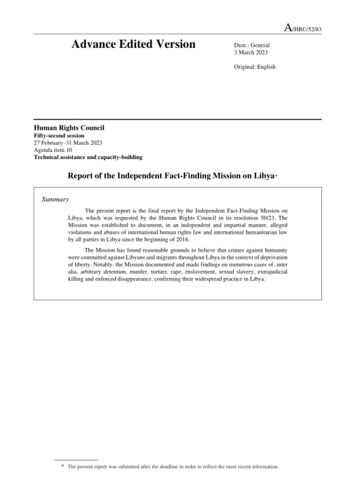
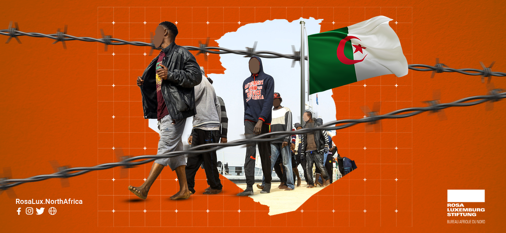
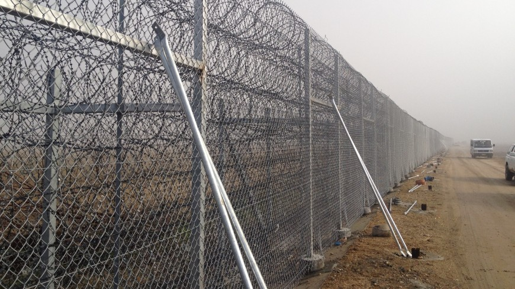

### AYS News Digest 31/03/23: Worsening situation for migrant people in North Africa

UN report calls for urget action to curb deteriorating human rights situation in Libya// Violence against sub-Sharan migrants continues in Tunisia// Massive illegal expulsion from Algeria to Niger// The problematics of the new initiative “security-related information sharing system” in EU// And more!!

](../assets/f4858ba159bd/1*XAqqPS1UOYqcbX59dtfJ0g.jpeg)

Many people were pushed back from Algeria to Niger. Via: [Alarmephone Sahara](https://twitter.com/AlarmephoneS/status/1641313589720936450)
#### LIBYA
### UN inquiry calls for urgent action against crimes in Libya

> “The practices and patterns of gross violations continue unabated, and there is little evidence that meaningful steps are being taken to reverse this troubling trajectory and bring recourse to victims” 

The victims mentioned in the recently published report of the UN Fact-Finding Mission are people on the move.

As stated in the report, violations towards migrants by the Libyan authorities are not new, but a repeatedly proven fact over the past years. Despite this, European governments continue to cooperate with the country on migration issues, as is clear from the recent renewal of the Italy-Libya memorandum

The report calls for urget action to curb the deteriorating human rights situation.

Read more here:

#### TUNISIA
### More violence, deaths and hate in Tunisia

For weeks now, the Tunisian president Kaïs Saïed has attacked sub-Saharan migrants in violent speeches, which has triggered a wave of violence. The hate narratives propagated by the president justify the violence towards sub-Saharan migrant people in Tunisia, which is making the country unlivable and extremely dangerous for them. 
Tunisia is not a safe country and many people have made the decision to cross the Mediterranean earlier than they had planned. Many sub-Saharan migrants find themselves forced to leave the Tunisian shores sooner, but many meet their deaths, as the journey is just as dangerous.

■■■■■■■■■■■■■■ 
> **[TAP news agency](https://twitter.com/TapNewsAgency) @ Twitter Says:** 

> > #Tunisia: the number of bodies of sub-Saharan #African migrants, victims of the recent shipwrecks of migration boats off #Sfax, has exceeded the capacity of the forensic medicine system in the region, the regional director of health said Wednesday. [bit.ly/3zjQkrj](https://bit.ly/3zjQkrj) https://t.co/wOR7f8Zzxk 

> **Tweeted at [2023-03-29 16:40:05](https://twitter.com/TapNewsAgency/status/1641118037582528516?s=20).** 

■■■■■■■■■■■■■■ 

Deaths at sea of those trying to reach Europe have increased in recent days. In fact the number of bodies of sub-Saharan Africans, victims of the recent shipwrecks at the [coast of Sfax](https://www.tap.info.tn/en/Portal-Regions/16140438-sfax-rising-number) , has exceeded the capacity of the forensic medicine system in the region.

People on the move in Tunisia gathered in front of UNHCR demanding a fast evacuation to somewhere safer.

■■■■■■■■■■■■■■ 
> **[Refugees in Tunisia](https://twitter.com/RefugeesTunisia) @ Twitter Says:** 

> > Protests by refugees and immigrants continue in front of the UNHCR building in Tunis to demand evacuation in light of the deteriorating humanitarian conditions in Tunisia and the renewal of hate speech and aggression by citizens against refugees and immigrants. https://t.co/khJxDFyw9K 

> **Tweeted at [2023-03-31 11:36:15](https://twitter.com/RefugeesTunisia/status/1641766352166739968?s=20).** 

■■■■■■■■■■■■■■ 

Algeria meanwhile is looking fearfully at events in its neighbouring country, worried about an increase of migrants in the country. A wave of repression is ensuing, worsening the overall situation in North Africa, which is becoming increasingly alarming. On the one hand, Libya, Tunisia’s neighbour, has for years been denounced for torture and degrading treatment, as described above. In this repressive wave, Tunisia is implementing racist migration policies fuelled by hate speech propagated by the government of Kaïs Saïed. On the other side, Algeria is no better when it comes to respecting international law, with an increase of pushbacks recorded in recent months and a general worsening of the situation of people on the move in Algeria.
#### ALGERIA
### Massive illegal expulsion from Algeria to Niger

Without water and without food. In the middle of the desert. In these conditions at least 1277 people have been expelled by the Algerian authorities to the Niger border in recent days, according to [Alarmephone Sahara.](https://twitter.com/SeebrueckeFfm/status/1641409217872494592?s=20&fbclid=IwAR21kHw3NEzdNnkPukOQUJQ4WQgsEyeW3EXOvv0qgedLVWsCYVjI5O15tyM)

■■■■■■■■■■■■■■ 
> **[Seebrücke Frankfurt](https://twitter.com/SeebrueckeFfm) @ Twitter Says:** 

> > ⛔ Weiter massive #Pushbacks von #Algerien🇩🇿 in den #Niger🇳🇪! @[AlarmephoneS](https://twitter.com/AlarmephoneS) weiß von 2 Ankünften in den letzten Tagen mit 1.277 Betroffenen!!!

Am 24.03. wurden 606 Menschen um 20:00 am #PointZero ausgesetzt und mussten im Dunkeln den Weg durch die Wüste nach #Assamaka finden. 

> **Tweeted at [2023-03-30 11:57:08](https://twitter.com/SeebrueckeFfm/status/1641409217872494592?s=20).** 

■■■■■■■■■■■■■■ 

Between January and March this year alone, the Algerian authorities expelled more than 10,000 migrating people. The Algerian government is intensifying an illegal practice, (pushbacks) which puts the lives of people in transit at risk. The Algerian authorities justify this practice on the basis of a bilateral agreement between Algeria and Niger dating back to 2014: nevertheless, in parallel with the deportation of people from Niger in official convoys, citizens of other origins are deported in unofficial convoys and left in the middle of the desert near the border with Niger.

Read more at [this link](https://www.infomigrants.net/fr/post/47871/algerie--plus-de-1-000-migrants-expulses-dans-le-desert-en-deux-jours?fbclid=IwAR06GdU5h9teGZCYHKCUOvhslwHxwGRKbelhCs1RhhD2euGPMeLprbs_jOo)

Algeria is rapidly hardening its policies on migration with harsher punishments for those who try to leave the country irregularly, whether they are of Algerian origin or not.

Read more here:

#### GERMANY

Germany has temporarily halted the processing of applications for the admission of Afghan nationals

[Read more here](https://www.infomigrants.net/en/post/47862/germany-announces-temporary-halt-for-afghan-admissions?fbclid=IwAR1vzvyQXnnzRCQRGFmvcBG2BTdo4qB50uMXc2dyekoSL3OCuEHcJGur2IQ)
#### EU
### 10 organisations have signed to stop the new EU Commision plan for a “security-related information sharing system”

The European Commission’s plan for a “security-related information sharing system between frontline officers in the EU and key partner countries” should be stopped. It represents one more step toward the increasing use of large-scale processing of the personal data of non-EU citizens for criminal law and immigration control purposes.

> “The aim of the plan is to allow reciprocal police and border guard access to data for EU member states and non-member states alike” 

…explained [Statewatch](https://www.statewatch.org/news/2023/march/eu-plan-for-international-border-data-sharing-system-should-not-proceed/?fbclid=IwAR3jSJ4GPmyorQ0sJVPZG2MOyxOEyt30senD-ZSebOYUku1Mf3hsGtWUgDU) .

Togheter with other EU initiatives, this new EU Commission initiative will facilitate the sharing of information between EU and non-EU states.

The Border Violence Monitoring Network, togheter with nine other organisations, calls for

> “the Commission’s initiative not to proceed and for attention to be focussed on sufficient safeguards around the current mechanisms that have already been unsatisfactorily implemented” 

#### WORTH READING:
- Council of Europe’s Committee for the Prevention of Torture has called on European governments to protect foreign nationals and to put an end to pushbacks at land or sea borders:

- Criminalisation of people in solidarity with people on the move was extremely high over 2022. In fact at least 102 people faced criminal or administrative proceedings in the EU:

[**Over 100 people criminalised for helping migrants in the EU in 2022 \* PICUM**](https://picum.org/over-100-people-criminalised-for-helping-migrants-in-the-eu-in-2022/?fbclid=IwAR38etgJ8IJ6_UIGpUlty9pYsDoCped1s7cEJMtlkM0ALfRIJE8tUK5Aguw) 
[_This blog summarises key findings from our media monitoring on the criminalisation of solidarity with migrants in…_ picum.org](https://picum.org/over-100-people-criminalised-for-helping-migrants-in-the-eu-in-2022/?fbclid=IwAR38etgJ8IJ6_UIGpUlty9pYsDoCped1s7cEJMtlkM0ALfRIJE8tUK5Aguw)
- IrpiMedia has published an investigation into Italy’s responsibility for the abuses perpretated by Libyan maritime forces and how Italy has collaborated in building up their power:

> _JOIN OUR TEAM — Reach out via Facebook, Instagram or by email at: areyousyrious@gmail.com_ 

> **Find daily updates and special reports on our [Medium page](https://medium.com/are-you-syrious) .** 

**If you wish to contribute, either by writing a report or a story, or by joining the Info team, please let us know!**

**We strive to echo correct news from the ground through collaboration and fairness. Every effort has been made to credit organisations and individuals with regard to the supply of information, video, and photo material (in cases where the source wanted to be accredited). Please notify us regarding corrections.**

**If there’s anything you want to share or comment, contact us through Facebook, Twitter or write to: areyousyrious@gmail.com**

_[Post](https://medium.com/are-you-syrious/ays-news-digest-31-03-23-worsening-situation-for-migrant-people-in-north-africa-f4858ba159bd) converted from Medium by [ZMediumToMarkdown](https://github.com/ZhgChgLi/ZMediumToMarkdown)._
