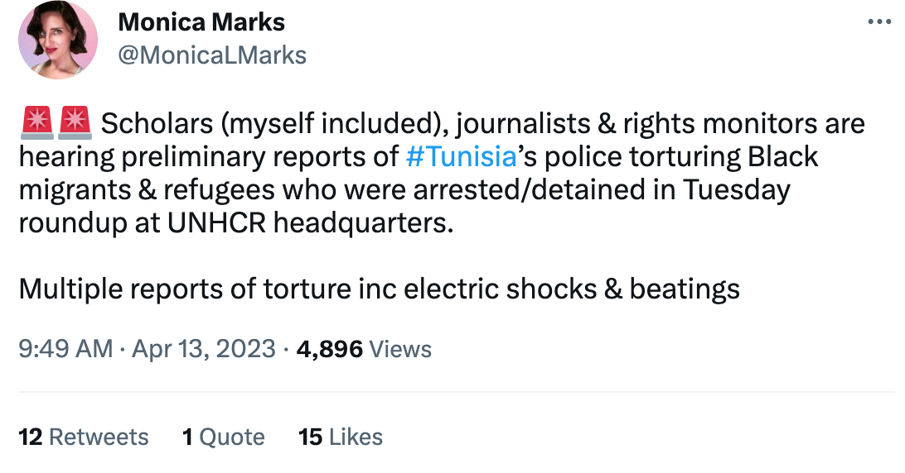

### AYS News Digest 13/04/23: Violence against Sub-Saharans in Tunisia
#### Italy has declared a state of emergency over migration // Police prevent 270,000 people from entering Greece in 2022 // EU funded camps on the Serbian-Croatian border are unlivable //European Court to challenge the UK’s Rwanda policy // “We used to look for shelter, now we look for places to hide” — Police in Paris isolating minors, putting them at further risk // & more
#### **FEATURE:** Violence against Sub-Saharans in Tunisia continues, as protesting asylum seekers are tear gassed by authorities

Via Twitter

As reported [in our most recent digest](https://medium.com/are-you-syrious/ays-news-digest-10-04-2023-400-people-waiting-for-rescue-for-days-in-the-mediterranean-e814e4dc6997) , there has been an explosion of racially motivated violence against Sub-Saharan Africans in Tunisia over the past weeks. Following the evictions on 21st February, people have been forced to camp outside IOM and UNHCR buildings for months. This turned violent on Tuesday, when the Tunisian police used tear gas to disperse a small minority of frustrated individuals, who had been throwing stones at the building as well as at nearby cars. It is now understood that many uninvolved asylum seekers — as well as refugees with UNHCR papers — have been targeted and imprisoned, particularly those who have spoken to the media. Reports include:

■■■■■■■■■■■■■■ 
> **[Refugees in Tunisia](https://twitter.com/RefugeesTunisia) @ Twitter Says:** 

> > The police arrived at 9 am and continued to provoke us, but we held our breath, but when they continued to shoot you, the situation became crazy. Some cars were smashed because the police fired banyans to disperse us.

1/4 https://t.co/mCSHnYXgcX 

> **Tweeted at [2023-04-11 19:18:25](https://twitter.com/RefugeesTunisia/status/1645868928093261824).** 

■■■■■■■■■■■■■■ 

Since 21st February, refugees and asylum seekers have been denied everything: shelter, food, essential access to hygiene, security. On top of this, they are subjected to state violence.

Read more [here](https://www.infomigrants.net/en/post/48173/tunisian-police-deploy-teargas-against-subsaharan-migrants?fbclid=IwAR1cYIh6FhWFj7iOAxeNjSk0q7wW7O-UvytoovgAxDEJ_zN0iZZRrn4SJuE) and [here](https://www.ibtimes.com/tunisia-police-use-tear-gas-disperse-homeless-migrants-3685011?fbclid=IwAR1cYIh6FhWFj7iOAxeNjSk0q7wW7O-UvytoovgAxDEJ_zN0iZZRrn4SJuE) . Tunisia is not a safe country:

■■■■■■■■■■■■■■ 
> **[Ahlam Chemlali](https://twitter.com/AhlamChemlali) @ Twitter Says:** 

> > Since January the Tunisian coastguard has intercepted more than 14406 migrants of which 13138 were Sub-Saharan. These staggering numbers are a clear testimony to the unlivable and dangerous situation for migrants in Tunisia, what many I know have named 'Europes open-air-prison'. 

> **Tweeted at [2023-04-11 21:16:18](https://twitter.com/AhlamChemlali/status/1645898593642094592?fbclid=IwAR0lMYtC9na8SbTpisorHwTRp53AmH3M34FmV2cUn32RS-3pF_HcNPlapKg).** 

■■■■■■■■■■■■■■ 

_Info Migrants_ report:

> “We want to be evacuated immediately to any other safe country that will accept and respect us as human , not a country like Tunisia that doesn’t value us as human,” a group of migrants told journalists in a text message late Monday, _AFP_ reported. The migrants said they had been “unjustly kicked out of our homes and got sacked from work” after Saied’s speech. 

> “We came to Tunisia… for refuge but Tunisia is not safe for us and we can’t stay in Tunisia anymore,” they added. 

#### A vessel sinks with 123 people on board: no other choice?

](../assets/bb50e32b0a57/0*Fkr_JpLdZlQgM-gu)

Via Twitter, [Refugees in Libya](https://twitter.com/RefugeesinLibya/status/1646147865289302025?fbclid=IwAR1ZDpa-9gdF7VWNq2u22bz5nPjYrrYnsrzR5fhpfATjx5RSEs7Rh-ZxhCQ)

In the face of rising violence and persecution, another shipwreck has occurred off the coast, near Kerkennah.

An overcrowded vessel sank at around 10pm on Tuesday night, mere hours after leaving the mainland. There were 30 women, 13 children and babies on board. 60 people have disappeared.
#### SEARCH AND RESCUE
#### 400 people in distress finally rescued from an adrift vessel by the Italian Coast Guard

The prolonged wait for rescue is yet another instance of the Maltese authorities neglecting their obligations in their SAR zone, preferring to risk 400 lives at sea. [It is reported that the Maltese authorities ordered merchant vessels not to rescue people in distress, and then lied — claiming to have received no rescue request.](https://www.independent.com.mt/articles/2023-04-11/local-news/AFM-says-no-rescue-was-requested-for-the-boat-with-400-migrants-in-distress-6736251016?fbclid=IwAR3gSKtF6KQTivUMQ-j4hdY-EX56yG8adsoUyPXW-jxw6H4QVjriF2dCL3c)

■■■■■■■■■■■■■■ 
> **[@alarmphone](https://twitter.com/alarm_phone) @ Twitter Says:** 

> > Their long ordeal at sea is over! The #Diciotti of the Italian Coastguard has arrived with the ~400 people on board in Vibo Valentia. They are finally receiving medical care. According to media sources, one person in a bad state of health was transferred by helicopter. https://t.co/1hGSzQeBnj 

> **Tweeted at [2023-04-12 17:30:03](https://twitter.com/alarm_phone/status/1646204041771335704).** 

■■■■■■■■■■■■■■ 

In the last three months alone, [441 lives are confirmed to have been lost at sea (UN).](https://www.france24.com/en/live-news/20230412-deadliest-first-quarter-for-central-med-migrants-since-2017-un?ref=tw&fbclid=IwAR2QEurSDB3FW1wQcfgrpWxfMlGFUwAiXWpht_ZHNZMMFi-nRMVqMEOa8Jw) Hundreds more people remain missing. The IOM’s message is unequivocal: state actors must support NGOs, not hinder them — saving lives at sea is a moral and legal obligation:

> “States must respond. Delays and gaps in state-led SAR are costing human lives.” 

#### SERBIAN / CROATIAN BORDER
#### EU funded camps are unlivable

> “The complaints about the **deplorable situation** at the Principovac camp reached the No Name Kitchen team operating in northern Serbia. The **strike** by the people living there shed some light on a reality full of **darkness** and **violence** , sponsored by the EU. “The protest broke a false balance that existed between violence and silence towards this violence,” the organization stated in a statement. 

> In addition, a **video** recorded inside the camp by a person outside the organization shows in all its **rawness** the terrible conditions that the residents of Principovac have to endure.” 

[**No Name Kitchen denounces the dire situation in refugee camps funded by the EU**](https://nonprofit.xarxanet.org/news/no-name-kitchen-denounces-dire-situation-refugee-camps-funded-eu?fbclid=IwAR1ySwgZkau5VJiIwqBfEfAWZNA2BUh_VkQ1ptiiYH43gJwJnwISXyWTyTk) 
[_Day after day, thousands of people are forced to leave their countries of origin due to multiple causes, such as…_ nonprofit.xarxanet.org](https://nonprofit.xarxanet.org/news/no-name-kitchen-denounces-dire-situation-refugee-camps-funded-eu?fbclid=IwAR1ySwgZkau5VJiIwqBfEfAWZNA2BUh_VkQ1ptiiYH43gJwJnwISXyWTyTk)
#### GREECE
#### Police prevent 270,000 people from entering Greece in 2022

 on Unsplash](../assets/bb50e32b0a57/0*iitYyryX433VmsmC)

Photo by [Daniel Bernard](https://unsplash.com/@nardly?utm_source=medium&utm_medium=referral) on Unsplash

This statistic does not come from a solidarity organisation, [but is a boast from ‘Citizen Protection Minister’ Takis Theodorikakos,](https://www.skai.gr/news/greece/theodorikakos-ston-skai-1003-ergo-ethnikis-asfaleias-o-fraxtis-ston-evro-noumero-ena-prote?fbclid=IwAR296u4XXFVqxzDTwW3POFm5MHqO1CT30xTUyLcZRHB7eg1naZcFDNwWrMg) as he promotes his border violence in a bid to gain the budget to complete the Evros river fence.

The anti-migration sentiment — presented as a national security issue to the Greek public — is also appallingly extended to recognised refugees, as shown in this thread:

■■■■■■■■■■■■■■ 
> **[RSA](https://twitter.com/rspaegean) @ Twitter Says:** 

> > #Thread on recognised #RefugeesGr in #Greece

1/10 In addition to the serious obstacles in issuing and renewing their residence permit, recognised refugees also face serious problems with the other documents they need. https://t.co/elQEVohEK6 

> **Tweeted at [2023-04-12 10:20:22](https://twitter.com/rspaegean/status/1646095908168257537?fbclid=IwAR05Q8LmZrcgAUWkHLrJTJjuawwBTISQ4ZmnJO4WWAucUhYw2DpKY9UzOWU).** 

■■■■■■■■■■■■■■ 

#### AUSTRIA
#### Checks at the Hungarian and Slovenian Borders to be extended

_Info Migrants_ reports that Austria — citing the ‘success’ of its national controls in lowering asylum applications, blaming the failure of EU external border protection — is set to extend the controls on its borders.

Meanwhile, Germany has reported an [**80% increase in asylum applications.**](https://www.infomigrants.net/en/post/48160/germany-reports-80-increase-in-asylum-applications?fbclid=IwAR3RfRrU9X0ygiBmCyIgyme9lecSphd79Pcea9x9t1KWBidWLN90p9gq3Og)

#### FRANCE
#### “We used to look for shelter, now we look for places to hide” — Police in Paris isolating minors, putting them at further risk

](../assets/bb50e32b0a57/0*i-BXqW9DI9TMz4q1.jpg)

Via [InfoMigrants](https://www.infomigrants.net/en/post/48137/unaccompanied-homeless-youth-in-paris-we-used-to-look-for-shelter-now-we-look-for-places-to-hide?fbclid=IwAR3aezT69wYe0RZVBNltl_5zNeVe1RwN8MJvgLbB3mKzR7CYVa_VNtFkhzo)

Following the ‘zero-tolerance’ suppression of migrant and refugee camps in Paris over the past few weeks, young people are increasingly isolated and at risk in the French capital. Whilst authorities are unsure of the ages of minors, they remain without any protection, waiting on the decisions of the courts. Civil actors such as Utopia 56 try to fill the gap, but the reality is that France is woefully failing young children.

> “Utopia 56 said the upcoming 2024 Olympics couple be pushing authorities to toughen their dismantling policy. 

> “Paris has to hide its migrants before welcoming the whole world,” Nikolai said. 

> With dramatic consequences — when the youngsters become invisible, they become prey. 

> “They disperse, hide. More and more slip away from our reach. We cannot protect them, we are worried that by isolating themselves, they will fall into the hands of criminal networks,” Alice explained to [_InfoMigrants_](https://www.infomigrants.net/en/post/48137/unaccompanied-homeless-youth-in-paris-we-used-to-look-for-shelter-now-we-look-for-places-to-hide?fbclid=IwAR3aezT69wYe0RZVBNltl_5zNeVe1RwN8MJvgLbB3mKzR7CYVa_VNtFkhzo) . 

■■■■■■■■■■■■■■ 
> **[Utopia 56](https://twitter.com/Utopia_56) @ Twitter Says:** 

> > Depuis une semaine, plus de 200 ados isolés survivent dans une école désaffectée du 16e arr. de Paris. Alors que beaucoup sont malades et n’arrivent plus à dormir, @[OlivierKlein93](https://twitter.com/OlivierKlein93) et @[CharlotteCaubel](https://twitter.com/CharlotteCaubel) continuent d’ignorer la situation et refusent le dialogue. https://t.co/T2r7eHxRzV 

> **Tweeted at [2023-04-12 05:29:02](https://twitter.com/Utopia_56/status/1646022592887681024?fbclid=IwAR1skU1iw5T0LGjyrWS8PPK0tAn5iGlIrPi8O23Iti7sNwqNGjzPaaGfHHY).** 

■■■■■■■■■■■■■■ 

As the government fails to accommodate people on the move, it is young minors who are increasingly failed.
#### ITALY
#### Italy has declared a state of emergency over migration

Since January of this year, more than 31,000 people have arrived in Italy by sea. By declaring a state of emergency, the government will be able to release more funds — an initial €5 million.

The government has stated that the funding will go towards ‘decongestion’, particularly in Lampedusa, as well as to create new structures

> “suitable both for sheltering as well as the processing and repatriation of migrants who don’t have the requisites to stay” 

There is further fear that this funding might go to external control, including North African coast guards in Libya, Morocco and Tunisia. It is well documented that the ‘Libyan Coast Guard’ has been involved in the detention, abuse and imprisonment of people transiting through Northern Africa.

_Infor Migrants_ report that:

> “Jean-Pierre Gauci, director of the Malta-based humanitarian organization People for Change Foundation, said he thinks Italy and the EU are looking for “pretexts” to allow them to violate their international obligations and that they are “overreacting.” 

In this sense, the ‘emergency’ is more of a pretext for harder-line policies, facilitating potential deportations and quick repatriations.
#### UNITED KINGDOM

 on Unsplash](../assets/bb50e32b0a57/0*vNkkF2GQusb_dYc4)

Photo by [Majkl Velner](https://unsplash.com/@majklvelner?utm_source=medium&utm_medium=referral) on Unsplash
#### European Court to challenge the UK’s Rwanda policy

Rule 39 — the interim injunction preventing individual applicants’ removal to Rwanda — has now expired. However, if the UK’s Home Secretary does decide to press ahead with exporting asylum seekers to Rwanda, it is almost certain that these will be met with further applications for interim injunctions.

Read more about the specific case of a man (anonymised as NSK) [here](https://freemovement.org.uk/european-court-announces-challenge-against-rwanda-removal-policy-as-interim-injunction-expires/?fbclid=IwAR296u4XXFVqxzDTwW3POFm5MHqO1CT30xTUyLcZRHB7eg1naZcFDNwWrMg) .

**One year on from the UK’s ‘Migration and Economic Development Partnership’ with Rwanda**

The UK’s much-criticised policy — a restrictive immigration partnership — is regrettably one year old today. It is an asymmetric partnership that negates responsibility, just at Australia have done previously in their ‘Pacific Model’ — detention on the islands of Papua New Guinea and Nauru.

Not only is Rwanda not necessarily the safe country the Home Office would like us to believe it is, but there is no guarantee that asylum seekers will be accepted by Rwanda. Indeed, as noted in this [article](https://discoversociety.org/2023/03/30/out-of-sight-offshore-and-over-there-a-disturbing-ambition-in-uk-asylum-management/?fbclid=IwAR3QQoHEC96622oVjVhXTTXZRFy3ThnBHG57RCBsqSvvG8V3LXhySLxs4Is) , it has very low recorded rates of successful asylum applications; the whole policy is a hoax.

> “UNHCR figures up to 2021 recorded just 204 applications submitted in the previous year. Data on refugee status determination was even less impressive: in 2019, some 62 individuals were granted refugee status, while 124 were refused. Out of 24 appeals, only 2 saw their decisions corrected. A slightly improved number received refugee status in 2020: out of 489 decisions, 285 individuals were recognised as refugees (58%). 

> The small number of successful asylum applications raised further questions, when considered against the 127,369, people of concern as reported by [UNHCR](https://data.unhcr.org/en/country/rwa) for 31 May 2022. In the context of Rwanda, the greatest trend in refugee protection has not been asylum, but rather the return of tens of thousands of Burundians, further to a voluntary repatriation agreement between Rwanda, Burundi and UNHCR, which was restarted in 2021.” 

Crucially, **the number of successful applications for asylum to Rwanda is exceeded by the number of repatriations.** The UK’s policy is a clear dereliction of duty, and the mooted deals with Latin American countries — Peru, Paraguay and Belize — with worse human rights records than Rwanda, is equally worrying.
#### **WORTH READING**
- “Civil Society alarmed” — the advent of biometric surveillance by Frontex on Europe’s borders:

- [“Humanitarian Action Under Attack” in Greece:](https://lens.civicus.org/greece-humanitarian-action-under-attack/?fbclid=IwAR0zUZfYR1m_5klCcLScPvm9msoYt0zXnZg8ht_WHUvnijUZ-mEUgFxVjAY)

> _JOIN OUR TEAM — Reach out via Facebook, Instagram or by email at: areyousyrious@gmail.com_ 

**_Find daily updates and special reports on our [Medium page](https://medium.com/are-you-syrious) ._**

**If you wish to contribute, either by writing a report or a story, or by joining the Info team, please let us know!**

**We strive to echo correct news from the ground through collaboration and fairness. Every effort has been made to credit organisations and individuals with regard to the supply of information, video, and photo material (in cases where the source wanted to be accredited). Please notify us regarding corrections.**

**If there’s anything you want to share or comment, contact us through Facebook, Twitter or write to: areyousyrious@gmail.com**

_[Post](https://areyousyrious.medium.com/ays-news-digest-13-04-23-violence-against-sub-saharans-in-tunisia-bb50e32b0a57) converted from Medium by [ZMediumToMarkdown](https://github.com/ZhgChgLi/ZMediumToMarkdown)._
