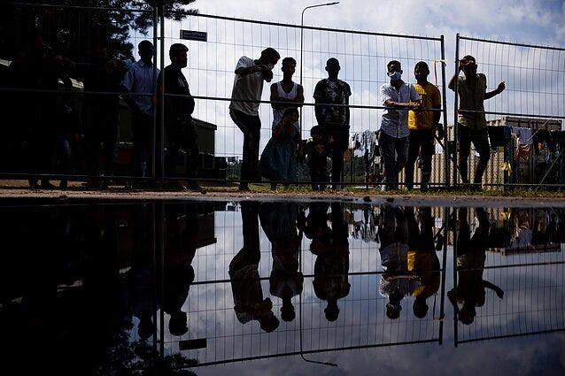

### AYS News Digest 20/04/23: Legalisation of Pushbacks in Lithuania
#### Unjustifiable deportations of Syrian refugees // People on the move file law suit against Croatia’s Constitutional Court // Special protections for asylum seekers to be cancelled by right-wing governement in Italy // Over 80,000 asylum applications in Germany so far this year // ‘A State of Emergency’ — UK Home Office emulates Italy in seeking to declare a migration emergency & more — including an investigation into the informal banking system of irregular migration and human trafficking
#### FEATURE — Legalisation of Pushbacks in Lithuania?

People on the move at the Lithuanian border // Credit: J. Stacevičius/LRT

Opposed by Amnesty International, the Council of Europe’s Committee for the Prevention of Torture and over 150 European NGOs, Lithuania’s parliamentarians are set to vote on amendments to the Lithuanian Law on the State Border, which would legalise the collective expulsions of asylum seekers. In essence, this could and inevitably will put vulnerable people in situations where they face the risk of torture and further persecution.

A reminder, via [Amnesty](https://www.amnesty.eu/news/lithuania-attempt-to-legalize-pushbacks-would-green-light-torture/?fbclid=IwAR01JOrRAoYzu3_5UOhZhvYz9iejJ00TMqE0gkge__L4-rEB8HHYjZcaXv8) : “International law prohibits collective expulsions and the return of anyone to a country where they could face serious human rights violations.”

> **“Rather than taking the urgent steps necessary to stop the widespread use of violence, intimidation and physical ill-treatment against people in the context of pushback operations, this law would effectively green-light torture.”** 

> \- Nils Muižnieks, Director of Amnesty International’s Europe Regional Office 

A member of Global Lithuanian Leaders’ (GLL) migration group, has [written](https://www.lrt.lt/en/news-in-english/19/1964825/groups-criticise-lithuania-s-migrant-pushback-law-saying-it-mimics-hungary?fbclid=IwAR1MEFSnMv2pZBwX5cXBZXjqOgGK7vxsI3aDPGnLHQ9iHGB8yDPHGXAlKng) that the practice echoes the oppressive policies of Hungary’s border, and that:

> “Lithuania is increasingly associated with a selective rule of law” 

Since August 2021, **20,100** people have been prevented from entering Lithuania via the Belarusian border. The proposed amendments will silently prevent people from applying for asylum in Lithuania, whilst the nation very publicly accepts refugees from Ukraine.

For an idea of what it’s like to live in Lithuania, read our AYS Special from last year: “ [They treat you like criminals](https://medium.com/are-you-syrious/ays-special-from-lithuania-they-treat-you-like-criminals-2c0f9a63b395) ”.
#### LEBANON
#### Unjustifiable deportations of Syrian refugees

64people have been forcibly deported from Lebanon, following security raids carried out by the Lebanese army. It is reported that the refugees have been handed over to Assad’s militias.

The Wusl Center for Human Rights reports (via [_The Syrian Observer_](https://syrianobserver.com/news/82659/children-and-sick-individuals-lebanon-deports-dozens-of-syrian-refugees-hands-them-to-fourth-division.html?fbclid=IwAR3bnuEj_6VENFfL678iR3PL9yezaPbVqSpzDFG-LRmZCxfwpUnIKo4iSpo) ) that all those subjected to arbitrary deportation were **registered with the UN High Commissioner for Refugees** , and had entered the country legally (although they did not have legal residence status).

The Lebanese government purportedly plans to forcibly return **15,000 refugees to Syria each month.** Handing refugees over to the Assad regime is in direct contravention of the International Bill on Human Rights; there is no evidence to suggest that the Lebanese authorities have verified that those deported will not face torture or ill-treatment in Syria.

Nothing is yet known of the fate of the 64 people deported last week.

The [UN estimates](https://civil-protection-humanitarian-aid.ec.europa.eu/where/middle-east-and-northern-africa/lebanon_en#:~:text=People%20in%20need%20of%20humanitarian,211%2C000%20Palestinian%20refugees) that there are currently **1.5 million Syrian refugees** living in Lebanon, as well as over 200,000 Palestinian refugees. UNHCR Lebanon shared this a few days ago:

■■■■■■■■■■■■■■ 
> **[UNHCR Lebanon](https://twitter.com/UNHCRLebanon) @ Twitter Says:** 

> > “I cannot remember the last time my family ate fruits” – Warde, Syrian refugee mother. 

90% of refugees in Lebanon need humanitarian assistance to survive.

Now, more than ever, people in Lebanon need support. 
@[UNHCR_Arabic](https://twitter.com/UNHCR_Arabic) @[Refugees](https://twitter.com/Refugees) @VoicesW[Refugees](https://twitter.com/Refugees) https://t.co/D6nk8otnVw 

> **Tweeted at [2023-04-19 06:00:01](https://twitter.com/UNHCRLebanon/status/1648567104449179650).** 

■■■■■■■■■■■■■■ 

#### CROATIA
#### People on the move file law suit against Croatia’s Constitutional Court

The lawsuit come after more than two years without effective investigation into a pushback involving sexual assault, reported on at the time by [_The Guardian_ .](https://www.theguardian.com/global-development/2020/oct/21/croatian-police-accused-of-sickening-assaults-on-migrants-on-balkans-trail-bosnia) This is in keeping with a pattern of failures:

_“The European Court of Human Rights (ECHR) has recently condemned Croatia’s failure to conduce effective investigations into crimes committed against migrants and refugees.”_ — [ECCHR](https://www.ecchr.eu/en/press-release/refugees-file-lawsuit-to-croatias-constitutional-court/?fbclid=IwAR3SbIcUoLoHde-KuQ7qj8Tqngmlx1tTG5Sp7OCcSvKzBv-9P-lZJobNZyo)

#### GREECE
#### A report on living irregularly in Greece

Refugee Supprt Aegean (RSA) have put together an explainer on the ongoing difficulties faced by recognised refugees in Greece. Benefits designed under the umbrella of international protection rely on long-term residence in Greece, and are consequently made unavailable to refugees; Greece fails to take into account their special circumstances.

■■■■■■■■■■■■■■ 
> **[RSA](https://twitter.com/rspaegean) @ Twitter Says:** 

> > #Thread on recognised #RefugeesGr in #Greece 

1/8 Beneficiaries of international protection are indirectly discriminated against Greek citizens, and de facto excluded from most forms of social welfare. https://t.co/kaA23tDEiy 

> **Tweeted at [2023-04-19 09:31:06](https://twitter.com/rspaegean/status/1648620226139881473?t=UGtSrkDax4dk2o-Po0423Q).** 

■■■■■■■■■■■■■■ 

See the full thread [here](https://twitter.com/rspaegean/status/1648620226139881473?t=UGtSrkDax4dk2o-Po0423Q&s=19&fbclid=IwAR1VuuCYS17YSbWwZ6O8iCctPO0RNo4ky33CbdNlidhuoFZd4ZNsT2EYbp4) .

To read a full report compiled by RSA and PRO ASYL, see here:

#### ITALY
#### Special protections for asylum seekers to be cancelled?

Italy’s right-wing government has introduced over 300 proposals (to be debated this week) to the country’s immigration law. The curtailment of special protections is particularly worrying. Amongst other amendments, the new proposals will mean that:
- Migrants will no longer be granted special protection when faced with “serious psychophysical conditions or deriving from serious pathologies” but only when dealing w/conditions deriving from “particularly serious pathologies”& which cannot be treated in the country of origin.”

“The gov. will therefore have significantly more leeway to repatriate migrants as it will be near to impossible to argue whether a country of origin does or does not have the capacity to treat ill migrants& bc special protection is anyway a temporary form of protection which does not lead to permanent residency.” — via [Alissa Pavia’s Twitter](https://twitter.com/AlissaPavia/status/1647274623833194498?t=H_aPdJJ7zowYKK9khjx1GA&s=19&fbclid=IwAR21jDYVAWIz4XbpasXjezK_SX6BCBsx66apEGH4C1fcpgDnD7YQzq6ccBA) .

More here from _Info Migrants_ :

#### GERMANY
#### Over 80,000 asylum applications in Germany so far this year

This compares to 44,908 applications between January and April in 2022, marking an increase of 80.3%. The majority of applications came from Syrian, Afghan and Turkish people.

#### FRANCE
#### Further protests by unaccommodated people on the move in Paris

■■■■■■■■■■■■■■ 
> **[Utopia 56](https://twitter.com/Utopia_56) @ Twitter Says:** 

> > Ce matin à Paris, 114 personnes en famille ont passé la nuit dehors près de l’Hôtel de Ville, parmi elles, des bébés de 1, 8 et 10 mois. Elles avaient manifesté leur droit à un logement, @[Prefet75_IDF](https://twitter.com/Prefet75_IDF) leur a refusé. 
Toujours sans solution, elles restent sur place. https://t.co/OziWpYaLmi 

> **Tweeted at [2023-04-19 08:29:31](https://twitter.com/Utopia_56/status/1648604727536484352?t=0LcTMaCYtTfB-07wdbZYuA).** 

■■■■■■■■■■■■■■ 

#### UNITED KINGDOM
#### ‘A State of Emergency’ — UK Home Office emulates Italy in seeking to declare a migration emergency

](../assets/70e4b31ee1a/0*3727ohkvSdveBKpe)

RAF Wethersfield. Credit: Getty Images via [LBC](https://www.lbc.co.uk/news/asylum-seekers-to-be-declared-emergency-by-braverman/?fbclid=IwAR0WWPPbq6L3urXsb_dEnKfhVdQdZAXY2AhJYhdIxbtIQGJMwBdFj_0kfcY)

Suella Bravermen is seeking to declare a ‘migration emergency’ in the United Kingdom. Currently the UK government spends £6 million every day on hotel and emergency accommodation for house asylum seekers, which is often also unfit for purpose. The Home Office hope that a site in Essex — Westerfield Airfield — is one part of the solution. However, Braintree’s District Council is blocking the application on the grounds that

> “Westerfield Airfield is an unsuitable site to house asylum seekers, given the lack of capacity in local services \[and\] its isolated location”. 

So, what are the government looking for in prospective accommodation sites? Apparently:
- Isolated — somewhere away from the public eye
- Inadequate — with insufficient access to local services such as healthcare

Braverman is now hoping to access ‘emergency’ powers that will override local government and their objections, thus allowing her to convert an unsuitable former army barracks into accommodation for asylum seekers.
#### Far-right activists oppose the housing of migrants elsewhere in the UK

A plan to convert a former RAF base in Scrampton, Lincolnshire into housing for 2000 asylum seekers is the l [atest target of far-right activists](https://inews.co.uk/news/far-right-protesters-target-village-raf-scampton-asylum-seekers-2280169?ITO=newsnowFUarch&fbclid=IwAR3QZ4EeIMdcABFA8Qixr9-amX2ouyK53kln74bXpSCzLJBdqX7W9kfqftw) in the UK, who are organising a rally this weekend. Stand Up to Racism have planned a counter-protest.
#### SEARCH AND RESCUE
#### Around 100 people remain adrift off Libya in urgent distress

■■■■■■■■■■■■■■ 
> **[@alarmphone](https://twitter.com/alarm_phone) @ Twitter Says:** 

> > 🆘 ~100 people off the coast of #Libya in urgent distress!
This morning we were called by ~100 people on a rubber boat. They said their boat is sinking and fear the worst. So far, we couldn’t reach the so-called Libyan Coastguard on any of their numbers. 
Send rescue now! https://t.co/GRbmLgGkj6 

> **Tweeted at [2023-04-19 05:09:39](https://twitter.com/alarm_phone/status/1648554431980400640?t=t4yl7yKk0vkxM35r9bcVAw).** 

■■■■■■■■■■■■■■ 

It is currently unclear whether a rescue conducted by Humanity 1 last night, saving 69 people, relates to the same incident:

■■■■■■■■■■■■■■ 
> **[SOS Humanity](https://twitter.com/soshumanity_de) @ Twitter Says:** 

> > 1/2🔴Breaking: Bei Wind, über 2m hohen Wellen &amp; schlechter Sicht rettete die Crew der #Humanity1 heute Nacht 69 Menschen von einem überbesetzten Schlauchboot. Viele Menschen waren seekrank &amp; dehydriert, 1 Person ohnmächtig. Alle Geretteten werden an Bord erstversorgt. https://t.co/jokm8dM8fV 

> **Tweeted at [2023-04-20 07:07:09](https://twitter.com/soshumanity_de/status/1648946386816192513).** 

■■■■■■■■■■■■■■ 

#### Nineteen people are confirmed to have drowned off the Canary Islands, including a young girl:

■■■■■■■■■■■■■■ 
> **[Helena Maleno Garzón](https://twitter.com/HelenaMaleno) @ Twitter Says:** 

> > ‼️TRAGEDIA‼️ Se confirma la muerte de diecinueve personas, entre ellas siete mujeres y una niña, en la neumática que su hundió esta mañana en la ruta Canaria. El retraso en los rescates sigue dejando víctimas. #DEP 

> **Tweeted at [2023-04-19 19:03:45](https://twitter.com/HelenaMaleno/status/1648764340521033753).** 

■■■■■■■■■■■■■■ 

#### WORTH READING

An investigation into an informal banking system used by people on the move — an ancient money transfer system known as _hawala,_ based on interpersonal trust. The investigation examines the business mechanisms of the criminal networks behind irregular migration.

> _JOIN OUR TEAM — Reach out via Facebook, Instagram or by email at: areyousyrious@gmail.com_ 

**_Find daily updates and special reports on our [Medium page](https://medium.com/are-you-syrious) ._**

**If you wish to contribute, either by writing a report or a story, or by joining the Info team, please let us know!**

**We strive to echo correct news from the ground through collaboration and fairness. Every effort has been made to credit organisations and individuals with regard to the supply of information, video, and photo material (in cases where the source wanted to be accredited). Please notify us regarding corrections.**

**If there’s anything you want to share or comment, contact us through Facebook, Twitter or write to: areyousyrious@gmail.com**

_[Post](https://areyousyrious.medium.com/ays-news-digest-20-04-23-legalisation-of-pushbacks-in-lithuania-70e4b31ee1a) converted from Medium by [ZMediumToMarkdown](https://github.com/ZhgChgLi/ZMediumToMarkdown)._
