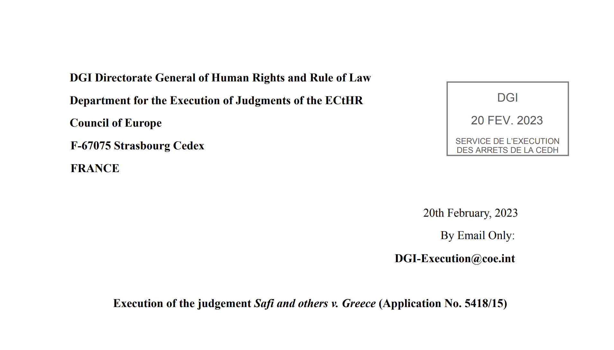
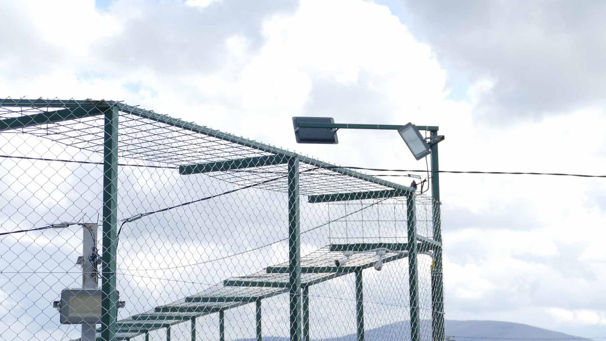

### AYS News Digest 26/04/2023: Fatmata family ask for justice

Fatmata’s loved ones ask for justice after she was killed by police at Greek border with North Macedonia// More funds for sea survellaince in northern Aegean// Samos organisation denounces evidence of human rights violations against people on the move // New arrivals in Lesbos// Minor in Serbian hospital after being beaten by police in camp // Pushbacks officially legalised in Lithuania // UK Home Office starts working with a US defence startup to ‘stop’ Channel crossings // And more

](../assets/223f6f3b95ba/1*EeorDoXMeFyc1T0_H-vsJg.jpeg)

Fatmata, woman shot by police at Greek border with North Macedonia. Via [Second Tree](https://www.facebook.com/SecondTree/photos/a.497958000551965/1984500108564406?type=3&sfnsn=mo&paipv=0&eav=AfaXA6G7rbBKaEpTu_cBcbYKc_VR2eTLROHMtM_ooTGWi81zWln40qjWPUgGN9Bl6Fg&_rdr)
#### SEA/SAR

> After a five-day journey, Humanity 1 has arrived in the port of Ravenna, Italy, and has just completed the disembarkation of the 69 people rescued from distress at sea, 

as said [SOS Humanity](https://www.facebook.com/photo/?fbid=516161750719210&set=a.239368188398569) , noting that all of them are from sub-Saharan countries, mainly from Sudan.

While some people could finally arrive at the Italian coast after risky travel, others didn’t make it and lost their lives close to the coast of Tunisia.

■■■■■■■■■■■■■■ 
> **[@alarmphone](https://twitter.com/alarm_phone) @ Twitter Says:** 

> > 🆘Shipwrecks off #Italy &amp; #Libya! Dozens of bodies wash up at the shores of #Tunisia. At the same time, Alarm Phone is alerted to 26 ongoing distress situations at sea. Europe, don't let even more people drown. Mass rescue efforts are desperately needed! 

> **Tweeted at [2023-04-24 18:04:27](https://twitter.com/alarm_phone/status/1650561354581913600?t=uDVfRUcSSYCjdzGOgHeoyA).** 

■■■■■■■■■■■■■■ 

Moreover eight people on the move who left from Algeria are missing.

■■■■■■■■■■■■■■ 
> **[@alarmphone](https://twitter.com/alarm_phone) @ Twitter Says:** 

> > 🆘 8 people missing in the #Alborán Sea.

Relatives informed us about a group of 8 men who left #Algiers yesterday at 6h CEST. @[salvamentogob](https://twitter.com/salvamentogob) is informed but hasn’t been able to locate them - we call on them to not give up on the search for the missing! 

> **Tweeted at [2023-04-26 09:22:28](https://twitter.com/alarm_phone/status/1651154767178002433?t=wSbHjKC9O1MmmRfLW4gwHw).** 

■■■■■■■■■■■■■■ 

#### GREECE
### New marine control centre installed in Alexandroupolis, in the northern Aegean

The Greek Coast Guard will acquire a maritime traffic surveillance and monitoring system in the Northern Aegean with a control center in Alexandroupolis and three surveillance stations. All at the overall cost of €3,147,120. One more step in border securitisation.

Read more at [this link](https://www.evros-news.gr/2023/04/24/%CF%83%CF%84%CE%B7%CE%BD-%CE%B1%CE%BB%CE%B5%CE%BE%CE%B1%CE%BD%CE%B4%CF%81%CE%BF%CF%8D%CF%80%CE%BF%CE%BB%CE%B7-%CE%B5%CE%B3%CE%BA%CE%B1%CE%B8%CE%AF%CF%83%CF%84%CE%B1%CF%84%CE%B1%CE%B9-%CF%84%CE%BF/)

Increasing funds for surveillance are part of a process that has been going on for years: instead of creating safe routes for people seeking safety in Europe, the EU management of migration is following a militarization and externalisation of borders.

Despite the evidence of the consequences that this approach causes, it remains the preferred one. People on the move who attempt to reach the Greek coast are risking their lives at sea. But often they do not only have to deal with the hazards of the way; in fact human rights violations by the Greek authorities have been denounced by many organisations.

The Samos organisation presented evidence of these abuses to the Council of Europe, reporting acts of torture, pushbacks and a lack of investigations into such violations by the Greek authorities.

Read the press release here:

### New arrivals in Lesbos

■■■■■■■■■■■■■■ 
> **[MSF Sea](https://twitter.com/MSF_Sea) @ Twitter Says:** 

> > #BREAKING: On Monday, #MSF teams in #Lesbos were notified of 36 ppl arriving on the island and provided emergency medical assistance to 9 ppl. Authorities found another 4. Yesterday, 2 ppl from the same boat arrived in the #MSFclinic, one of which collapsed following 70Km walk!⬇️ https://t.co/N6LugidFgV 

> **Tweeted at [2023-04-26 13:38:10](https://twitter.com/MSF_Sea/status/1651219118060707840?fbclid=IwAR22Ba3Ql7q3KuxdjEoP7p7thDlfjdxwaMpQu8iM6uy9xXp8tpKvhVhbGWg).** 

■■■■■■■■■■■■■■ 

#### NORTH MACEDONIA
### Fatmata died at the Greek border with North Macedonia, her loved ones are asking for justice

On [Wednesday 19th April](https://www.koraki.org/post/it-is-time-to-stop) a 23-year-old woman, Fatmata, was shot by the police at the Greek border with North Macedonia during a vehicle inspection: she died later in the hospital (read our Digest [here](https://medium.com/are-you-syrious/ays-news-digest-22-04-23-eid-al-fitr-celebration-and-joy-among-violence-and-displacement-for-c7791c931229) ). The authorities were reportedly trying to apprehend a person believed to be a smuggler, but during this operation the woman was shot in the chest. And she died while attempting to reach a safe place.

After being denied asylum in Greece, Fatmata decided to leave the country in order to seek protection elsewhere. Her husband, Abu Bakar, was with her when she was shot. As [Second Tree](https://www.facebook.com/SecondTree/photos/a.497958000551965/1984500108564406/?type=3&paipv=0&eav=AfbXmx6hML8l5qoS8xySJzNwppcP-LWcRBvpVb3a1ndbT8IlWSpro01kBM6kP_Ydn7M&_rdc=2&_rdr) reported:

> “ (Abu Bakar) was then handcuffed, driven several hours away, held in detention for a day without news of his wife. (…) He still doesn’t know where Fatmata’s body is and has been asking to see her since they were separated”. 

Her husband, her family and those who knew her are demanding justice so that she would not be forgotten and to denounce the unfair border system.

#### SERBIA
### Violence from the different borders of Serbia

Reportedly a 14-year-old minor on the move went to the hospital after being beaten by Serbian authorities inside Sombor camp.

■■■■■■■■■■■■■■ 
> **[Nidzara Ahmetasevic](https://twitter.com/AhNidzara) @ Twitter Says:** 

> > And more violence. Official camp in #Sombor, #Serbia. Victim is 14 years old kid. #eu migration management. Abolish borders now!!!! https://t.co/IT6wjDbCQU 

> **Tweeted at [2023-04-25 14:02:36](https://twitter.com/AhNidzara/status/1650862880814931968?t=NYIoqPHnn5UCd36vTgVHaw).** 

■■■■■■■■■■■■■■ 

Moreover a video, disseminated on 24th April, shows evidence of police violence against people on the move who were pushed back from Bosnia to Serbia.

■■■■■■■■■■■■■■ 
> **[Nidzara Ahmetasevic](https://twitter.com/AhNidzara) @ Twitter Says:** 

> > Mali Zvornik, #Serbian border with #Bosnia. Serbian border police beating migrants who were pushed back. People who were at the bridge near the border could see everything. The EU supports border police in the region, pushing the violence from its border inside #Balkans. https://t.co/eYciFDwpye 

> **Tweeted at [2023-04-24 14:50:36](https://twitter.com/AhNidzara/status/1650512568534827012?t=XIZ5I0EQEoiOfGZOXiCsIg).** 

■■■■■■■■■■■■■■ 

[And here is a verification of the video](https://twitter.com/JackSapoch/status/1650523346138808325?t=gQF5as2VmvRzWQfTCpVSZQ&s=19&fbclid=IwAR0mnxuD07vU9ktqWmrKLi0CcC3vnQIoQVtaGxr20X_nNLz7MU6HHs-cslk) .
#### ITALY
### Call for no border protest

](../assets/223f6f3b95ba/1*rSP3isabxGSydg5sNwtLwg.jpeg)

[Via Comitato Antirazzista Saluzzese](https://www.facebook.com/photo/?fbid=618986470268924&set=a.470009921833247)

Protest against borders at Colle della Maddalena (valle Stura) at 10am at Demonte on 29th April.
#### LITHUANIA
### Pushbacks are officially legalised by the Parliament

Pushbacks are made legal in Lithuania.

A practice that violates the fundamental rights of people on the move has now been legalised in the country. As we mentioned in a previous digest, Lithuania’s parliamentarians were set to vote on amendments to the Lithuanian Law on the State Border on 25th April.

After the vote of the Parliament last Tuesday, border guards are allowed to turn back people who cross its frontiers in an irregular way (since they have no access to safe routes).

People arriving from Belarus have been subjected to daily pushbacks since August 2021 by Lithuanian authorities and now the government has givena kind of ambiguous “legal” base for this practice to continue.

[Read more here](https://www.reuters.com/world/europe/lithuania-passes-legislation-allowing-border-guards-turn-back-migrants-2023-04-25/?fbclid=IwAR1pjguo1q1Mt0wFcnQ6UcGPn9HkNVoyAC2-Ae_abC1seCIS-kSjWOHAtkA)
#### UK
### Lack of clarity within the asylum system in UK

Robert Jenrick, Minister for Immigration, claimed it is possible to ask for asylum via UNHCR, but only few weeks ago this was declared not to be a viable option.

■■■■■■■■■■■■■■ 
> **[Lou Calvey](https://twitter.com/LouCalvey) @ Twitter Says:** 

> > Here’s @[RobertJenrick](https://twitter.com/RobertJenrick) saying today in Parliament that people can claim asylum via UNHCR. And here’s his response to a written question two weeks ago saying that they can’t. Confirmed by UNHCR.

He needs to correct the record on this &amp; at least be honest. https://t.co/2za39n7UCd 

> **Tweeted at [2023-04-26 15:30:20](https://twitter.com/LouCalvey/status/1651247343688138753?t=ftirfphccLEfoCs_XaNgcQ).** 

■■■■■■■■■■■■■■ 

In fact UNHCR explained in a statment that

> “there is no mechanism through which refugees can approach UNHCR with the intention of seeking asylum in the U.K. There is no asylum visa or ‘queue’ for the United Kingdom” 

[Read more here](https://www.unhcr.org/uk/news/statement-asylum-processing-and-resettlement-unhcr?fbclid=IwAR22Ba3Ql7q3KuxdjEoP7p7thDlfjdxwaMpQu8iM6uy9xXp8tpKvhVhbGWg)

While the United Nations High Commissioner for Refugees makes it clear that there is no safe and legal route for all those seeking safety, irregular routes are made more risky and harder.

The survellaince system is a focal point of the actual management of migration in the UK. In fact the UK Home Office started working with US defense startup Anduril attempting to stop small boats crossing the Channel. Anduril shows its ambiguities inside its own origin and development: Anduril is backed by Peter Thiel, a Silicon Valley investor and supporter of Donald Trump and has supplied autonomous surveillance technology to the US Department of Defense (DOD) to detect and track migrants trying to cross the US-Mexico border. The startup uses artificial intelligence (AI) to identify people on the move crossing the Channel.

However there are many critical issues. This use of technology is likely to violate the rights of people on the move.

[Read more here](https://www.infomigrants.net/en/post/48326/uk-signs-contract-with-us-startup-to-identify-migrants-in-smallboat-crossings?fbclid=IwAR366UqUkJty2XVg6JavPTZtyq-MRle6jCBWbaFwVSNsQYUCxML55R0e-cQ)
#### WORTH READING/WATCHING
- An article on a new detention wing being constructed at Lipa camp in Bosnia Herzegovina

The Webinar on European Detention Regimes will be streamed in youtube on 2nd May. The event is organised by the Border Violence Monitoring Network and Mobile Info Team. [Here is the link](https://docs.google.com/forms/d/e/1FAIpQLSez2Ds5K7VIS15ZQoHpF6mEQSb9v66P-078roOt5Avd-alB5g/viewform?fbclid=IwAR3hkedAKiT0w3mHX1eLLZ2ST3weye2aOM6JKGqGbybvOIvVmbRbcGdjrNU)

> _JOIN OUR TEAM — Reach out via Facebook, Instagram or by email at: areyousyrious@gmail.com_ 

**_Find daily updates and special reports on our [Medium page](https://medium.com/are-you-syrious) ._**

**If you wish to contribute, either by writing a report or a story, or by joining the Info team, please let us know!**

**We strive to echo correct news from the ground through collaboration and fairness. Every effort has been made to credit organisations and individuals with regard to the supply of information, video, and photo material (in cases where the source wanted to be accredited). Please notify us regarding corrections.**

**If there’s anything you want to share or comment, contact us through Facebook, Twitter or write to: areyousyrious@gmail.com**

_[Post](https://medium.com/are-you-syrious/ays-news-digest-26-04-2023-fatmata-family-ask-for-justice-223f6f3b95ba) converted from Medium by [ZMediumToMarkdown](https://github.com/ZhgChgLi/ZMediumToMarkdown)._
