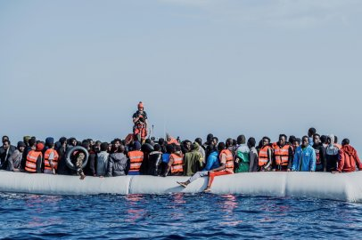

### AYS News Digest 11/05/23: Syrian refugees face mounting threats in Turkey and Lebanon
#### Deportations of Syrian refugees continue in Lebanon // Expansion of the Fylakio Closed Detention Centre in the Evros region // Italian PM Meloni meets with Libya // Pushbacks to Italy on the French border // Opposition to the UK’s “Irregular Migration Bill” & much more
#### FEATURE — TURKEY
#### What will the Turkish election (14th May) mean for Syrians in Turkey?

Kılıçdaroğlu on a flag ahead of elections. Image via Middle East Eye. Credit: MEE Carola Cappellari

Kemal Kılıçdaroğlu, leader of Erdogan’s biggest opposition bloc, is — on the surface — a hopeful prospect for the EU. He has promised a transition to a parliamentary system in Turkey, and to implement the rulings of the ECHR.

However, Kılıçdaroğlu’s antipathy to Syrian refugees is clear. He recently stated that “We have to give back our streets and neighbourhoods to their owners”. Anti — refugee rhetoric now underpins election campaigns, as hostility rises.

Clingendael, the Institute for International Relations in the Netherlands, have released an article examining what this politicisation of migration as an electoral issue might mean in practice: **the forced return of refugees to Syria.**

We have broken down some of the paper’s key considerations below.

**What does the political spectrum currently look like?**
- 82% of the Turkish population want Syrian refugees to leave, according to a [UNHCR report from 2021](https://www.unhcr.org/tr/wp-content/uploads/sites/14/2022/12/SB-2021-English-01122022.pdf) . Public hostility is on the rise, including racially motivated attacks.
- All major Turkish political parties (Kılıçdaroğlu’s CHP, Erdogan’s AKP) — with the exception of the HDP — now advocate for a return of Syrian refugees.
- AKP has put no timeframe on returns, whilst Kılıçdaroğlu recently clarified his CHP party aims to carry out returns within two years.
- Clingendael write that _“In short, the aim of the CHP is to give Turkey back to the people, and the Syrian refugees are not part of this vision.”_

**What are the potential consequences? Key background:**
- As of 2020, [78% of Syrians](https://www.unhcr.org/tr/wp-content/uploads/sites/14/2022/12/SB-2021-English-01122022.pdf) indicated that they would not return to Syria under any circumstances. This had decreased to 61% of Syrians in Turkey by 2021.
- Syria is not a safe country, and, as the UNHCR outlines: “ _all Syrian refugees in Turkey are protected \[against refoulement\]. This means that no one can be returned to Syria against his or her will_ .”
- As the EU-Turkey deal remains in place — designating Turkey a safe third country for Syrian refugees — the EU bears significant responsibility.
- The decrease in a quality of life in Turkey for Syrian refugees correlates to more people considering an alternative life in Europe, which could lead to a significant increase in the irregular migration of Syrians to Europe:

#### LEBANON
#### Human Rights Watch (HRW): “Halt Summary Deportations of Syrian Refugees”

Since early April, the Lebanese Armed Forces have been raiding the homes of Syrian refugees, **deporting them immediately. As many as** 600 people were deported last month, whilst 1,100 people were arrested, according to [_Syria Direct_ .](https://twitter.com/SyriaDirect/status/1654199799019720710)

In the past few days, in violation of Lebanese and international law, there have been further arrests. The pictures below are from Mansourieh:

■■■■■■■■■■■■■■ 
> **[Mohammad Alasakra](https://twitter.com/mohammed_asakra) @ Twitter Says:** 

> > These are #Syrian refugees in #Lebanon who were arrested in Mansourieh area in order to deport them to Syria. Has the world become blind and abandoned the Syrian people.! https://t.co/LTfPHWtUp8 

> **Tweeted at [2023-05-11 08:38:00](https://twitter.com/mohammed_asakra/status/1656579396948434944).** 

■■■■■■■■■■■■■■ 

HRW have released a joint statement with 19 other organisations, condemning the deportations:

■■■■■■■■■■■■■■ 
> **[The Syria Campaign](https://twitter.com/TheSyriaCmpgn) @ Twitter Says:** 

> > Today over 20 organisations called on #Lebanon to halt summary deportations of Syrian #refugees. The deportations come amid an alarming surge in anti-refugee rhetoric in Lebanon and other coercive measures intended to pressure refugees to return
👇 
[diary.thesyriacampaign.org/lebanon-halt-d…](https://diary.thesyriacampaign.org/lebanon-halt-deportations-of-syrian-refugees/) https://t.co/PFsAPEDXR6 

> **Tweeted at [2023-05-11 12:25:38](https://twitter.com/TheSyriaCmpgn/status/1656636683347976193).** 

■■■■■■■■■■■■■■ 

People forcibly returned include those who are registered refugees with UNHCR. Deportees have [told Amnesty International](https://www.amnesty.org/en/latest/news/2023/04/lebanon-authorities-must-halt-unlawful-deportations-of-syrian-refugees/#:~:text=In%20a%20December%202020%20letter,to%20the%20Covid%2D19%20pandemic) that they had no opportunity to contact a lawyer, UNHCR or challenge their deportation.

Those deported have been directly handed to the Syrian authorities at the border. HRW report that “ [Some of them were arrested or disappeared upon their return to Syria](https://www.hrw.org/news/2023/05/11/joint-statement-lebanon-halt-summary-deportations-syrian-refugees) .”

Alongside deportations, there is a rise in coercive measures aimed to force ‘voluntary’ returns amongst the refugee population.
- Curfews have been imposed in certain municipalities to curtail movement
- Restrictions have been imposed on the ability of Syrian people to rent homes
- There has been a rise in political and media anti-refugee rhetoric

**Syria is NOT a safe country — what do Syrian refugees face upon return?**

Via [HRW](https://www.hrw.org/news/2023/05/11/joint-statement-lebanon-halt-summary-deportations-syrian-refugees) :

> “Local and international organizations continue to document horrific violations committed by Syrian military and security forces against Syrian returnees, including children, such as unlawful or arbitrary detention and torture and other ill-treatment, rape and sexual violence, and enforced disappearance.” 

Anyone who has entered Lebanese territory, regardless of their circumstances, “after the decisions of the Higher Defense Council on 14/4/2019” will be deported, according to Lebanese authorities. — via [LBC International](https://www.lbcgroup.tv/news/news-bulletin-reports/702007/strict-measures-reasons-for-deportation-of-syrian/en?fbclid=IwAR1XSOSD3MYKZkRiV9zofmo2l0Tr7hBz0ZXNtg_whV0HnL4iptmTlzmkiaw) .
#### GREECE
#### Evros — The expansion of Fylakio closed detention centre

Satellite data shows the expansion of the closed detention centre in the past year: Fylakio’s capacity for the detention of people seems to have doubled.

■■■■■■■■■■■■■■ 
> **[Lena K.](https://twitter.com/lk2015r) @ Twitter Says:** 

> > Fylakio, comprising the Pre-removal detention centre (big building with the red roof) &amp; the Reception &amp; Identification centre next to it, already operated as a 'closed' centre.
Images from Google Earth Pro show how much the facility has been expanded from 2022 (L) to 2023 (R). https://t.co/jrDQRCiWkF 

> **Tweeted at [2023-05-08 11:47:46](https://twitter.com/lk2015r/status/1655539989931778049).** 

■■■■■■■■■■■■■■ 

What does this expansion represent?

> “black holes for the fundamental human rights of asylum seekers” 

Here’s a reminder of some of the key findings in RSA’s (Refugee Support Aegean) [recent report](https://rsaegean.org/en/ccac-aegean-islands-greece/) , based on research conducted in February and March 2023:

> “In the Closed Controlled Access Centers (CCAC) on Samos, Kos and Leros — the construction of which was **100% funded by the European Union** — as well as those on Lesbos and Chios, asylum seekers and their children live in **remote areas** with **disproportionate security and surveillance measures** , facing **reported violent behavior by security authorities** and with **significant shortcomings in legal assistance, medical care, and interpretation.** ” 

RSA’s research highlights the deficiencies and shortcomings across a range of refugee reception services.

Their key conclusion is that the construction of these centres is an act of **occlusion** — [‘hid\[ing\] the problems from public view by creating prison-like ghettos’](https://rsaegean.org/en/ccac-aegean-islands-greece/) — rather than improvement. Although it is true that the housing and security conditions have improved on the islands (with the exception of the Western Lesbos Controlled Temporary Accommodation Facility for Asylum Seekers) as there are no longer makeshift shelters and tents, the basic needs of people on the move remain largely unmet. This is in spite of the huge investment of EU funds: €121 million was spent on Samos, Kos and Leros in November 2020, and another €155 million for new centres in Lesbos and Chios in 2021.

**What are the key deficiencies that remain, as identified by RSA, as well as human rights violations?**
- **“Extensive surveillance and repression measures”**

CCACs are akin to prisons — they have turnstiles, magnetic gates, x-rays, and two-factor access control systems (identity and fingerprint) that are installed at the exits/entrances of the camps.

All residents are subject to bag checks, body checks, and metal detectors upon entrance and exit, even when children return from school.

The **psychological impact** of such intense security cannot be underestimated: the Greek authorities have entirely removed people’s rights to freedom of movement and privacy.
- **Location: “all structures are located outside urban fabric and/or in remote areas** ”

Hiding CCACs far from urban centres (8km away on Chios and Samos, 15km away on Kos, 6km away on Leros, 9km away on Samos) has two main effects. It imposes financial and physical burdens on people on the move, discouraging their movement and integration. It also keeps them away from the public eye, making it very hard to know how CCACs are operating.
- **“Serious shortages of medical staff and psychosocial support, and deficiencies in the provision of interpretation”**
- **“Significant delays in the provision of the monthly financial assistance allowances”**
- “ **a lack of recreational activities” as well as shop spaces, creative activities and shaded outdoor spaces**

[See RSA’s full report here for further details on the main problems in living conditions and significant deficiencies in specific CCACs.](https://rsaegean.org/en/ccac-aegean-islands-greece/)

Further analysis of detention conditions and provisions in the Aegean has been carried out by Mobile Info Team and Border Criminologies — see below:

Here is ABR’s report from last week too:

■■■■■■■■■■■■■■ 
> **[Aegean Boat Report](https://twitter.com/ABoatReport) @ Twitter Says:** 

> > Here is the weekly report for week 18 2023 from Aegean Boat Report. 
 
For more detailed statistics go to [aegeanboatreport.com](http://aegeanboatreport.com). / ABR Statistics.

To support the work of Aegean Boat Report [aegeanboatreport.com/donate/](http://aegeanboatreport.com/donate/) https://t.co/W87fXxdApO 

> **Tweeted at [2023-05-09 09:15:01](https://twitter.com/ABoatReport/status/1655863934878883840?fbclid=IwAR05IJGed5jCsk5NlINRBG40V3nQZDlCUT7AzIQcqKADM3_wN0HTI07fpz8).** 

■■■■■■■■■■■■■■ 

#### Red Cross presence at rescue operations in Evros

After five days stuck on an islet in the Evros river, 17 people have been rescued by the Greek authorities and Red Cross.

Although the Hellenic Red Cross reported that these rescues were carried out “ [immediately](https://twitter.com/greekredcross/status/1656216811967328256?fbclid=IwAR35OhhAC-oIhERrK0-YAR0QMm29e0AuPqxoBwD-_izZOJeAI5eZT1aapLw) ”, a significant amount of pressure was required from civilian actors to elicit a response.

Whilst it is primarily a relief that people are being rescued from the Evros river, following the previous practice of non-rescue, questions remain over the nature of the heavily publicised collaboration of border forces and the Red Cross. Fingers crossed this is a positive development.

■■■■■■■■■■■■■■ 
> **[@alarmphone](https://twitter.com/alarm_phone) @ Twitter Says:** 

> > We are relieved to hear that the people were found and rescued off the islet, among others by @[greekredcross](https://twitter.com/greekredcross). We hope they will recover fast from the tiring journey. 

[x.com/[greekredcross](https://twitter.com/greekredcross)/…](https://x.com/[greekredcross](https://twitter.com/greekredcross)/status/1656216811967328256?t=OHyyT6NtsFzD1gN0guvJZA&s=19) 

> **Tweeted at [2023-05-10 11:35:10](https://twitter.com/alarm_phone/status/1656261595071229954).** 

■■■■■■■■■■■■■■ 

#### ITALY
#### Italian Premier Giorgia Meloni meets with Libyan strongman General Khalifa Haftar

It is certain that migration will have been a key issue at this meeting, and [_Info Migrants_ report that](https://www.infomigrants.net/en/post/48746/italylibya-meloni-meets-haftar-migration-a-priority?fbclid=IwAR2lrkDONVlgFTNipqcvweg9xaaigsHkb0ZfO6jaZbdC_yVBWh-moUyBahA) :

> “Premier Meloni underscored the unprecedented increase in migration toward Italy: 42,405 persons arrived in Italy from the beginning of 2023, four times as many as those who arrived during the first four months of the previous year, according to figures from the Ministry of the Interior.” 

The fighting in Sudan has raised Italian fears of further displacement in Northern Africa— the UN warns that 860,000 people could be displaced by the conflict — and it is understood that Italy is seeking to stabilise Libya’s political stalemate; the country currently has two governments — in Tripoli and Benghazi.

Full article below for more information:

#### SPAIN
#### The Atlantic route: an update form the Canary Islands

63% fewer people have arrived on the Canary Islands in the first quarter of 2023, when compared to the same period in 2022, according to the Spanish Interior Ministry.

Why?

Since Moroccan and Spanish authorities made peace in March 2022 — with Spain supporting Morocco’s position on the Western Sahara — the border has been made significantly harder:
- The number of naval patrols has increased, and people on the move are routinely intercepted by the coastguard and returned to Ouarazazate, an inland city nicknamed “the door of the desert”.
- The Spanish enclaves of Melilla and Ceuta are much more closely monitored.

Juan Carlos Lorenzo, coordinator of the Spanish Commission for Refugees (CEAR) in the Canaries, suggested to [_InfoMigrants_](https://www.infomigrants.net/en/post/48793/canary-islands-the-most-important-thing-for-madrid-is-that-migrants-remain-in-morocco?fbclid=IwAR2VODE18j27fRk2-FmmQX9F1YvTVl8iSM5mHDkAGr5OYfKUK6rqN-qQ9fw) the _quid pro quo_ nature of this new friendship:

> “The Moroccan authorities are insatiable in their demands, on Western Sahara, on trade agreements, on financial compensation… And Spain accepts \[…\] 

> The most important thing for Spain is that migrants stay in Morocco, whatever the cost” 

As Morocco and Spain collaboratively tighten controls of the border, there remains a large community of young Sub-Saharans and Moroccans who are attempting to reach Europe. Sub-Saharans, moreover, [as we previously reported,](https://areyousyrious.medium.com/ays-news-digest-13-04-23-violence-against-sub-saharans-in-tunisia-bb50e32b0a57) are facing increasingly difficult living conditions in Morocco and Northern Africa (particularly Tunisia) with a recent rise in reports of racist abuse.
#### FRANCE
#### Pushbacks on the French-Italian border

At Ventimiglia in Italy, MSF have reported daily pushbacks, including of unaccompanied minors:

■■■■■■■■■■■■■■ 
> **[InfoMigrants](https://twitter.com/InfoMigrants) @ Twitter Says:** 

> > Doctors without Borders (MSF) is concerned about pushbacks happening at the Italy-France border at Ventimiglia. Even unaccompanied migrant minors are pushed back, MSF said. https://t.co/2qTDpp6NRH 

> **Tweeted at [2023-05-09 14:26:00](https://twitter.com/InfoMigrants/status/1655942196401512448?fbclid=IwAR09Nj16KoiiyMKJBdrtiW0IeB0rutOe5oi6QxSZ7LZ6aIvADaUZPngukzU).** 

■■■■■■■■■■■■■■ 

Sergio Di Dato, head of an MSF mobile clinic on the border, reports that French authorities

> “are no longer able to absorb unaccompanied minors into their reception system, so have started to send them back to Italy, something they should not do according to the regulations in place… **They are obliged to take care of them”** 

An additional 150 border police have recently been posted to Menton, on the French side of the border.

Those pushed back from Menton live the following experience:
- The French police issue a ‘refusal of entry’ document
- People are then transferred to **containers, where they are detained** , awaiting the Italian police.

Held in poor conditions, there have been reports of people lacking water and access to basic necessities, as well as inappropriate situations that have arisen, such as young girls left alone in containers with older men.

> “If the unaccompanied minors are sent back systematically and in an arbitrary manner, there is the issue of how to protect these individuals — who are the weakest — in an effective manner, especially since \[migrant\] facilities in Italy are full,” Di Dato said. — _via [Info Migrants.](https://www.infomigrants.net/en/post/48774/france-sending-unaccompanied-minors-back-to-italy-msf)_ 

#### Paris 2023: 65 families left on the streets

Whilst Utopia 56 and their network of solidarity activists were able to help accommodate many of these people, there were still 22 families forced to spend the night on the street.

■■■■■■■■■■■■■■ 
> **[Utopia 56](https://twitter.com/Utopia_56) @ Twitter Says:** 

> > Hier soir, notre équipe à Paris a rencontré 65 familles sans domicile. Si notre réseau d'hébergements solidaires a été en capacité de proposer des solutions  pour une majorité d'entre-elles, 22 familles ont dû passer la nuit à la rue. C'est insupportable. https://t.co/gnnsq05EUI 

> **Tweeted at [2023-05-10 06:19:06](https://twitter.com/Utopia_56/status/1656182053975539712?fbclid=IwAR0tlfIU7nfoZsWsYP1rv-QcH9Q0M0jCo86Jm2DsTyffZZdEz8khtsri_W0).** 

■■■■■■■■■■■■■■ 

#### UNITED KINGDOM
#### Strong opposition in Parliament against the ‘Illegal Migration Bill’, as well as protests on the streets

Discussed yesterday in the Houses of Parliament, the Archbishop of Canterbury Justin Welby called the government’s highly polemical illegal migration bill “ _morally unacceptable”,_ arguing that it threatens “ _the interests of those in need of protection or the nations who face together face this challenge_ ”.

Welby argued that the bill fails to address two key aspects of international migration: climate change and war. The Intergovernmental Panel on Climate Change has estimated that by 2050, the climate crisis alone could cause 800 million individuals to become refugees.

Welby forcefully argued that:

> “There must be safe, legal routes put in place as soon as illegal or unsafe routes begin to be attacked. We cannot wait for the years that will take place before that happens” 

The government’s migration bill — dubbed ‘anti-refugee laws’ — has been met by protests, as well as condemnation by NGOs and solidarity networks.

■■■■■■■■■■■■■■ 
> **[These Walls Must Fall](https://twitter.com/wallsmustfall) @ Twitter Says:** 

> > In Manchester right now we are together in the streets, united and determined to resist the anti-refugee laws and to fight for justice. Thanks @[GMIAU](https://twitter.com/GMIAU) for organising! #NoOneIsIllegal https://t.co/HbvQmSmvWg 

> **Tweeted at [2023-05-10 12:42:15](https://twitter.com/wallsmustfall/status/1656278475190280200?fbclid=IwAR3J-ZLBEJuk1_sIgAPxhVNjzLZgCw0JGKCo03uKM_j2fS6YmzCB30zmTR8).** 

■■■■■■■■■■■■■■ 

Under particular scrutiny is the arrival of a barge, built in the 1970s, which will supposedly house 500 people. It is supposed to be [‘moved into position off the Isle of Portland’](https://www.standard.co.uk/news/uk/bibby-stockholm-barge-home-office-asylum-migrants-falmouth-cornwall-dorset-uk-b1079677.html) — a floating prison therefore — in the coming weeks.

■■■■■■■■■■■■■■ 
> **[Twitter User](https://twitter.com/migrants_rights/status/1655869883601625092?fbclid=IwAR1DKFU8TzaImu-mu4aqHjMoJtpPn994hsHnj4E8sJe7YltygfpULuLrZNo) @ Twitter Says:** 

> >  

> **Tweeted at .** 

■■■■■■■■■■■■■■ 

How can these highly-visible, deeply impractical policies hope to respond to the scale of the global migration crisis? Over the weekend alone, [411 people crossed the channel from France.](https://twitter.com/SimonJonesNews/status/1655897260364800000?fbclid=IwAR0tlfIU7nfoZsWsYP1rv-QcH9Q0M0jCo86Jm2DsTyffZZdEz8khtsri_W0)

A further 70 people were picked up by the French authorities, before being detained, attempting to cross the straits of Dover on Tuesday:

■■■■■■■■■■■■■■ 
> **[Préfecture maritime Manche et mer du Nord](https://twitter.com/premarmanche) @ Twitter Says:** 

> > [#Opération] d'assistance et de sauvetage de soixante-dix personnes dans le détroit du Pas-de-Calais  (62) coordonnée par le #CROSS Gris-Nez
▶️[bit.ly/3HXzXp7](https://bit.ly/3HXzXp7) https://t.co/9tV07ONdin 

> **Tweeted at [2023-05-09 20:44:10](https://twitter.com/premarmanche/status/1656037367247978511?fbclid=IwAR3GKc6wzpPX4MM-Afqchaai65fbOnihEy8IjLob6rzmNJ7OLR8sK9Dkukg).** 

■■■■■■■■■■■■■■ 

**Find daily updates and special reports on our [Medium page](https://medium.com/are-you-syrious) .**

**If you wish to contribute, either by writing a report or a story, or by joining the Info team, please let us know!**

**We strive to echo correct news from the ground through collaboration and fairness. Every effort has been made to credit organisations and individuals with regard to the supply of information, video, and photo material (in cases where the source wanted to be accredited). Please notify us regarding corrections.**

**If there’s anything you want to share or comment, contact us through Facebook, Twitter or write to: areyousyrious@gmail.com**

_[Post](https://areyousyrious.medium.com/ays-news-digest-11-05-23-syrian-refugees-face-mounting-threats-in-turkey-and-lebanon-6900bc4669b2) converted from Medium by [ZMediumToMarkdown](https://github.com/ZhgChgLi/ZMediumToMarkdown)._
