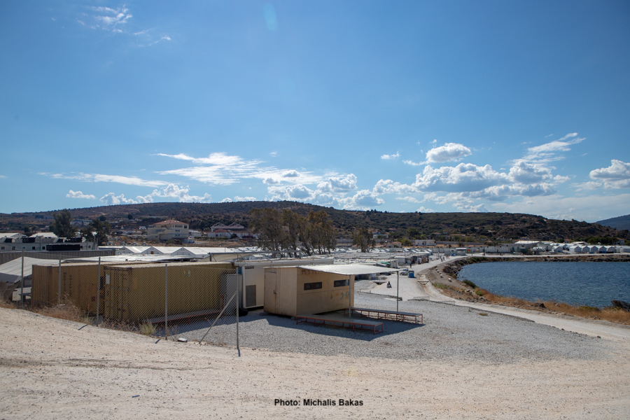

### AYS News Digest 16/05/23: What’s going on with Frontex? Prioritising PR over people
#### Libya increases its surveillance capacity // Concerning updates about the rapid development of Lesvos CCAC // Failures to protect people from sexual violence in Swiss asylum centres // Join opposition to the UK’s floating prisons // Calls for support in Germany and on Lesvos & longer reads
#### FEATURE — What’s going on with Frontex? Nothing new — prioritising PR over people

 .](../assets/b320829bf84c/0*kr-gBuCQiIWRTVb4)

A Frontex Operation near Lesvos, Greece in 2016. Via [HRW](https://www.hrw.org/news/2021/06/23/frontex-failing-protect-people-eu-borders) .

Since 2016, Frontex has become the fastest growing EU agency, with a budget of close to €1 billion, and 11,000 employees. Make no mistake about its priorities: dissuasion, detention and deportation, rather than the assistance and protection of people.

Hans Leitjens, successor to Fabrice Leggeri as head of Frontex — who resigned last year over the [cover-up of illegal pushbacks](https://fragdenstaat.de/en/blog/2022/10/13/frontex-olaf-report-leaked/) from Greece to Turkey — admitted that he “cannot assure” that pushbacks are not occurring in the EU (via [Info Migrants](https://www.infomigrants.net/en/post/48923/frontex-forecasts-new-record-of-migrant-arrivals?preview=1684162398682&fbclid=IwAR1HyvtRkTRZd7778avh_GIj-fB39aDzA3BfCi0gs38Bugv2H-MgHp_Q8uM) ). Moreover, he claims to seek to introduce a ‘transparency culture’ to the agency:

■■■■■■■■■■■■■■ 
> **[Hans Leijtens](https://twitter.com/LeijtensFrontex) @ Twitter Says:** 

> > Though press interviews aren't a daily routine for me and may be quite intense, they're crucial for bringing our #Frontex work into the spotlight, highlighting our dedication and the challenges at the external borders. Stay tuned for more! #Transparency #EU https://t.co/RLNA179sL0 

> **Tweeted at [2023-05-12 12:14:59](https://twitter.com/LeijtensFrontex/status/1656996388696121346).** 

■■■■■■■■■■■■■■ 

#### **Transparency?!**

In an [interview with Politico](https://www.politico.eu/article/new-eu-border-chief-hans-leijtens-vow-clean-up-frontex-agency-migrant-number-surge/) , he stated that:

> “The real game changer \[is\] being more transparent.” 

So, how does that explain Frontex’s collaboration with Greek authorities as they build and expand new CCACs (Closed Controlled Access Centres) — built in rural locations away from the public eye? How does that explain Frontex’s response to Freedom of Information (FOI) inquiries?

We’ve seen no evidence of change yet:

■■■■■■■■■■■■■■ 
> **[Luděk Stavinoha @stavinoha.bsky.social](https://twitter.com/LudekStavinoha) @ Twitter Says:** 

> > “There is nothing secret about @[Frontex](https://twitter.com/Frontex)" - Hans Leijtens proclaimed at his first press conference as the border agency’s new Executive Director back in January. 

It seems his Transparency Office, tasked with dealing with #FOI requests, is yet to read the memo: https://t.co/M0s9dJQaLW 

> **Tweeted at [2023-04-19 09:33:48](https://twitter.com/LudekStavinoha/status/1648620906460205056?s=20).** 

■■■■■■■■■■■■■■ 

#### **Pushbacks: What’s the state of Europe’s borders?**

Let’s just return to Leitjens use of language, as quoted in an [_Info Migrants_](https://www.infomigrants.net/en/post/48923/frontex-forecasts-new-record-of-migrant-arrivals?preview=1684162398682&fbclid=IwAR1HyvtRkTRZd7778avh_GIj-fB39aDzA3BfCi0gs38Bugv2H-MgHp_Q8uM) article:

_“However, Leijtens also stated that he “cannot assure” that practices like pushbacks of migrants are not taking place in the EU: “I can create conditions where, first of all, that we know about in the moment they happen, that we try to be there to prevent them from happening. We try to educate our people,” he said.”_

The phrase _“cannot assure”_ is absurd — a piece of political PR that seeks to portray pushbacks as occasional possibilities, unfortunate incidents. They are — in reality — frequent, violent and illegal. So Frontex will ‘try’ to educate their people — is that good enough?

Frontex is Europe’s border agency. If there is one thing that is assured on Europe’s borders, it is pushbacks.

There are an estimated [**600 pushbacks every day**](https://pers.11.be/translation-over-200000-illegal-pushbacks-at-eus-external-borders-in-2022) **on Europe’s borders** .

We [recently reported](https://areyousyrious.medium.com/ays-news-digest-11-05-23-syrian-refugees-face-mounting-threats-in-turkey-and-lebanon-6900bc4669b2) on systematic pushbacks on the Italian-French border, and Belgian NGO 11.11.11 has recorded an estimated [**225,533**](https://pers.11.be/translation-over-200000-illegal-pushbacks-at-eus-external-borders-in-2022) **pushbacks since 2022** .
#### **Public relations first, not people**

[Frontex has announced](https://frontex.europa.eu/media-centre/news/news-release/detections-in-central-mediterranean-at-record-level-xSzOka) that it expects a ‘record’ increase in the number of people irregularly crossing into Europe. They report that climate change and poverty — rather than conflict — are the key causes, and that “organised crime groups are taking advantage of political volatility”.

What about the lack of options for ‘regular’ migration, the lack of legal and safe routes, we ask?

The EU will formally resettle, through ‘legal’ routes (via the UN), only 17,000 people in 2023. There are 2 million people awaiting resettlement ( [EU Observer](https://euobserver.com/migration/157032?fbclid=IwAR31XpJUdBdjd4et159SnPAjT8raThBe8oEwVySKxAZzllFboOwSsax4M_I) ).

So, in this new-look Frontex headed by Leijtens, its clear where the priorities lie: PR, not people.

In spite of increased border controls, and a decrease in the irregular movement of people via the Eastern Mediterranean, Poland and the Balkans, net movement to the EU is rising significantly.
- Compared to this time last year, there has been a 300% increase in the number of people seeking to reach Europe via Northern Africa.
- There has been a 1100% growth in the number of people departing from Tunisia.

As the EU and Frontex continually externalise human rights abuses (last week Italian PM Meloni was in Libya), Frontex is seemingly trying to improve nothing but its image. In 2022, the EU-funded Libyan coast guard intercepted 23,600 people, forcibly returning them to Libya.

As an [_MSF_ report](https://www.msf.org/eu-leaders-continue-push-through-deadly-policies-migrants?fbclid=IwAR1nUyq8h9F8K3Kg-xbiqp73kw5JyqhoNwBzKIRZJ_VL3_WA82UfURGHU5s) from a few days ago writes:

> “Today, people who survive the deadly Mediterranean Sea crossing or the mountains and forests of Europe only do so to be subjected to undignified treatment when they reach Europe. 

> Across Europe, we’ve seen **the normalisation of violence at its borders.** On top of deaths at sea and violent pushbacks, we’ve heard reports of children locked up in shipping containers and teargassed in Hungary, before being pushed back to Serbia. It’s inhumane.” — Buha Collette, MSF’s Operations Team Leader for Europe 

The EU is actively eroding the asylum system, failing to give meaningful protection to those seeking safety. Frontex is at the heart of this.

See StateWatch’s recent report for more on this:

**SEA / SAR**

Green MEP, Tineke Strik, has visited Lampedusa. The importance of first-hand understanding in developing a policy agenda — not relying on data and risk analysis alone — cannot be ignored.

■■■■■■■■■■■■■■ 
> **[Tineke Strik](https://twitter.com/Tineke_Strik) @ Twitter Says:** 

> > I spoke with @[seawatchcrew](https://twitter.com/seawatchcrew) about the growing difficulties they face saving lives. 

Malta is non-responsive to distress calls and Italy instructs vessels to bring people back to Libya. This is a deliberate hands-off policy, condoned by the EU, leading to innocent people drowning. https://t.co/Wt2U06YrEL 

> **Tweeted at [2023-05-16 09:22:28](https://twitter.com/Tineke_Strik/status/1658402524909518848).** 

■■■■■■■■■■■■■■ 

#### LIBYA
#### So-called Libyan coast guard increasing its surveillance capacity

■■■■■■■■■■■■■■ 
> **[Migrant Rescue Watch](https://twitter.com/rgowans) @ Twitter Says:** 

> > #Libya 14.05.23 - Delivery of a new air asset to Libyan Coast Security Detachment in Al-Maya. The light reconnaissance helicopter is one of three units that are planned for purpose of enhancing coastal surveillance capabilities. #migrantcrisis #DontTakeToTheSea #seenotrettung https://t.co/a0cSdqCggt 

> **Tweeted at [2023-05-14 18:50:03](https://twitter.com/rgowans/status/1657820587153039366?s=20).** 

■■■■■■■■■■■■■■ 

Libyan authorities have also recently met with Turkish government representatives, to discuss the supply of boats to the so-called coast guard:

■■■■■■■■■■■■■■ 
> **[Migrant Rescue Watch](https://twitter.com/rgowans) @ Twitter Says:** 

> > 1/2 #Libya 14.05.23 - MoI Undersecretary for Public Affairs joint by Coast Security staff met with Turkish Embassy advisor for Security Cooperation accompanied by Turkish Coast Guard coordinating officer. #migrantcrisis #DontTakeToTheSea #seenotrettung #Frontex https://t.co/6WzWxVRx6c 

> **Tweeted at [2023-05-14 18:39:22](https://twitter.com/rgowans/status/1657817899220779008).** 

■■■■■■■■■■■■■■ 

#### GREECE
#### Lesvos CCAC — under rapid development in spite of legal and local governmental questions about the legality, safety and environmental impact of the site.

■■■■■■■■■■■■■■ 
> **[ECRE](https://twitter.com/ecre) @ Twitter Says:** 

> > Human and environmental tragedy - two for the price of one - with greetings from the 🇬🇷 government and of course funded by 🇪🇺 

> **Tweeted at [2023-05-15 14:06:44](https://twitter.com/ecre/status/1658111674744819713).** 

■■■■■■■■■■■■■■ 

A few key concerns, via RSA, about the development of the new CCAC on Lesvos, with the potential capacity to detain 10,000 people.

> \- “The new structure, despite the strong reactions of the local society, was located in a remote district in Northern Lesvos next to the landfill, and has a budget of EUR 76 million plus VAT. It is 100% funded directly by the EU through the Emergency Support Mechanism.” 

> \- “The structure is adjacent to a protected NATURA area and there are serious concerns regarding safety and forest fires.” 

See their [thread](https://twitter.com/rspaegean/status/1658108176556863489) on Twitter for full information.

■■■■■■■■■■■■■■ 
> **[Dr. Apostolos Veizis](https://twitter.com/AVeizis) @ Twitter Says:** 

> > Moria 3.0 #Vastria ,Lesvos ,Greece
📷Michael Bakas https://t.co/WN2FmPop11 

> **Tweeted at [2023-05-14 16:54:02](https://twitter.com/AVeizis/status/1657791390980399107).** 

■■■■■■■■■■■■■■ 

Read this report from RSA and ProAsyl for greater depth investigation into Lesvos CCAC:

#### SWITZERLAND
#### Failures to protect people in the asylum system from sexual assault and violence

Power imbalances inherent to the asylum system have led to the sexual exploitation of people in Swiss asylum camps. Often, cases of sexual violence go unreported; people are afraid it might impact on their asylum applications.

Recently, a public prosecutor ruled that a woman named Zahara Moradi (name changed) was not sexually assaulted. [The injustice derives from Swiss law and its definitions of criminally prosecutable sexualised violence.](https://antira.org/2023/05/15/gestorben-im-niger-getroffen-in-griechenland-vergewaltigt-im-bundesasylcamp/?fbclid=IwAR3jA1Q3NFRzL3aSZjqdaxG8gbw_mCEHvT1qB39oDXK5aLQNT_-MFHYRc6o#Sexualisierte_Gewalt_in_Schweizer_Asyllagern)

[Amnesty International has called for an urgent revision of this law,](https://12ft.io/proxy?q=https%3A%2F%2Fmagazin.nzz.ch%2Fnzz-am-sonntag%2Fschweiz%2Fwenn-asylbetreuer-ihre-macht-missbrauchen-ld.1736411%3Freduced%3Dtrue&fbclid=IwAR3oH8tCeFdn-1cP57drbuggrNg2hOPnlh-F-fspc-SnrDR7nrWNXBveeo8) and for greater protections to be put in place for those in the Swiss asylum system.
#### UNITED KINGDOM
#### Join the opposition to the UK’s floating prisons!

Suella Braverman’s proposition to house people on a floating barge — the Bibby Stockholm — is deeply inhumane. It might re-traumatise those who arrived in Europe by sea, not to mention restrict freedom of movement.

How will people be able to come and go safely? How will there be sufficient space or privacy on a tightly packed barge?

When the Bibby Stockholm was used for immigration detention by the Dutch government, [NGOs condemned it as inhumane.](https://www.statewatch.org/news/2008/march/statewatch-news-online-netherlands-two-deaths-in-immigration-detention-in-2-months/) An Algerian man, Rachid Abdelsalam died on board, and there were reports of rape and abuse on board. How can the British government sanction this?

Make your voice heard — join our opposition to this floating prison.

■■■■■■■■■■■■■■ 
> **[Are You Syrious?](https://twitter.com/areyousyrious) @ Twitter Says:** 

> > Solidarity! No floating prisons✊️ 

> **Tweeted at [2023-05-14 12:54:40](https://twitter.com/areyousyrious/status/1657731150230482944).** 

■■■■■■■■■■■■■■ 

■■■■■■■■■■■■■■ 
> **[Reclaim The Sea](https://twitter.com/Reclaim_The_Sea) @ Twitter Says:** 

> > Thank you @[MSF_uk](https://twitter.com/MSF_uk) for signing our open letter today, along with @safepassageuk , @[giveyourbest_uk](https://twitter.com/giveyourbest_uk) , @[RefugeeCKitchen](https://twitter.com/RefugeeCKitchen) and others! We have now reached 63 organisational signatures - has your org signed yet? [docs.google.com/document/d/1fn…](https://docs.google.com/document/d/1fncMSbaX5avtAxLOP_my-Arq8w6PyoyAB4ZjCAeC7fQ/edit?usp=sharing) 

> **Tweeted at [2023-05-15 16:46:08](https://twitter.com/Reclaim_The_Sea/status/1658151790322364425).** 

■■■■■■■■■■■■■■ 

#### IRELAND
#### Make-shift camp in Dublin burned down by anti-immigration protestors

[Following anti-immigration protests over the weekend, the tents and belongings of more than 10 refugees were burned down in Dublin.](https://www.infomigrants.net/en/post/48914/fire-destroys-makeshift-migrant-camp-in-dublin?preview=1684152709705&fbclid=IwAR2qo6sxGzdiS-VtImwzkyKpfIqPkeh-ENo6rVo-q9MQ6Gs15SMF0bs1b4E) Police separated far-right, nationalist protestors from counter-protestors, before the street was set alight.

There are currently a large number of people sleeping rough in Dublin, who are seeking asylum. As the cost of living bites, alongside a serious housing shortage in Ireland, locals (fuelled by an opportunistic far-right community) are directing their frustrations at homeless asylum seekers.

■■■■■■■■■■■■■■ 
> **[Twitter User](https://twitter.com/IrlagainstFash/status/1657144931620618242?ref_src=twsrc^tfw|twcamp^tweetembed|twterm^1657144931620618242|twgr^b55bc0e2c1800bb9fe8298e4c2fa83d0ee00ca24|twcon^s1_) @ Twitter Says:** 

> >  

> **Tweeted at .** 

■■■■■■■■■■■■■■ 

Lots of the rhetoric surrounding these protests was nationalistic and racist in tone.
#### CALLS FOR SUPPORT
#### Stop Deportation Camp in Berlin: Call for Translators

> “We are looking very much forward to the Stop Deportation Camp from 1-6th June. The equipment for simultaneous translation is organized. But we still need a lot of translators! 

> Languages: French, Russian, Arabic, Farsi, Spanish, English, German are mostly needed. If you speak other languages though, we are very happy if you let us know as well! 

> Please send all the information to signup-stopdeportation@riseup.net. For us it would be very helpful if you also join the translators’ signal group: [https://signal.group/...](https://signal.group/?fbclid=IwAR2z2Mj2EuWwQOwC8Ml5AlcJgLU5E2m4zeaMtUwm6eFOKpkuzNaBDfk4MKo#CjQKIG1zIvTYZnUfUprKu6I48ShZshh-wJcIQSoO_br1kaTqEhBV-Rv0DvvCRyJI-SESdi_u) 

> Unfortunately, we are not able to pay you for translating. But we are looking for further funds to finance your travel costs to the camp. Please let us know if you need travel costs.” — _First time translators are welcome!_ 

#### Lesvos LGBTIQA\*+ Refugee Support Collective — volunteers and financial support required !

> “Lesvos LQBTIQA\*+ Refugee Solidarity is a grassroots collective, active in Lesvos since July 2017. Members of the group are people who identify as LGBTIQA\*+ and are living in Lesvos as refugees, volunteers and locals. The group’s aims are to build community by providing a safer space for LGBTIQA\*+ refugees in Lesvos, and to collectively demand changes to the situation for LGBTIQA\*+ refugees trapped on Lesvos. 

They are looking for people to support their coordination team, and for donations. Get in touch [here](https://www.facebook.com/LesvosLGBTIQRefugeeSolidarity?locale=en_GB) .

> It is possible to donate here: 

> Borderline Lesvos 

> IBAN: DE54 4306 0967 4005 7941 02 

> Reference (important): lgbtiq+Lesvos 

> Also you if you want to connect, organise solidarity events and need informations and/or material you can contact us via: lesvos.lgbt.r.solidarity@gmail.com!” 

#### WORTH READING
- Naohiko Omata, associate professor at University of Oxford, writes an illuminating piece about the ‘disjuncture’ between the expectations of aid providers and the beneficiaries of aid. He explores this shortcoming among aid practitioners in the context of mis-projected expectations, which can harm communication between practitioners and beneficiaries.

> “Humanitarian staff often struggle to understand the causes, instead creating labels such as “refugee syndrome”, which equates the experiences of forced displacement with the loss of rational thinking and effective problem solving. 

> However, empirical evidence demonstrates that refugees respond rationally to aid, based on their lived experiences, in order to increase their access to resources and opportunities under numerous constraints. Yet aid organisations frequently fail — or do not attempt — to comprehend the strategies behind refugees’ decisions, blaming them for “unacceptable” non-conformity.” 

[**Humanitarian aid as performance? | Oxford Department of International Development**](https://www.qeh.ox.ac.uk/blog/humanitarian-aid-performance) 
[_When refugees use humanitarian assistance in rational but unexpected ways, aid agencies often fail to understand this…_ www.qeh.ox.ac.uk](https://www.qeh.ox.ac.uk/blog/humanitarian-aid-performance)
- Article from the EU Observer: ‘Majority of EU states in 2022 did not resettle a single refugee’:

The IRC asks EU nations to expand their pledges for resettlement — a legal channel to seek protection — from 20,000 to 44,000 people per year by 2024–5. Last year only 17,000 people were re-settled in Europe, mostly in Germany, Sweden and France.

2 million refugees are currently in need of resettlement worldwide.

**Find daily updates and special reports on our [Medium page](https://medium.com/are-you-syrious) .**

**If you wish to contribute, either by writing a report or a story, or by joining the Info team, please let us know!**

**We strive to echo correct news from the ground through collaboration and fairness. Every effort has been made to credit organisations and individuals with regard to the supply of information, video, and photo material (in cases where the source wanted to be accredited). Please notify us regarding corrections.**

**If there’s anything you want to share or comment, contact us through Facebook, Twitter or write to: areyousyrious@gmail.com**

_[Post](https://areyousyrious.medium.com/ays-news-digest-16-05-23-whats-going-on-with-frontex-prioritising-pr-over-people-b320829bf84c) converted from Medium by [ZMediumToMarkdown](https://github.com/ZhgChgLi/ZMediumToMarkdown)._
