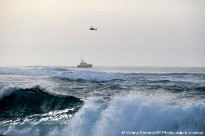
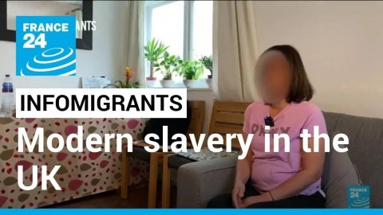
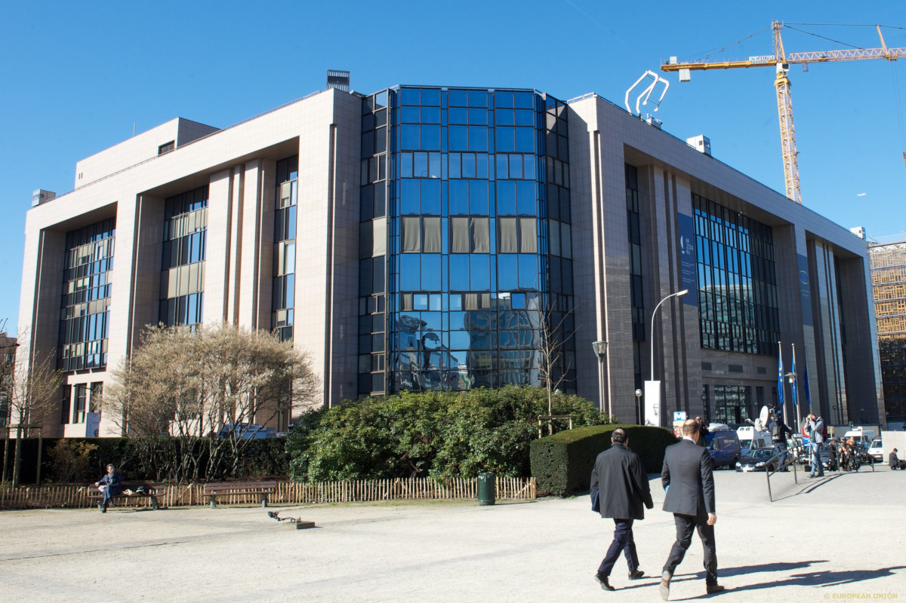
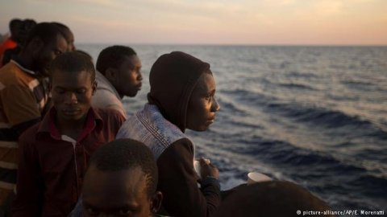
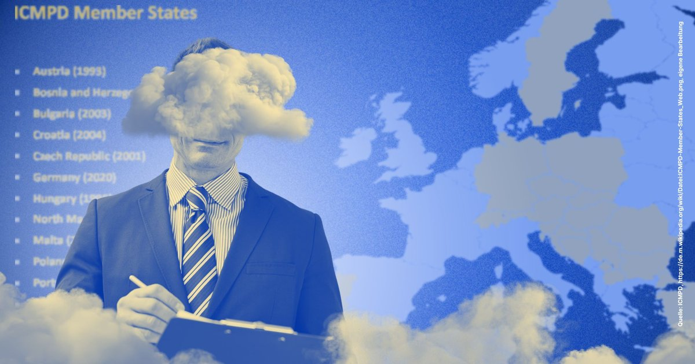

### AYS News Digest 23/05/23: Pushbacks in the Aegean, verified by video investigation
#### Serbia — a change in migration route as people increasingly try to reach the EU via Bosnia and Croatia, not Hungary // Lipa Camp in Bosnia — a Greek-style CCAC funded by the EU // Austria strengthens border controls for a further six months, leading to condemnation from the EU Commission // Testimony about detention conditions in Libya // Report from Green MEP Tineke Strik about the reality of Meloni’s migration policies in Lampedusa & many more reads, including Fragenstadt’s investigation into the ICMPD
#### FEATURE — GREECE
#### Video evidence of pushbacks in the Aegean

 .](../assets/e0359816d56e/1*qw8bbicIZMD12tA_dzfGZw.png)

Documentary evidence from the investigation — here a baby is loaded onto a Hellenic Coast Guard Vessel, before being transferred to a life-raft in Turkish waters. Via [NYT](https://www.nytimes.com/2023/05/19/world/europe/greece-migrants-abandoned.html?smid=nytcore-ios-share&referringSource=articleShare) .

Greek pushbacks have been filmed on Lesvos for the very first time, from the moment of detention, to abandoning people and minors in a liferaft in Turkish waters. The investigation — with detailed verification using shipping data to cross-reference the time of day, interviews with the survivors in Turkey, and analysis of daylight — was led by the New York Times (NYT), and is hugely significant. Greece has yet to respond to the investigation and revelation of blatant and systematic human rights violations, whilst the EU Commission has called for an independent inquiry.

Although, with many other activists and groups, we share the frustration of being ignored when reporting and documenting in the past, we also share the hope that publications like this one from the NYT will make a shift in public perception, if not difference in official policies. As reported in [our digest last week](https://areyousyrious.medium.com/ays-news-digest-16-05-23-whats-going-on-with-frontex-prioritising-pr-over-people-b320829bf84c) , there are an estimated **600 pushbacks every day at Europe’s borders** , which are often violent, and involve the theft of personal belongings.

Border Violence Monitoring Network (BVMN)’s thread, [here](https://twitter.com/Border_Violence/status/1659810735797551104?fbclid=IwAR0X-0mPvIOqjW0bXSNvx_q3tWu6JoVEi8LfCXjLHinjM09x9TXe-PcbjYw) , details more documentation of such events, including the 1000+ ‘driftback’ events recorded in the Aegean, verified and geolocated with the help of investigative platform Forensic Architecture.

■■■■■■■■■■■■■■ 
> **[Border Violence Monitoring Network](https://twitter.com/Border_Violence) @ Twitter Says:** 

> > Since 2020, BVMN member organisations have taken 14 testimonies of pushbacks in the Aegean impacting 384 individuals
📊93% of testimonies involved minors
📈86% of the testimonies described violence
📉100% of the testimonies involved the theft of personal belongings 

> **Tweeted at [2023-05-20 06:38:12](https://twitter.com/Border_Violence/status/1659810738557399040).** 

■■■■■■■■■■■■■■ 

Human Rights Abuses are occurring throughout Greece, as this appalling report from Consolidated Rescue Group (CRG) details:

■■■■■■■■■■■■■■ 
> **[Twitter User](https://twitter.com/C_R_G_24/status/1660266640578170880?s=20) @ Twitter Says:** 

> >  

> **Tweeted at .** 

■■■■■■■■■■■■■■ 

See also this article from the European Council on Refugees and Exiles (ECRE)’s weekly report about conditions in CCACs in Greece, as well as the NYT report:

> “The Greek authorities unsurprisingly refused to comment despite repeated requests and the Commission said that it was “concerned by the footage” and that, though it had not verified the material for itself despite having been explained on how the video was verified.” 

[**Greece: Government Praise Own 'Achievements' on Migration Ahead of Election as Violations Continue…**](https://ecre.org/greece-government-praise-own-achievements-on-migration-ahead-of-election-as-violations-continue-situation-in-closed-controlled-facilities-raise-eu-concern-and-ngo-condemnation/?fbclid=IwAR3XDljHvbu5fg1fBnn-Bf93NRJXRO8a1pmXUTMAf-GTTAFjO-ELmfAk6ZY) 
[_As the Greek government is "extremely proud" over "tough but fair" migration policies, reports of pushbacks continue to…_ ecre.org](https://ecre.org/greece-government-praise-own-achievements-on-migration-ahead-of-election-as-violations-continue-situation-in-closed-controlled-facilities-raise-eu-concern-and-ngo-condemnation/?fbclid=IwAR3XDljHvbu5fg1fBnn-Bf93NRJXRO8a1pmXUTMAf-GTTAFjO-ELmfAk6ZY)
#### SERBIA
#### More people seeking to enter the EU via Bosnia and Croatia

Research by [KlikAktiv](https://www.facebook.com/klikaktiv/posts/pfbid0ZVo3ZKXnr9bdGncFLzWGbEw378BPKKbPnhZoweHx8W9fUUbtw51fySviRrmKBVwPl) shows that — for financial reasons — more and more people are trying to traverse Serbia, to reach Bosnia and Herzegovina, and Croatia. Entrance to Hungary — the geographically closest location — has become financially unviable, such are the sums demanded by traffickers to cross the border.

Most crossings to Bosnia are achieved via the Drina river (which forms the border with Serbia) in boats during the night, posing a real risk of drowning. There have been reports of violent pushbacks from Bosnia during such crossings.
#### BOSNIA
#### “Austrian-Guantanamo” — Lipa Camp in Bosnia, set up by the ICMPD

](../assets/e0359816d56e/1*iRBpWJHGUmCozYwO-0-tdA.png)

Via [Matthias Monroy](https://digit.site36.net/2023/05/22/bosnian-refugee-camp-lipa-dispute-over-austrian-guantanamo/?fbclid=IwAR1y6kThnYmTnX-vQ2bQSvkH8K8Icvfk7C9IToZpTms9TZJv0PzFSUm-VFc)

The International Centre for Migration Policy Development (ICMPD), based in Vienna and headed by the former head of the Austrian People’s Party, is funded by the EU. The German government funded the Lipa camp to the tune of €3.2 million in 2020. Fragenstadt have recently released an article about the ICMPD [here,](https://fragdenstaat.de/en/blog/2023/05/19/the-migration-managers/) in our ‘Worth Reading’ section.

NGO SOS-Balkanroute has described the new camp in Lipa, a high-security detention centre with cells, prison-like bars, high surveillance and scarce natural light as an ‘Austrian-Guantanamo’. which the ICMPD has filed a lawsuit in response to: for “defamation”.

The NGO has responded, describing this as political intimidation.
#### AUSTRIA
#### Strengthening of border controls — EU Commission threatens legal action

People on the move held at the Austrian Border. Credit: _Photo: Picture-alliance/dpa/Pixsell/V. Z. Rogulja._

_Info Migrants_ [report](https://www.infomigrants.net/en/post/49069/austria-strengthens-border-controls-in-response-to-hungary-plan-to-release-jailed-migrant-smugglers?fbclid=IwAR10JQnefApI8iN9UFqN6pt5edwT7urtpQEBWXDiJNsjb3hTDXcUvGjc6fM) that:

> “Following the announced release of imprisoned people smugglers in Hungary, fellow EU member state Austria has tightened border controls with its neighbour to the east.” 

This follows prolonged extensions of border controls on the Austrian border — on the 11th May, they announced plans to [extend their checks](https://www.infomigrants.net/en/post/48116/austria-to-extend-hungary-slovenia-border-controls) at borders with Hungary and Slovenia for a further six months, in response to what the Interior Minister called “high migratory pressure”.

This suspension of the Schengen’s free-travel restrictions has led to threats of legal action from the EU Commission; there should be no stationary checks on Schengen borders:

> “The reintroduction of border controls must remain an exception, strictly limited in time and a last resort” _— EU Commission via_ [Euractiv](https://www.euractiv.com/section/politics/news/eu-commission-threatens-legal-action-against-austrias-schengen-border-controls/?fbclid=IwAR3sItK9QnizSDQOAzx5vuZi46w5AEstutLOgtE8Juz8Lqd3fR6UUbzUSA4) 

#### LIBYA
#### Conditions in Libyan detention: “Locked in a room without windows”

Last week, the Médecins Sans Frontières (MSF) ship, ‘Geo Barents’ rescued 26 people from off the coast of Libya, who spoke to them about their time in detention.

_Info Migrants_ report:

> “There were no windows, our own breath would condense and literally drip on our own bodies. The place was ridden with germs and bacteria. It was dark. We could not tell if it was day or night. The only light we could see was what we would see when they would open the door to throw some food at us, but then they would immediately close the door. The best moment was when they opened that door and when we could finally breathe a smell that was different from the putrid one of the place where we were held,” they recounted. 

**1st July 2023 — Call for a Demonstration in Brussels**

> “Brussels is at the centre of European decision-making, with the headquarters of EU-Council, the EU-Commission and its parliament. It is also the heart of EU border politics and the site of UNHCR, IOM and Frontex offices, which are involved in migration and refugee “management”. Here, in this capital, we can find the main actors who are responsible for the endless suffering and death at the borders of Europe. 

> We are calling for a mobilization in Brussels at the same week as EU leaders meet for their EU-council-summit on 29th and 30th of June, in order to confront these institutions and agencies with the voices and demands of refugees who have survived or are still experiencing their inhuman border policy.” — _Refugees in Libya_ 

[**Call to Bruxelles! | Refugees in Libya**](https://www.refugeesinlibya.org/call-to-bruxelles?fbclid=IwAR1SoLFvSH5lMuOTt40PbYaGBn5CCXxn4GOgG6e3HOYRM_5TQEhZ3IsLXko) 
[_Brussels is at the centre of European decision-making, with the headquarters of EU-Council, the EU-Commission and its…_ www.refugeesinlibya.org](https://www.refugeesinlibya.org/call-to-bruxelles?fbclid=IwAR1SoLFvSH5lMuOTt40PbYaGBn5CCXxn4GOgG6e3HOYRM_5TQEhZ3IsLXko)
#### ITALY
#### The state of migration under Meloni’s legislation

Green MEP Tineke Strik’s [thread](https://twitter.com/Tineke_Strik/status/1660925544731496448) reveals many of the realities — seen at first hand by Strik in Lampedusa — that politicians choose to ignore. Read her thread on the appalling criminalisation of NGOs, the obstructions posed by Italian and Maltese Search and Rescue (SAR) operations, the filthy detention conditions, and the externalisation policies conducted by the Italy and the EU.

■■■■■■■■■■■■■■ 
> **[Tineke Strik](https://twitter.com/Tineke_Strik) @ Twitter Says:** 

> > I recently returned from Rome and Lampedusa, where I assessed the crackdown on asylum seekers, migrants and Search and Rescue (SAR) NGOs by Meloni's new legislation. The situation I encountered was extremely grim.🧵 https://t.co/JLIjd49TRA 

> **Tweeted at [2023-05-23 08:28:03](https://twitter.com/Tineke_Strik/status/1660925544731496448).** 

■■■■■■■■■■■■■■ 

Sign the petition to the EU Commission now:

[**Europe, stop paying for pushbacks!**](https://act.greens-efa.eu/pushbacks?source=nl_20230509) 
[_If you flee from war or persecution, you have the right to request asylum in the European Union. However tens of…_ act.greens-efa.eu](https://act.greens-efa.eu/pushbacks?source=nl_20230509)

**Since January, over 900 people have lost their lives in the Central Mediterranean.**

#### **WORTH READING**
- Turkish Elections — _Info Migrants_ article on Kilicdaroglu’s promises:

- “Modern Slavery in the UK: How foreign domestic workers are exploited”

- An article from Statewatch about the EU’s Asylum Procedures and Management Systems. The article tracks “compromise texts”, member state comments about finding a “balance between solidarity and responsibility”.

- Tougher migration laws in the EU — an article about how Italy, Greece, Czech Republic and the UK are all aligning together in a harder border stance:

- Fragdenstaat — an article about the International Centre for Migration Policy Development (ICMPD), an important player in EU migration policy.

Some important conclusions:
- As an international organization, ICMPD is subject to few transparency obligations. This allows ICMPD to create and host spaces where member states like Germany can discuss migration policy out of the public eye.
- ICMPD directly and indirectly influences European migration policy. Strengthening of asylum law, which is publicly proposed by politicians, was partly worked out beforehand in informal meetings or outlined in documents of ICMPD.
- ICMPD directly and indirectly supports borders and coast guards in Libya, Morocco and Tunisia — authorities that are accused of grave human rights violations. In doing so, ICMPD is helping to push the EU’s external border towards North Africa. Currently, the EU is also discussing border procedures at the EU’s external borders as part of the asylum system reform.
- ICMPD co-developed ideas for a dubious asylum project — including for Germany. In the process, ICMPD also worked closely with Jan Marsalek, a white-collar criminal who has since gone underground.

**Find daily updates and special reports on our [Medium page](https://medium.com/are-you-syrious) .**

**If you wish to contribute, either by writing a report or a story, or by joining the Info team, please let us know!**

**We strive to echo correct news from the ground through collaboration and fairness. Every effort has been made to credit organisations and individuals with regard to the supply of information, video, and photo material (in cases where the source wanted to be accredited). Please notify us regarding corrections.**

**If there’s anything you want to share or comment, contact us through Facebook, Twitter or write to: areyousyrious@gmail.com**

_[Post](https://medium.com/are-you-syrious/ays-news-digest-23-05-23-pushbacks-in-the-aegean-verified-by-video-investigation-e0359816d56e) converted from Medium by [ZMediumToMarkdown](https://github.com/ZhgChgLi/ZMediumToMarkdown)._
