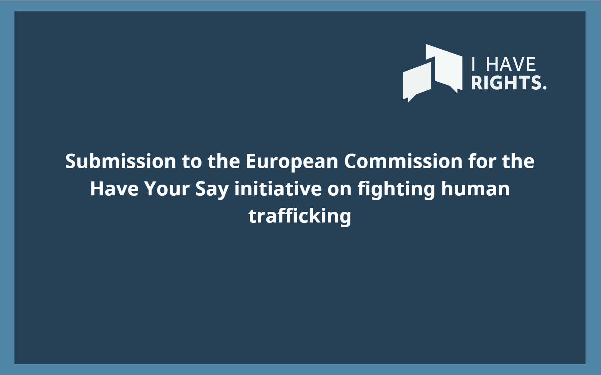
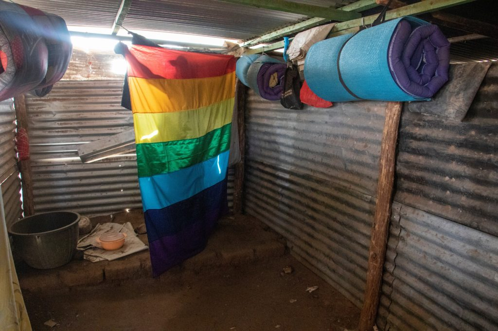

### AYS News Digest 24/05/23: Marginalisation and criminalisation of asylum seekers must end; protests and solidarity in UK

One more person killed at the Polish-Belarus border//Protests against the planned refugee accommodation barge in Falmouth, UK //Greek PM Mitsotakis spoke about the evidence of pushbacks// Report denounces abuses against LGBTI refugees and asulym seekers in Kakuma refugee camp in Kenya// And more

](../assets/16e3aede90c2/1*7ASfM7tLzxtP291ohcLGUw.jpeg)

Graffiti on a wall against Bibby Stockolm prison barge and planned accomodation to house refugees. [Via Care4Calais](https://www.facebook.com/care4calais/posts/pfbid02LNpT1cZL44mWvZfMt7RqGyxuEngHr5xBRqPzhiP36xWSYXP5Aw7ud1fX32waCkqDl)
#### SEA/SAR
### ResQship Nadir summarized the events of its last mission

> “Our second rotation this year was marked by the incessant calls for help at sea — shipwrecks and distress cases. We once again remember, now and always, those for whom our help came too late. Rest in Power. The racist fortress of Europe stays murderous and records deaths every day” 

](../assets/16e3aede90c2/1*p_c934MjHGDlDga7bCVKfQ.jpeg)

[Via ResqShip](https://www.facebook.com/resqship/posts/pfbid02LqgfBUDtS7mBTr2CY7p2zjxfDnEbiRVLnixmNQTX542JufCBVkRVGTZFWNxfytZ6l)

Find more [here](https://www.facebook.com/resqship/posts/pfbid02LqgfBUDtS7mBTr2CY7p2zjxfDnEbiRVLnixmNQTX542JufCBVkRVGTZFWNxfytZ6l)
#### GREECE
### Greek PM Mitsotakis spoke about the evidence of pushbacks by the Greek authorities

In a recent AYS digest we wrote about the evidence of pushbacks carried out by the Greek authorities on Lesvos. Pushbacks have been filmed on Lesvos for the first time, from the moment of detention to abandoning people and minors in a liferaft in Turkish waters. [Find our digest here](https://medium.com/are-you-syrious/ays-news-digest-23-05-23-pushbacks-in-the-aegean-verified-by-video-investigation-e0359816d56e)

Mitsotakis was interviewed on the topic:

■■■■■■■■■■■■■■ 
> **[Christiane Amanpour](https://twitter.com/amanpour) @ Twitter Says:** 

> > “I take this incident very seriously.” Greek PM @[kmitsotakis](https://twitter.com/kmitsotakis) reacts to @[nytimes](https://twitter.com/nytimes) video evidence of Greek authorities ditching migrants at sea. This “completely unacceptable practice” is “already being investigated,” he says in the first interview since his party’s election win. https://t.co/JU6JTCUjqS 

> **Tweeted at [2023-05-23 17:36:16](https://twitter.com/amanpour/status/1661063509260615684?fbclid=IwAR0AsuAB-1XZM5Pnt0aTREi7WsR4CZEi8iso8m0j-HHmqrByYbxa2PRTsYk).** 

■■■■■■■■■■■■■■ 

Despite Mitsotakis declaring pushbacks as a “completely unacceptable practice”, the Greek Prime Minister is allowed by his voters to continue his tough migration policy. In the Greek elections, he and his center-right party Néa Dimokratia won almost 41 percent of the vote. His voters expect him to follow policies that see a securitarian approach to migration, as well as the use of illegal practices, such as pushbacks. Read more here:

[/s3/static.nrc.nl/images/gn4/stripped/data100874823-fd1150.jpg)](https://www.nrc.nl/nieuws/2023/05/22/mitsotakis-mag-van-griekse-kiezer-door-met-hard-migratiebeleid-a4165248?fbclid=IwAR1WFB9Six3BvHFTzQpYPrPLQ-ZHyKfaveU8EUITlFqq_OpjOlrUU_Pph0w)

#### POLAND
### One more person killed at the Polish-Belarus border

](../assets/16e3aede90c2/1*ExgGvNHInvpeYuqXUIY2Eg.jpeg)

Via [Grupa Granica](https://www.facebook.com/grupagranica/posts/pfbid02gG5TRnZPdpkbvqLC34UrwqoFitHwdicGduK9JS36WCSehHB7WBHbi9UJFd7wJePEl)

> “Ignoring and preventing people on the move from submitting applications for legal protection and continuing illegal deportations to Belarus by the uniformed services impacts growth of the desperation among those who seek for safety and protection in Poland and EU. It also increases the risk of loss of health and life by refugees” 

wrote [Grupa Granica in a post](https://www.facebook.com/grupagranica/posts/pfbid02gG5TRnZPdpkbvqLC34UrwqoFitHwdicGduK9JS36WCSehHB7WBHbi9UJFd7wJePEl)
#### UK
### Marginalisation and criminalisation of asylum seekers must end: protests and solidarity in UK

The UK government is planning to house asylum seekers in a prison barge at sea. On 21st May, about 300 people gathered in a protest against the Bibby Stockholm barge, which is currently in Falmouth’s dry dock, being refitted to increase its capacity from 250 people to a shocking 500. The demonstration condemned the Government’s choice to host people seeking safety in such an inhumane structure, which will start to house people as soon as next June. [Read more here](https://www.facebook.com/care4calais/posts/pfbid02LNpT1cZL44mWvZfMt7RqGyxuEngHr5xBRqPzhiP36xWSYXP5Aw7ud1fX32waCkqDl)

](../assets/16e3aede90c2/1*i2ssJHPp8juUz6_IQ42dRQ.jpeg)

The prison barge that will soon house about 500 people seeking safety in UK. Via [Care4Calais](https://www.facebook.com/care4calais/posts/pfbid02LNpT1cZL44mWvZfMt7RqGyxuEngHr5xBRqPzhiP36xWSYXP5Aw7ud1fX32waCkqDl)

This kind of housing plans aim to marginalise asylum seekers and refugees, creating an unknown “other” easier to demonise in media and political narratives. A barge at sea forces people to live in inhumane conditions, isolated and marginalised. This marginalizations process is parallel to a systematic criminalisation practice.

It is precisely the NGO Captain Support’s main objective to oppose this criminalisation process. It is a platform founded to support those accused of driving boats to Europe, by connecting them with local support networks and lawyers. People on the move are often arrested and imprisoned for driving boats bringing people to Europe, accused of human smuggling. In order to give them proper legal support, the NGO is calling for help via their fundraising effort. [See more here](https://www.instagram.com/p/CslJ6aBIu3T/?fbclid=IwAR0NmLS6QA9MGttdpwKrZz2B_WIjxTpl-y4KA45pq2CfZAm4_jzqt1i2BCA)

However the criminalisation process affects even solidarity: a trial against three activists who tried to stop a deportation to Jamaica in November 2021 will start soon at the end of this month. [A rally has been called](https://www.instagram.com/p/Cr0QHTjoZCy/?utm_source=ig_web_copy_link&igshid=MzRlODBiNWFlZA%3D%3D&fbclid=IwAR2Cj-W0A63F2tuP2fjITpO3Jsx7qhfpp-oF44Dk73y3AihYzerr9aAnwZk) for 30th May at Lewes Crown Court (see [LGSMigrants page](https://www.instagram.com/p/Cr0QHTjoZCy/?utm_source=ig_web_copy_link&igshid=MzRlODBiNWFlZA%3D%3D&fbclid=IwAR2Cj-W0A63F2tuP2fjITpO3Jsx7qhfpp-oF44Dk73y3AihYzerr9aAnwZk) )

Solidarity and dissent practices are essential to fight against the systematic criminalisation and marginalisation of people on the move and asylum seekers. Nevertheless, a change of the overall migration system is crucial in order to de-construct the main narratives which see people migrating to the UK as the “enemy”. Care4Calais has pointed out the need for safe passages and a change to the Illegal Migration Bill, which was considered on the 24th by the House of Lords.

They wrote:

> “Our proposal is that if the bill is made law, the government should introduce a system of safe passage for refugees with a viable asylum claim.We hope the lords will accept the change” 

[Read more here](https://www.facebook.com/care4calais/posts/pfbid0We8A9aWz2gacoBjj99YVUpafsRLjGy1rRi73jqAaDTp1Cb6UEH9cPXfe5CUcEkLZl)
#### EU
### The NGO ‘I have rights’ submitted feedback on EU Anti-trafficking Directive

The European Commission has recently decided to review the EU Anti-Trafficking Directive. The NGO ‘I have rights’ has decided to submitt its feedback on the mentioned directive. Indeed, they consider that the Greek authorities have often failed to meet their obligations to human trafficking survivors. The NGO has called for a positive obligation to identify, support, protect, and assist victims of trafficking and to adress the currents gaps.

Read more here:

#### WORTH READING:
- The importance of sport to regain dignity and build a life among refugees in Greece. [Read here about Refugym activities](https://www.facebook.com/refugym1/posts/pfbid032MttsGMXytwCXSJFZtDahQgLpdSaQaN8XpiqNhNdB1AJEFzLo3T2sm52Bk9Z3xmKl)
- Amnesty International and the National Gay and Lesbian Human Rights Commission (NGLHRC) reported on the human rights abuses towards LGBTI asylum seekers and refugees living in Kakuma, one of Kenya’s biggest refugee camps:

**Find daily updates and special reports on our [Medium page](https://medium.com/are-you-syrious) .**

**If you wish to contribute, either by writing a report or a story, or by joining the Info team, please let us know!**

**We strive to echo correct news from the ground through collaboration and fairness. Every effort has been made to credit organisations and individuals with regard to the supply of information, video, and photo material (in cases where the source wanted to be accredited). Please notify us regarding corrections.**

**If there’s anything you want to share or comment, contact us through Facebook, Twitter or write to: areyousyrious@gmail.com**

_[Post](https://medium.com/are-you-syrious/ays-news-digest-24-05-23-marginalisation-and-criminalisation-of-asylum-seekers-must-end-protests-16e3aede90c2) converted from Medium by [ZMediumToMarkdown](https://github.com/ZhgChgLi/ZMediumToMarkdown)._
