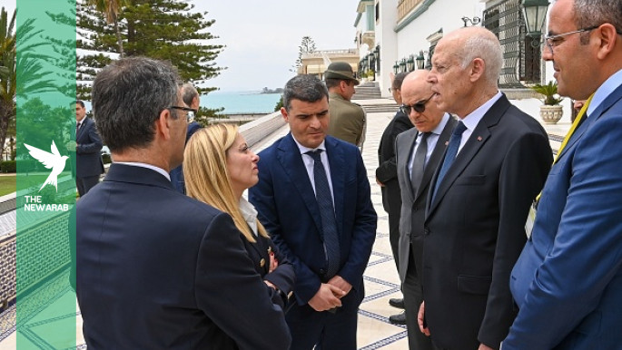
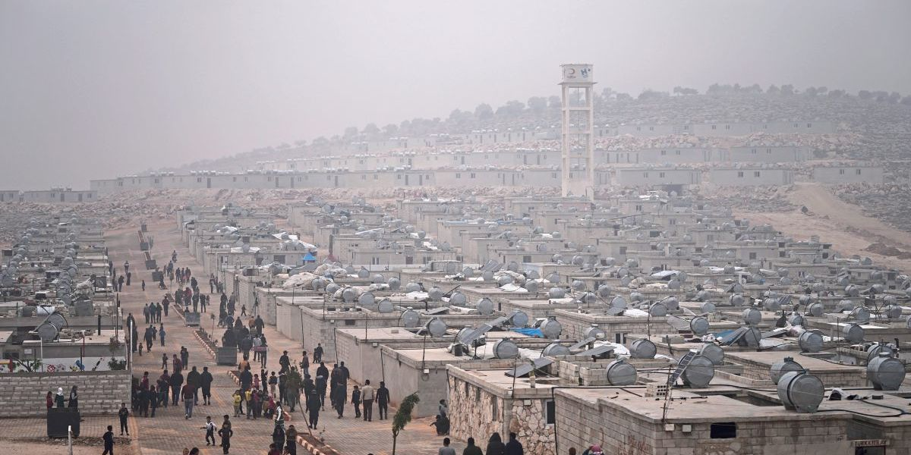
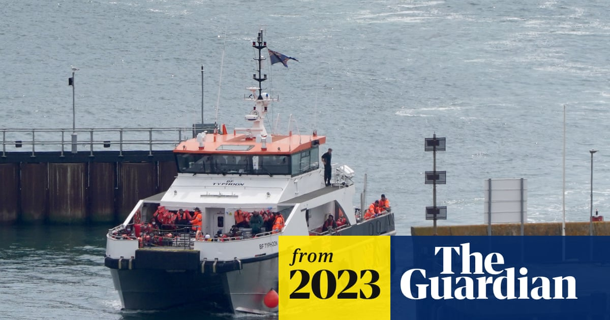
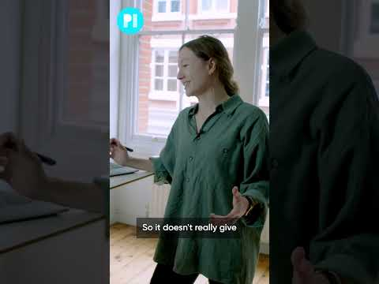
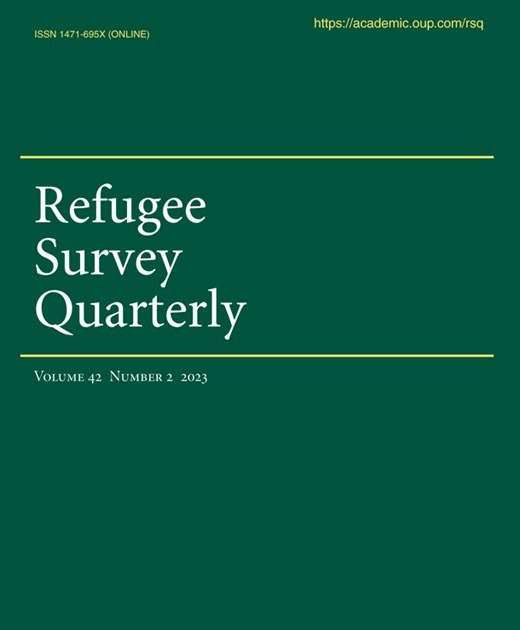

### AYS News Digest 12/06/23: New EU agreement on migration

The new EU agreement on migration aims to boost returns, deportations and externalization of borders// Turkish security forces accused of violence against people on the move at Syrian border// 90 people rescued at sea off the island of Kythera//Two-tier refugee system in UK abandonded due to asylum backlog// And more info

](../assets/6295f8903f84/1*jhRcnFXqyGqIl3nphxw2Hw.png)

European members on 9th of June agreed on some points on the Pact on Migration and Asylum to reform EU asylum law. Imagine via [EnergyPost](https://energypost.eu/eu-electricity-market-reform-completing-not-dismantling-the-integration-is-the-answer/)
#### FEATURE
### New EU agreement on migration aims to boost returns, deportations and and externalization of borders

> “No member state can deal with the challenges of migration alone. Frontline countries need our solidarity. And all member states must be able to rely on the responsible adherence to the agreed rule” 

The [press release](https://www.consilium.europa.eu/en/press/press-releases/2023/06/08/migration-policy-council-reaches-agreement-on-key-asylum-and-migration-laws/) on the agreement on key asylum and migration laws between EU member states begins with the above mentioned statement by Maria Malmer Stenergard (the Swedish minister for migration). “Solidarity” is the key word of those two sentences. However it is a world that must be analysed.

What is meant by solidarity in the new agreement?

In order to understand how the EU arrived at the agreement, it is useful to look back to a meeting in Tunisia some days ago with Giorgia Meloni, the Italian prime minister, and Ursula Von der Leyen, European Commission Head.

■■■■■■■■■■■■■■ 
> **[Ursula von der Leyen](https://twitter.com/vonderleyen) @ Twitter Says:** 

> > 1. A robust 🇹🇳 economy;
We are considering up to €900M macrofinancial assistance &amp; up to €150M in budget support.

2. Increased trade &amp; investment

3. Mutually beneficial energy cooperation

4. Addressing common migration challenges

5. Bringing our people together

#TeamEurope https://t.co/araemd0BUq 

> **Tweeted at [2023-06-11 11:10:27](https://twitter.com/vonderleyen/status/1667851787196301314).** 

■■■■■■■■■■■■■■ 

It may seem that this has nothing to do with the recent agreement on migration. While the agreement has certainly been made between European member states, the so-called third and transit countries are of great importance. And Tunisia is one of them. Therefore, looking at recent events is useful to understand the European dynamics and direction on asylum.

European leaders offered Tunisia more than 1 billion euro in order to hinder migration from the North African country.

> “We both have a vast interest in breaking the cynical business model of smugglers and traffickers” 

stated Von der Leyen. While European border management focuses on smugglers, attempting ‘to stop’ irregular arrivals, no effort is channeled toward finding legal ways.

So [while Scholz urges Italy](https://www.msn.com/en-xl/news/other/scholz-tells-italy-refugee-crisis-can-only-be-solved-at-eu-level/ar-AA1ciGMU?fbclid=IwAR0umn6AdhyDMcQF8M0YreS3FHFoEh5aPFWyQhnHRhxaLUU_0INg5H5EDmY) and other European members to coordinate in a harmonious management of European migration policies, Giorgia Meloni (Italian prime minister) travels to Tunisia. Such agreements with countries that do not respect human rights are not only a priority for countries governed by the extreme right, as in the Italian case, but for the whole of Europe.

No matter which countries these are: after months of hate speech by Tunisian President Said against migrant people and in particular Sub-Saharan people, the EU seems deaf.

Transit countries play a crucial role not only in controlling Europe’s external borders, but also within the European asylum system as a whole: returns, deportations, but also pushbacks and irregular expulsions (more politely called ‘readmissions’).

On 9th June, for the first time in many years, European leaders seemed to have found a common line to follow on the management of migration and asylum at the European level. Not without opposition, in particular from Poland and [Hungary](https://www.rferl.org/a/hungary-eu-refugee-reform-deal/32451830.html?fbclid=IwAR0wIu8Ii2qFHi_Ovjhw4YQabUBiecJ8FWgIS_mCZARmNJgigS2XZkd4L3s) . And the direction taken in this agreement is the same one that has been followed for years now.

[Here is the press release](https://www.consilium.europa.eu/en/press/press-releases/2023/06/08/migration-policy-council-reaches-agreement-on-key-asylum-and-migration-laws/)

The fundamental role of third and transit countries for European policies was just mentioned above. It is therefore not surpraising that [Human Rights Watch](https://www.hrw.org/news/2023/06/09/new-eu-migration-deal-will-increase-suffering-borders) explains:

> The agreement would allow each country to [determine what constitutes a “safe third country”](https://www.euractiv.com/section/migration/news/eu-ministers-reach-historic-deal-on-migrant-relocation/) where people can be returned, based on a vague concept of “connection” to that country. This could lead to people being sent to countries they have merely transited 

ECRE analyzed the agreement point by point in order to imagine and foresee the possible consequences of those decisions.

■■■■■■■■■■■■■■ 
> **[ECRE](https://twitter.com/ecre) @ Twitter Says:** 

> > 🧵Editorial: Migration Pact Agreement Point by Point

What was agreed? What are the consequences? Where are we now?

ECRE will analyze detailed texts, when available. Meantime, 48 points can already be made on agreement reached yesterday among the 🇪🇺 MS

🔗[bit.ly/3ClMSy0](https://bit.ly/3ClMSy0) https://t.co/WDsXcNyOeq 

> **Tweeted at [2023-06-09 10:47:25](https://twitter.com/ecre/status/1667121212793802753?fbclid=IwAR0LyhbHrOsWXUlI0Sma-fZoIij3eXJr1ilMdqtTEVxwZkqXd_DtFpIh2r4).** 

■■■■■■■■■■■■■■ 

So, we ask again, what is meant by solidarity? According to the press realease:

> “(…) a new solidarity mechanism is being proposed that is simple, predictable and workable. The new rules combine mandatory solidarity with flexibility for member states as regards the choice of the individual contributions. These contributions include relocation, financial contributions or alternative solidarity measures such as deployment of personnel or measures focusing on capacity building” 

However, an overall look at the agreed points is sufficient to support ECRE’s claim:

> An underlying objective is to transfer responsibility to countries outside Europe, even though 85% of the world’s refugees are hosted outside Europe, mainly in desperately poor countries. The targets are the countries of the Western Balkans and North Africa, through the use of legal tools such as the “safe third country” concept. Nonetheless, the reforms do nothing to increase the likelihood that these countries agree to host people returned from the EU. 

At the same time, while the EU fuels an externalisation approach on migration, within Europe the reforms increase the focus on the borders, trying to hinder so called ‘secondary movements’ inside the EU Schengen area.

Read here more about the agreement and ECRE’s analysis:

[**Editorial: Migration Pact Agreement Point by Point**](https://ecre.org/editorial-migration-pact-agreement-point-by-point/) 
[_ECRE will analyse the detailed texts of the General Approach, when they are available. In the meantime, 48 points can…_ ecre.org](https://ecre.org/editorial-migration-pact-agreement-point-by-point/)

The introduction of accelerated ‘border procedures’ would have worrying consequences, as stated by Human Rights Watch:

> “Imposing this procedure in conjunction with detention or detention-like conditions is directly linked to the twin interests of many EU countries in preventing people traveling further into Europe from countries of first entry and in deporting people as swiftly as possible” 

For more details, here are some other articles on this topic by [Politico](https://www.politico.eu/article/italy-giorgia-meloni-assylum-seekers-eu-holds-migration-deal-hostage/) , [Al Jazeera](https://www.aljazeera.com/news/2023/6/9/eu-members-sign-deal-to-overhaul-migration-procedures) and [InfoMigrants](https://www.infomigrants.net/fr/post/49551/ue--les-vingtsept-saccordent-sur-une-reforme-de-lasile-apres-trois-ans-dintenses-debats)
#### LIBYA
### Pushbacks to Libya, not a safe country

■■■■■■■■■■■■■■ 
> **[InfoMigrants](https://twitter.com/InfoMigrants) @ Twitter Says:** 

> > 📷Despite international humanitarian organizations, including the UN, declaring that Libya is not a safe place for migrants, the Libyan coast guard continues to intercept migrants at sea and bring them back to Libya. Here a group were brought back on June 8. https://t.co/KIBbMFnde8 

> **Tweeted at [2023-06-12 09:10:00](https://twitter.com/InfoMigrants/status/1668183859806994432?fbclid=IwAR31Cn8lPXmlwevQ_CaHdE8I8UGL5wN4MlayaykO0K65UPtwGVfyTu_1HAc).** 

■■■■■■■■■■■■■■ 

#### TURKEY
### Turkish security forces accused of violence against people on the move at Syrian border

Human Rights Watch accused Turkish authorities at the border with Syria of massive violence against migrant people and called for an investigation.

People trying to cross from Syria to Turkey are systematically beaten and tortured by the Turkish autorithies and often pushed back. Although they are seeking protection, they often find more risks, even to the point of death.

“Hundreds of deaths and injuries” have been suffered at this border, according to Hugh Williamson, Europe and Central Asia director at Human Rights Watch (HRW), who also claimed:

> “Turkish gendarmes and forces in charge of border control routinely mistreat and indiscriminately fire on Syrians along the Syrian-Turkish border” 

Read more here:

#### GREECE
### 90 people rescued at sea off the island of Kythera

Last Sunday, 12th June, 90 people in distress were rescued by the Greek authorities. Most of the people travelling by makeshift boat are from Afghanistan, Bangladesh, Pakistan, Iraq and Egypt, countries they decided to leave for different reasons in order to find a safe life in Europe. [Read more here](https://www.infomigrants.net/en/post/49591/greek-coastguard-rescues-90-migrants-including-37-children?fbclid=IwAR1pVMDoqhNMdIvwDb9ZIg0WxeD_ZphGpHUfMnUK_xooJbBKReExcjeI06w)

However, at any border they have to cross they have to deal with the difficulties imposed by border controls and the border system. And even in the worst of times, while risking their lives, they do not know if they will find help. The Greek authorities systematically push back people on the move even though the Greek government keeps denying it.
#### SPAIN
### Two people drowned while trying to reach Spain

Forced to cross by a risky route: there were no legal ways to each the EU for them but to cross the Mediterranean Sea in an irregular way in the direction of Spain. And then: forced to swim to the coast. Two people on the move died in the attempt to reach Almeria. They were traveling with a small boat and afterward were forced to swim to the Spanish coast by the people driving the boat. [Read more here](https://www.usnews.com/news/world/articles/2023-06-09/two-migrants-forced-to-swim-to-shore-drown-spanish-authorities?fbclid=IwAR1pVMDoqhNMdIvwDb9ZIg0WxeD_ZphGpHUfMnUK_xooJbBKReExcjeI06w)
#### UK
### Two-tier refugee system in the UK abandonded due to asylum backlog

Asylum seekers arriving from the Channel will no longer be differentiated from other people who reached the UK by legal ways. The UK governemnt announced this decision to cope with delays in the asylum system.

Rishi Sunak has dropped the key plank of last year’s asylum law. The policy introduced last year gave priority to the way people arrived in the UK rather than to their need for protection and personal story.

> “The government is now admitting that its flagship Nationality and Borders Act has failed to deliver. As was predicted by us and other refugee organisations, it hasn’t deterred desperate men, women and children from taking dangerous journeys but has simply led to unnecessary misery for many refugees.” 

Stated Ever Solomon, chief executive for the Refugee Council, for The Guardian.

This dual-track way of analysing asylum applications was intended to stop and discourage irregular travel. But one important point was overlooked: those who travel the Channel risking their lives in small boats have no other legal alternative. Thus, the only result of this modus operandi was to cause a huge delay within the asylum system while people wait for an answer on the decision made about their lives.

People crossing the sea to the UK have no other ways. The UK governemnt monitors the number of people traveling and detected in the Channel (thus: risking their lives because of the absence of legal paths). [Find it here](https://www.gov.uk/government/publications/migrants-detected-crossing-the-english-channel-in-small-boats/migrants-detected-crossing-the-english-channel-in-small-boats-last-7-days?fbclid=IwAR0LyhbHrOsWXUlI0Sma-fZoIij3eXJr1ilMdqtTEVxwZkqXd_DtFpIh2r4)

Over the past years, arrivals from Albania have increased sharply. A significant part of the people crossing the Channel is accounted for by Albanian people. This increase has generated an internal debate within British politics on whether Albania should be considered a safe country or not. [Read it here](https://www.theguardian.com/world/2023/jun/12/albania-is-a-safe-country-cross-party-mps-group-finds?fbclid=IwAR1yYFKeddXRPekHRxQjDaMQHUJnJbvnOAQuQQUxXsfRzj5oyayPFbcNdew)

Once they arrive, asylum seekers in the UK are held in reception centres or detention centres. New off-shore barges are planned to host them: this would humiliate and isolate them. They would be considered as criminals and held in facilities similar to jails.

The Archbishop of Canterbury, [as it is possible to read at this link](https://www.dorsetecho.co.uk/news/23581151.archbishop-canterbury-delay-portland-port-barge/?fbclid=IwAR1QcWSHSLRjHARrA8d9ncKUr8za67gDY0IyAfB556ERVvOXwxTQh0ezruc) , has called on plans for a barge housing asylum seekers to be delayed so that the government can consult Dorset residents.

Once asylum seekers receive an answer to their claims, they are either at risk of deportation or free to leave the centres where they used to live. However, Privacy International has pointed out that many of the people leaving detention centres are monitored using gps tracking devices.

■■■■■■■■■■■■■■ 
> **[Privacy International](https://twitter.com/privacyint) @ Twitter Says:** 

> > Migrants in the UK are forced by the Home Office to wear GPS tracking devices - humiliated, controlled, stigmatised - even if they’ve lived in the UK for years.

We bought some tags from the open market to figure out how they work. 

#DignityNotData

> **Tweeted at [2023-06-11 10:50:00](https://twitter.com/privacyint/status/1667846637941854209?fbclid=IwAR14AqUtHlHd_wZEo33F-V06lJQ-iChIcRTqvfvOvgOTTTekPLGlQNZg6UU).** 

■■■■■■■■■■■■■■ 

#### WORTH READING:
- UK Parliament Human Rights Commitee reccomendations to UK governemnts “ [not to breach its legal obligations to refugees, children and victims of modern slavery](https://twitter.com/HumanRightsCtte/status/1667834055222792195?fbclid=IwAR0kgE0_KVQPa-xnhqKrzBkFhQ5srdYwj4UYa8TbnqZU_V4AIHOzppM0vys) ”. Here is the [report](https://publications.parliament.uk/pa/jt5803/jtselect/jtrights/1241/report.html)
- New practices of reception and support of people on the move and refugees are being tried out in Niger. Local communities and refugees interact and support each other, trying out a more sustainable alternative compared to refugees camps. [Read the article here](https://www.unhcr.org/news/stories/refugees-and-locals-live-side-side-niger-s-opportunity-villages?fbclid=IwAR3_py6C2o7DjZyQybYzKx0N0xxjIgb6Nlxcs2dK4Ep3S0GcdE3po3GP7cU)
- Forced Migration Current Awareness released the new Issue of _Refugee Survey Quarterly:_

- Debate between German parties on the possibility of starting an asylum plan similar to the UK Rwanda Plan. [Read it here](https://www.dailymail.co.uk/news/article-12176903/Germany-wants-EU-adopt-Rwanda-style-migrant-system.html?fbclid=IwAR0D_kEPb9Srgs4ilc_Jc-5vYeuKCllskjFaYiykbKXDFtbTvY9hKfKRN0w)

**Find daily updates and special reports on our [Medium page](https://medium.com/are-you-syrious) .**

**If you wish to contribute, either by writing a report or a story, or by joining the Info team, please let us know!**

**We strive to echo correct news from the ground through collaboration and fairness. Every effort has been made to credit organisations and individuals with regard to the supply of information, video, and photo material (in cases where the source wanted to be accredited). Please notify us regarding corrections.**

**If there’s anything you want to share or comment, contact us through Facebook, Twitter or write to: areyousyrious@gmail.com**

_[Post](https://medium.com/are-you-syrious/ays-news-digest-12-06-23-new-eu-agreement-on-migration-6295f8903f84) converted from Medium by [ZMediumToMarkdown](https://github.com/ZhgChgLi/ZMediumToMarkdown)._
