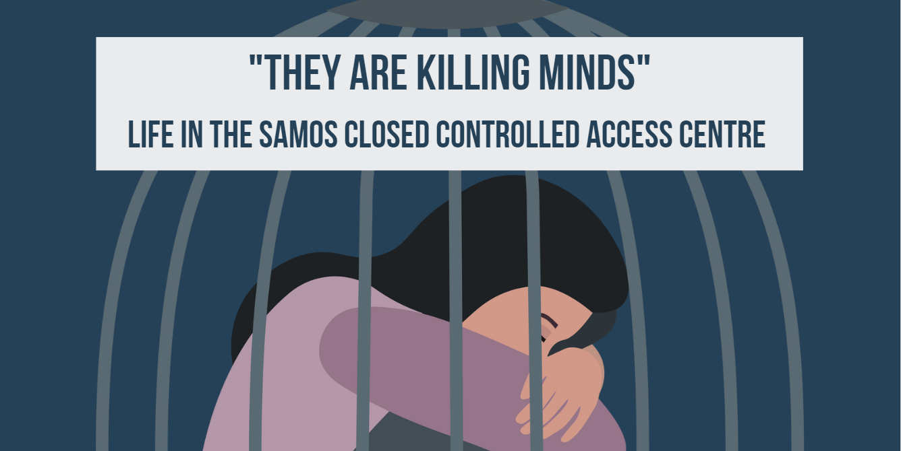
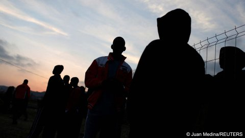

### AYS News digest 21/06/23: Use of relocation procedures by EU to hinder people’s right to claim asylum; the Dutch example

Preliminary interviews conducted for relocation used by the Dutch authorities as a pretext for refusing asylum applications// Organisations ask for justice and investigation into the shipwreck of 14th of June// Asylum database in Greece leaves people unable to claim asylum// New plan to increase host capacity of asylum seekers in Cyprus// Criticism of the age assessment system in the UK

](../assets/b846f9ff95a1/1*StVN5I9kZWq_18sQSj4oVQ.jpeg)

Credit to [Borderline Europe](https://twitter.com/BorderlineEurop/status/1671546401631731712?fbclid=IwAR24DrtcShUNWICHne8rR2kvwGwQ219gwLkzuOuiduHIGEGFCmgdDJ6B7Ac)
#### EU
### Preliminary interviews conducted for relocation used by the Dutch authorities as a pretext for refusing asylum applications

■■■■■■■■■■■■■■ 
> **[borderline-europe](https://twitter.com/BorderlineEurop) @ Twitter Says:** 

> > 5/6 MS should stop putting asylum-seeking ppl through unnecessary inquiries and act in compliance with EU law. This means conducting interviews only after the ppl have been transferred. The relocation scheme can’t be used as a fast track for rejection and deportation! 

> **Tweeted at [2023-06-21 15:51:35](https://twitter.com/BorderlineEurop/status/1671546411857354752).** 

■■■■■■■■■■■■■■ 

Borderline Europe reported a specific case: shortly after being rescued by Sea-Watch3, six people were interviewed to activate the relocation process. Once disembarked at the port of arrival, people were interviewed in the country of arrival and then flown to Amsterdam. Subsequently, the interviews conducted upon disembarkation were used by the Netherlands to reject their asylum applications, without interviewing them once in the country. One of them is still waiting for a response, one was accepted while four were refused. This example highlights a completely unlawful practice.

By using interviews for the relocation process, the procedures for analysing asylum applications are speeded up. Thus these interviews function as a quicker way of rejecting and deporting people.

Asylum seekers have the right to tell their story in the host country. The relocation process cannot hinder reception, nor speed up the decision. Many asylum seekers find obstacles not only in the host country, but on the path to it. In addition to the traumas often experienced in the country of origin, there are the traumas on the journey and imposed by borders. Yet the systematic and structural violence of the border system is increasingly normalised.

Dunja Mijatović, the commissioner for human rights at the Strasbourg-based watchdog, the Council of Europe, commented on the increasing tolerance of human rights violations against refugees, asylum seekers and migrants across Europe, which has reached alarming levels.

#### SEA/SAR
### Organisations ask for justice and investigation on the shipwreck of 14th of June

The Mediterranean is a crime scene, not only a graveyard. Saying it, on World Refugee Day, many organisations demand a full and independent investigation into the shipwreck off Greece and clear consequences for those responsible.

■■■■■■■■■■■■■■ 
> **[ECRE](https://twitter.com/ecre) @ Twitter Says:** 

> > Up to 600 people drown off #Pylos 🇬🇷

Today, on #WRD, we demand a full &amp; independent investigation into what happened &amp; clear consequences for those responsible

Open letter from +180 human rights organizations &amp; initiatives

🔗[bit.ly/43TleEv](https://bit.ly/43TleEv) https://t.co/xTWqYsETTt 

> **Tweeted at [2023-06-20 09:04:19](https://twitter.com/ecre/status/1671081534374174721?fbclid=IwAR1SGnpS9TU4_wInlJ6EOjOihUIieGpFzw0Lda48ToXk6r1vSzFLbaIeeKw).** 

■■■■■■■■■■■■■■ 

### Italian court rejected two appeals filed by Doctors Without Borders against the assignement of inconvenient ports

A Rome court considered the assignement of the inconvenient northern ports of Ancona and La Spezia to Doctors Without Borders’ Geo Barents ship as legal, rejecting two appeals filed by the NGO. The Court stated that a safe port is not the nearest one; forgetting that rescued people are coming from a long and traumatic route on the sea.

[Read more here](https://www.infomigrants.net/en/post/49817/italian-court-rules-in-favor-of-inconvenient-port-assignments-to-ngo-ships?fbclid=IwAR0gxN5-J668niBHEc6Zf7dF684TVt0xLXFIjbqQp35nPvgdcDs7FrHzTrE)
#### CYPRUS
### New plan to increase the host capacity for asylum seekers in Cyprus

Cyprus’ Interior Minister, Constantinos Ioannou, has presented a new plan to increase the country’s reception capacity. Indeed, [as asylum applications increase on the island](https://cyprus-mail.com/2023/06/20/asylum-applications-rocket-in-cyprus/?fbclid=IwAR1WicMDIpKTRWeLXlT_VaelKbtso-kGT3FvlSKYz2ra7cv9bjE8YoJiKkc) , the new plan presented on Wednesday to renovate and build new flats in refugee reception centres becomes central.

[Read more here](https://cyprus-mail.com/2023/06/21/minister-thanks-organisations-for-humanitarian-refugee-housing-help/?fbclid=IwAR2e_NYFuIfq-JElO6Pg-tXD5SSu2TtWQ5rLyL_5PihpWpnh6z0PevL0AqI)
#### GREECE
### Asylum database in Greece leaves people unable to claim asylum

Organisations working in Greece have shared a statement on the recent shutdown of the Greek asylum database (Alkyoni), which halted most procedures, while registering asylum through subsequent apps is still not possible. Therefore people are forced to live in a limbo and remain undocumented, suffering the consequences of being without papers.

■■■■■■■■■■■■■■ 
> **[ARCHIVED: Mobile Info Team](https://twitter.com/mobileinfoteam) @ Twitter Says:** 

> > 📢Today with @[RLSAthens](https://twitter.com/RLSAthens) @IHaveRights_eu @[lesboslegal](https://twitter.com/lesboslegal) @[ASF_NGO](https://twitter.com/ASF_NGO) &amp; ELA we share a statement on the recent shutdown of Greek #asylum database #Alkyoni halting most procedures

🔴 Registering asylum &amp; subsequent apps. still not possible
🔴 People left in limbo

[mobileinfoteam.org/alkyoni](http://www.mobileinfoteam.org/alkyoni) https://t.co/3zndme4iyt 

> **Tweeted at [2023-06-21 09:57:26](https://twitter.com/mobileinfoteam/status/1671457289109139458?fbclid=IwAR3Ov54WrPT_42Mhz8JKUU4mBm4fTv_zhFb92bW0_QHR4pDnBqsHD05R1Cg).** 

■■■■■■■■■■■■■■ 

The first reception in Greece, as well as temporary reception, shows very serious shortcomings and many fragilities. This is to the detriment of asylum seekers. It is no coincidence that recently the Court of Human Rights has ruled that living conditions in Moria were inhuman and degrading

■■■■■■■■■■■■■■ 
> **[Daphne Tolis](https://twitter.com/daphnetoli) @ Twitter Says:** 

> > 🧵On 13 June 2023 the European Court of Human Rights ruled in its judgment H.A. &amp; others v Greece.

The  Court ruled that living conditions in #Moria were inhuman and degrading due to the overcrowding, resulting difficulties of such overcrowding &amp; acute lack of basic necessities. 

> **Tweeted at [2023-06-20 16:41:42](https://twitter.com/daphnetoli/status/1671196638029725697?fbclid=IwAR3mMtZ2py_NMjDhskBn3YoRikZmy993g_Ydv_uqG2mtr_hBl6swXguo2Nk).** 

■■■■■■■■■■■■■■ 

#### UK
### Criticism of the age assessment system in the UK

Minors are vulnerable individuals who must by law be taken care of and protected by the state, especially if they are unaccompanied. However, rather [questionable measures](https://www.communitycare.co.uk/2023/03/16/basw-urges-social-workers-not-to-take-jobs-with-home-office-age-assessment-body/?fbclid=IwAR3925oY8_-4eryWZjZxgss9GzusMg8h_XITNRWA-I5K9Nd73vlNuUqyuj8) are used to determine the age of the person. It is no coincidence that the Home Office is struggling to find social workers willing to do age assessment. [Read more here](https://www.communitycare.co.uk/2023/06/20/home-office-has-recruited-just-40-of-social-workers-needed-for-asylum-body/)

■■■■■■■■■■■■■■ 
> **[Twitter User](https://twitter.com/ColinYeo1/status/1671204289908203520?fbclid=IwAR1tExBgCk_Em6ig5FaMjZ0QuUilarcqhE04Jda5-uwk0TFFuYdwCUChkcc) @ Twitter Says:** 

> >  

> **Tweeted at .** 

■■■■■■■■■■■■■■ 

Although minors should be protected by the state, many underage children are still missing in the UK:

■■■■■■■■■■■■■■ 
> **[Refugee Council 🧡](https://twitter.com/refugeecouncil) @ Twitter Says:** 

> > "Home Secretary you and I both have children, what would you do if one of them went missing"? Suella Braverman was pressed by SNP Spokesperson and APPG Refugees member @[alisonthewliss](https://twitter.com/alisonthewliss) on what the Government are doing to locate the 154 unaccompanied asylum seeking children still https://t.co/nrMAEoDoBS 

> **Tweeted at [2023-06-15 16:50:51](https://twitter.com/refugeecouncil/status/1669387000367939586?fbclid=IwAR2dwHKMlN0YTvT9DJQ8fyuAUrlplxtqFZEPtL8n2EDQ8SUuiu38pfm2dSQ).** 

■■■■■■■■■■■■■■ 

#### WORTH READING
- A report about the life in Samos closed centre was released by [‘I have rights’](https://twitter.com/IHaveRights_eu/status/1671046745365663744?fbclid=IwAR2Q-p8zu5HTg6JzHau9ouqEcWj0wt4hBXgBkEa51EVU8hHB-Xey81zkRWE)

- Changes in the migration pattern along the so-called Balkan Route. A thread by Collective Aid summarized them:

■■■■■■■■■■■■■■ 
> **[Collective Aid](https://twitter.com/collective_aid) @ Twitter Says:** 

> > What has migration looked like in the Western Balkans? 
Thread! 🧵 

> **Tweeted at [2023-06-19 08:51:02](https://twitter.com/collective_aid/status/1670715805078548480?fbclid=IwAR38WCRTRtIwcwuSAGkHjxKK1tO9IZI8F0LSz_6KENbU6UNS76kbdcqeI1c).** 

■■■■■■■■■■■■■■ 

- Some weeks ago, Altreconomia and Inkyfada pubblished an intersting investigation on the abuse of sedatives and antipsychotic drugs in detention centers for third country nationals detained in deportation centers (CPR) in Italy:

- In this article there is a list of contact numbers and addresses that can be contacted about missing persons after the shipwreck of 14th of June:

**Find daily updates and special reports on our [Medium page](https://medium.com/are-you-syrious) .**

**If you wish to contribute, either by writing a report or a story, or by joining the Info team, please let us know!**

**We strive to echo correct news from the ground through collaboration and fairness. Every effort has been made to credit organisations and individuals with regard to the supply of information, video, and photo material (in cases where the source wanted to be accredited). Please notify us regarding corrections.**

**If there’s anything you want to share or comment, contact us through Facebook, Twitter or write to: areyousyrious@gmail.com**

_[Post](https://medium.com/are-you-syrious/ays-news-digest-21-06-23-use-of-relocation-procedures-by-eu-to-hinder-peoples-right-to-claim-b846f9ff95a1) converted from Medium by [ZMediumToMarkdown](https://github.com/ZhgChgLi/ZMediumToMarkdown)._
