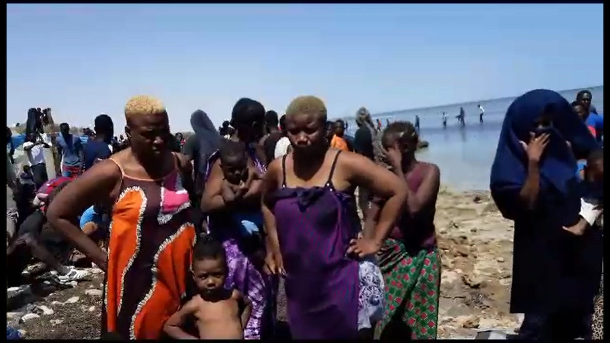

### AYS News Digest 7/07/2023: Mass expulsions of sub-Saharan people from Tunisia to Libya

Violence, abuses and mass expulsion: the lives of sub-Saharan people in Tunisa are increasingly at risk// People in distress close to Malta//the Balkans as an EU deportation hub// Caminando Fronteras report that 951 people died trying to reach safety on the Canaries// And more

](../assets/54d000e01074/1*qOL-aCwStYeLOPssBjc45w.jpeg)

Sub-saharan people and black asylum seekers (according to a racial profile following hate discourses now in Tunisia) in Sfax are expelled from their houses with violence and forced to sleep in the street, more exposed to abuses and mass expulsions to Libya. Credit [: Refugees in Tunisa](https://twitter.com/RefugeesTunisia/status/1677446525599772674)
#### FEATURE
### Violence, abuses and mass expulsion of sub-Saharan people in Sfax

Sub-Saharan people in Tunisa have been suffering violence for months. The situation is becoming increasingly dramatic. Since 2nd July, the Tunisian authorities have been [collectivly expelling sub-Saharan people to Libya](https://ilmanifesto.it/in-tunisia-e-partito-un-pogrom-centinaia-di-deportati-in-libia) , a country well known for its violations of the human rights of people on the move and asylum seekers.

> “Not only is it unconscionable to abuse people and abandon them in the desert, but collective expulsions violate international law.” 

said Lauren Seibert, a refugee and migrant rights researcher at Human Rights Watch. Here are some interviews collected by Human Rights Watch:

Hate speech and racism prevail over the lives of the people who, abandoned in the middle of the desert, are the first to suffer from the consequences of the EU-Tunisia migration agreements.

While the European authorities are trying to strengthen the externalisation of their borders with meetings and dialogues with President Saied, the disinterest and silence shown in the face of the violence and mass expulsions is significant.

■■■■■■■■■■■■■■ 
> **[EuroMed Rights](https://twitter.com/EuroMedRights) @ Twitter Says:** 

> > #Tunisia: in the face of grave violations of migrants and refugees rights pushed back to #Libya, the negotiation of an agreement by the #EU to return migrants to Tunisia must be halted! 

Tunisia is not a safe country! says @[EuroMedRights](https://twitter.com/EuroMedRights) President @[walasmar](https://twitter.com/walasmar) https://t.co/6sLROfhva7 

> **Tweeted at [2023-07-07 12:51:20](https://twitter.com/EuroMedRights/status/1677299259412979713).** 

■■■■■■■■■■■■■■ 

From Sfax, a city from which many people try to leave the country in order to reach safety, people are brought to the Algerian and Tunisian borders and abbandoned there [, in the desert](https://ilmanifesto.it/lo-stato-di-diritto-in-tunisia-sta-morendo-nel-deserto) .

The [violence in Sfax is alarming](https://twitter.com/garey_/status/1677598127241437186) and sub-Saharan people are constantly at risk of deportation on the basis of racial profiling based on their features and skin colour. Women and children are not excluded .

■■■■■■■■■■■■■■ 
> **[@alarmphone](https://twitter.com/alarm_phone) @ Twitter Says:** 

> > @[unhcr](https://twitter.com/unhcr) According to reports, over 300 people have now been deported to the Libyan border. Some have been there for several days, without food or water - in the middle of the desert. They are in the crossfire of the Tunisian authorities and have nowhere to go. 
Rescue them now! https://t.co/IvRQMrTBEy 

> **Tweeted at [2023-07-05 14:55:33](https://twitter.com/alarm_phone/status/1676605743703769094).** 

■■■■■■■■■■■■■■ 

Perhaps, seeing recent developments, this is more than just a risk; it is almost a certainty. This is leading many people to seek a highly dangerous escape route, whatever that may be. The lives of these people are in danger: whether because of violence and abuse in the city of Sfax, or because of deportation to Libya or Algeria, or from a desperate attempt to escape. But this, in the general silence of the European authorities, does not seem to matter. And so for days, for months, the violence has persisted.

Attacks in the city of Sfax are now taking place daily. Refugees in Tunisia are trying to ask for help, as they have no choice but to [sleep in the street](https://twitter.com/RefugeesTunisia/status/1677446525599772674) after being violently expelled from their houses. In this situationm they are even more exposed to abuses both by the authorities and by Tunisian citizens.

■■■■■■■■■■■■■■ 
> **[Refugees in Tunisia](https://twitter.com/RefugeesTunisia) @ Twitter Says:** 

> > Hundreds of Sudanese refugees are seeking help from humanitarian and international organizations to protect them from attacks and violence by Tunisian citizens in Sfax. #TunisiaNotSafe #UNHCR #EvacuateRefugeesFromTunisia https://t.co/Rj5idiL8HF 

> **Tweeted at [2023-07-06 16:17:42](https://twitter.com/RefugeesTunisia/status/1676988806174502912).** 

■■■■■■■■■■■■■■ 

#### SEA/SAR
### People in distress waiting for help near Malta

■■■■■■■■■■■■■■ 
> **[@alarmphone](https://twitter.com/alarm_phone) @ Twitter Says:** 

> > Urgent! This boat with approx. 250 people on board is at risk of capsizing in #Malta SAR. They need to be rescued without further delay. Don't wait again until it is too late! Don't let them drown!
(📷 by #Seabird @[seawatchcrew](https://twitter.com/seawatchcrew)) https://t.co/K43jo5A1jM 

> **Tweeted at [2023-07-07 16:38:47](https://twitter.com/alarm_phone/status/1677356498148642818).** 

■■■■■■■■■■■■■■ 

#### BALKAN ROUTE
### EU asylum and migration system plan to trasform the Balkans in a deportation hub

■■■■■■■■■■■■■■ 
> **[Nidzara Ahmetasevic](https://twitter.com/AhNidzara) @ Twitter Says:** 

> > Balkans as EU deportation hub. According to the plans, charter flights will be organised from the Balkans for people who are sent back to the region from the EU, and through the readmission agreements. 
Platforma za deportacije [portalnovosti.com/platforma-za-d…](https://portalnovosti.com/platforma-za-deportacije) via @[novossti](https://twitter.com/novossti) 

> **Tweeted at [2023-07-08 08:29:10](https://twitter.com/AhNidzara/status/1677595669454811136).** 

■■■■■■■■■■■■■■ 

#### SPAIN
### The forgotten route through the Canaries: a report shows that 951 people have died in the last six months

Caminando Fronteras - Walking Borders — have released a report with data about the crossings and deaths along the route from western Africa to the Canaries. According to the report, the Spanish authorities are often responsible for those deaths, since most of the time requests for help by people in distress are ignored. Moreover, the EU keeps enforcing its external borders, while no legal routes are available. [Read here more](https://www.lamarea.com/2023/07/06/la-impunidad-en-mitad-del-mar-llamamos-a-todo-el-mundo-pero-no-venia-nadie/)
[https://drive.google.com/viewerng/viewer?url=https%3A//caminandofronteras.org/wp-content/uploads/2023/07/Monitoreo-DALV-primer-semestre-2023.pdf&embedded=true](https://drive.google.com/viewerng/viewer?url=https%3A//caminandofronteras.org/wp-content/uploads/2023/07/Monitoreo-DALV-primer-semestre-2023.pdf&embedded=true)
#### WORTH READING:
- A collective investigation on the shipwreck of 14th June, when about 600 people died. Solomon, Forensis, The Guardian and ARD have made a digital reconstruction of the boat’s trajectory which reveals inconsistencies in the Hellenic Coast Guard’s account, showing their crucial responsibility.

- The Border Violence Monitoring Network’s May report is out. [Testimonies of illegal pushback are listed here.](https://borderviolence.eu/reports/balkan-regional-report-may-2023/)
- A study by Borderline Europe shows the systematic criminalisation of migrant people in Greece:

**Find daily updates and special reports on our [Medium page](https://medium.com/are-you-syrious) .**

**If you wish to contribute, either by writing a report or a story, or by joining the Info team, please let us know!**

**We strive to echo correct news from the ground through collaboration and fairness. Every effort has been made to credit organisations and individuals with regard to the supply of information, video, and photo material (in cases where the source wanted to be accredited). Please notify us regarding corrections.**

**If there’s anything you want to share or comment, contact us through Facebook, Twitter or write to: areyousyrious@gmail.com**

_[Post](https://medium.com/are-you-syrious/ays-news-digest-7-07-2023-mass-expulsions-of-sub-saharan-people-from-tunisia-to-libya-54d000e01074) converted from Medium by [ZMediumToMarkdown](https://github.com/ZhgChgLi/ZMediumToMarkdown)._
