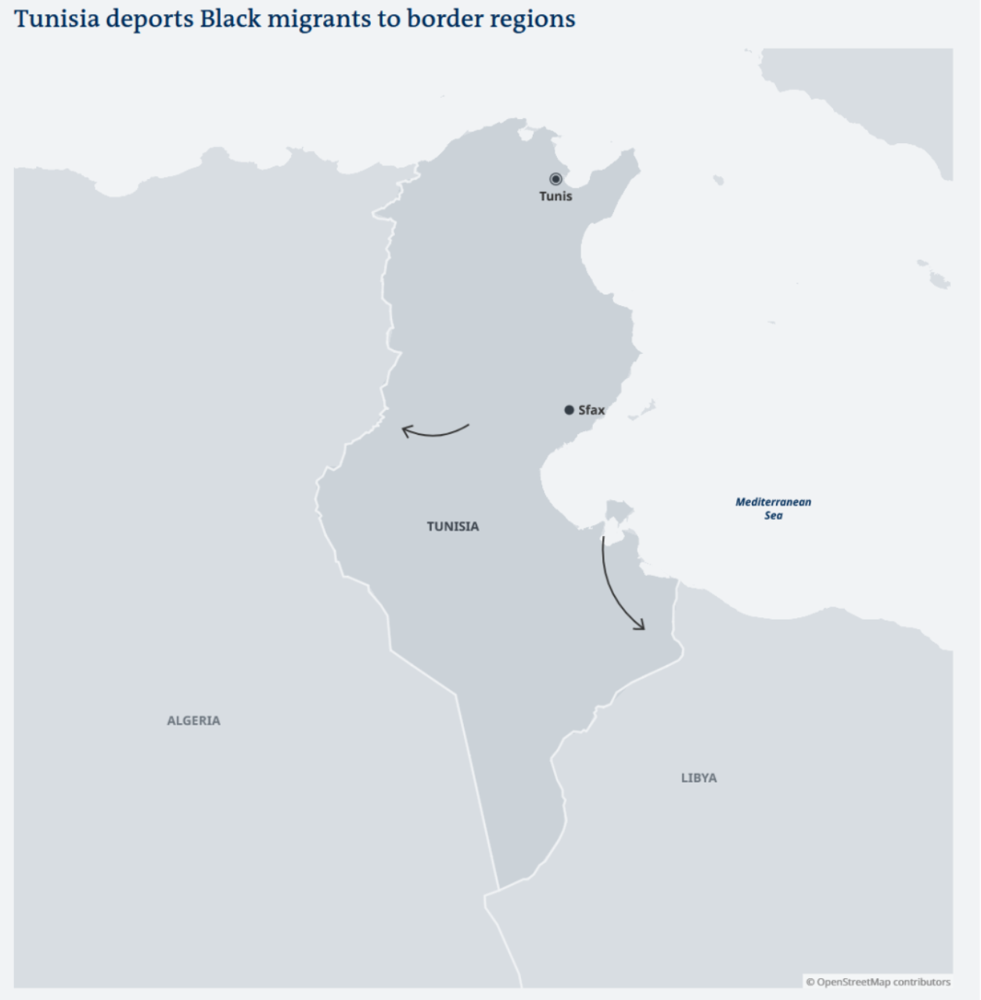

### AYS News Digest 12/07/23: Pylos Tragedy — where will Greece go from here?
#### Hundreds of sub-Saharan people are abandoned in Tunisian-Libyan borderlands // 204 people rescued by SOS Humanity as POS legislation persists in Italy // People released from detention in Libya’s Aizanara concentration camp // Illegal Migration Bill continues its journey in UK parliament & long read: “I spent a day watching asylum seekers being jailed. Here’s what I learnt”
#### FEATURE — GREECE
#### Pylos Tragedy — where will Greece go from here?

 .](../assets/7e833066672b/0*j040pClTJUcFvE7t.png)

A survivor, using Forensis’ 3D model, points to the blue rope used to tow the vessel. Via [Solomon](https://wearesolomon.com/mag/format/investigation/under-the-unwatchful-eye-of-the-authorities-deactivated-cameras-dying-in-the-darkest-depths-of-the-mediterranean/) .

As further investigative efforts (see [here](https://www.theguardian.com/global-development/2023/jul/10/greek-shipwreck-hi-tech-investigation-suggests-coastguard-responsible-for-sinking) and [here](https://counter-investigations.org/investigation/the-pylos-shipwreck) ) suggest that the Hellenic Coast Guard was indeed responsible for the tragedy, the Greek authorities continue to divert, distract and exonerate themselves from responsibility.

In Riga recently, [Greek PM Mitsotakis said that](https://www.ekathimerini.com/news/1215109/pm-says-not-fair-to-manage-eu-migration-problem-alone/?fbclid=IwAR204WrVa1ZZoi5UedfeAVtQN6ILilWYn8WYoWo0CijB2JsgjLWCXHjX8ag)

> “It is very unfair for countries such as Greece… to be burdened with the task of managing this problem or be accused of not saving people at sea when this is what our coast guard does every day” 

Mitsotakis’ coast guard is a work of fiction, his words here empty lies. The Greek authorities will not be let off the hook. The Hellenic Coast Guard failed on multiple accounts: failing to mobilise, turning cameras off, tampering survivor statements, and attempting to tow the vessel, which they have consistently denied.

Here is Forensis’ version of events:

[")](https://vimeo.com/843117800)

Academics — predominantly from Greece — are calling for further investigation, as human rights organisations and investigative journalists continue to work with survivors to document the truth.

■■■■■■■■■■■■■■ 
> **[Eleni Konstantopoulo](https://twitter.com/EleniKonstanto) @ Twitter Says:** 

> > 'Three hundred academics from Universities in #Greece &amp; abroad sent a joint letter to 🇬🇷🇪🇺 officials highlighting the urgent need to address the systematic practices of illegal refoulements &amp; calling for a comprehensive investigation for #Pylos Shipwreck' [efsyn.gr/ellada/koinoni…](https://www.efsyn.gr/ellada/koinonia/397159_anoihti-epistoli-300-panepistimiakon-gia-nayagio-tis-pyloy) 

> **Tweeted at [2023-07-11 14:46:49](https://twitter.com/EleniKonstanto/status/1678777871136083970?fbclid=IwAR2XNxqwzDNolhlOSaGJzP1ZLry1Fhbia2M2nB6b_GR41mVcPB3M3HwbsEc).** 

■■■■■■■■■■■■■■ 

#### SEARCH AND RESCUE
#### SOS Humanity: 204 people rescued

■■■■■■■■■■■■■■ 
> **[SOS Humanity (international)](https://twitter.com/soshumanity_en) @ Twitter Says:** 

> > [1/3] 🔴Breaking: Yesterday the crew of #Humanity1 rescued 204 people from distress at sea in four rescues within a very short time. Among the survivors are several pregnant women and about 50 unaccompanied minors, including several children and babies. https://t.co/1hanid00rT 

> **Tweeted at [2023-07-12 07:32:05](https://twitter.com/soshumanity_en/status/1679030855564500993?fbclid=IwAR2tBAeVNHJKk5b9S8Wa5jdnTfdZacZK8xgrFDb-WAAytppsUP-cQClwqBU).** 

■■■■■■■■■■■■■■ 

However, the Italian authorities have assigned a Port of Safety (POS) that is over 1,400 km from their current position. The journey to Ancona will add three days of further transit at sea.

Italy’s inhumane policy of keeping people in traumatic conditions, as well as fatiguing and incapacitating the civil fleet continues.

Ocean Viking is currently impounded at the Italian port of Civitavecchia, where authorities claim it fails to comply with SOLAS (Safety of Life at Sea) international safety legislation. The irony of being accused of violating a ‘Safety of Life at Sea’ policy in the Mediterranean is nothing short of outrageous. SOS Mediterranée — Ocean Viking’s NGO — have challenged the Italian authorities.
#### TUNISIA
#### Hundreds of people from sub-Saharan Africa stuck at the border

Between Tunisia and Libya, there is almost nothing: sand, sea water, desert.

](../assets/7e833066672b/0*vuUs0-W_Vng4xeTP.jpg)

Via [Alarm Phone](https://www.alarmephonesahara.info/en/blog/posts/stop-the-hunt-on-migrants-in-tunisia-and-deportations-to-the-border-help-and-evacuation-for-people-deported-to-the-no-man-s-land-on-the-tunisian-libyan-border?fbclid=IwAR0foGQC0ODpGxslgrAJcr6rVtnxnBGifO_ajXHQYG-phQ5YswSZ3ESnHu4)

Yesterday, there were reportedly 150 in the Tunisian-Libyan border region. Some had been there for over five days without access to food or water. Needing immediate medical aid, they are surrounded by armed security forces on both sides. Reportedly, neither Libyan or Tunisian authorities are providing any aid.

This is not the first time Tunisian authorities have been dropping off sub-Saharan people in this desert no-man’s-land. Earlier this week, 800 people were reportedly abandoned there.

> “The groups of Black refugees and migrants included children, women, pregnant women and they’d been left stranded in the Sahara with no shade, no food, no water,” 

> \- Monica Marks, Tunisia researcher and assistant professor of Arab Crossroads Studies at the New York University Abu Dhabi, told _DW_ from the capital Tunis. 

Read more [here](https://www.infomigrants.net/en/post/50293/african-migrants-in-tunisia-we-need-help?fbclid=IwAR3jnLMB97T1cjXu2SVW972QnI6-XnzUGmUPv_qDJz5mOs8o-LPn91rAcQU) about the background of growing anti-migration sentiment in Tunisia, as fears of further escalation grow.
#### LIBYA
#### After 18 months in detention, people have been released from Ainzara concentration camp

■■■■■■■■■■■■■■ 
> **[Refugees In Libya](https://twitter.com/RefugeesinLibya) @ Twitter Says:** 

> > 🔔BREAKING NEWS❇️
  Our comrades who have been detained for 18 months in the Ainzara concentration camp have been finally released.

We thank the ministry of interior and encourage them to release also all other detainees throughout the country. 

We also thank the @[UNHCRLibya](https://twitter.com/UNHCRLibya) https://t.co/j7CayfJCZM 

> **Tweeted at [2023-07-11 13:03:01](https://twitter.com/RefugeesinLibya/status/1678751751250255873?fbclid=IwAR18imHCntY7nLN-l4RwmU2LwmhqmRfYlQaYuclJsuhX-c6FheINMLyNR4g).** 

■■■■■■■■■■■■■■ 

#### UNITED KINGDOM
#### MPs reject amendment to the Migration Bill: so the UK government can continue to violate international law

The UK government has announced it will make “no more concessions” on their so-called Illegal Migration Bill.

There will be more voting sessions next week, as the bill will return to the Houses of Parliament next week.

■■■■■■■■■■■■■■ 
> **[JCWI (Follow us on Bluesky @jcwi-uk.bsky.social)](https://twitter.com/JCWI_UK) @ Twitter Says:** 

> > 🚨BREAKING: MPs reject amendment that would have ensured the cruel migration bill complies with international law. This means the Government can break international conventions in pursuit of their cruel agenda. 

> **Tweeted at [2023-07-11 18:15:03](https://twitter.com/JCWI_UK/status/1678830274325409805?fbclid=IwAR0DjZiWlIpMkfPa49GfAO2SfzI9b1oSMwZIR8O-u1mByNBp4p1UA7vbxAo).** 

■■■■■■■■■■■■■■ 

Sign Liberty’s petition to [Stop the Bill](https://action.libertyhumanrights.org.uk/page/127312/petition/1) here.

This news comes as Immigration detainees are refused the right to face-to-face legal advice in British detention:

#### WORTH READING
- MUST READ! — The reality of seeking asylum in the UK, in 2023?

**“There is no entry clearance visa these people could have applied for, from outside the UK, in order to enter the country and claim asylum”**

- Research done by Landworkers Alliance looking at migrant farm workers experiences of exploitation and destitution.

> _JOIN OUR TEAM — Reach out via Facebook, Instagram or by email at: areyousyrious@gmail.com_ 

> **_Find daily updates and special reports on our [Medium page](https://medium.com/are-you-syrious) ._** 

**If you wish to contribute, either by writing a report or a story, or by joining the Info team, please let us know!**

**We strive to echo correct news from the ground through collaboration and fairness. Every effort has been made to credit organisations and individuals with regard to the supply of information, video, and photo material (in cases where the source wanted to be accredited). Please notify us regarding corrections.**

**If there’s anything you want to share or comment, contact us through Facebook, Twitter or write to: areyousyrious@gmail.com**

_[Post](https://areyousyrious.medium.com/ays-news-digest-12-07-23-pylos-tragedy-where-will-greece-go-from-here-7e833066672b) converted from Medium by [ZMediumToMarkdown](https://github.com/ZhgChgLi/ZMediumToMarkdown)._
