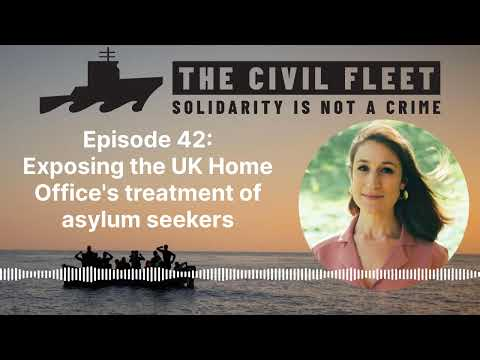

### AYS News Digest 17/7/23: EU in (another) deal with an authoritarian regime to prevent movement of people
#### Hunger strike on Chios // EU signed another “cooperation agreement” (likely to prove itself as another criminal deal) with Tunisia // BVMN on the EU Ombudsman’s Frontex decision

#### FEATURE

European Commission President Ursula Von der Leyen, Dutch Prime Minister Mark Rutte, and Italian Prime Minister Giorgia Meloni held renewed talks with Tunisian President Kais Saied as they all seem to agree on one thing — (too) many people have been fleeing their homes.

An agreement of cooperation signed between Tunisia and the EU to “stem movement of people”, news outlets say. In fact, what has happened is that the EU is funding criminal actions that undermine the core values the society and the EU was built on.

■■■■■■■■■■■■■■ 
> **[ECRE](https://twitter.com/ecre) @ Twitter Says:** 

> > They're happy about signing a "strategic" agreement with the country that 
⚫️deported hundreds of migrants to the desert just last week
⚫️left hundreds of people in distress adrift or drowning in the sea without assistance 
⚫️triggered racist violence against black migrants 

> **Tweeted at [2023-07-17 09:21:18](https://twitter.com/ecre/status/1680870278316933120?s=20).** 

■■■■■■■■■■■■■■ 

It is interesting that none of the EU counterparts or stakeholders of this agreement found indicative the Tunisian president’s remarks, such as the one saying “this memorandum should be coupled at the earliest time by a set of binding agreements emanating from its principles”.

Their racist policies and lack of any proper approach to the rights and protection of the people fleeing Sub Saharan areas is surely not good ground on which to build more of their demands towards the EU member states, opening up a space for dependancy, more demands and a poltical black hole.

Specific aid announced by von der Leyen on Sunday includes a 10-million Euro ($11 million) programme to boost student exchange and 65 million Euros ($73 million) in EU funding to modernise Tunisian schools, media [reported](https://www.aljazeera.com/news/2023/7/16/tunisia-and-eu-finalise-deal-on-migration?fbclid=IwAR0uDFuymyJecdIfj6S7I5WDA11Af1j5F0b-g-PFhxSAwFjwE6hbjYDyeDo) .

Needless to say, questions, critique and reactions are many.

■■■■■■■■■■■■■■ 
> **[Monica Marks](https://twitter.com/MonicaLMarks) @ Twitter Says:** 

> > 3) The fulcrum on which this EU-Tunisia deal pivots—migration—is elaborated in the MoU’s final section.

Its sole mention of “human rights” occurs merely as the tiniest of breath-catching pauses before the EU wags the finger at—not HR abuses by Saied’s regime, ofc—but smugglers. https://t.co/BvfzCUlnxJ 

> **Tweeted at [2023-07-16 23:41:36](https://twitter.com/MonicaLMarks/status/1680724392525852672?s=20).** 

■■■■■■■■■■■■■■ 

■■■■■■■■■■■■■■ 
> **[RSA](https://twitter.com/rspaegean) @ Twitter Says:** 

> > “Relying on authoritarian regimes to manage migration creates political dependency” - @MinosMouz, legal officer at @[rspaegean](https://twitter.com/rspaegean)

At @[FinancialTimes](https://twitter.com/FinancialTimes) regarding the agreement of cooperation between Tunisia and the EU, aiming at strengthening border controls 👇

[ft.com/content/215ba9…](https://www.ft.com/content/215ba9f7-ffb3-48d1-9cbd-7a9e96c0cffe) 

> **Tweeted at [2023-07-17 08:00:29](https://twitter.com/rspaegean/status/1680849942967885829?fbclid=IwAR2bsKT5eLZ_czrbIAym_UZi0PeSE3zXcpyBSDT_WBpC6C6Zyd2SNkCD9BI).** 

■■■■■■■■■■■■■■ 

#### FRONTEX

[Border Violence Monitoring Network](https://borderviolence.eu/) (BVMN) has addressed the recent EU ombudsman’s [decision](https://www.ombudsman.europa.eu/en/decision/en/171951) on how the European Border and Coast Guard Agency (Frontex) ensures respect of the rights of migrants in ‘debriefing’ interviews.

The summary of the decision states:

> The case concerned debriefing interviews of irregular migrants conducted by Frontex, notably in the context of the Frontex-Spain Joint Operation Indalo at the Spanish-Morocco sea border. Debriefing interviews seek to gather information from migrants after they have crossed the EU external border irregularly. The information collected is used for risk analysis and the identification of cross-border crime suspects. 

> The Ombudsman found that Frontex needs to do more to ensure migrants’ fundamental right to human dignity. She suggested that Frontex should provide interviewees with information about their rights, access to interpretation and to an independent complaints mechanism with proper oversight. These safeguards could be more effectively implemented if migrants have access to legal aid. Frontex should also consider adequate measures to ensure that the consent of migrants to participate in debriefings is recorded, that interviewees or their legal representatives review and sign the record of the interview, and that the records are treated confidentially. Frontex should insist with the host Member State that all these safeguards are included in the relevant operational plan. 

> The Ombudsman also looked into how the Fundamental Rights Officer dealt with the concerns raised by the complainants, and found no maladministration on this front. 

Background information: [Statewatch | Questioning the interviewers: Frontex’s covert interrogations at the Spanish Southern border](https://www.statewatch.org/analyses/2022/questioning-the-interviewers-frontex-s-covert-interrogations-at-the-spanish-southern-border/)

■■■■■■■■■■■■■■ 
> **[Border Violence Monitoring Network](https://twitter.com/Border_Violence) @ Twitter Says:** 

> > 🚨What's significantly missing from the decision?

🇪🇸 Frontex violated its own Regulation (Art. 83.2) by not respecting national law of country of mission. Acc. to Spanish law, interviewees are witnesses/victims/suspects, entitling to rights and safeguards in criminal proceedings 

> **Tweeted at [2023-07-14 19:10:47](https://twitter.com/Border_Violence/status/1679931464824045587?s=20).** 

■■■■■■■■■■■■■■ 

BVMN notes that the decision did not reference other relevant articles of the EU Charter that could provide stronger safeguards during debriefings:

Article 47 on the right to an effective remedy and a fair trial, and Article 48, the right to defense in criminal procedure, noting that Frontex should stop conducting debriefing interviews as reports show that with or without safeguards, in practice, officers systemically violate EU, international and national law.
#### GREECE
### Hunger strike in VIAL

7 months of waiting for the examination of asylum applications… this is one of the many reasons for a **hunger strike** that **30 people** in the closed controlled facility of VIAL, on the island of Chios, began on July 17.

[Reportedly](https://astraparis.gr/apergia-peinas-palaistinion-stin-vial-gia-kathysteriseis-sto-asylo-vinteo/?fbclid=IwAR2xgXMoVDqb8dVBOgSwjAw7gNRAyHwuF1EKSUVwWi15syPqjVa2KW5JnFU) , the people are calmly refusing meals and had asked to meet the head of the facility, demanding for some concrete changes before others join them in this harsh and desperate, but brave move for justice and rights.

As one of the prominent activists noted:

> 7 months in a camp for displaced people, sharing small containers with other people, throughout the harshest of winters and scorching summers with little protection, a lack of adequate food and water, a lack of NGOs to cover even the most basic of needs, education, medial support, support for livelihood — nothing. 

A video by the community inside the VIAL centre was posted [here](https://www.facebook.com/watch/?v=591257059855025&extid=CL-UNK-UNK-UNK-AN_GK0T-GK1C&mibextid=2Rb1fB&ref=sharing) .

We support all efforts and demands for a fairer, just and timely dealing with people’s asylum requests and hope that a drop of political will will sooner rather than later appear in the sea of ignorance, laziness and inhumanity that has poured over many of the offices accross Europe.
#### BALKANS
### A rise in the number of violent pushbacks

As every year, in the warmer months more people are on the move, trying to reach places they think they could find stability and the chance to ask for international protection in order to get independent as soon as possible, and free to live a decent life. However, with more people on the move, there are more instances of pushbacks, more needs among individuals coming and passing, and more support in general is needed.

Most of all what is needed is more reasoning in order to take steps towards responsible and humane decision making. In Serbia, activist groups in the field report more needs, more encounters, but also violence and pushbacks conducted on a daily basis by the officials.

■■■■■■■■■■■■■■ 
> **[Collective Aid](https://twitter.com/collective_aid) @ Twitter Says:** 

> > 3) People traveling through Serbia, Bulgaria, and Bosnia face repeated violence and pushback. Every day at the WASH, our volunteers hear tales of border forces across the Balkans using violence to keep people out of Europe. 

> **Tweeted at [2023-07-14 07:57:05](https://twitter.com/collective_aid/status/1679761923783507968?s=20).** 

■■■■■■■■■■■■■■ 

#### WORTH LISTENING TO:
- Podcast episode discussing the UK government providing £3m to the Turkish border guards to stop people on the move at the country’s border with Iran:

**_JOIN OUR TEAM — Reach out via Facebook, Instagram or by email at: areyousyrious@gmail.com_**

**Find daily updates and special reports on our [Medium page](https://medium.com/are-you-syrious) .**

**If you wish to contribute, either by writing a report or a story, or by joining the Info team, please let us know!**

**We strive to echo correct news from the ground through collaboration and fairness. Every effort has been made to credit organisations and individuals with regard to the supply of information, video, and photo material (in cases where the source wanted to be accredited). Please notify us regarding corrections.**

**If there’s anything you want to share or comment, contact us through Facebook, Twitter or write to: areyousyrious@gmail.com**

_[Post](https://medium.com/are-you-syrious/ays-news-digest-17-7-23-eu-in-another-deal-with-an-authoritarian-regime-to-prevent-movement-of-6ccb6a9cf826) converted from Medium by [ZMediumToMarkdown](https://github.com/ZhgChgLi/ZMediumToMarkdown)._
