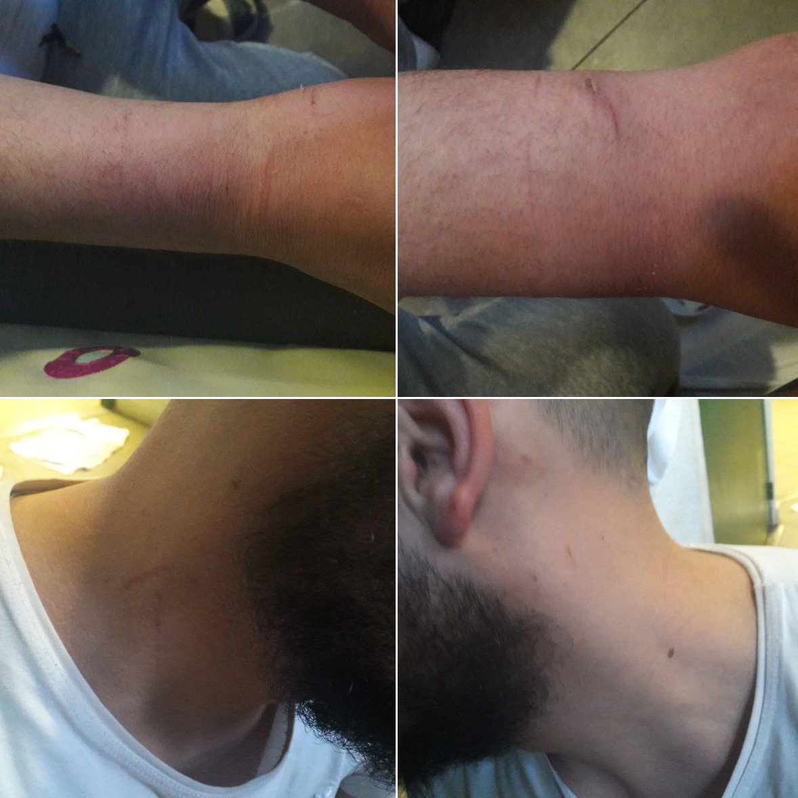
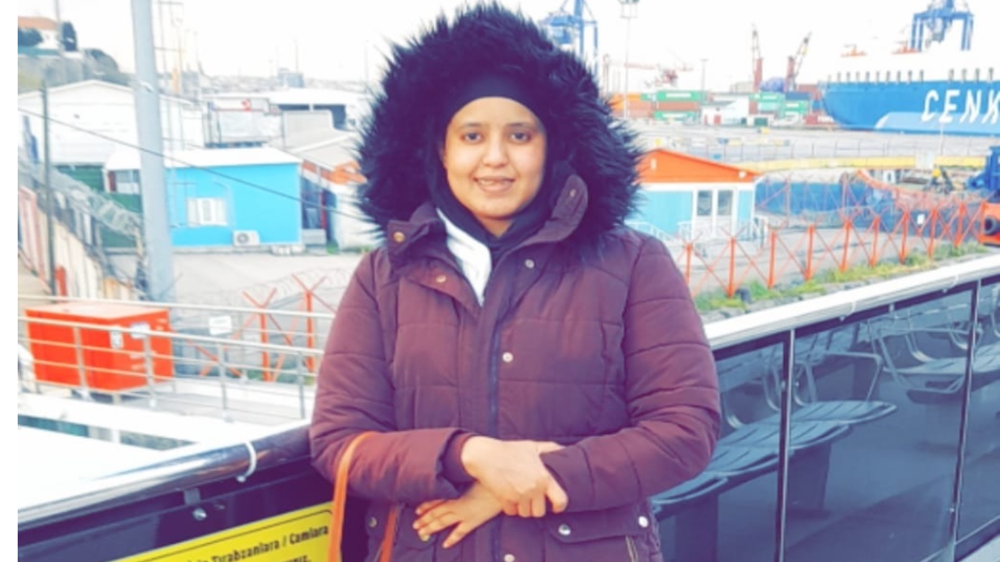

### AYS News Digest 27/07/23: Shipwrecks off Senegal and Malta claim 23 lives
#### Eighty-four people rescued off Gran Canaria // Iuventa Crew’s legal challenge to criminal charge of “facilitating unauthorised migration” goes to ECJ // A woman and child found dead on the Tunisian-Libyan border desert // Testimony about abuses in French detention // Four people suffocate on Greek–Turkish border // Updates on Pylos enquiry, as survivors denied psychological aid; protests at Amygdaleza detention centre as a man dies after being denied medical assistance
#### SEARCH AND RESCUE

A capsized boat is brought ashore off Dakar. Credit: AP/Leo Correa.
#### Shipwreck on the Mediterranean kills six people

The summer months have seen an increase in the number of attempted crossings over the fatal waters of the Mediterranean, as well as the Atlantic. In the past few days, tragic shipwrecks have been reported off Senegal and Malta, whilst 84 people were rescued by the Spanish coast guard off Gran Canaria. Every lost life is the result of choices made by those who are not forced to take such risks. Every lost life is an incalculable, incommunicable tragedy.

■■■■■■■■■■■■■■ 
> **[@alarmphone](https://twitter.com/alarm_phone) @ Twitter Says:** 

> > ⚫ Shipwreck in the central Mediterranean

This morning, we were informed about a boat in serious distress. We could never reach the 42 people, who were said to have been on board. Now we had to learn that six people from this boat have died. #BordersKill

[x.com/AngiKappa/stat…](https://x.com/AngiKappa/status/1683617449940340738?t=JB7vKYH-5v1OP52T6lUrAg&s=19) 

> **Tweeted at [2023-07-25 18:36:17](https://twitter.com/alarm_phone/status/1683909048863686682?fbclid=IwAR39QpHDTwNzBmXDfZMdMsmbCsOZyKGwTezPbEuSTDm6LGQs-fUSe1cSFrg).** 

■■■■■■■■■■■■■■ 

#### Shipwreck off Senegal claims 17 people’s lives

Seventeen bodies have been found by the Senegalese navy, after a boat capsized off the coast of Dakar. This is the first time that bodies have washed up on the capital’s shoreline, and it is feared that an increasing number of people on the move will lose their lives there.

](../assets/c7a99743756c/0*7tdJC1nZ1Duff3g3)

A shirt found during the rescue mission. Via [AP](https://apnews.com/article/senegal-migration-boats-dead-bodies-dc6a67c32f61b9039125b7b3254372f5?fbclid=IwAR2Y0z50k2UFWPH7Q3bSzGQCseN3usfz-M1piULm8RyirKbZbZ2VgvUSl_0)

■■■■■■■■■■■■■■ 
> **[@alarmphone](https://twitter.com/alarm_phone) @ Twitter Says:** 

> > ⚫️At least 17 people were found dead after a boat capsized in Senegal’s capital. The boat was carrying more than 100 people and was reported missing for more than 2 weeks. Our thoughts are with the relatives who lost their loved ones on their way to fortress Europe. #borderskill 

> **Tweeted at [2023-07-25 16:00:07](https://twitter.com/alarm_phone/status/1683869747983552515?fbclid=IwAR0N07wmprmBybMqw50zKtODP22Mwn__LEL-LCV-O6LbmaMIfqvs-p4Gv_8).** 

■■■■■■■■■■■■■■ 

#### Eighty-four people rescued off Gran Canaria, along with a corpse

Mostly hailing from sub-Saharan Africa, these people were rescued 16km off the coast. Eight people were hospitalised upon disembarkation.

[**Spain rescues boat with 84 migrants, one dead**](https://www.reuters.com/world/europe/spain-rescues-boat-with-84-migrants-one-dead-2023-07-25/?fbclid=IwAR0tbvAtm3JCz4CDR3TnhAGXN7ztS7HcS5wu4_39eN77N3N-bChjl9YVsb8) 
[_Spain's maritime rescue service on Tuesday said it had rescued a boat near the island of Gran Canaria carrying 84…_ www.reuters.com](https://www.reuters.com/world/europe/spain-rescues-boat-with-84-migrants-one-dead-2023-07-25/?fbclid=IwAR0tbvAtm3JCz4CDR3TnhAGXN7ztS7HcS5wu4_39eN77N3N-bChjl9YVsb8)
#### IUVENTA CREW
#### “Facilitating unauthorised migration” appeal goes to ECJ

The European Court of Justice (ECJ) is set to examine the legitimacy of “facilitating unauthorised migration” as a criminal offence.

“ _Our objection is that the European regulation, and consequently the Italian one that transposes it, does not include the intention to make a profit as a constitutive element of the offense and, at the same time, does not oblige Member States to exclude the responsibility of those who act out of altruistic and humanitarian reasons_ “, explains Francesca Cancellaro.

From the Iuventa campaign:

**“This is the first time that the European court has to assess the legitimacy of EU legislation criminalising the facilitation of migration.** If successful, the effects of the decision would impact on similar past and future cases in Europe.”
#### TUNISIA / LIBYAN BORDER
#### Left to die in the desert

A 30-year-old woman from the Ivory Coast, Fati Dosso, along with her young daughter Marie, have died in the Tunisian-Libyan borderland. Their bodies were discovered on Tuesday, their lives taken by dehydration, having been abandoned in the desert by the Tunisian authorities.

■■■■■■■■■■■■■■ 
> **[Refugees In Libya](https://twitter.com/RefugeesinLibya) @ Twitter Says:** 

> > Fati Dosso 30 was born in the west of Ivory Coast in a village commonly called as (MAN) 
Her parents are said to have died long ago and then she moved to Libya where she lived for 5 years. 

Her husband also 30 (MBENGUE NYIMBILO CREPIN) nicknamed Pato comes from Cameroon and it https://t.co/ZrzCcd7bEF 

> **Tweeted at [2023-07-25 20:54:31](https://twitter.com/RefugeesinLibya/status/1683943835456401408).** 

■■■■■■■■■■■■■■ 

Make no mistake: this is the calculated, sanctioned denial of life. Murder.

The temperatures on the border are almost unliveable, reaching 50 degrees Centigrade. There have been reports of the Tunisian authorities deporting children as young as three months old, actively endangering lives:

■■■■■■■■■■■■■■ 
> **[Martin Glasenapp](https://twitter.com/MartinGlasenapp) @ Twitter Says:** 

> > Natürlich hat Libyen eigene Probleme. Aber hier fragt zu Recht der libysche Grenzer, warum Migranten, darunter ein 3 Monate altes Baby, in die 50°-Hitze an der libysch-tunesischen Grenze abgeschoben werden. „Eine Schande für Tunis und die Welt“, sagt er. https://t.co/EA1F72Xq2g 

> **Tweeted at [2023-07-25 12:58:52](https://twitter.com/MartinGlasenapp/status/1683824135162540032?fbclid=IwAR32RIVreMrfWxCFgZzqmD_jbBh8QAfnHZXcWp1zT_o6xPA4MdQ1Q3ClYjU).** 

■■■■■■■■■■■■■■ 

#### GREECE
#### Protests at Amygdaleza detention centre

A 26-year-old Indian man has reportedly died in Greek detention, having been denied medical care and medicine despite his illness.

Protests have since erupted across the centre, with 10 people believed to have been arrested so far.

■■■■■■■■■■■■■■ 
> **[Vedat Yeler](https://twitter.com/vedatyeler_) @ Twitter Says:** 

> > #Greece | I understand this is the refugee camp in Amigdaleza. A sick person is reported to have died from lack of treatment. The video shows the camp on fire and #refugees screaming.

https://t.co/YqCUYuprTA 

> **Tweeted at [2023-07-25 22:35:00](https://twitter.com/vedatyeler_/status/1683969122999189506?fbclid=IwAR2iXjbui7P0pAWfXkcQ9QbYM9ccLEpnh6mcFSB95rtfWICo57OXFAHNh9M).** 

■■■■■■■■■■■■■■ 

This comes after BVMN reported on such abusive detention practices in February this year.

■■■■■■■■■■■■■■ 
> **[Border Violence Monitoring Network](https://twitter.com/Border_Violence) @ Twitter Says:** 

> > 🚨Detainees in #Amygdaleza Pre-Removal Detention Centre protest after the death of a fellow detainee who was denied medical care.

In February we released a report detailing violence and abuse against detainees in PRDCs in #Greece➡️[borderviolence.eu/reports/detent…](https://borderviolence.eu/reports/detention-violence-greece/) 

> **Tweeted at [2023-07-26 08:25:38](https://twitter.com/Border_Violence/status/1684117762644357126?fbclid=IwAR2Y0z50k2UFWPH7Q3bSzGQCseN3usfz-M1piULm8RyirKbZbZ2VgvUSl_0).** 

■■■■■■■■■■■■■■ 

#### Updates on the Pylos tragedy

The European Ombudsman has asked Frontex about its role in the shipwreck off Pylos last June, as the open enquiry continues:

[**European Ombudsman**](https://www.ombudsman.europa.eu/en/press-release/en/172857?utm_source=some_EO&utm_medium=twitter_organic&utm_campaign=frontex_OI_search-rescue&fbclid=IwAR39QpHDTwNzBmXDfZMdMsmbCsOZyKGwTezPbEuSTDm6LGQs-fUSe1cSFrg) 
[_Edit description_ www.ombudsman.europa.eu](https://www.ombudsman.europa.eu/en/press-release/en/172857?utm_source=some_EO&utm_medium=twitter_organic&utm_campaign=frontex_OI_search-rescue&fbclid=IwAR39QpHDTwNzBmXDfZMdMsmbCsOZyKGwTezPbEuSTDm6LGQs-fUSe1cSFrg)

A report has also emerged that no psychological help has been provided to survivors of the shipwreck. [See here](https://www.zeit.de/gesellschaft/2023-07/schiffsunglueck-griechenland-migration-seenotrettung-gefluechtete?utm_referrer=https%3A%2F%2Ft.co%2F&fbclid=IwAR2b_CSqkYlD6IVVGwmqP4mox-eQV8PjirE2NZXSJeF-gSDOtLv_Bv8AuvU) :

#### Four people suffocate to death on the Greek/Turkish border

At the Ipsala border, four people have been found dead in the back of lorry that was travelling from Izmir to Thessaloniki, loaded with refrigerators.

Lack of air and exposure to extreme heat were recorded as the medical causes of death.

More [here](https://www.milletnews.com/western-thrace/horror-at-the-border-4-immigrants-suffocated-and-died?fbclid=IwAR32RIVreMrfWxCFgZzqmD_jbBh8QAfnHZXcWp1zT_o6xPA4MdQ1Q3ClYjU) .
#### Abuses at Coquelles detention centre

Calais Migrant Solidarity have written a report, based on testimonies of those who were detained, about the physical and psychological violence of detention in France.

> “Since their arrests, the detainees have reported being victims of humiliation and beatings by the cops. The pressure imposed on them is so strong that some can no longer bear it and try to end their lives. Suicide attempts are frequent, both a sign of despair and the ultimate strategy of resistance. Yet even after hospitalization for attempted suicide, releases are rarely granted; after a stay in hospital, detainees are placed back in CRA if the administration considers that deportation to another country is still possible.” 

CW: the article includes a video of forced deportation, as well as images.

#### WORTH READING
- “Indifference to the deaths in the Mediterranean is a sign of a collapse in humanity” — although behind a paywall, this article in _Le Monde_ considers the lack of media attention that the Pylos tragedy has received, in relation to other large scale shipwrecks in 2013 and 2015. How come the Pylos shipwreck hasn’t registered on the political spectrum of security-oriented rhetoric and xenophobia?

[**" L'indifférence face aux morts en Méditerranée est le signe d'un effondrement en humanité "**](https://www.lemonde.fr/idees/article/2023/07/25/l-indifference-face-aux-morts-en-mediterranee-est-le-signe-d-un-effondrement-en-humanite_6183284_3232.html?fbclid=IwAR3s0Jy7rhB72blzsSeZIGq_TncYOz8xHkbg7M89v4ithjV6-WoYod6b4lg) 
[_TRIBUNE. L'écart entre l'émotion provoquée par la disparition des cinq occupants du submersible " Titan " et…_ www.lemonde.fr](https://www.lemonde.fr/idees/article/2023/07/25/l-indifference-face-aux-morts-en-mediterranee-est-le-signe-d-un-effondrement-en-humanite_6183284_3232.html?fbclid=IwAR3s0Jy7rhB72blzsSeZIGq_TncYOz8xHkbg7M89v4ithjV6-WoYod6b4lg)
- Disappearances in Greece. People coming to the Aegean are so desperate to evade pushbacks that they take life-threatening risks, disappearing into remote woodland and mountain areas. This article is about those who go unaccounted for as a result.

> _JOIN OUR TEAM — Reach out via Facebook, Instagram or by email at: areyousyrious@gmail.com_ 

> **_Find daily updates and special reports on our [Medium page](https://medium.com/are-you-syrious) ._** 

> **If you wish to contribute, either by writing a report or a story, or by joining the Info team, please let us know!** 

**We strive to echo correct news from the ground through collaboration and fairness. Every effort has been made to credit organisations and individuals with regard to the supply of information, video, and photo material (in cases where the source wanted to be accredited). Please notify us regarding corrections.**

**If there’s anything you want to share or comment, contact us through Facebook, Twitter or write to: areyousyrious@gmail.com**

_[Post](https://areyousyrious.medium.com/ays-news-digest-27-07-23-shipwrecks-off-senegal-and-malta-claim-23-lives-c7a99743756c) converted from Medium by [ZMediumToMarkdown](https://github.com/ZhgChgLi/ZMediumToMarkdown)._
