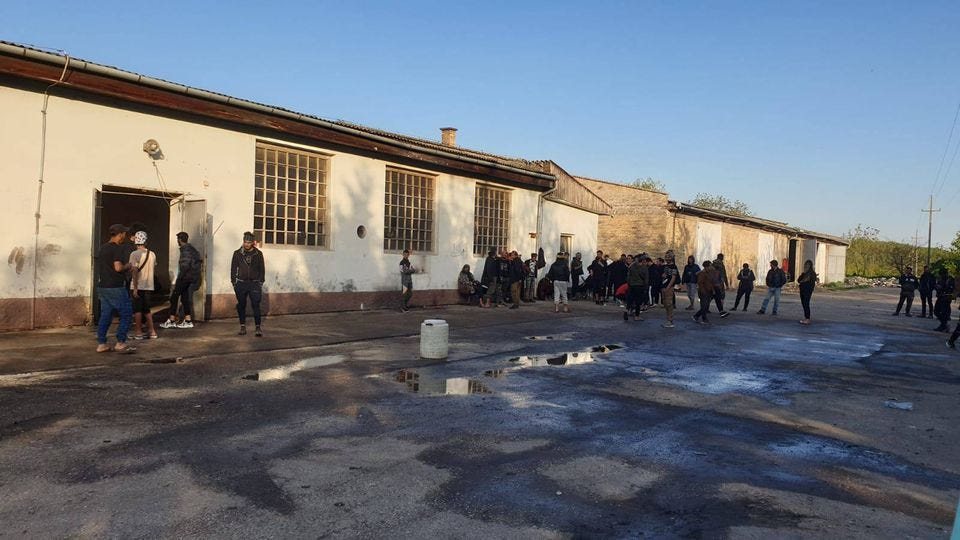

### AYS News Digest 25/8/23: Violence Rises at French/Italian Border
#### Two Squats Evicted in Athens // Kidnappers Testimony Accuses Victims of Arson // An Increasing Number of Children on the Move in Serbia // Asylum Backlog Hits Record High // Worth Reading and more…

 )](../assets/47deea52f97/0*mlWmOF8awphJ8_wb)

(40 people were forced back to Libya on the 25th. Photo Credit: [Sea-Watch](https://twitter.com/seawatch_intl/status/1695034950838296613/photo/1) )
#### FEATURE: Violence Rises at French/Italian Border

[A concerning report and video](https://www.facebook.com/watch/?v=105131769358872&extid=CL-UNK-UNK-UNK-AN_GK0T-GK1C&mibextid=ifW6Jt&ref=sharing) have been published by No Name Kitchen and the journalists Paolo Bogo and [Stakoza Ahmed](https://www.facebook.com/ahmed.stakoza?__tn__=-]K) . In the video a young family are forcibly removed from a train while their child cries and the distraught mother repeatedly requests to be allowed into France and not to be pushed back. It is also stated that unaccompanied minors, young men and pregnant women are being violently arrested and crammed for nights into crowded and sweltering containers before being pushed back to Italy.

> Here’s what’s happening: 

> 1- Minors Stuck in Difficult Conditions: More than 68 young minors, most of whom are traveling alone, found themselves spending between one to three nights at the detention containers of Police Aux Frontières (PAF). This number is only of the minors recognised by the French border police. They’ve been stuck there for days, and because there are no available spaces in nearby shelters, some of them have even been held in a container prison alongside adults. This is especially troubling given the current strong heat wave, for which France is taking several steps to relieve its citizens from the effects of it, such as providing free public transportation in certain regions, while these minors remain crammed in oppressive containers for days, in very high degrees, which make conditions inside these containers extremely inhumane and unsafe. This container prison is just above Menton City, which registered the highest temperatures in Metropolitan France on the night of Tuesday 22nd August. 

 )](../assets/47deea52f97/0*WTH8G7ul4ZxMuAAc)

(Photo Credit: [No Name Kitchen](https://www.facebook.com/photo?fbid=691452803012697&set=a.632303292260982) )

> One minor had a particularly distressing experience. Having been arrested in France, this young person was pushed back from France to Italy this Sunday after spending one night in detention in France. He was then pushed back from Italy back to France because he’s a minor, where he was held by the Police Aux Frontières (French Border Police) for three days before being pushed back again to Italy yesterday. He was given an “age assessment” and then expelled from France with expulsion papers that order him to leave the Schengen area. Giving minors expulsion papers is illegal under European law. 

> 2- A pregnant woman, a young man, and a baby violently arrested on a train: In a troubling incident, a family’s pursuit of safety and stability turned into a nightmare of aggression and injustice. A 7-months pregnant woman, a young man, and a baby embarked on a train that headed from Ventimiglia to Cuneo, crossing through French territory in the Roya Valley. At the first French station, their trip took a harrowing turn. They were subjected to aggression, arrested, and detained overnight by French police. A heart-wrenching separation followed: the father and baby were pushed back to Italy this morning, while the pregnant mother remains trapped in custody on French soil. 

> We cannot turn a blind eye to this crisis. The EU border violence is reaching unacceptable levels of cruelty and injustice that demands immediate attention and intervention. These are heinous crimes against humanity that have to END immediately! These are beyond challenges, these are violations of basic human rights. Everything the French police is doing has already been deemed to be illegal by European Courts, and this has in no way stopped them — they are coming up with even more illegal practices! 

> Last update: The pregnant woman mentioned in the text has just been released and pushed back to Italy. Out team has taken her to a place where she can get assistance on this situation. 

#### SEA
#### Many Rescue Ships Back to Sea

The [Mare Go](https://twitter.com/marego_vessel/status/1694333204176470507?fbclid=IwAR2ddz3DeBjPHyoimxfYgqdAA3LjLgX-CGl9WyuGQpws7UIXtTTd4jW_07k) is about to return to the search and rescue zone, the [SVI Mara](https://twitter.com/search?q=%23svimara&src=typed_query&f=top&fbclid=IwAR3o3F2lFTO99Y6T3iiw-8j3M_Nq0jgebT1LM51qa_gvz6MwPKwY6F0J8XU) and [Louise Michel](https://twitter.com/MVLouiseMichel/status/1695003689843392750?fbclid=IwAR1zN-DeZKTs8oUk744b7nlhFb9j553lmiaBFJusMyBCim-6YupXVnDwFMY) have also just returned.

[A new ship](https://www.instagram.com/p/CwXThYoozaK/?utm_source=ig_web_copy_link&igshid=MzRlODBiNWFlZA%3D%3D&fbclid=IwAR2bsVXX7OKKahPnK6MQlsd35Hf-T6jx4Z5L-s1KDVIvKme_dMcwNQ-zk0E) has also departed from Sicily to support the Civilian Sea Rescue of refugees in the Mediterranean Sea.

> The sailboat of the CompassCollective from Wendland will search the Mediterranean Sea between Lampedusa and Tunisia with six crew members for sea emergencies and in case of a sighting, stabilize the people and boats in distress, as well as alert the Italian coast guard to counteract the deaths on the Mediterranean Sea. 

We send solidairty and wish them all fair winds and safe sailing!

Aurora, Sea Eye 4 and Opens Arms remained blocked in port.
#### GREECE
#### Two Squats Evicted in Athens

On the morning of the 25th two squats in Athens were evicted, Zizania and Ano Kato. Since Nea Demokratia came into power they have systematically dismantled civil society structures and occupied spaces in Greece. In their first term in office they began by evicting almost all the housing squats for people on the move, in their second term they are evicting the spaces which host events and groups who are made up of and work in solidarity with people on the move.

From [Zizania’s statement](https://www.facebook.com/ViktoriaSolidarity/posts/pfbid0gXPhEjW8fnGW3UCroNjZ8XygD2xzGywuaYpZBFCwhKRdZAGsaE7fn7GmZ3ZwHiNl) :

> The state will always fail to understand that you can never uproot the wild weeds of resistance, mutual help and strife. Like weeds on concrete, we’ll grow back among all that’s rotten in this society. In the most unexpected places, at the most unexpected moments, we will take back our playground and our community. 

#### After the Fires Kidnappers Testimony Accuses Victims of Arson

In a bizarre turn of events, [charges of arson have been brought against people on the move](https://www.efsyn.gr/ellada/dikaiomata/401811_antistrefontas-ton-rolo-thyti-kai-thymatos) based on the testimony of their kidnappers, members of the illegal militias who patrol Northern Greece, three of whom have also been arrested. This racist rhetoric is extremely dangerous. Had the 18 people who died in the fires in Evros last week not been hiding in the woods from these patrols, the police, the army and Frontex, they would not have lost their lives in such a horrific and terrifying manner. Racism kills.
#### SERBIA
#### An Increasing Number of Children on the Move in Serbia

 )](../assets/47deea52f97/1*TwXDKjpg6l1BxpSDEfkGQA.jpeg)

(Photo Credit: [Klikaktiv](https://www.facebook.com/klikaktiv/posts/pfbid035MUwDzfhb7su2BVXpJxxaZwKgi4TWgxkFzyKCnUmQoEW4CjAJv1VkWRkB5S3JyS7l) )

[New report from Klikaktiv](https://www.facebook.com/klikaktiv/posts/pfbid035MUwDzfhb7su2BVXpJxxaZwKgi4TWgxkFzyKCnUmQoEW4CjAJv1VkWRkB5S3JyS7l) who have met an increasing number of children on the move both with and without guardians.

> At some of the occasions we have met up to 30 unaccompanied children in a group of approximately 150 refugees. 

In a recent visit to Sunce, a self organized settlement in an abandoned factory they spoke with a large number of 12 to 17-year-olds and were appalled by the living conditions.

> High number of people moving in and out of the place meant considerable amounts of garbage, many cases of body lice, and insects which bite humans. Most of the people slept in the hangars of the abandoned factory on blankets they had found on the spot, with no covers for the body during the night when the temperatures get lower, and without clean clothes to change themselves into after a long while. 

Basic medical needs are also not being met.

> …a 15-year-old boy with still child-like seriousness and honesty and asked: “Will I be able to have my tooth fixed once when I get to Germany?”. He had one of his incisors broken on a football playground back in Syria and he did not have the time to see the dentist before his family sent him off to Turkey in search for safety. 

#### UK
#### Asylum Backlog Hits Record High

[Care4Calais report](https://www.facebook.com/care4calais/posts/689689619870087?ref=embed_post) that at the end of June 2023, more than 175,000 people were waiting for a decision on whether they will be granted refugee status. An increase of 44% from last year.

In numbers the latest Home Office figures show that:

> • 71% of people applying are granted asylum, and 53% of people making appeals saw their claim granted 

> • Afghans were largest nationality group coming to the UK by small boat for the third 3rd consecutive quarter; 98% of Afghan applicants were granted asylum 

> • The number of asylum applications withdrawn — meaning the claims were ended either by asylum seekers themselves or by officials — shot up from 60 cases in June 2022 to 15,308 

> • The UK receives only the sixth-highest number of asylum claims of all European countries — 21st per head of population. 

#### WORTH READING

[Fires, Pushbacks and the Far Right: Misplaced Blame and the Mobilisation of Violence Against People on the Move in Evros — BVMN (borderviolence.eu)](https://borderviolence.eu/reports/fires-evros/?fbclid=IwAR3o3F2lFTO99Y6T3iiw-8j3M_Nq0jgebT1LM51qa_gvz6MwPKwY6F0J8XU)

[Independence Day in Pakistan: A New Struggle for Freedom | by Misbah Sheikh | Aug, 2023 | Medium](https://misbahsheikhh.medium.com/independence-day-in-pakistan-a-new-struggle-for-freedom-c709c6136daa)

[How Malta stole the youth of three young men | Refugees | Al Jazeera](https://www.aljazeera.com/opinions/2023/8/25/how-malta-stole-the-youth-of-three-young-men)

> **_Find daily updates and special reports on our [Medium page](https://medium.com/are-you-syrious) ._** 

> **_If you wish to contribute, either by writing a report or a story, or by joining the AYS Info team, please let us know!_** 

**We strive to echo correct news from the ground through collaboration and fairness. Every effort has been made to credit organisations and individuals with regard to the supply of information, video, and photo material (in cases where the source wanted to be accredited). Please notify us regarding corrections.**

**If there’s anything you want to share or comment, contact us through Facebook, Twitter or write to: areyousyrious@gmail.com**

_[Post](https://medium.com/are-you-syrious/ays-news-digest-25-8-23-violence-rises-at-french-italian-border-47deea52f97) converted from Medium by [ZMediumToMarkdown](https://github.com/ZhgChgLi/ZMediumToMarkdown)._
