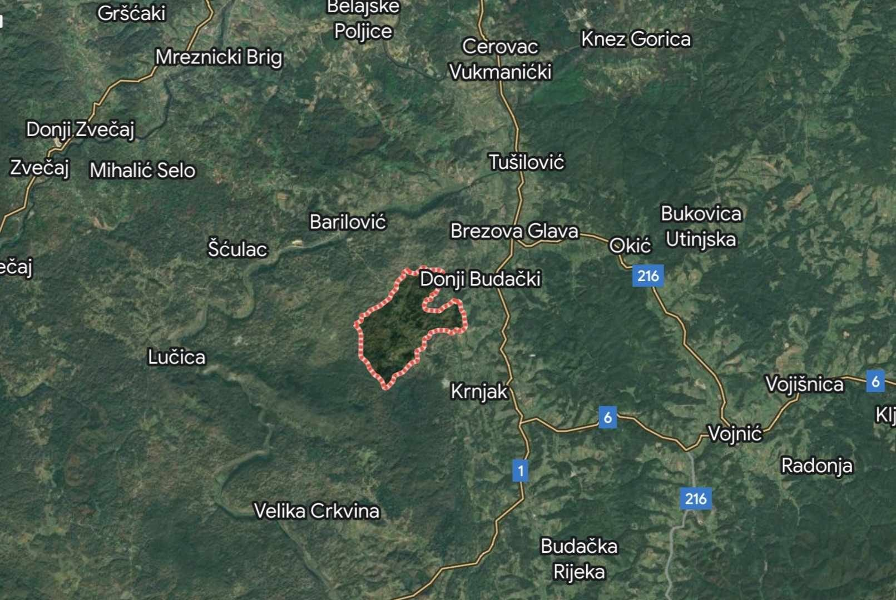

### AYS News Digest 1/9/23: Supported by the EU, Croatia building a new centre close to the border with BiH
#### Reports on arrests of four Tunisian fishermen charged with theft from displaced persons / SAR updates / UK: Refugee Action lodged a Freedom of Information request regarding the infamous barge / a legal analysis as to why Turkey cannot be considered as a safe third country / calls to protests, for volunteering and other useful info

Croatia — The area of Dugi Dol, Karlovac county, the potential location of MUP’s new centre
#### FEATURE

Unconfirmed and unofficial reports of the Ministry of the Interior planing to create another “hotspot” for people on the move within the region of Kordun and Lika in Croatia, in the location of a former military barracks, have in the past days startled the locals and confused the public.

The Ministry of the Interior has started arranging a kind of migrant centre in the former Dugi Dol barracks in an area of ​​the same name in the municipality of Krnjak, the mainstream newspapers published this week, whilst the police authorities answered “they are considering the possibility of arranging the Dugi Dol location in the Karlovac Police Department as a place where the registration of citizens of third countries who would express their intention for international protection could be carried out”.

In addition to having already mulched the field, they are preparing a project proposal, which can be financed from EU funds, as were many of the securitisation-oriented projects so far. The police claims that after the registration of asylum seekers, they would make it possible for the people to submit an appropriate application. Considering the large increase in the number of expressed intentions to submit applications for international protection this year, it would be necessary to strengthen the appropriate administrative capacities of the Directorate for Immigration, Citizenship and Administrative Affairs, as well as capacities for accommodation and reception.

Following the news, this Thursday locals of both Krnjak and Barilovići held a protest to speak up against the Ministry’s plan, which has so far been kept a secret from both the public and local authorities, as the media reports show.

Given that the general notion seems to be the area is uninhabited, the locals wanted to prove otherwise and have started a petition with several hundred signatures on Thursday, which they intend to hand in directly to the minister of the interior, who plans to hold a meeting on the issue with the local politicians in Karlovac and with the representatives of the local communities of Krnjak and Barilovići.

Needless to say, there has been no move to provide people with a safe and legal pathway which would enable them to access the mechanism of international protection in a clear and fast way, nor has there been a stronger move in the direction of educating and employing more people who are experts in the field. Most people on the move depend on the will, (mis)information and, hopefully, kindness of the border (and intervention) police, whom they mostly see as the only faces representing Croatia and the EU when it comes to their journey through those areas. The European policies tend to support technical equipment, unreliable securitisation plans and policies, and questionable police centres rather than new, effective common policies on migration.
#### TUNISIA

Cases of piracy targeting people on the move making the Mediterranean Sea journey from North Africa to Europe have become more common, the latest story confirms. AFP reports that a number of men suspected of stealing engines and money from people trying to reach Italy have been charged with “criminal association with the aim of attacking people and property”.

“According to Italian investigators, almost half of the vessels carrying migrants that are rescued at sea are found without their engine. The Italian news agency _ANSA_ said investigations revealed that some Tunisians previously working as fishing crew had turned to piracy, as it was more lucrative”, InfoMigrants [reports](https://www.infomigrants.net/en/post/51531/tunisia-pirates-arrested-after-migrants-robbed-in-mediterranean?fbclid=IwAR1W-py0B0o1BTq0LZxZQRPhCbr6FjITrOMEwOHfc5st-mRzt0YQlAa0cZk) .
#### SEARCH AND RESCUE AT SEA

Compass Collective’s SV Trotamar III is currently on her first mission in the SAR Region, along with R42’s SV Imara

■■■■■■■■■■■■■■ 
> **[CompassCollective](https://twitter.com/boat_spotting) @ Twitter Says:** 

> > Update #TROTAMARIII 2023/08/29 - we left #Lampedusa and we are ready to support people on the move when they need help. - [compass-collective.org](https://compass-collective.org/) #searescue #seenotrettung #compasscollective #boatspotting https://t.co/t0RnzSXBb5 

> **Tweeted at [2023-08-29 13:39:24](https://twitter.com/i/status/1696517913094832172).** 

■■■■■■■■■■■■■■ 

Mutual support is everything — A nice chuck-up from Sea Punks for Aurora Support, the Burriana-based collective that assists civil fleet vessels and crew when alongside:

■■■■■■■■■■■■■■ 
> **[Sea Punks e.V. | seapunks.bsky.social](https://twitter.com/sea_punks) @ Twitter Says:** 

> > Wir möchten Danke sagen. @[aurorasuport](https://twitter.com/aurorasuport) ist nun schon seit einigen Jahren hier im Hafen von Burriana aktiv, um die NGOs zu unterstützen. Auch in den letzten Tagen wurde uns in unterschiedlichster Art geholfen. Jemand muss vom Bahnhof abgeholt werden? Frag' Aurora. https://t.co/FCN1ZtO7pD 

> **Tweeted at [2023-08-31 18:02:27](https://twitter.com/sea_punks/status/1697308883717369951?s=20).** 

■■■■■■■■■■■■■■ 

■■■■■■■■■■■■■■ 
> **[@alarmphone](https://twitter.com/alarm_phone) @ Twitter Says:** 

> > 1🆘 ~60 people in distress north of #Lesvos!

We received an alert to a group in need of urgent rescue, with water coming into the boat. The group report that they see the @Hcoastguard close by, we hope they are rescued and allowed to access asylum in Greece! https://t.co/Ps9n2PTBP4 

> **Tweeted at [2023-09-01 07:00:27](https://twitter.com/alarm_phone/status/1697504677951139977?s=20).** 

■■■■■■■■■■■■■■ 

### Events & Calls for volunteers

There will be a protest on September 4/5 in Berlin against the planned deportation of Baluchistani activist Atif Ali:

- Planned event in support of Iuventa crew on 7 Sept in Palermo, Sicily:

■■■■■■■■■■■■■■ 
> **[Border Violence Monitoring Network](https://twitter.com/Border_Violence) @ Twitter Says:** 

> > 📣OPEN CALL: BVMN is looking for new volunteers to join our 🇺🇳 UN Advocacy Team! Apply now through to 4th of September (midnight CET)👉[borderviolence.eu/get-involved/w…](https://borderviolence.eu/get-involved/work-with-us/) https://t.co/8udaOXT1jY 

> **Tweeted at [2023-08-16 09:37:05](https://twitter.com/Border_Violence/status/1691745887863591238?s=20).** 

■■■■■■■■■■■■■■ 

#### UK

The Fire and Security Trade Fair IFSEC has provided yet more detail on the controversy and potential risks faced by those facing incarceration on the accursed BIBBY STOCKHOLM barge. Refugee Action lodged a Freedom of Information request with the local Fire and Rescue Service to release their fire risk assessment of the barge, and failings are summarised as follows:

[Fire safety concerns raised over Bibby Stockholm — Five improvements required include escape routes, ventilation and firestopping](https://www.ifsecglobal.com/fire-news/fire-safety-concerns-raised-over-bibby-stockholm-migrant-barge-as-arrivals-delayed/?fbclid=IwAR1jxf5QFcSXqgSPN3c3XWx97sR2DBlPAfgV_Z7CQlkLnE0rOQwfU7HyqLE)
#### WORTH READING, WATCHING AND NOTING
- a legal analysis as to why Turkey cannot be considered as a safe third country: [Gutachten — Von welcher Sicherheit sprechen sie? — medico international](https://www.medico.de/von-welcher-sicherheit-sprechen-sie-19176?fbclid=IwAR1znDw3IsT81Wseow5fJ_QPDwXvoLNANscaSkn8DBL75suqErJexVbFt3c)
- The latest episode of ‘The Civil Fleet’ podcast dropped this week, featuring a member of Zusammenland discussing the operations of the MARE-GO in the Central Mediterranean: [The Civil Fleet Podcast: Episode 45: Saving lives in the dead of night on Apple Podcasts](https://podcasts.apple.com/gb/podcast/the-civil-fleet-podcast/id1574079272?i=1000625756003)
- [Video: Mediterranean mission — Civil sea rescue of refugees — InfoMigrants](https://www.infomigrants.net/en/post/51403/video-mediterranean-mission--civil-sea-rescue-of-refugees?fbclid=IwAR1ZDifn5nYl_yAlFlwPHJ3hiYSxoenUj5RstediHFXbhGuJiDpVrFoF2a8)
- We Are Solomon summarizes what has been uncovered so far about the Pylos wreck in June: [Ναυάγιο στην Πύλο: Τι γνωρίζουμε σήμερα — Solomon (wearesolomon.com)](https://wearesolomon.com/el/mag/format-el/reportaz/navagio-stin-pylo-ti-gnorizoume-simera/?fbclid=IwAR1hwzb9q1OeSPScASlUTedvOfrpPEDwIi0fwVcwFrKF1MI-C1ebkmUIAtQ)
- US podcast ‘It Could Happen Here’, which regularly covers the US Border crisis, has dropped an episode on the Central Med, with Sea Watch activist Giulia Messner: [It Could Happen Here: Rescuing Migrants in the Mediterranean on Apple Podcasts](https://podcasts.apple.com/gb/podcast/it-could-happen-here/id1449762156?i=1000626279887)

> **_Find daily updates and special reports on our [Medium page](https://medium.com/are-you-syrious) ._** 

> **_If you wish to contribute, either by writing a report or a story, or by joining the AYS Info team, please let us know!_** 

**We strive to echo correct news from the ground through collaboration and fairness. Every effort has been made to credit organisations and individuals with regard to the supply of information, video, and photo material (in cases where the source wanted to be accredited). Please notify us regarding corrections.**

**If there’s anything you want to share or comment, contact us through Facebook, Twitter or write to: areyousyrious@gmail.com**

_[Post](https://medium.com/are-you-syrious/ays-news-digest-1-9-23-supported-by-the-eu-croatia-building-a-new-police-centre-close-to-the-4dcd2ec5f36c) converted from Medium by [ZMediumToMarkdown](https://github.com/ZhgChgLi/ZMediumToMarkdown)._
