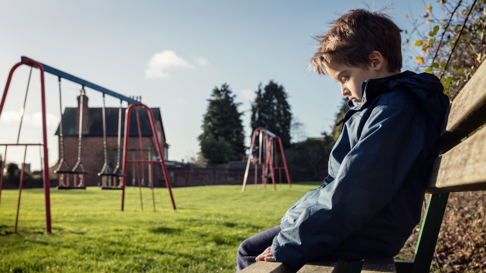
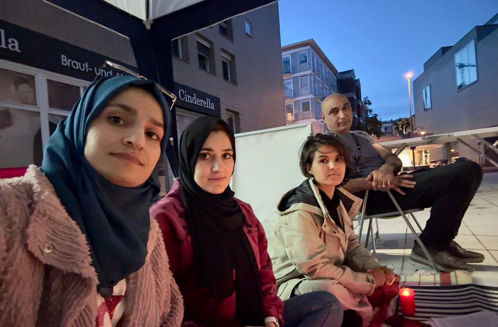

### AYS News Digest 6/09/23: Frontex acquitted by the European Court regarding the pushback of a Syrian family

A man died after a delayed rescue on Farmakonisi Island // Unaccompanied minors face lack of access to education opportunities // Hunger strike in Germany against gender aparthaid in Afghanistan // And more news

](../assets/5389a92a225f/1*qY_nbcwPkaoX5-gUk3GbbQ.jpeg)

[Credit: Sea Watch](https://twitter.com/seawatch_intl)
#### FEATURE
### The European Court of Justice denied the suit of a Syrian family pushed back by Frontex officers

According to recent adjudication at the European Court of Justice, Frontex is not responsible for human right violations at borders. The European agency Frontex was sued by a family from Syria who was pushed back to Turkey by Frontex officers after having reached Greece in 2016. Sea Watch and the Syrians who sued Frontex reported that in addition to the prohibition of degrading treatment, the agency violated the principle of non-refoulement, the right to asylum, and the rights of children.

The European Court of Justice rejected the lawsuit, ruling that Frontex was not involved in the decisions of the Greek authorities regarding the repatriation choice: the agency role was only one of operational and technical support.

In synthesis, the Court is arguing that the European Border Agency is not responsible as far as return measures are concerned.

> “The ruling demonstrates the sanctity of a European institution structurally set up in a legal space that allows human rights violations and covers up for perpetrators by diffusing responsibility”- Sea Watch 

This is a very worrying precedent, as it absolves Frontex of its responsibility for human rights violations at the borders.

[Read more here for a longer analysis](https://altreconomia.it/frontex-non-ha-responsabilita-nel-rimpatrio-illegittimo-di-una-famiglia-siriana-il-tribunale-ue-salva-lagenzia/)
#### SEA/SAR
### Iuventa Crew legal case still ongoing

[Alarm Phone](https://twitter.com/alarm_phone/status/1699069725773529253?fbclid=IwAR1mT4DfFGQ-2U78hfFfVBYa_VfNQ4elXBWDwJuGkFf8JWdu3lsoWwzVmWk) reported on some successful rescues at sea.

](../assets/5389a92a225f/1*dLPFT6Bg8oWwDH5Ozwnvhw.jpeg)

[Credit LouiseMichel](https://twitter.com/MVLouiseMichel/status/1699051016048837115)

The rescuing efforts at sea require funds: for this reason MARE-GO is launching a [fundraising campaign](https://twitter.com/marego_vessel/status/1699003084394123650?fbclid=IwAR1WnZ2J33C_DAJY8lU2ZnE4u5pmPPPAKobe6oi0M-iHpS0RfujS96ttN24) to continue their support at sea. [Next week in Frankfurt](https://twitter.com/hashtag/Schiffspatenschaft?src=hashtag_click&fbclid=IwAR3zEcNmZFbkXVGS79rJ0wvr2NLW03MITAUAFJqLUkbPUWuTkW_SyKtHq1g) there will be a fundraiser for MARE-GO, courtesy of Seebrücke Frankfurt.

In the meantime criminalisation of solidarity is still keeping organisations from supporting and saving lives freely as in the case of Iuventa Crew. Indeed their long-running legal case is still ongoing

■■■■■■■■■■■■■■ 
> **[iuventa-crew](https://twitter.com/IuventaCrew) @ Twitter Says:** 

> > Die Sommerpause ist vorbei!
Endspurt!
Zumindest von der Vorverhandlung.

Wir sind auf dem Weg nach Trapani, denn Freitag geht's weiter!
In den nächsten Wochen haben wir noch 10 Termine. 

Also: Alle Kraft voraus und Europa eine volle Breitseite geben.

SCHEISSE MALAKA EUROPE! https://t.co/TxMcHrGOjV 

> **Tweeted at [2023-09-06 10:11:03](https://twitter.com/IuventaCrew/status/1699364581909336234?fbclid=IwAR1mT4DfFGQ-2U78hfFfVBYa_VfNQ4elXBWDwJuGkFf8JWdu3lsoWwzVmWk).** 

■■■■■■■■■■■■■■ 

#### GREECE
### A man dies after a delayed rescue by Greek authorities

Time is always precious when there are lives to be saved, but at borders there is a different perception of time as reflected by a different consideration of lives. On 5th September a man died on Farmakonisi Island, waiting for help.

> “A Hellenic Coast Guard patrol boat immediately rushed to the area” 

said Greek authorities. However, as the Aegean Boat Report questioned, what does the verb “rush” mean according to the authorities? They claimed to have been informed on the the early hours of 5th September. But the Aegean Boat Report states clearly that the Hellenic Coast Guard Operations Center was informed at 10:23pm. We reported on the situation of the family waiting to be rescued in our [last News Digest](https://medium.com/are-you-syrious/ays-news-digest-4-9-2023-sustained-racist-violence-in-cyprus-ad915b814eeb) . Waiting, still waiting. Time was passing, and a man was dying. Bureaucracy and inefficiency delayed the rescue by the Coast Guard. The Aegean Boat Report tells about the call to the Hellenic Coast Guard SAR Center:

> “They told us that since this was on land, they had no jurisdiction and we had to contact local police. We tried to argue that there was no local police on Farmakonisi, since it’s an uninhabited island. This had no effect. The officer said, and I quote, ‘at sea, coast guard, on land Police, not too difficult to understand’. ” 

Subsequently Aegean Boat Report call for a proper independent investigation to get real answers

■■■■■■■■■■■■■■ 
> **[Aegean Boat Report](https://twitter.com/ABoatReport) @ Twitter Says:** 

> > Died on Farmakonisi after delayed rescue by Greek authorities.

Yesterday we published an SOS Alert on behalf of a group, reported to be 20 people, that had arrived on the Greek island of Farmakonisi, today we found out that the man we were trying to save died on Farmakonisi. https://t.co/u4maPfG1OA 

> **Tweeted at [2023-09-05 09:55:46](https://twitter.com/ABoatReport/status/1698998347325907157?t=lKBcW-rXTfFQ7BGm-WOT5g).** 

■■■■■■■■■■■■■■ 

The alarm was ignored by Greek authorities, who gave it consideration too late. However the continuing efforts of Aegean Boat Report are crucial as shown by some groups of people who successfully made it to safety. [A group of 38 arrived in Samos](https://twitter.com/ABoatReport/status/1698824169427751129?fbclid=IwAR0YPnLMZ9FdX1gS05JH2DRTnAJPAUSf4PzXxT-RZEsLzCxomJzeKCwyNDk) on 5th September, fearing pushbacks. The group included 15 children and a pregnant woman in need of medical attention. After having contacted Aegean Boat Report the group finally arrived at the Closed Controlled Access Center at Zervou. The day later, [a group of 21 reached Lesvos](https://twitter.com/ABoatReport/status/1699465569370529836?fbclid=IwAR0SWLzSZ18d8wFDr0AJH2438xscyBAXZ7i8TjpgttmluiZQmQzZqq3vO-M) and thanks to Aegean Boat Report they were found and transported safely to the registration and identification center in Maurovouni. Aegean Boat Report explained:

> “Since Greek authorities have, at least for now, stopped pushing back people arriving on the islands, we have again started to inform authorities when we have information on new arrivals, this to ensure that people are found quickly, without delay and unnecessary suffering, provided with food, water and medical attention, and transported to shelter in the nearest camp” 

#### UK
### Often unaccompanied children in the UK have no access to education

Refugee Youth Service reported that unaccompanied children in the UK have no way to access their right to education due to inappropriate accommodation and insecure status. According to the [Children Commisioner’s](https://www.childrenscommissioner.gov.uk/resource/looked-after-children-who-are-not-in-school/) study, 21% of unaccompanied children were missing education as of March 2022. The Commissioner said that life chances for unaccompanied children might even get worse after the passage of the the Illegal Migration Act in July 2023.

Read here more:

The right to housing and living goes hand in hand with the right to education. Without a proper place to live, it is impossible to pursue education and employment. This is true for unaccompanied minors, as well as for any other asylum seeker who must build a life for themselves once they have left the camps. But without a home this is impossible. The notice of only seven days issued to asylum seekers before they have to leave their residences seems to have as its goal the creation of homelessness. Faced with an increasingly saturated and competitive, as well as selective, European housing market, people who have to leave the camps find themselves in difficulty.

[Following the new government eviction rule](https://www.independent.co.uk/news/uk/home-news/refugees-homelessness-hotels-evictions-home-office-b2405326.html) , [140 organisations have called on the Government](https://twitter.com/refugeecouncil/status/1699344148015313080?fbclid=IwAR30IRtDJfcvgpt7DAqGJsFAMvuCyg82OthGpF9IXUIpSjjKYLYuuL5_SC8) to abandon recent policy changes that are leaving new refugees at risk of destitution and homelessness
#### WORTH READING:
- Despite the signing of the Cessation of Hostilities Agreement, Eritrean soldiers are committing human rights violations and crimes against civilians in Tigray (Ethiopia):

- As reported by [Rukhshana Media](https://twitter.com/RukhshanaMedia/status/1699393905853084027?t=nlenIEyH2QkmJO82fjtTNg&s=19&fbclid=IwAR2XKnCZ8LchcJIgLlgxQkonzBqGjGloq39lYKPqBeYuuXeDoBGeWZL1sg4) some afghans nationals in Germany started an [hunger strike](https://twitter.com/RukhshanaMedia/status/1699393905853084027?t=nlenIEyH2QkmJO82fjtTNg&s=19&fbclid=IwAR2XKnCZ8LchcJIgLlgxQkonzBqGjGloq39lYKPqBeYuuXeDoBGeWZL1sg4) to protest against gender aparthaid in Afghanistan:

> **_Find daily updates and special reports on our [Medium page](https://medium.com/are-you-syrious) ._** 

> **_If you wish to contribute, either by writing a report or a story, or by joining the AYS Info team, please let us know!_** 

**We strive to echo correct news from the ground through collaboration and fairness. Every effort has been made to credit organisations and individuals with regard to the supply of information, video, and photo material (in cases where the source wanted to be accredited). Please notify us regarding corrections.**

**If there’s anything you want to share or comment, contact us through Facebook, Twitter or write to: areyousyrious@gmail.com**

_[Post](https://medium.com/are-you-syrious/ays-news-digest-6-09-23-frontex-acquitted-by-the-european-court-regarding-the-pushback-of-a-syrian-5389a92a225f) converted from Medium by [ZMediumToMarkdown](https://github.com/ZhgChgLi/ZMediumToMarkdown)._
