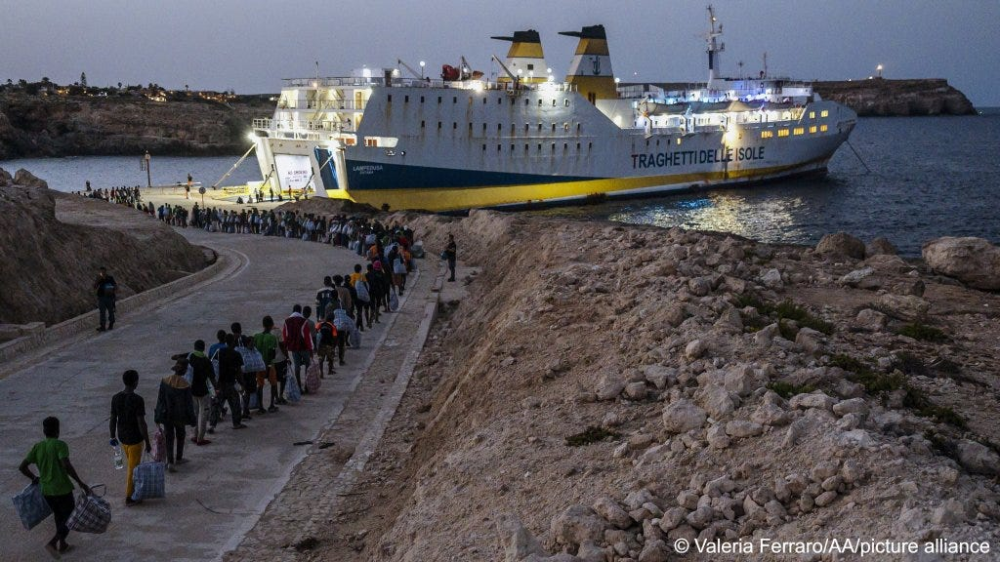
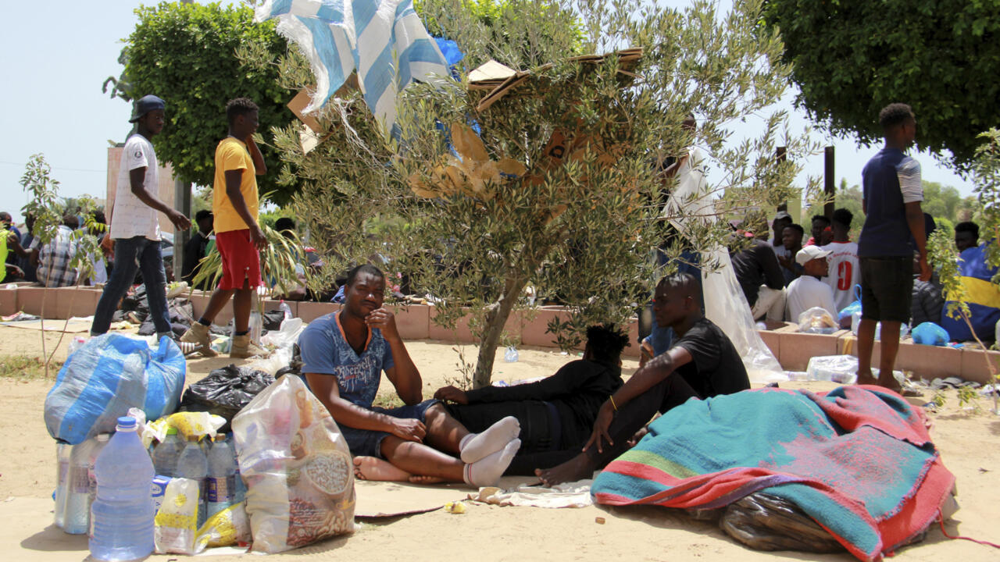
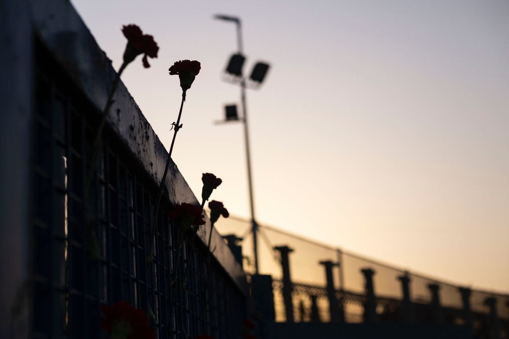

### AYS News Digest 19/09/23: Scandal and smoke screens ahead of Polish elections
#### Polish activist arrested on people-smuggling charges as national election looms // Updates from Lampedusa: Von der Leyen visits as thousands more people arrive by sea // Expulsion of Sub-Saharan Africans from Tunisia // SAR updates // New humanitarian event TODAY & much more
#### FEATURE — POLAND
#### **Activist arrested on people-smuggling charges, as the Polish government is hit by cash-for-visas scandal**

 . Credit: Agnieszka Sadowska / AP](../assets/3588edab0102/0*TaE_qwuG1JZ7sR9p.png)

Polish border wall via [InfoMigrants](https://www.infomigrants.net/en/post/51884/polish-government-hit-by-cashforvisas-scandal?fbclid=IwAR3wNyPwvaB3y34-cL3A4-kJ6u0SmG9lCK8fJHauAmy9YZ2ks7QDaTqk2gM) . Credit: Agnieszka Sadowska / AP
#### Visa fraud

Over the weekend, [reports have emerged that work visas for Poland were issued in Africa and Asia in exchange for bribes](https://apnews.com/article/migration-poland-visas-bribe-election-b6cdeadfc6a3935d0fbdb779947dad78) . Poland’s governing Law and Order (PiS) party is staunchly anti-migration, and the allegations that work visas were fast-tracked without the usual checks in exchange for large sums of money are extremely damaging. The deputy foreign minister has been dismissed, and several people detained.

The scale of corruption is currently under investigation. PiS claim that several hundred visas may have been wrongly fast-tracked, whilst the opposition leader, Donald Tusk, suggests that 250,000 visas were issued over the past two and a half years.

The scandal came to light as an unusually large number of people were noticed to be crossing into the EU on Polish work visas.

PiS, responsible for constructing a steel border wall on the border with Belarus, are currently seeking re-election for a third term on October 15th.
#### **Activist arrested: a smoke-screen?**

](../assets/3588edab0102/0*pmQN_IM6pdK0bw56)

via H [ope&Humanity Poland](https://www.facebook.com/groups/standwithrefugees/posts/844219080572173/)

Ewa M, a Polish citizen and activist who has spent the past two years working at the Belarusian-Polish border, has been arrested. She has been charged for helping people in detention, and is accused of asking for money in exchange for passage to Germany.

These are accusations, the charge is not a verdict. She is not guilty. She sent care packages to people in detention. She helped at the border. She organised legal aid.

We stand with Ewa, her legal representatives Szpila, and all humanitarian workers who are targeted by governments. We won’t back down, we won’t be distracted, we will stand in solidarity.

Ahead of the forthcoming election, the publicity surrounding Ewa’s alleged people-smuggling is uncanny. A smoke-screen perhaps? A distraction from high-level corruption in Poland’s governing Law and Justice Party? Undoubtedly. Ewa remains in temporary detention.

On a slightly different note, _Green Border —_ a film documenting state violence on the border — is coming out this week in Poland. It has been attacked by the government (see below):

#### ITALY
#### Lampedusa: what’s happening?

People boarding the Lampedusa Ferry, bound for the Italian mainland on September 17 2023

5000 people arrived ‘irregularly’ in Lampedusa on September 12th 2023, aboard 112 vessels. Most departed from Tunisia and Libya. In the past nine months, over 118,500 people have landed on the island.

There is only space for 389 people in Lampedusa’s reception centre, located away from the public eye. The Red Cross have been denied access due to “safety reasons”, and people have been jumping the fence to escape their detention.

**Von der Leyen visits: 10 point plan for Lampedusa**

EU Commission President Von der Leyen, visiting Lampedusa over the weekend, confirmed the EU security-oriented priorities. Only **two of ten** suggested measures consider the welfare of people on the move, and do so in very vague terminology without any concrete improvements suggested. Security, involving Frontex, and externalisation are the key priorities:
1. Frontex will go to Lampedusa.
2. There will be greater support for transfers from Lampedusa, particularly under the Voluntary Solidarity Mechanism.
3. Frontex will participate in deportations: “Those who cannot qualify for asylum cannot stay in the European Union”.
4. “We must step up our efforts to fight the smugglers.”
5. “We will step up sea and aerial surveillance” — with Frontex’s assistance, as well as supplying equipment to the Tunisian coastguard.
6. Disrupting smuggler’s logistics.
7. Speeding up asylum decisions in Italy; rapid deportations.
8. “We will offer migrants real alternatives through humanitarian admission”…
9. Increased co-operation with UNHCR and IOM “to ensure protection of migrants along the route and increased voluntary assistance”.
10. Working with Tunisia to accelerate the “Memorandum of Understanding”.

#### **From a different angle**

For an unusual analysis of migration to Italy — a population who’s country is shrinking — see below. Lukas Gahleitner measures migration to Italy against the falling population of the country, its low acceptance of migrants per capita, and Meloni’s call for 500,000 foreign workers to join the country. These are all incompatible facts when put alongside the rhetoric of her far-right party.

#### TUNISIA
#### Sub-Saharan Africans expelled from Sfax

Since the unrest in July, hundreds of people have taken refuge in the centre of Sfax. On Sunday, 500 people were forcibly removed. Following the MoU deal with the EU, the authorities in Tunisia have been increasingly active.

200 people were prevented from departing by boat this weekend.

#### SEARCH AND RESCUE
#### Baby is born and dies on the journey to Lampedusa

Last week a boat carrying 40 people was brought to Lampedusa by the coastguard, where the corpse of a newborn child was found. It is believed that the child was born during the crossing, and lost its life at sea as well. There is an ongoing investigation. [A few days earlier a five month old baby](https://www.infomigrants.net/en/post/51778/lampedusa-fivemonth-old-baby-dies-during-chaos-of-rescue#:~:text=A%20five%2Dmonth%2Dold%20baby,bring%20them%20safely%20to%20land.) drowned after falling into the water during a chaotic rescue.

See below for further updates about Lampedusa, following a visit from Meloni and Von der Leyen:

#### Shipwreck on the Algerian route claims 25 lives

Alarm Phone report that at least 25 people lost their lives on Sunday, trying to reach Spain. They also believe that, out of six boats that left Mostaganem on 11th September, two are now back in Algeria. It is unfortunately likely that those seeking freedom of movement will face repression.

■■■■■■■■■■■■■■ 
> **[@alarmphone](https://twitter.com/alarm_phone) @ Twitter Says:** 

> > ⚫️ Shipwreck on the #Algerian route! More than 25 people who left Mostaganem on September 11 died trying to reach #Spain. We send our thoughts and condoleances to the relatives. #Borderviolence has to stop! 

> **Tweeted at [2023-09-17 17:05:32](https://twitter.com/alarm_phone/status/1703455156312936703).** 

■■■■■■■■■■■■■■ 

#### WORTH READING + ATTENDING

Online event from the New Humanitarian, The White Helmets on Tuesday 19th September: **“Rethinking Aid Financing: How Locally Led Organisations are Funding Their Futures”**

Also, over a year on from the Melilla massacre, Alarm Phone have written about their CommemorAction on June 24th 2023 in Tanger.

> **_Find daily updates and special reports on our [Medium page](https://medium.com/are-you-syrious) ._** 

> **_If you wish to contribute, either by writing a report or a story, or by joining the AYS Info team, please let us know!_** 

**We strive to echo correct news from the ground through collaboration and fairness. Every effort has been made to credit organisations and individuals with regard to the supply of information, video, and photo material (in cases where the source wanted to be accredited). Please notify us regarding corrections.**

**If there’s anything you want to share or comment, contact us through Facebook, Twitter or write to: areyousyrious@gmail.com**

_[Post](https://areyousyrious.medium.com/ays-news-digest-19-09-23-scandal-and-smoke-screens-ahead-of-polish-elections-3588edab0102) converted from Medium by [ZMediumToMarkdown](https://github.com/ZhgChgLi/ZMediumToMarkdown)._
